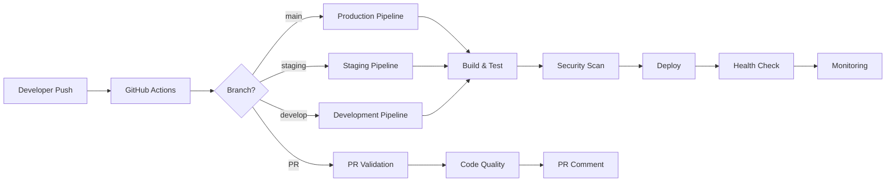
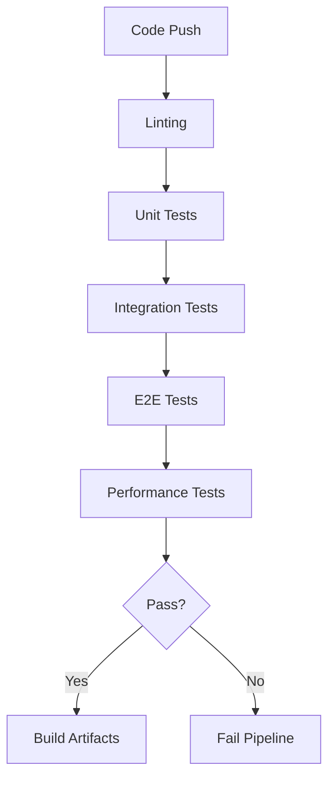
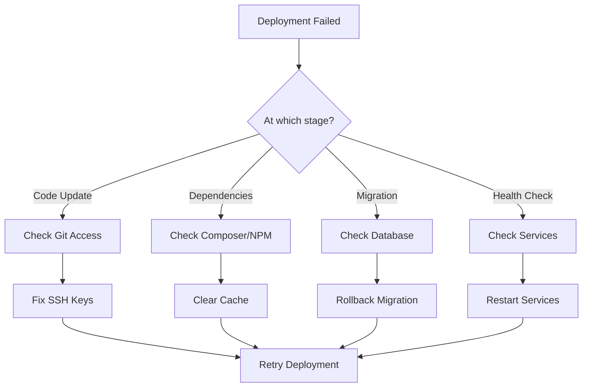

# AskProAI CI/CD Pipeline Documentation

**Version**: 2.0  
**Last Updated**: 2025-01-10  
**Status**: Production Ready

## Table of Contents

1. [Pipeline Architecture](#pipeline-architecture)
2. [GitHub Actions Workflows](#github-actions-workflows)
3. [Environment Configuration](#environment-configuration)
4. [Build & Test Process](#build--test-process)
5. [Deployment Strategies](#deployment-strategies)
6. [Security & Secret Management](#security--secret-management)
7. [Monitoring & Alerting](#monitoring--alerting)
8. [Rollback Procedures](#rollback-procedures)
9. [Developer Workflow](#developer-workflow)
10. [DevOps Manual](#devops-manual)
11. [Troubleshooting](#troubleshooting)
12. [Emergency Procedures](#emergency-procedures)

---

## Pipeline Architecture

### Overview

AskProAI uses a comprehensive CI/CD pipeline built on GitHub Actions, supporting multiple deployment strategies including zero-downtime deployments, blue-green deployments, and automated rollbacks.



### Key Components

1. **Version Control**: GitHub
2. **CI/CD Platform**: GitHub Actions
3. **Container Registry**: GitHub Container Registry
4. **Deployment Targets**: 
   - Production: `api.askproai.de`
   - Staging: `staging.askproai.de`
   - Development: Local/Docker
5. **Monitoring**: Prometheus, Grafana, Custom Dashboards
6. **Alerting**: Slack, Email, PagerDuty

---

## GitHub Actions Workflows

### 1. Main CI/CD Workflow (`ci-comprehensive.yml`)

The primary workflow handling all stages from code quality to deployment.

**Triggers**:
- Push to main, develop, staging branches
- Pull requests to main
- Scheduled security scans (daily at 2 AM)

**Jobs**:
1. **Code Quality Analysis**
   - PHP CodeSniffer (PSR-12)
   - PHPStan (Level 8)
   - PHP Mess Detector
   - Psalm static analysis

2. **Security Vulnerability Scan**
   - Composer audit
   - NPM audit
   - TruffleHog secret scanning
   - OWASP dependency check

3. **Unit & Integration Tests**
   - PHPUnit with coverage
   - Parallel test execution
   - MySQL & Redis service containers

4. **E2E Tests**
   - Full workflow testing
   - API endpoint validation
   - Performance benchmarks

5. **Build & Deploy**
   - Production artifact creation
   - Environment-specific deployment
   - Zero-downtime deployment

### 2. Manual Deployment Workflow (`deploy.yml`)

For controlled, manual deployments with approval gates.

**Features**:
- Environment selection (staging/production)
- Branch/tag/commit selection
- Emergency deployment option (skip tests)
- Deployment reason tracking
- Automated rollback on failure

**Workflow**:
```yaml
on:
  workflow_dispatch:
    inputs:
      environment:
        type: choice
        options: [staging, production]
      ref:
        type: string
        description: 'Branch/Tag/Commit to deploy'
      skip_tests:
        type: boolean
        description: 'Skip tests (emergency only)'
      reason:
        type: string
        description: 'Deployment reason'
```

### 3. Code Quality Workflow (`code-quality.yml`)

Runs on every push and PR for continuous code quality monitoring.

**Checks**:
- Laravel Pint (code formatting)
- PHPStan (static analysis)
- Security checks (hardcoded passwords, debug statements)
- Test coverage (minimum 80%)
- Documentation health

### 4. Documentation Auto-Update (`docs-auto-update.yml`)

Automatically maintains documentation freshness.

**Features**:
- Documentation health scoring
- Auto-generation of update PRs
- README badge updates
- PR comments with suggestions

---

## Environment Configuration

### Environment Variables

#### GitHub Secrets (Required)

**SSH Access**:
```
PRODUCTION_SSH_HOST
PRODUCTION_SSH_USER
PRODUCTION_SSH_KEY
STAGING_SSH_HOST
STAGING_SSH_USER
STAGING_SSH_KEY
```

**Notifications**:
```
SLACK_WEBHOOK_URL
NOTIFICATION_EMAIL
MAIL_HOST
MAIL_PORT
MAIL_USERNAME
MAIL_PASSWORD
```

**Monitoring**:
```
METRICS_ENDPOINT
DATADOG_API_KEY (optional)
NEW_RELIC_LICENSE (optional)
```

### Environment Files

#### Production (.env.production)
```env
APP_NAME=AskProAI
APP_ENV=production
APP_DEBUG=false
APP_URL=https://api.askproai.de

# Database
DB_CONNECTION=mysql
DB_HOST=127.0.0.1
DB_DATABASE=askproai
DB_USERNAME=askproai_user
DB_PASSWORD=${DB_PASSWORD_PRODUCTION}

# Redis
REDIS_HOST=127.0.0.1
REDIS_PASSWORD=${REDIS_PASSWORD_PRODUCTION}

# Queue
QUEUE_CONNECTION=redis
HORIZON_PREFIX=horizon:askproai:prod

# Security
FORCE_HTTPS=true
SESSION_SECURE_COOKIE=true
SESSION_ENCRYPT=true
```

#### Staging (.env.staging)
```env
APP_ENV=staging
APP_DEBUG=true
APP_URL=https://staging.askproai.de
# ... similar to production with staging values
```

---

## Build & Test Process

### Test Strategy



### Test Suites

1. **Unit Tests** (`tests/Unit/`)
   - Model tests
   - Service layer tests
   - Helper function tests
   - Coverage requirement: 80%

2. **Integration Tests** (`tests/Integration/`)
   - API integration tests
   - Database transaction tests
   - External service mocking

3. **Feature Tests** (`tests/Feature/`)
   - HTTP endpoint tests
   - Authentication flows
   - Webhook processing

4. **E2E Tests** (`tests/E2E/`)
   - Complete booking flow
   - Phone-to-appointment workflow
   - Multi-tenant isolation

### Performance Benchmarks

**Targets**:
- API Response: < 200ms (p95)
- Database Queries: < 50ms average
- Memory Usage: < 512MB per request
- Throughput: 1000 req/min

---

## Deployment Strategies

### 1. Rolling Deployment (Default)

Standard deployment with maintenance mode.

```bash
# Deployment flow
1. Enable maintenance mode
2. Pull latest code
3. Install dependencies
4. Run migrations
5. Optimize application
6. Restart services
7. Disable maintenance mode
```

### 2. Zero-Downtime Deployment

Blue-green deployment for critical updates.

```bash
# Using zero-downtime script
./deploy/zero-downtime-deploy.sh production
```

**Process**:
1. Prepare inactive environment (blue/green)
2. Update code and dependencies
3. Run migrations with online schema change
4. Health check new environment
5. Switch load balancer
6. Drain old connections
7. Update symlinks
8. Monitor for issues

### 3. Canary Deployment

Gradual rollout for high-risk changes.

```bash
# Canary deployment configuration
CANARY_PERCENTAGE=10  # Start with 10% traffic
CANARY_DURATION=3600  # Monitor for 1 hour
CANARY_SUCCESS_RATE=99.5  # Required success rate
```

### 4. Emergency Deployment

For critical hotfixes.

```bash
# Emergency deployment (skips tests)
gh workflow run deploy.yml \
  -f environment=production \
  -f ref=hotfix/critical-bug \
  -f skip_tests=true \
  -f reason="Critical bug fix"
```

---

## Security & Secret Management

### Secret Rotation

```bash
# Rotate secrets quarterly
php artisan security:rotate-keys
```

### GitHub Secrets Management

**Adding Secrets**:
```bash
gh secret set PRODUCTION_SSH_KEY < ~/.ssh/prod_key
gh secret set SLACK_WEBHOOK_URL
```

**Secret Categories**:
1. **Infrastructure**: SSH keys, server credentials
2. **Application**: API keys, database passwords
3. **Monitoring**: Webhook URLs, service tokens
4. **Deployment**: Environment-specific configs

### Security Scanning

**Pre-deployment**:
- Dependency vulnerability scan
- Secret detection
- OWASP security check
- Container image scan (if applicable)

**Post-deployment**:
- SSL certificate validation
- Security header verification
- Penetration testing (quarterly)

---

## Monitoring & Alerting

### Health Checks

**Endpoints**:
```bash
# Main health check
GET /api/health

# Component health checks
GET /api/health/database
GET /api/health/redis
GET /api/health/queue
GET /api/health/storage
GET /api/health/calcom
GET /api/health/retell
```

### Metrics Collection

**Prometheus Metrics**:
```bash
# Application metrics
GET /api/metrics

# Custom metrics
askproai_http_requests_total
askproai_http_request_duration_seconds
askproai_queue_size
askproai_active_calls
askproai_appointments_created_total
```

### Alert Configuration

**Critical Alerts**:
- Deployment failure
- Health check failure
- Error rate > 5%
- Response time > 1s
- Queue backlog > 1000

**Warning Alerts**:
- Memory usage > 80%
- Disk usage > 85%
- Slow queries > 100ms
- Failed jobs > 10

### Notification Channels

1. **Slack**:
   - `#deployments` - Deployment notifications
   - `#alerts` - System alerts
   - `#monitoring` - Performance metrics

2. **Email**:
   - DevOps team for critical alerts
   - Weekly deployment summaries

3. **PagerDuty**:
   - On-call rotation
   - Escalation policies

---

## Rollback Procedures

### Automated Rollback

Triggered automatically when:
- Post-deployment health check fails
- Error rate exceeds threshold
- Critical service unavailable

### Manual Rollback

```bash
# Quick rollback to previous version
./deploy/rollback.sh

# Rollback to specific backup
./deploy/rollback.sh /var/backups/askproai/backup-20250110-120000.tar.gz

# Enhanced rollback with options
./deploy/rollback-enhanced.sh \
  --backup=latest \
  --skip-health-check=false \
  --notify=true
```

### Rollback Process

1. **Immediate Actions**:
   ```bash
   php artisan down  # Enable maintenance
   php artisan horizon:terminate  # Stop queues
   ```

2. **Restore Application**:
   ```bash
   # Restore code
   tar -xzf backup.tar.gz -C /var/www/api-gateway
   
   # Restore database
   mysql askproai < backup.sql
   ```

3. **Verification**:
   ```bash
   php artisan health:check
   curl https://api.askproai.de/api/health
   ```

---

## Developer Workflow

### Feature Development

```bash
# 1. Create feature branch
git checkout -b feature/new-feature

# 2. Develop and test locally
composer test
npm run test

# 3. Check code quality
composer quality
php artisan docs:check-updates

# 4. Create pull request
gh pr create --title "Add new feature" \
  --body "Description of changes"

# 5. Monitor CI checks
gh pr checks

# 6. Merge after approval
gh pr merge --squash
```

### Pre-commit Hooks

```bash
# Install hooks
git config core.hooksPath .githooks

# Hooks run automatically:
- Code formatting (Pint)
- Static analysis (PHPStan)
- Test execution
- Documentation check
```

### Local Testing

```bash
# Run full test suite
composer test

# Run specific tests
php artisan test --filter=BookingTest

# Run with coverage
php artisan test --coverage --min=80

# Run in parallel
php artisan test --parallel
```

---

## DevOps Manual

### Daily Tasks

1. **Morning Checks** (9:00 AM):
   ```bash
   # Check overnight deployments
   grep "Deployment" /var/log/askproai/deployments.log | tail -20
   
   # Review error logs
   grep "ERROR" /var/log/askproai/laravel.log | tail -50
   
   # Check queue status
   php artisan horizon:status
   ```

2. **Monitoring Review**:
   - Check Grafana dashboards
   - Review overnight alerts
   - Verify backup completion

### Weekly Tasks

1. **Deployment Planning**:
   - Review pending PRs
   - Schedule deployment windows
   - Update team on changes

2. **Performance Review**:
   ```bash
   php artisan performance:report --days=7
   ```

3. **Security Audit**:
   ```bash
   php artisan askproai:security-audit
   composer audit
   npm audit
   ```

### Monthly Tasks

1. **Infrastructure Review**:
   - Server capacity planning
   - Cost optimization
   - SSL certificate renewal

2. **Disaster Recovery Test**:
   ```bash
   # Test backup restoration
   ./deploy/test-disaster-recovery.sh
   ```

3. **Documentation Update**:
   - Review and update deployment docs
   - Update runbooks
   - Archive old logs

---

## Troubleshooting

### Common Deployment Issues

#### 1. Migration Failure

**Symptoms**: Deployment fails at migration step

**Solution**:
```bash
# Check migration status
php artisan migrate:status

# Review pending migrations
php artisan migrate:pretend

# Rollback if needed
php artisan migrate:rollback --step=1
```

#### 2. Health Check Failure

**Symptoms**: Post-deployment health check fails

**Debug**:
```bash
# Check service status
systemctl status php8.2-fpm nginx redis mysql

# Review logs
tail -f /var/log/nginx/error.log
tail -f storage/logs/laravel.log

# Test endpoints manually
curl -v https://api.askproai.de/api/health
```

#### 3. Queue Worker Issues

**Symptoms**: Jobs not processing

**Solution**:
```bash
# Check Horizon status
php artisan horizon:status

# Clear failed jobs
php artisan queue:flush

# Restart Horizon
php artisan horizon:terminate
nohup php artisan horizon &
```

#### 4. Performance Degradation

**Symptoms**: Slow response times

**Debug**:
```bash
# Check slow query log
tail -f /var/log/mysql/slow-query.log

# Monitor Redis
redis-cli monitor

# Check OPcache status
php artisan opcache:status
```

### Deployment Troubleshooting Flowchart



---

## Emergency Procedures

### Critical Incident Response

#### Level 1: Application Down

**Immediate Actions**:
```bash
# 1. Enable maintenance mode
ssh prod-server
php artisan down --message="Technical difficulties. Back soon."

# 2. Check basic services
systemctl status nginx php8.2-fpm mysql redis

# 3. Quick diagnostics
tail -100 /var/log/nginx/error.log
tail -100 storage/logs/laravel.log

# 4. Attempt quick fix
php artisan cache:clear
systemctl restart php8.2-fpm
```

**If not resolved in 5 minutes**:
- Initiate rollback procedure
- Alert Level 2 support

#### Level 2: Data Corruption

**Actions**:
```bash
# 1. Stop all writes
php artisan down
php artisan horizon:terminate

# 2. Assess damage
mysql -e "CHECK TABLE appointments, calls, customers"

# 3. Restore from backup
./deploy/restore-database.sh --point-in-time="1 hour ago"
```

#### Level 3: Security Breach

**Immediate Response**:
```bash
# 1. Isolate system
iptables -I INPUT -j DROP  # Block all incoming

# 2. Preserve evidence
tar -czf /tmp/evidence-$(date +%s).tar.gz /var/log /var/www/api-gateway/storage/logs

# 3. Rotate all credentials
php artisan security:emergency-rotate

# 4. Notify security team
```

### Emergency Contacts

**Escalation Matrix**:

| Level | Role | Contact | Response Time |
|-------|------|---------|---------------|
| L1 | DevOps On-Call | Via PagerDuty | 15 min |
| L2 | Tech Lead | [Phone/Slack] | 30 min |
| L3 | CTO | [Phone] | 1 hour |
| L4 | CEO | [Phone] | 2 hours |

**External Support**:
- AWS Support: [Support Case URL]
- Cal.com: support@cal.com
- Retell.ai: support@retellai.com

### Post-Incident

1. **Incident Report** (within 24 hours)
2. **Root Cause Analysis** (within 48 hours)
3. **Process Improvement** (within 1 week)
4. **Documentation Update** (within 1 week)

---

## Appendices

### A. Useful Commands

```bash
# Deployment
gh workflow run deploy.yml -f environment=production
./deploy/deploy.sh production

# Monitoring
watch -n 5 'php artisan horizon:status'
tail -f storage/logs/laravel.log | grep ERROR

# Debugging
php artisan tinker
php artisan telescope:prune

# Performance
php artisan route:list --columns=method,uri,action,middleware
php artisan queue:monitor
```

### B. Configuration Files

- `.github/workflows/` - GitHub Actions workflows
- `deploy/` - Deployment scripts
- `.env.example` - Environment template
- `phpunit.xml` - Test configuration
- `horizon.php` - Queue configuration

### C. Related Documentation

- [Deployment Guide](DEPLOYMENT_GUIDE.md)
- [Security Best Practices](SECURITY_BEST_PRACTICES.md)
- [Performance Optimization](PERFORMANCE_OPTIMIZATION.md)
- [Monitoring Setup](MONITORING_SETUP.md)

---

**Document Version**: 2.0  
**Last Updated**: 2025-01-10  
**Next Review**: 2025-02-10  
**Maintained By**: DevOps Team