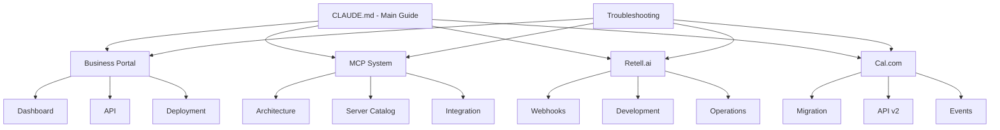

# 📚 Complete AskProAI Documentation Index

## 🗂️ Master Documentation List

### 🏗️ Core System Documentation
1. **CLAUDE.md** - Main development guide and project overview
2. **ASKPROAI_COMPLETE_DOCUMENTATION.md** - System-wide documentation
3. **TECHNICAL_SPECIFICATION_V2_FINAL.md** - Complete technical specifications
4. **MASTER_IMPLEMENTATION_PLAN.md** - Overall implementation strategy
5. **DEPLOYMENT_GUIDE.md** - Production deployment procedures
6. **TESTING_STRATEGY.md** - Comprehensive testing approach
7. **MONITORING_AND_ALERTING_GUIDE.md** - System monitoring setup

### 💼 Business Portal Documentation (15 Documents)
1. **BUSINESS_PORTAL_COMPLETE_DOCUMENTATION.md** - Complete portal overview
2. **01-DASHBOARD-MODULE.md** - Dashboard implementation details
3. **02-CALLS-MODULE.md** - Calls management module
4. **03-API-ARCHITECTURE.md** - API structure and endpoints
5. **API_REFERENCE.md** - Complete API documentation
6. **DEPLOYMENT_GUIDE.md** - Portal deployment guide
7. **TROUBLESHOOTING_GUIDE.md** - Common issues and solutions
8. **ENVIRONMENT_VARIABLES.md** - Configuration reference
9. **GOAL_SYSTEM_GUIDE.md** - Goal tracking implementation
10. **CUSTOMER_JOURNEY_GUIDE.md** - Customer journey mapping
11. **SECURITY_AUDIT_GUIDE.md** - Security best practices
12. **MCP_SERVER_GUIDE.md** - MCP integration for portal
13. **QUICK_REFERENCE.md** - Quick lookup guide
14. **NOTION_TRANSFER_GUIDE.md** - Documentation transfer guide
15. **Business Portal React Migration** - Multiple implementation docs

### 🤖 MCP Server System Documentation (20+ Documents)
1. **MCP_COMPLETE_OVERVIEW.md** - Complete MCP system overview
2. **MCP_ARCHITECTURE.md** - System architecture details
3. **MCP_INTEGRATION_GUIDE.md** - Integration procedures
4. **MCP_SETUP_COMPLETE_GUIDE.md** - Setup instructions
5. **MCP_TEAM_GUIDE.md** - Team collaboration guide
6. **MCP_QUICK_REFERENCE.md** - Quick command reference
7. **MCP_EXAMPLES.md** - Usage examples
8. **MCP_TROUBLESHOOTING.md** - Troubleshooting guide
9. **MCP_EVOLUTION_SYSTEM.md** - System evolution strategy

#### Individual MCP Server Documentation:
10. **CalcomMCPServer** - Calendar integration
11. **RetellMCPServer** - AI phone service
12. **DatabaseMCPServer** - Database operations
13. **WebhookMCPServer** - Webhook processing
14. **QueueMCPServer** - Queue management
15. **StripeMCPServer** - Payment processing
16. **KnowledgeMCPServer** - Knowledge base
17. **AppointmentMCPServer** - Appointment management
18. **CustomerMCPServer** - Customer management
19. **CompanyMCPServer** - Multi-tenant management
20. **BranchMCPServer** - Branch management
21. **RetellConfigurationMCPServer** - Retell configuration
22. **RetellCustomFunctionMCPServer** - Custom AI functions
23. **AppointmentManagementMCPServer** - Advanced appointments
24. **SentryMCPServer** - Error tracking
25. **GITHUB_MCP_SERVER.md** - GitHub integration
26. **APIDOG_MCP_SERVER.md** - API documentation
27. **SEQUENTIAL_THINKING_MCP_SERVER.md** - Problem solving
28. **DATABASE_QUERY_MCP_SERVER.md** - Query optimization
29. **NOTION_MEMORY_FIGMA_MCP_SERVERS.md** - Design tools

### 📞 Retell.ai Integration Documentation (10+ Documents)
1. **RETELL_AI_COMPLETE_DOCUMENTATION.md** - Complete Retell guide
2. **RETELL_TROUBLESHOOTING_GUIDE_2025.md** - Troubleshooting guide
3. **RETELL_DEVELOPER_GUIDE.md** - Developer reference
4. **RETELL_OPERATIONS_MANUAL.md** - Operations procedures
5. **RETELL_WEBHOOK_CONFIGURATION_GUIDE.md** - Webhook setup
6. **RETELL_DATA_INTEGRATION_SUMMARY.md** - Data integration
7. **RETELL_IMPLEMENTATION_STATUS.md** - Current status
8. **RETELL_AGENT_PROMPT_UPDATED.md** - AI agent prompts
9. **RETELL_COLLECT_APPOINTMENT_INTEGRATION.md** - Appointment collection
10. **RETELL_WEBHOOK_FIX_2025-07-02.md** - Critical webhook fixes

### 📅 Cal.com Integration Documentation
1. **CALCOM_V2_MIGRATION_GUIDE.md** - V2 migration guide
2. **CALCOM_V2_API_DOCUMENTATION.md** - API v2 documentation
3. **CAL_COM_API_V1_V2_COMPARISON.md** - Version comparison
4. **CALCOM_MIGRATION_GUIDE.md** - Migration procedures
5. **CALCOM_IMPORT_GUIDE.md** - Data import guide
6. **EVENT_MANAGEMENT_DOCUMENTATION.md** - Event handling

### 🎯 Feature-Specific Documentation
1. **GOAL_SYSTEM_GUIDE.md** - Goal tracking system
2. **CUSTOMER_JOURNEY_GUIDE.md** - Customer journey mapping
3. **SENSITIVE_DATA_MASKING_IMPLEMENTATION.md** - Data protection
4. **API_AUTHENTICATION_STATUS.md** - Auth implementation
5. **WEBHOOK_RESPONSE_STANDARDS.md** - Webhook standards
6. **PERFORMANCE_INDEX_REPORT.md** - Performance metrics
7. **E2E_TEST_SCENARIOS.md** - End-to-end testing

### 🔧 Development & Operations
1. **DEVELOPMENT_PROCESS_2025.md** - Development workflow
2. **BEST_PRACTICES_IMPLEMENTATION.md** - Best practices guide
3. **DATABASE_SAFETY_GUIDELINES.md** - Database operations
4. **STRUCTURED_LOGGER_GUIDE.md** - Logging implementation
5. **ENHANCED_BOOKING_SERVICE.md** - Booking service details
6. **SERVICE_ARCHITECTURE.md** - Service layer architecture
7. **UNIVERSAL_BOOKING_SYSTEM.md** - Booking system design

### 🐛 Troubleshooting & Support
1. **TROUBLESHOOTING_DECISION_TREE.md** - Decision tree guide
2. **ERROR_PATTERNS.md** - Common error patterns
3. **PHONE_TO_APPOINTMENT_FLOW.md** - Call flow debugging
4. **INTEGRATION_HEALTH_MONITOR.md** - Integration monitoring
5. **KPI_DASHBOARD_TEMPLATE.md** - KPI tracking
6. **TROUBLESHOOTING_GUIDE.md** - General troubleshooting

### 🚀 Deployment & DevOps
1. **DEPLOYMENT_CHECKLIST.md** - Deployment procedures
2. **EMERGENCY_RESPONSE_PLAYBOOK.md** - Emergency procedures
3. **5-MINUTEN_ONBOARDING_PLAYBOOK.md** - Quick onboarding
4. **CUSTOMER_SUCCESS_RUNBOOK.md** - Customer success guide
5. **PRODUCTION_READY_STATUS.md** - Production readiness

### 📊 Status Reports & Analysis
1. **SYSTEM_STATUS_REPORT.md** - Current system status
2. **FEATURES_VERIFICATION_REPORT.md** - Feature verification
3. **PERFORMANCE_OPTIMIZATION_GUIDE.md** - Performance tuning
4. **EAGER_LOADING_OPTIMIZATION.md** - Query optimization
5. **QUERY_OPTIMIZATION_GUIDE.md** - Database queries

### 🗄️ Archive & Historical
1. **BLOCKER_JUNI_2025.md** - Historical blockers
2. **Migration guides** - Various migration documents
3. **Status reports** - Historical status updates
4. **Implementation plans** - Past implementation docs

---

## 📊 Documentation Statistics

### By Category
- **Core System**: 15 documents
- **Business Portal**: 15 documents
- **MCP Servers**: 29 documents
- **Retell.ai**: 10 documents
- **Cal.com**: 6 documents
- **Features**: 7 documents
- **Development**: 7 documents
- **Troubleshooting**: 6 documents
- **Deployment**: 5 documents
- **Reports**: 5 documents
- **Archive**: 50+ documents

### Total Active Documentation: 150+ files
### Total Including Archive: 250+ files

---

## 🔄 Documentation Relationships

---

## 🎯 Quick Access Matrix

| Need | Primary Doc | Secondary Docs |
|------|------------|----------------|
| **Getting Started** | CLAUDE.md | Quick Reference, 5-Min Onboarding |
| **Business Portal** | Business Portal Complete | API Reference, Deployment |
| **MCP Servers** | MCP Complete Overview | Architecture, Examples |
| **Retell Setup** | Retell Complete Doc | Troubleshooting, Webhooks |
| **Troubleshooting** | Troubleshooting Guide | Error Patterns, Decision Tree |
| **Deployment** | Deployment Guide | Checklist, Emergency Response |
| **API Development** | API Reference | Architecture, Authentication |
| **Performance** | Performance Guide | Optimization, Monitoring |

---

## 📝 Documentation Maintenance

### Update Frequency
- **Core Docs**: Monthly review
- **API Docs**: With each release
- **Troubleshooting**: As issues arise
- **Archive**: Quarterly cleanup

### Ownership
- **System Architecture**: Senior Developers
- **API Documentation**: Backend Team
- **User Guides**: Product Team
- **Troubleshooting**: Support Team

---

*Last Updated: 2025-07-10*
*Total Documents: 250+*
*Active Documents: 150+*