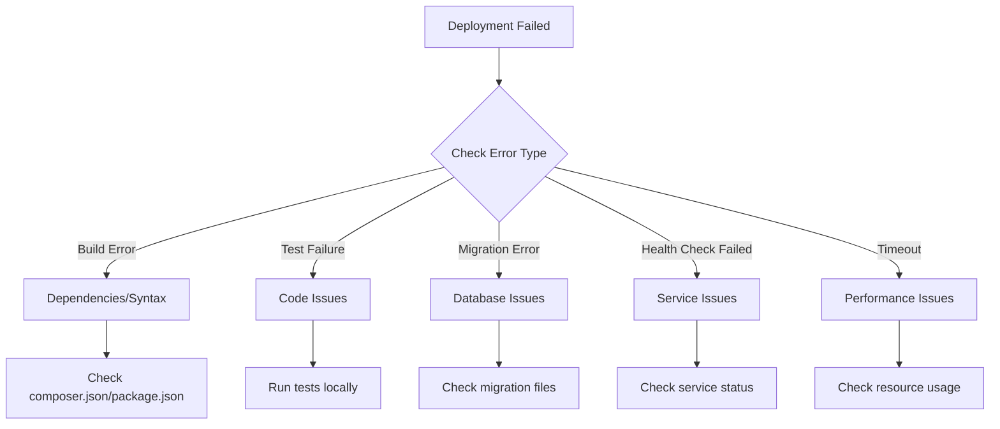

# Deployment Troubleshooting Guide - AskProAI

**Version**: 1.0  
**Last Updated**: 2025-01-10  
**Purpose**: Quick reference for resolving deployment issues

## Table of Contents

1. [Common Deployment Failures](#common-deployment-failures)
2. [Pre-Deployment Issues](#pre-deployment-issues)
3. [During Deployment Issues](#during-deployment-issues)
4. [Post-Deployment Issues](#post-deployment-issues)
5. [GitHub Actions Issues](#github-actions-issues)
6. [Database Migration Issues](#database-migration-issues)
7. [Performance Issues](#performance-issues)
8. [Integration Issues](#integration-issues)
9. [Emergency Recovery](#emergency-recovery)
10. [Prevention Strategies](#prevention-strategies)

---

## Common Deployment Failures

### Quick Diagnosis Flowchart



### Top 5 Most Common Issues

1. **Composer Package Conflicts**
   ```bash
   # Solution
   composer update --with-all-dependencies
   composer install --no-scripts
   composer dump-autoload
   ```

2. **Database Connection Failed**
   ```bash
   # Check connection
   php artisan db:show
   
   # Test credentials
   mysql -h localhost -u askproai_user -p askproai
   ```

3. **Permission Errors**
   ```bash
   # Fix permissions
   sudo chown -R www-data:www-data storage bootstrap/cache
   sudo find storage -type d -exec chmod 755 {} \;
   sudo find storage -type f -exec chmod 644 {} \;
   ```

4. **Cache Issues**
   ```bash
   # Clear all caches
   php artisan optimize:clear
   rm -rf bootstrap/cache/*.php
   ```

5. **Queue Worker Not Restarting**
   ```bash
   # Force restart
   php artisan queue:restart
   sudo supervisorctl restart all
   ```

---

## Pre-Deployment Issues

### Issue: Git Authentication Failed

**Symptoms**:
```
fatal: Authentication failed for 'https://github.com/...'
```

**Solutions**:
```bash
# Update Git credentials
git config --global credential.helper store
git pull # Enter credentials when prompted

# Use SSH instead
git remote set-url origin git@github.com:askproai/api-gateway.git

# For GitHub Actions, check secrets
gh secret set GITHUB_TOKEN
```

### Issue: Insufficient Disk Space

**Symptoms**:
```
No space left on device
```

**Solutions**:
```bash
# Check disk usage
df -h
du -sh /var/*

# Clean up
# 1. Old logs
find /var/log -name "*.gz" -delete
truncate -s 0 /var/log/nginx/access.log

# 2. Old backups
find /var/backups -mtime +30 -delete

# 3. Docker cleanup (if using)
docker system prune -a

# 4. Composer cache
composer clear-cache

# 5. NPM cache
npm cache clean --force
```

### Issue: Environment File Missing

**Symptoms**:
```
.env file not found
```

**Solutions**:
```bash
# Copy from template
cp .env.production.example .env.production

# Or restore from backup
cp /var/backups/askproai/configs/.env.production.backup .env

# Verify required variables
php artisan env:check
```

---

## During Deployment Issues

### Issue: Composer Install Hangs

**Symptoms**:
- Composer install takes forever
- No output for minutes

**Solutions**:
```bash
# Increase timeout
composer install --no-interaction --prefer-dist --optimize-autoloader --no-progress --profile

# Use verbose mode to see what's happening
composer install -vvv

# Clear composer cache
composer clear-cache

# Use specific mirror
composer config -g repos.packagist composer https://packagist.org
```

### Issue: NPM Install Fails

**Symptoms**:
```
npm ERR! code EINTEGRITY
npm ERR! sha512-... integrity checksum failed
```

**Solutions**:
```bash
# Clean install
rm -rf node_modules package-lock.json
npm cache clean --force
npm install

# Use different registry
npm config set registry https://registry.npmjs.org/
npm install

# Install with legacy peer deps
npm install --legacy-peer-deps
```

### Issue: Migration Locks

**Symptoms**:
```
SQLSTATE[HY000]: General error: 1205 Lock wait timeout exceeded
```

**Solutions**:
```bash
# Check for locks
mysql -e "SHOW PROCESSLIST;" | grep -i lock

# Kill blocking query
mysql -e "KILL QUERY process_id;"

# Run migrations with timeout
php artisan migrate --force --timeout=300

# Use online schema change for large tables
pt-online-schema-change --alter "ADD COLUMN new_field VARCHAR(255)" D=askproai,t=large_table
```

### Issue: Build Process Killed

**Symptoms**:
```
npm run build
Killed
```

**Solutions**:
```bash
# Check memory
free -h

# Increase swap
sudo fallocate -l 4G /swapfile
sudo chmod 600 /swapfile
sudo mkswap /swapfile
sudo swapon /swapfile

# Build with reduced memory
NODE_OPTIONS="--max-old-space-size=2048" npm run build

# Or build locally and upload
npm run build
rsync -avz public/build/ server:/var/www/api-gateway/public/build/
```

---

## Post-Deployment Issues

### Issue: 500 Internal Server Error

**Debug Steps**:
```bash
# 1. Check PHP errors
tail -100 /var/log/php8.2-fpm.log
tail -100 storage/logs/laravel.log

# 2. Check permissions
ls -la storage/logs/
ls -la bootstrap/cache/

# 3. Test PHP syntax
find . -name "*.php" -exec php -l {} \; | grep -v "No syntax errors"

# 4. Check .env file
php artisan tinker
>>> config('app.key')
>>> config('database.default')

# 5. Enable debug mode temporarily
sed -i 's/APP_DEBUG=false/APP_DEBUG=true/' .env
# Check error
sed -i 's/APP_DEBUG=true/APP_DEBUG=false/' .env
```

### Issue: Queue Jobs Not Processing

**Debug Steps**:
```bash
# 1. Check Horizon status
php artisan horizon:status

# 2. Check Redis connection
redis-cli ping

# 3. Check failed jobs
php artisan queue:failed

# 4. Process single job manually
php artisan queue:work --once

# 5. Check supervisor
sudo supervisorctl status
sudo supervisorctl restart horizon

# 6. View Horizon logs
tail -f storage/logs/horizon.log
```

### Issue: Slow Response Times

**Debug Steps**:
```bash
# 1. Check slow queries
tail -f /var/log/mysql/slow-query.log

# 2. Check PHP-FPM status
sudo php-fpm8.2 -tt
curl http://localhost/php-fpm-status

# 3. Check OPcache
php -r "print_r(opcache_get_status());"

# 4. Profile specific endpoint
ab -n 100 -c 10 https://api.askproai.de/api/health

# 5. Check Redis performance
redis-cli --latency
redis-cli monitor

# 6. Enable query log temporarily
php artisan tinker
>>> DB::enableQueryLog();
>>> // Run slow operation
>>> dd(DB::getQueryLog());
```

---

## GitHub Actions Issues

### Issue: Workflow Not Triggering

**Debug**:
```bash
# Check workflow syntax
actionlint .github/workflows/deploy.yml

# Validate YAML
yamllint .github/workflows/deploy.yml

# Check branch protection rules
gh api repos/:owner/:repo/branches/main/protection

# Manually trigger
gh workflow run deploy.yml -f environment=staging
```

### Issue: Secrets Not Available

**Symptoms**:
```
Error: Input required and not supplied: ssh-private-key
```

**Solutions**:
```bash
# List secrets
gh secret list

# Set secret
gh secret set PRODUCTION_SSH_KEY < ~/.ssh/prod_key

# Check secret in workflow
- name: Debug
  run: |
    echo "Secret exists: ${{ secrets.PRODUCTION_SSH_KEY != '' }}"
```

### Issue: GitHub Actions Timeout

**Solutions**:
```yaml
# Increase timeout in workflow
jobs:
  deploy:
    timeout-minutes: 60  # Default is 360

# Or split into smaller jobs
jobs:
  build:
    # ...
  test:
    needs: build
    # ...
  deploy:
    needs: test
    # ...
```

---

## Database Migration Issues

### Issue: Migration Rollback Needed

**Safe Rollback**:
```bash
# 1. Check migration status
php artisan migrate:status

# 2. Rollback last batch
php artisan migrate:rollback --step=1

# 3. Rollback specific migration
php artisan migrate:rollback --path=/database/migrations/2025_01_10_create_feature_table.php

# 4. Emergency: manual rollback
mysql askproai -e "DROP TABLE IF EXISTS feature_table;"
mysql askproai -e "DELETE FROM migrations WHERE migration = '2025_01_10_create_feature_table';"
```

### Issue: Foreign Key Constraints

**Symptoms**:
```
SQLSTATE[23000]: Integrity constraint violation: 1452 Cannot add or update a child row
```

**Solutions**:
```bash
# Temporarily disable checks
php artisan tinker
>>> Schema::disableForeignKeyConstraints();
>>> // Run migration
>>> Schema::enableForeignKeyConstraints();

# Or in migration file
public function up()
{
    Schema::disableForeignKeyConstraints();
    // ... migration code ...
    Schema::enableForeignKeyConstraints();
}
```

### Issue: Column Already Exists

**Solutions**:
```php
// Check before adding
public function up()
{
    if (!Schema::hasColumn('users', 'new_column')) {
        Schema::table('users', function (Blueprint $table) {
            $table->string('new_column')->nullable();
        });
    }
}
```

---

## Performance Issues

### Issue: Memory Exhausted

**Symptoms**:
```
PHP Fatal error: Allowed memory size of 134217728 bytes exhausted
```

**Solutions**:
```bash
# Temporary increase
php -d memory_limit=512M artisan command

# Permanent increase
# Edit /etc/php/8.2/fpm/php.ini
memory_limit = 512M

# Restart PHP-FPM
sudo systemctl restart php8.2-fpm

# Find memory leaks
php artisan tinker
>>> memory_get_usage(true) / 1024 / 1024 // MB
>>> // Run operation
>>> memory_get_usage(true) / 1024 / 1024 // MB
```

### Issue: Too Many Database Connections

**Symptoms**:
```
SQLSTATE[HY000] [1040] Too many connections
```

**Solutions**:
```bash
# Check current connections
mysql -e "SHOW PROCESSLIST;" | wc -l
mysql -e "SHOW VARIABLES LIKE 'max_connections';"

# Increase limit (temporary)
mysql -e "SET GLOBAL max_connections = 500;"

# Permanent fix in /etc/mysql/mysql.conf.d/mysqld.cnf
max_connections = 500

# Kill idle connections
mysql -e "SELECT CONCAT('KILL ', id, ';') FROM information_schema.processlist WHERE command = 'Sleep' AND time > 300;" | mysql

# Use connection pooling in .env
DB_POOL_MIN=2
DB_POOL_MAX=10
```

---

## Integration Issues

### Issue: Cal.com API Failing

**Debug**:
```bash
# Test API key
curl -H "apiKey: YOUR_API_KEY" https://api.cal.com/v1/me

# Check from application
php artisan tinker
>>> $service = app(App\Services\CalcomService::class);
>>> $service->testConnection();

# Common fixes
# 1. Check API key
grep CALCOM .env

# 2. Check rate limits
curl -I -H "apiKey: YOUR_API_KEY" https://api.cal.com/v1/me

# 3. Use circuit breaker
php artisan circuit-breaker:status
php artisan circuit-breaker:reset calcom
```

### Issue: Retell.ai Webhooks Not Working

**Debug**:
```bash
# 1. Check webhook URL in Retell dashboard
# Should be: https://api.askproai.de/api/retell/webhook

# 2. Test webhook signature
curl -X POST https://api.askproai.de/api/retell/webhook \
  -H "Content-Type: application/json" \
  -H "x-retell-signature: test" \
  -d '{"event": "test"}'

# 3. Check webhook logs
grep -i retell storage/logs/laravel.log | tail -50

# 4. Verify webhook secret
php artisan tinker
>>> config('services.retell.webhook_secret')
```

---

## Emergency Recovery

### Complete System Failure

```bash
#!/bin/bash
# Emergency Recovery Script

# 1. Enable maintenance mode (if possible)
php artisan down || echo "Maintenance mode failed"

# 2. Backup current state
tar -czf /tmp/emergency-backup-$(date +%s).tar.gz /var/www/api-gateway

# 3. Restore last known good state
cd /var/www/api-gateway
git fetch origin
git reset --hard origin/main

# 4. Restore vendor directories
composer install --no-dev --optimize-autoloader
npm ci --production

# 5. Restore database
mysql askproai < /var/backups/askproai/db/latest-verified.sql

# 6. Clear everything
php artisan optimize:clear

# 7. Restart services
systemctl restart nginx php8.2-fpm redis mysql

# 8. Health check
curl https://api.askproai.de/api/health
```

### Data Corruption Recovery

```bash
# 1. Stop all writes
php artisan down
php artisan queue:pause

# 2. Identify corruption
mysqlcheck -c askproai

# 3. Attempt repair
mysqlcheck -r askproai

# 4. If repair fails, restore from backup
# Find last good backup before corruption
mysql askproai < /var/backups/askproai/db/backup-before-corruption.sql

# 5. Replay transactions from binary log
mysqlbinlog --start-datetime="2025-01-10 14:00:00" /var/log/mysql/mysql-bin.* | mysql askproai
```

---

## Prevention Strategies

### Pre-Deployment Checklist

```bash
#!/bin/bash
# pre-deploy-check.sh

echo "Running pre-deployment checks..."

# 1. Test suite passes
php artisan test || exit 1

# 2. No syntax errors
find . -name "*.php" -exec php -l {} \; | grep -E "error|Error" && exit 1

# 3. Dependencies are locked
test -f composer.lock || exit 1
test -f package-lock.json || exit 1

# 4. Migrations are reversible
php artisan migrate:status | grep -i "pending" || exit 1

# 5. Disk space available
AVAILABLE=$(df / | awk 'NR==2 {print $4}')
[[ $AVAILABLE -lt 5000000 ]] && echo "Low disk space!" && exit 1

echo "All checks passed!"
```

### Monitoring Setup

```yaml
# prometheus/alerts.yml
groups:
  - name: deployment
    rules:
      - alert: DeploymentFailed
        expr: increase(deployment_failures_total[5m]) > 0
        for: 1m
        annotations:
          summary: "Deployment failed"
          
      - alert: PostDeploymentErrors
        expr: rate(http_requests_total{status=~"5.."}[5m]) > 0.1
        for: 5m
        annotations:
          summary: "High error rate after deployment"
```

### Automated Recovery

```bash
#!/bin/bash
# auto-recovery.sh

# Monitor health endpoint
while true; do
    STATUS=$(curl -s -o /dev/null -w "%{http_code}" https://api.askproai.de/api/health)
    
    if [ "$STATUS" != "200" ]; then
        echo "Health check failed, attempting recovery..."
        
        # Try cache clear first
        php artisan cache:clear
        
        sleep 30
        
        # Check again
        STATUS=$(curl -s -o /dev/null -w "%{http_code}" https://api.askproai.de/api/health)
        
        if [ "$STATUS" != "200" ]; then
            # Rollback
            ./deploy/rollback.sh --auto
        fi
    fi
    
    sleep 60
done
```

---

## Quick Reference Card

### Emergency Commands

```bash
# Stop everything
php artisan down
php artisan queue:pause
systemctl stop horizon

# Clear everything
php artisan optimize:clear
redis-cli FLUSHALL

# Restart everything
systemctl restart nginx php8.2-fpm redis mysql
php artisan up
php artisan queue:restart

# Rollback
./deploy/rollback.sh

# View all logs
tail -f /var/log/**/*.log
```

### Debug Commands

```bash
# PHP info
php -i | grep -i error
php-fpm8.2 -tt

# MySQL
mysql -e "SHOW PROCESSLIST;"
mysql -e "SHOW ENGINE INNODB STATUS\G"

# Redis
redis-cli monitor
redis-cli --latency

# System
htop
iotop
netstat -tlnp
```

---

**Document Version**: 1.0  
**Last Updated**: 2025-01-10  
**Emergency Contact**: DevOps On-Call via PagerDuty  
**Maintained By**: DevOps Team