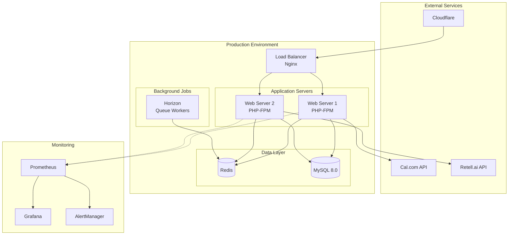

# DevOps Manual - AskProAI

**Version**: 1.0  
**Last Updated**: 2025-01-10  
**Target Audience**: DevOps Engineers, System Administrators

## Table of Contents

1. [Infrastructure Overview](#infrastructure-overview)
2. [Server Management](#server-management)
3. [Deployment Operations](#deployment-operations)
4. [Monitoring & Alerting](#monitoring--alerting)
5. [Backup & Recovery](#backup--recovery)
6. [Security Operations](#security-operations)
7. [Performance Management](#performance-management)
8. [Incident Response](#incident-response)
9. [Maintenance Procedures](#maintenance-procedures)
10. [Automation Scripts](#automation-scripts)

---

## Infrastructure Overview

### Architecture Diagram



### Server Specifications

**Production Servers**:
- **Web Servers**: 2x (8 vCPU, 16GB RAM, 200GB SSD)
- **Database Server**: 1x (16 vCPU, 32GB RAM, 500GB SSD)
- **Redis Server**: 1x (4 vCPU, 8GB RAM, 100GB SSD)
- **Monitoring Server**: 1x (4 vCPU, 8GB RAM, 200GB SSD)

**Network Configuration**:
- **Domain**: api.askproai.de
- **SSL**: Let's Encrypt (auto-renewal)
- **CDN**: Cloudflare
- **Firewall**: UFW + Cloudflare WAF

---

## Server Management

### SSH Access

```bash
# Production access
ssh -i ~/.ssh/askproai-prod.pem deploy@prod-web-01.askproai.internal
ssh -i ~/.ssh/askproai-prod.pem deploy@prod-web-02.askproai.internal

# Database access (restricted)
ssh -i ~/.ssh/askproai-db.pem dbadmin@prod-db-01.askproai.internal

# Staging access
ssh -i ~/.ssh/askproai-staging.pem deploy@staging.askproai.internal
```

### User Management

```bash
# Add new DevOps user
sudo adduser newdevops
sudo usermod -aG sudo,www-data,deploy newdevops

# Set up SSH key
sudo mkdir /home/newdevops/.ssh
sudo chmod 700 /home/newdevops/.ssh
echo "ssh-rsa AAAAB3..." | sudo tee /home/newdevops/.ssh/authorized_keys
sudo chmod 600 /home/newdevops/.ssh/authorized_keys
sudo chown -R newdevops:newdevops /home/newdevops/.ssh

# Remove user access
sudo deluser --remove-home olduser
```

### Service Management

```bash
# Check all services
sudo systemctl status nginx php8.2-fpm mysql redis

# Restart services gracefully
sudo systemctl reload nginx
sudo systemctl reload php8.2-fpm

# Hard restart (if needed)
sudo systemctl restart nginx
sudo systemctl restart php8.2-fpm

# View service logs
sudo journalctl -u nginx -f
sudo journalctl -u php8.2-fpm -f
```

### System Updates

```bash
# Weekly security updates (automated via unattended-upgrades)
# Manual check:
sudo apt update
sudo apt list --upgradable

# Apply security updates only
sudo apt-get install --only-upgrade $(apt list --upgradable 2>/dev/null | grep -i security | cut -d'/' -f1)

# Full system update (scheduled maintenance)
sudo apt update && sudo apt upgrade -y

# Kernel updates (requires reboot)
sudo apt install linux-generic
sudo reboot
```

---

## Deployment Operations

### Pre-Deployment Checklist

```bash
# 1. Run pre-deployment checks
cd /var/www/api-gateway
./deploy/pre-deploy-check.sh

# 2. Verify backups
ls -la /var/backups/askproai/ | tail -5

# 3. Check system resources
df -h
free -h
htop

# 4. Review pending changes
git log origin/main..main --oneline
```

### Standard Deployment

```bash
# Production deployment
./deploy/deploy.sh production

# Staging deployment
./deploy/deploy.sh staging

# Dry run (test without applying)
DRY_RUN=true ./deploy/deploy.sh production
```

### Zero-Downtime Deployment

```bash
# Blue-Green deployment
./deploy/zero-downtime-deploy.sh production

# Monitor progress
tail -f /var/log/askproai/zero-downtime-deploy-*.log

# Verify active environment
readlink /var/www/api-gateway
```

### Emergency Deployment

```bash
# Skip tests for critical hotfix
gh workflow run deploy.yml \
  -f environment=production \
  -f ref=hotfix/critical-fix \
  -f skip_tests=true \
  -f reason="Critical security patch CVE-2025-XXXX"

# Manual emergency deployment
cd /var/www/api-gateway
git pull origin hotfix/critical-fix
composer install --no-dev --optimize-autoloader
php artisan down --message="Emergency maintenance"
php artisan migrate --force
php artisan optimize
php artisan up
```

### Post-Deployment Verification

```bash
# 1. Health checks
curl -s https://api.askproai.de/api/health | jq .
curl -s https://api.askproai.de/api/health/database | jq .
curl -s https://api.askproai.de/api/health/redis | jq .
curl -s https://api.askproai.de/api/health/queue | jq .

# 2. Check error logs
tail -100 /var/www/api-gateway/storage/logs/laravel.log | grep ERROR

# 3. Monitor queue
php artisan horizon:status
php artisan queue:monitor

# 4. Check response times
ab -n 100 -c 10 https://api.askproai.de/api/health
```

---

## Monitoring & Alerting

### Prometheus Configuration

`/etc/prometheus/prometheus.yml`:
```yaml
global:
  scrape_interval: 15s
  evaluation_interval: 15s

alerting:
  alertmanagers:
    - static_configs:
        - targets: ['localhost:9093']

scrape_configs:
  - job_name: 'askproai'
    static_configs:
      - targets: ['localhost:9090']
    metric_path: '/api/metrics'
    
  - job_name: 'node'
    static_configs:
      - targets: ['localhost:9100']
      
  - job_name: 'mysql'
    static_configs:
      - targets: ['localhost:9104']
      
  - job_name: 'redis'
    static_configs:
      - targets: ['localhost:9121']
```

### Alert Rules

`/etc/prometheus/rules/askproai.yml`:
```yaml
groups:
  - name: askproai
    interval: 30s
    rules:
      - alert: HighErrorRate
        expr: rate(askproai_http_requests_total{status=~"5.."}[5m]) > 0.05
        for: 5m
        labels:
          severity: critical
        annotations:
          summary: "High error rate detected"
          description: "Error rate is {{ $value }}% for the last 5 minutes"
          
      - alert: SlowResponseTime
        expr: histogram_quantile(0.95, askproai_http_request_duration_seconds) > 1
        for: 10m
        labels:
          severity: warning
        annotations:
          summary: "Slow response times"
          description: "95th percentile response time is {{ $value }}s"
          
      - alert: QueueBacklog
        expr: askproai_queue_size > 1000
        for: 15m
        labels:
          severity: warning
        annotations:
          summary: "Large queue backlog"
          description: "Queue size is {{ $value }}"
          
      - alert: DiskSpaceLow
        expr: node_filesystem_avail_bytes{mountpoint="/"} / node_filesystem_size_bytes < 0.15
        for: 10m
        labels:
          severity: critical
        annotations:
          summary: "Low disk space"
          description: "Only {{ $value }}% disk space remaining"
```

### Grafana Dashboards

**Key Dashboards**:
1. **Application Overview**
   - Request rate
   - Error rate
   - Response time (p50, p95, p99)
   - Active users

2. **Infrastructure**
   - CPU usage
   - Memory usage
   - Disk I/O
   - Network traffic

3. **Business Metrics**
   - Appointments created
   - Call volume
   - Webhook processing time
   - API integration status

### Log Management

```bash
# Centralized logging with rsyslog
# /etc/rsyslog.d/askproai.conf
:programname, isequal, "askproai" /var/log/askproai/app.log
& stop

# Log rotation
# /etc/logrotate.d/askproai
/var/log/askproai/*.log {
    daily
    missingok
    rotate 30
    compress
    delaycompress
    notifempty
    create 0640 www-data adm
    sharedscripts
    postrotate
        systemctl reload rsyslog > /dev/null
    endscript
}

# Search logs
grep -r "ERROR" /var/log/askproai/ --include="*.log" | tail -50
zgrep "CRITICAL" /var/log/askproai/*.gz

# Real-time log monitoring
tail -f /var/log/askproai/app.log | grep -E "ERROR|CRITICAL"
```

---

## Backup & Recovery

### Backup Strategy

**Schedule**:
- **Database**: Every 4 hours (retained 7 days)
- **Application**: Daily (retained 30 days)
- **Full System**: Weekly (retained 90 days)
- **Offsite**: Daily sync to S3

### Backup Scripts

```bash
# Database backup
#!/bin/bash
# /usr/local/bin/backup-database.sh

BACKUP_DIR="/var/backups/askproai/db"
TIMESTAMP=$(date +%Y%m%d_%H%M%S)
DB_NAME="askproai"

# Create backup
mysqldump \
    --single-transaction \
    --routines \
    --triggers \
    --events \
    --add-drop-database \
    $DB_NAME | gzip -9 > "$BACKUP_DIR/db_${TIMESTAMP}.sql.gz"

# Verify backup
gunzip -t "$BACKUP_DIR/db_${TIMESTAMP}.sql.gz"

# Clean old backups
find "$BACKUP_DIR" -name "db_*.sql.gz" -mtime +7 -delete

# Sync to S3
aws s3 sync "$BACKUP_DIR" s3://askproai-backups/db/ --delete
```

### Recovery Procedures

**Database Recovery**:
```bash
# 1. Stop application
php artisan down

# 2. Backup current state
mysqldump askproai > /tmp/askproai_current.sql

# 3. Restore from backup
gunzip < /var/backups/askproai/db/db_20250110_020000.sql.gz | mysql askproai

# 4. Verify restoration
mysql -e "USE askproai; SHOW TABLES;"

# 5. Restart application
php artisan up
```

**Point-in-Time Recovery**:
```bash
# Using binary logs
mysqlbinlog \
    --start-datetime="2025-01-10 10:00:00" \
    --stop-datetime="2025-01-10 10:30:00" \
    /var/log/mysql/mysql-bin.000042 | mysql askproai
```

**Full System Recovery**:
```bash
# 1. Restore application files
cd /
tar -xzf /var/backups/askproai/full/system_20250110.tar.gz

# 2. Restore database
gunzip < /var/backups/askproai/db/db_latest.sql.gz | mysql

# 3. Restore Redis data
cp /var/backups/askproai/redis/dump.rdb /var/lib/redis/

# 4. Fix permissions
chown -R www-data:www-data /var/www/api-gateway
chown redis:redis /var/lib/redis/dump.rdb

# 5. Restart services
systemctl restart nginx php8.2-fpm redis mysql
```

---

## Security Operations

### Security Hardening

```bash
# 1. Firewall configuration
sudo ufw default deny incoming
sudo ufw default allow outgoing
sudo ufw allow from 10.0.0.0/8 to any port 22  # SSH from internal
sudo ufw allow 80/tcp
sudo ufw allow 443/tcp
sudo ufw enable

# 2. Fail2ban configuration
sudo apt install fail2ban
sudo cp /etc/fail2ban/jail.conf /etc/fail2ban/jail.local
sudo systemctl enable fail2ban

# 3. SSH hardening
# /etc/ssh/sshd_config
PermitRootLogin no
PasswordAuthentication no
PubkeyAuthentication yes
AllowUsers deploy devops
```

### SSL Certificate Management

```bash
# Check certificate expiry
echo | openssl s_client -servername api.askproai.de -connect api.askproai.de:443 2>/dev/null | openssl x509 -noout -dates

# Renew Let's Encrypt certificate
sudo certbot renew --dry-run  # Test first
sudo certbot renew
sudo systemctl reload nginx

# Monitor auto-renewal
sudo systemctl status certbot.timer
```

### Security Auditing

```bash
# 1. Check for vulnerabilities
sudo apt install lynis
sudo lynis audit system

# 2. Review user access
last -20
who
w

# 3. Check for suspicious processes
ps aux | grep -v "grep" | grep -E "nc|netcat|perl|python" | grep -v "legitimate_process"

# 4. Monitor file changes
find /var/www/api-gateway -type f -mtime -1 -ls

# 5. Review authentication logs
grep "Failed password" /var/log/auth.log | tail -20
grep "Accepted publickey" /var/log/auth.log | tail -20
```

### Incident Response Checklist

1. **Detection**:
   ```bash
   # Check active connections
   netstat -tlnp
   ss -tulwn
   
   # Review system logs
   tail -f /var/log/syslog
   journalctl -xe
   ```

2. **Containment**:
   ```bash
   # Block suspicious IP
   sudo iptables -I INPUT -s SUSPICIOUS_IP -j DROP
   
   # Disable compromised account
   sudo usermod -L compromised_user
   
   # Stop suspicious service
   sudo systemctl stop suspicious.service
   ```

3. **Investigation**:
   ```bash
   # Collect evidence
   sudo tar -czf /tmp/incident_$(date +%s).tar.gz \
     /var/log \
     /etc/passwd \
     /etc/shadow \
     /home/*/.bash_history
   ```

4. **Recovery**:
   - Follow backup restoration procedures
   - Reset all passwords
   - Review and update security policies

---

## Performance Management

### Performance Tuning

**PHP-FPM Configuration**:
```ini
; /etc/php/8.2/fpm/pool.d/www.conf
pm = dynamic
pm.max_children = 50
pm.start_servers = 10
pm.min_spare_servers = 5
pm.max_spare_servers = 20
pm.max_requests = 500

; Slow log
slowlog = /var/log/php8.2-fpm-slow.log
request_slowlog_timeout = 10s
```

**MySQL Tuning**:
```ini
# /etc/mysql/mysql.conf.d/performance.cnf
[mysqld]
innodb_buffer_pool_size = 8G
innodb_log_file_size = 256M
innodb_flush_log_at_trx_commit = 2
innodb_flush_method = O_DIRECT

query_cache_type = 1
query_cache_size = 128M
query_cache_limit = 2M

max_connections = 200
thread_cache_size = 8

# Slow query log
slow_query_log = 1
slow_query_log_file = /var/log/mysql/slow.log
long_query_time = 2
```

**Redis Configuration**:
```conf
# /etc/redis/redis.conf
maxmemory 4gb
maxmemory-policy allkeys-lru
save 900 1
save 300 10
save 60 10000
```

### Performance Monitoring

```bash
# Real-time monitoring
htop
iotop -o
iftop

# MySQL performance
mysqladmin extended-status | grep -E "Threads_|Queries|Slow_queries"
mysql -e "SHOW PROCESSLIST;"
mysql -e "SHOW ENGINE INNODB STATUS\G"

# Redis monitoring
redis-cli monitor
redis-cli info stats
redis-cli --latency

# Application performance
php artisan performance:analyze
php artisan route:cache
php artisan config:cache
```

### Capacity Planning

```bash
# Analyze growth trends
#!/bin/bash
# /usr/local/bin/capacity-report.sh

echo "=== Capacity Report - $(date) ==="

# Disk usage trend
echo -e "\n## Disk Usage"
df -h | grep -E "^/dev/"

# Database growth
echo -e "\n## Database Size"
mysql -e "SELECT 
    table_schema AS 'Database',
    ROUND(SUM(data_length + index_length) / 1024 / 1024, 2) AS 'Size (MB)'
FROM information_schema.TABLES
WHERE table_schema = 'askproai'
GROUP BY table_schema;"

# Traffic analysis
echo -e "\n## Traffic (Last 24h)"
awk '{print $1}' /var/log/nginx/access.log | sort | uniq -c | wc -l

# Resource usage
echo -e "\n## Resource Usage"
echo "CPU: $(top -bn1 | grep "Cpu(s)" | awk '{print $2}')%"
echo "Memory: $(free -h | awk '/^Mem:/ {print $3 " / " $2}')"
```

---

## Incident Response

### Incident Severity Levels

| Level | Description | Response Time | Examples |
|-------|-------------|---------------|----------|
| P1 | Critical | 15 minutes | Service down, data loss |
| P2 | High | 30 minutes | Performance degradation |
| P3 | Medium | 2 hours | Non-critical feature broken |
| P4 | Low | 24 hours | Minor bugs, UI issues |

### Response Procedures

**P1 - Service Down**:
```bash
# 1. Acknowledge incident
echo "$(date): P1 Incident acknowledged by $(whoami)" >> /var/log/incidents.log

# 2. Quick diagnostics
systemctl status nginx php8.2-fpm mysql redis
curl -I https://api.askproai.de/api/health

# 3. Check recent changes
cd /var/www/api-gateway
git log -5 --oneline

# 4. Emergency rollback if needed
./deploy/rollback.sh

# 5. Notify stakeholders
./scripts/send-incident-notification.sh P1 "Service experiencing issues"
```

### Post-Incident Review

Template: `/docs/templates/post-incident-review.md`
```markdown
# Post-Incident Review

**Incident ID**: INC-2025-001
**Date**: 2025-01-10
**Duration**: 45 minutes
**Severity**: P1

## Timeline
- 14:00 - Alert triggered
- 14:05 - Engineer acknowledged
- 14:15 - Root cause identified
- 14:30 - Fix deployed
- 14:45 - Service restored

## Root Cause
Database connection pool exhausted due to...

## Action Items
1. Increase connection pool size
2. Add monitoring for pool usage
3. Update runbook

## Lessons Learned
- Need better alerting for connection pool
- Rollback procedure took too long
```

---

## Maintenance Procedures

### Scheduled Maintenance

```bash
# 1. Announce maintenance (24h before)
php artisan maintenance:announce --time="2025-01-15 02:00" --duration="2 hours"

# 2. Pre-maintenance backup
./scripts/full-backup.sh

# 3. Enable maintenance mode
php artisan down --message="Scheduled maintenance. Back at 04:00 UTC" --retry=3600

# 4. Perform maintenance
# - System updates
# - Database optimization
# - Index rebuilding
# - Log rotation

# 5. Health checks
./scripts/post-maintenance-checks.sh

# 6. Disable maintenance mode
php artisan up
```

### Database Maintenance

```bash
# Weekly optimization
mysqlcheck -o askproai --auto-repair

# Monthly analysis
mysqlcheck -a askproai

# Quarterly full optimization
php artisan down
mysqlcheck -o askproai --auto-repair --optimize
php artisan up

# Index maintenance
mysql -e "
SELECT CONCAT('ANALYZE TABLE ', table_name, ';') 
FROM information_schema.tables 
WHERE table_schema = 'askproai';
" | mysql askproai
```

### Log Rotation

```bash
# Force rotation
logrotate -f /etc/logrotate.d/askproai

# Archive old logs
find /var/log/askproai -name "*.gz" -mtime +30 -exec mv {} /archive/logs/ \;

# Clean up old archives
find /archive/logs -name "*.gz" -mtime +90 -delete
```

---

## Automation Scripts

### Health Check Script

```bash
#!/bin/bash
# /usr/local/bin/health-check.sh

API_URL="https://api.askproai.de"
SLACK_WEBHOOK="${SLACK_WEBHOOK_URL}"

check_endpoint() {
    local endpoint=$1
    local expected_status=${2:-200}
    
    status=$(curl -s -o /dev/null -w "%{http_code}" "${API_URL}${endpoint}")
    
    if [ "$status" != "$expected_status" ]; then
        alert "Health check failed: ${endpoint} returned ${status}"
        return 1
    fi
    return 0
}

alert() {
    local message=$1
    curl -X POST -H 'Content-type: application/json' \
        --data "{\"text\":\"🚨 ${message}\"}" \
        "$SLACK_WEBHOOK"
}

# Run checks
check_endpoint "/api/health"
check_endpoint "/api/health/database"
check_endpoint "/api/health/redis"
check_endpoint "/api/health/queue"
```

### Auto-scaling Script

```bash
#!/bin/bash
# /usr/local/bin/auto-scale.sh

CPU_THRESHOLD=80
MEMORY_THRESHOLD=85

# Get current usage
CPU_USAGE=$(top -bn1 | grep "Cpu(s)" | awk '{print int($2)}')
MEMORY_USAGE=$(free | grep Mem | awk '{print int($3/$2 * 100)}')

# Scale up if needed
if [ $CPU_USAGE -gt $CPU_THRESHOLD ] || [ $MEMORY_USAGE -gt $MEMORY_THRESHOLD ]; then
    echo "Scaling up: CPU=${CPU_USAGE}%, Memory=${MEMORY_USAGE}%"
    
    # Increase PHP-FPM workers
    sed -i 's/pm.max_children = 50/pm.max_children = 75/' /etc/php/8.2/fpm/pool.d/www.conf
    systemctl reload php8.2-fpm
    
    # Alert team
    ./scripts/send-notification.sh "Auto-scaled PHP-FPM workers to 75"
fi
```

### Deployment Notification

```bash
#!/bin/bash
# /usr/local/bin/notify-deployment.sh

STATUS=$1
ENVIRONMENT=$2
VERSION=$3
DURATION=$4

if [ "$STATUS" == "success" ]; then
    COLOR="good"
    EMOJI="✅"
else
    COLOR="danger"
    EMOJI="❌"
fi

curl -X POST -H 'Content-type: application/json' \
    --data "{
        \"attachments\": [{
            \"color\": \"${COLOR}\",
            \"title\": \"${EMOJI} Deployment ${STATUS}\",
            \"fields\": [
                {\"title\": \"Environment\", \"value\": \"${ENVIRONMENT}\", \"short\": true},
                {\"title\": \"Version\", \"value\": \"${VERSION}\", \"short\": true},
                {\"title\": \"Duration\", \"value\": \"${DURATION}s\", \"short\": true}
            ]
        }]
    }" \
    "$SLACK_WEBHOOK_URL"
```

---

## Quick Reference

### Emergency Commands

```bash
# Service recovery
systemctl restart nginx php8.2-fpm mysql redis
php artisan cache:clear
php artisan queue:restart

# Database recovery
mysql askproai < /var/backups/askproai/db/latest.sql

# Rollback deployment
./deploy/rollback.sh

# Block malicious IP
iptables -I INPUT -s MALICIOUS_IP -j DROP

# Emergency maintenance
php artisan down --message="Emergency maintenance"
```

### Monitoring Commands

```bash
# System status
htop
iotop
iftop
df -h
free -h

# Service status
systemctl status nginx php8.2-fpm mysql redis
php artisan horizon:status

# Logs
tail -f /var/log/nginx/error.log
tail -f /var/www/api-gateway/storage/logs/laravel.log
journalctl -f
```

### Performance Commands

```bash
# MySQL
mysql -e "SHOW PROCESSLIST;"
mysql -e "SHOW ENGINE INNODB STATUS\G"

# Redis
redis-cli monitor
redis-cli info stats

# PHP
php-fpm8.2 -tt
opcache-gui

# Network
netstat -tlnp
ss -tulwn
tcpdump -i any port 80
```

---

**Document Version**: 1.0  
**Last Updated**: 2025-01-10  
**Next Review**: 2025-02-10  
**Maintained By**: DevOps Team