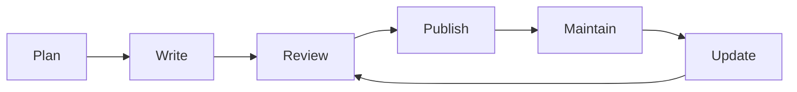

# AskProAI Documentation Framework

> 📋 **Version**: 1.0  
> 📅 **Created**: 2025-01-10  
> 🎯 **Purpose**: Complete documentation standards and templates for AskProAI

## Overview

This framework provides comprehensive templates, standards, and guidelines for creating and maintaining high-quality documentation across the AskProAI platform.

## 📁 Framework Structure

```
docs/
├── templates/              # Ready-to-use documentation templates
│   ├── API_DOCUMENTATION_TEMPLATE.md
│   ├── SERVICE_DOCUMENTATION_TEMPLATE.md
│   ├── INTEGRATION_GUIDE_TEMPLATE.md
│   ├── TROUBLESHOOTING_GUIDE_TEMPLATE.md
│   ├── OPERATIONS_MANUAL_TEMPLATE.md
│   ├── FEATURE_DOCUMENTATION_TEMPLATE.md
│   ├── SECURITY_DOCUMENTATION_TEMPLATE.md
│   └── MIGRATION_GUIDE_TEMPLATE.md
├── standards/             # Documentation standards and guidelines
│   ├── WRITING_STYLE_GUIDE.md
│   ├── FORMATTING_CONVENTIONS.md
│   ├── LANGUAGE_GUIDELINES.md
│   ├── VERSION_CONTROL.md
│   ├── REVIEW_PROCESS.md
│   ├── UPDATE_PROCEDURES.md
│   └── MAINTENANCE_GUIDELINES.md
├── toolkit/               # Tools and resources
│   ├── COMMON_SNIPPETS.md
│   ├── USEFUL_TOOLS.md
│   ├── QUALITY_CHECKLIST.md
│   └── BEST_PRACTICES.md
└── DOCUMENTATION_FRAMEWORK.md  # This file
```

## 🚀 Quick Start Guide

### For New Documentation

1. **Choose a Template**
   - API endpoint? Use [API_DOCUMENTATION_TEMPLATE.md](./templates/API_DOCUMENTATION_TEMPLATE.md)
   - New service? Use [SERVICE_DOCUMENTATION_TEMPLATE.md](./templates/SERVICE_DOCUMENTATION_TEMPLATE.md)
   - Integration? Use [INTEGRATION_GUIDE_TEMPLATE.md](./templates/INTEGRATION_GUIDE_TEMPLATE.md)
   - Feature? Use [FEATURE_DOCUMENTATION_TEMPLATE.md](./templates/FEATURE_DOCUMENTATION_TEMPLATE.md)

2. **Follow Standards**
   - Read [WRITING_STYLE_GUIDE.md](./standards/WRITING_STYLE_GUIDE.md) for tone and voice
   - Check [FORMATTING_CONVENTIONS.md](./standards/FORMATTING_CONVENTIONS.md) for structure
   - Review [LANGUAGE_GUIDELINES.md](./standards/LANGUAGE_GUIDELINES.md) for clarity

3. **Use Quality Tools**
   - Copy snippets from [COMMON_SNIPPETS.md](./toolkit/COMMON_SNIPPETS.md)
   - Run checks using [USEFUL_TOOLS.md](./toolkit/USEFUL_TOOLS.md)
   - Validate with [QUALITY_CHECKLIST.md](./toolkit/QUALITY_CHECKLIST.md)

### For Existing Documentation

1. **Update Process**
   - Follow [UPDATE_PROCEDURES.md](./standards/UPDATE_PROCEDURES.md)
   - Use [VERSION_CONTROL.md](./standards/VERSION_CONTROL.md) for tracking
   - Apply [MAINTENANCE_GUIDELINES.md](./standards/MAINTENANCE_GUIDELINES.md)

2. **Review Process**
   - Submit for [REVIEW_PROCESS.md](./standards/REVIEW_PROCESS.md)
   - Check against [BEST_PRACTICES.md](./toolkit/BEST_PRACTICES.md)
   - Use [QUALITY_CHECKLIST.md](./toolkit/QUALITY_CHECKLIST.md)

## 📋 Template Usage Guide

### Choosing the Right Template

| Documentation Type | Template | When to Use |
|-------------------|----------|-------------|
| API Endpoints | [API_DOCUMENTATION_TEMPLATE](./templates/API_DOCUMENTATION_TEMPLATE.md) | REST APIs, GraphQL endpoints |
| Services | [SERVICE_DOCUMENTATION_TEMPLATE](./templates/SERVICE_DOCUMENTATION_TEMPLATE.md) | Internal services, classes |
| Integrations | [INTEGRATION_GUIDE_TEMPLATE](./templates/INTEGRATION_GUIDE_TEMPLATE.md) | External services, third-party APIs |
| Troubleshooting | [TROUBLESHOOTING_GUIDE_TEMPLATE](./templates/TROUBLESHOOTING_GUIDE_TEMPLATE.md) | Common issues, debugging |
| Operations | [OPERATIONS_MANUAL_TEMPLATE](./templates/OPERATIONS_MANUAL_TEMPLATE.md) | DevOps, deployment, maintenance |
| Features | [FEATURE_DOCUMENTATION_TEMPLATE](./templates/FEATURE_DOCUMENTATION_TEMPLATE.md) | User-facing features |
| Security | [SECURITY_DOCUMENTATION_TEMPLATE](./templates/SECURITY_DOCUMENTATION_TEMPLATE.md) | Security policies, procedures |
| Migrations | [MIGRATION_GUIDE_TEMPLATE](./templates/MIGRATION_GUIDE_TEMPLATE.md) | Version upgrades, breaking changes |

### Template Customization

Each template includes:
- 📝 **Placeholder text** in `{CURLY_BRACES}`
- ✅ **Checklists** for completeness
- 💡 **Examples** to guide you
- 📊 **Tables** for structured data
- 🔗 **Cross-references** to related docs

## 📐 Standards Overview

### Documentation Lifecycle



### Key Standards

1. **Writing Standards**
   - [WRITING_STYLE_GUIDE.md](./standards/WRITING_STYLE_GUIDE.md) - Voice, tone, clarity
   - [FORMATTING_CONVENTIONS.md](./standards/FORMATTING_CONVENTIONS.md) - Structure, markdown
   - [LANGUAGE_GUIDELINES.md](./standards/LANGUAGE_GUIDELINES.md) - English/German guidelines

2. **Process Standards**
   - [VERSION_CONTROL.md](./standards/VERSION_CONTROL.md) - Git workflow, commits
   - [REVIEW_PROCESS.md](./standards/REVIEW_PROCESS.md) - Peer review, approval
   - [UPDATE_PROCEDURES.md](./standards/UPDATE_PROCEDURES.md) - Keeping docs current

3. **Maintenance Standards**
   - [MAINTENANCE_GUIDELINES.md](./standards/MAINTENANCE_GUIDELINES.md) - Regular upkeep
   - Automated checks and monitoring
   - Team responsibilities

## 🛠️ Toolkit Resources

### Essential Tools

1. **[COMMON_SNIPPETS.md](./toolkit/COMMON_SNIPPETS.md)**
   - Ready-to-copy code blocks
   - Standard sections
   - Common patterns

2. **[USEFUL_TOOLS.md](./toolkit/USEFUL_TOOLS.md)**
   - Markdown editors
   - Validation tools
   - Publishing platforms

3. **[QUALITY_CHECKLIST.md](./toolkit/QUALITY_CHECKLIST.md)**
   - Pre-publication checklist
   - Quality scoring
   - Review criteria

4. **[BEST_PRACTICES.md](./toolkit/BEST_PRACTICES.md)**
   - Pro tips
   - Common pitfalls
   - Excellence guidelines

## 🎯 Implementation Roadmap

### Phase 1: Immediate (Week 1)
- [ ] Team training on framework
- [ ] Identify documentation gaps
- [ ] Prioritize critical updates
- [ ] Begin using templates

### Phase 2: Short-term (Month 1)
- [ ] Migrate existing docs to templates
- [ ] Implement review process
- [ ] Set up automated tools
- [ ] Create team guidelines

### Phase 3: Long-term (Quarter 1)
- [ ] Full framework adoption
- [ ] Metrics tracking
- [ ] Continuous improvement
- [ ] Expand templates as needed

## 📊 Success Metrics

### Documentation Health Indicators
- **Coverage**: % of features documented
- **Freshness**: Average age of documents
- **Quality**: Average review score
- **Usage**: Page views and time on page
- **Satisfaction**: User feedback score

### Team Performance
- **Velocity**: Docs created/updated per sprint
- **Review Time**: Average review turnaround
- **Quality**: First-time approval rate
- **Maintenance**: Update frequency

## 🤝 Team Responsibilities

### Documentation Team
- Maintain this framework
- Train other teams
- Review submissions
- Track metrics

### Development Teams
- Document new features
- Update API docs
- Technical reviews
- Code examples

### Product Team
- User guides
- Feature documentation
- Use cases
- Benefits

### Support Team
- Troubleshooting guides
- FAQs
- Common issues
- User feedback

## 🚨 Getting Help

### Resources
- **Slack**: #documentation-help
- **Wiki**: Internal documentation wiki
- **Training**: Monthly documentation workshops
- **Office Hours**: Wednesdays 14:00-15:00 CET

### Contacts
- **Documentation Lead**: docs-lead@askproai.de
- **Technical Writing**: tech-writing@askproai.de
- **Framework Issues**: Create issue in repo

## 📅 Maintenance Schedule

| Task | Frequency | Owner |
|------|-----------|-------|
| Framework review | Monthly | Doc Team |
| Template updates | Quarterly | Doc Team |
| Standards review | Bi-annually | All Teams |
| Tool evaluation | Annually | Tech Lead |

## 🎉 Acknowledgments

This framework incorporates best practices from:
- Google Developer Documentation Style Guide
- Microsoft Writing Style Guide
- Write the Docs community
- The AskProAI team's collective experience

---

> 🔄 **Framework Version**: 1.0  
> 📅 **Last Updated**: 2025-01-10  
> 📧 **Feedback**: documentation@askproai.de

**Remember**: Great documentation is not written, it's crafted. Use this framework to create documentation that truly serves your users.