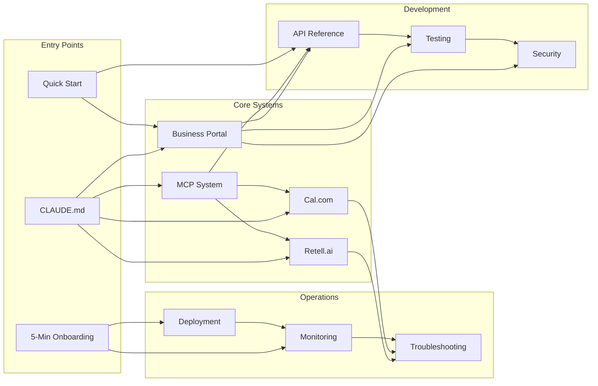

# 🗺️ AskProAI Documentation Visual Hierarchy

## 🌐 Complete Documentation Map

### 🏛️ Documentation Architecture
```
┌─────────────────────────────────────────────────────────────────┐
│                    🚀 AskProAI Documentation                     │
│                         Master Repository                         │
└─────────────────────────────────────────────────────────────────┘
                                   │
        ┌──────────────────────────┴──────────────────────────┐
        │                                                       │
        ▼                                                       ▼
┌─────────────────┐                                   ┌─────────────────┐
│  📖 Core Docs   │                                   │ 🛠️ Technical    │
│                 │                                   │    Reference    │
├─────────────────┤                                   ├─────────────────┤
│ • CLAUDE.md     │                                   │ • API Docs      │
│ • Quick Ref     │                                   │ • MCP Servers   │
│ • Architecture  │                                   │ • Integrations  │
│ • Dev Process   │                                   │ • Deployment    │
└────────┬────────┘                                   └────────┬────────┘
         │                                                      │
         └──────────────────┬───────────────────────────────────┘
                            │
    ┌───────────────────────┼───────────────────────────────┐
    │                       │                               │
    ▼                       ▼                               ▼
┌──────────┐         ┌──────────┐                  ┌──────────┐
│ Business │         │ Platform │                  │ Support  │
│  Portal  │         │ Services │                  │   Docs   │
├──────────┤         ├──────────┤                  ├──────────┤
│ • React  │         │ • Retell │                  │ • Guides │
│ • API    │         │ • Cal.com│                  │ • Debug  │
│ • Goals  │         │ • Stripe │                  │ • FAQ    │
└──────────┘         └──────────┘                  └──────────┘
```

## 🔗 Documentation Interconnections

### Primary Documentation Flows


## 📊 Documentation Categories & Relationships

### 1️⃣ Core Documentation Hub
```
CLAUDE.md (Master Guide)
    ├── Quick Reference Guide
    ├── Best Practices 2025
    ├── Development Process
    └── Context Summary
        ├── Links to → All Major Systems
        ├── References → Common Commands
        └── Points to → Troubleshooting
```

### 2️⃣ Business Portal Ecosystem
```
Business Portal Complete Documentation
    ├── Module Documentation
    │   ├── Dashboard Module
    │   ├── Calls Module
    │   └── API Architecture
    ├── Feature Guides
    │   ├── Goal System Guide
    │   ├── Customer Journey Guide
    │   └── Security Audit Guide
    ├── Technical References
    │   ├── API Reference
    │   ├── MCP Server Guide
    │   └── Environment Variables
    └── Operations
        ├── Deployment Guide
        ├── Troubleshooting Guide
        └── Quick Reference
```

### 3️⃣ MCP Server Network
```
MCP Complete Overview
    ├── Architecture Documentation
    │   ├── System Design
    │   ├── Communication Patterns
    │   └── Security Model
    ├── Server Catalog (20+ Servers)
    │   ├── Internal Servers
    │   │   ├── CalcomMCPServer
    │   │   ├── RetellMCPServer
    │   │   ├── DatabaseMCPServer
    │   │   └── [17 more...]
    │   └── External Servers
    │       ├── GitHub MCP
    │       ├── Sequential Thinking
    │       └── [Others...]
    └── Implementation Guides
        ├── Setup Guide
        ├── Integration Guide
        ├── Examples
        └── Troubleshooting
```

### 4️⃣ Integration Documentation
```
Platform Integrations
    ├── Retell.ai System
    │   ├── Complete Documentation
    │   ├── Developer Guide
    │   ├── Operations Manual
    │   └── Troubleshooting (2025)
    ├── Cal.com System
    │   ├── V2 Migration Guide
    │   ├── API Documentation
    │   ├── Event Management
    │   └── Import Guide
    └── Other Services
        ├── Stripe Integration
        ├── Sentry Monitoring
        └── Webhook Standards
```

### 5️⃣ Operational Documentation
```
Operations & Deployment
    ├── Deployment Procedures
    │   ├── Production Deployment
    │   ├── Emergency Response
    │   └── Rollback Procedures
    ├── Monitoring & Health
    │   ├── KPI Dashboard
    │   ├── Health Monitor
    │   └── Alert Configuration
    └── Support & Troubleshooting
        ├── Decision Tree
        ├── Error Patterns
        └── Common Issues
```

## 🎯 Documentation Access Patterns

### For New Developers
```
Start → CLAUDE.md
  ↓
Quick Reference → Development Setup
  ↓
Architecture Overview → Code Examples
  ↓
API Reference → Testing Guide
```

### For Operations Team
```
Start → Deployment Guide
  ↓
Monitoring Guide → Alert Setup
  ↓
Troubleshooting → Emergency Playbook
  ↓
Health Monitor → KPI Dashboard
```

### For Support Staff
```
Start → Troubleshooting Guide
  ↓
Error Patterns → Decision Tree
  ↓
Common Issues → Solution Database
  ↓
Customer Success → FAQ
```

### For Product Team
```
Start → Business Portal Docs
  ↓
Feature Guides → User Stories
  ↓
API Capabilities → Roadmap
  ↓
Analytics → Business Metrics
```

## 🔄 Cross-Reference Matrix

| From Document | Links To | Purpose |
|--------------|----------|---------|
| CLAUDE.md | All major systems | Central navigation |
| Business Portal | API, MCP, Deploy | Complete module docs |
| MCP Overview | All MCP servers | Server catalog |
| Retell Docs | Webhooks, API | Integration details |
| Troubleshooting | All systems | Problem resolution |
| API Reference | All endpoints | Technical specs |
| Deployment | Monitoring, Emergency | Ops procedures |

## 📈 Documentation Growth Map

### Current State (July 2025)
- 250+ Total Documents
- 150+ Active Documents
- 20+ MCP Servers Documented
- 50+ API Endpoints Documented
- 100+ Environment Variables

### Documentation Coverage
```
System Coverage:
├── Core Platform: 95% ████████████████████░
├── Business Portal: 90% ██████████████████░░
├── MCP System: 85% █████████████████░░░
├── Retell.ai: 90% ██████████████████░░
├── Cal.com: 80% ████████████████░░░░
├── Troubleshooting: 85% █████████████████░░░
└── Operations: 90% ██████████████████░░
```

## 🎨 Visual Documentation Types

### 1. Text Documentation
- Markdown files (primary format)
- Code examples and snippets
- Configuration templates
- Command references

### 2. Diagrams
- Architecture diagrams (Mermaid)
- Flow charts (Mermaid)
- Sequence diagrams (Mermaid)
- Entity relationships (ERD)

### 3. Interactive Elements
- API playgrounds
- Configuration generators
- Troubleshooting wizards
- Search functionality

### 4. Reference Materials
- Cheat sheets
- Quick reference cards
- Decision trees
- Comparison tables

## 🚦 Documentation Status Indicators

### 🟢 Production Ready
- Business Portal Documentation
- Core API Documentation
- Deployment Guides
- Monitoring Setup

### 🟡 Beta/In Progress
- Advanced MCP Features
- Performance Tuning
- Some Integration Guides
- Analytics Dashboards

### 🔴 Planned/TODO
- Mobile App Documentation
- Advanced Analytics
- ML/AI Features
- Multi-language Guides

---

*Last Updated: 2025-07-10*
*Visual Guide Version: 1.0*