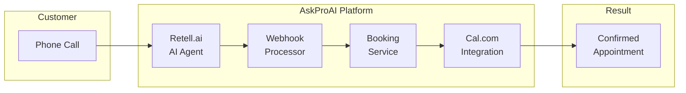

# AskProAI Documentation

## Welcome to AskProAI

AskProAI is an AI-powered SaaS platform that automatically answers incoming customer calls and independently schedules appointments. Through the integration of phone AI (Retell.ai) and online calendar system (Cal.com), it creates a seamless end-to-end solution for appointment bookings.

## Quick Links

- [🚀 Quick Start Guide](quickstart.md)
- [🏗️ Architecture Overview](architecture/overview.md)
- [📡 API Documentation](api/rest-v2.md)
- [🔧 Configuration Guide](configuration/environment.md)
- [📊 System Status](status.md)

## Key Features

### 🤖 AI Phone System
- 24/7 automated call answering
- Natural conversation in 30+ languages
- Intelligent appointment scheduling
- Context-aware responses

### 📅 Calendar Integration
- Real-time availability checking
- Automatic booking confirmation
- Multi-location support
- Staff assignment management

### 🏢 Multi-Tenant Architecture
- Complete data isolation
- Company-specific configurations
- Branch-level management
- Role-based access control

### 🔒 Security & Compliance
- GDPR compliance toolkit
- Field-level encryption
- Comprehensive audit logging
- Adaptive rate limiting

## System Overview

## Production Ready Status: 85%

### ✅ What's Working
- Core booking flow (phone → appointment)
- Multi-tenant data isolation
- Cal.com integration
- Retell.ai phone system
- Admin dashboard
- Basic email notifications

### 🚧 In Progress
- WhatsApp integration
- Advanced analytics
- Customer self-service portal
- Mobile app API
- SMS notifications

### ⚠️ Known Issues
- 119 database tables (should be 25)
- Multiple service versions
- Security vulnerabilities in debug routes
- Performance optimization needed

## Getting Help

- 📖 Read the [documentation](https://api.askproai.de/docs)
- 🐛 Report [issues on GitHub](https://github.com/askproai/api-gateway/issues)
- 💬 Join our [community forum](https://community.askproai.de)
- 📧 Contact support: support@askproai.de

---

*Last updated: June 22, 2025*