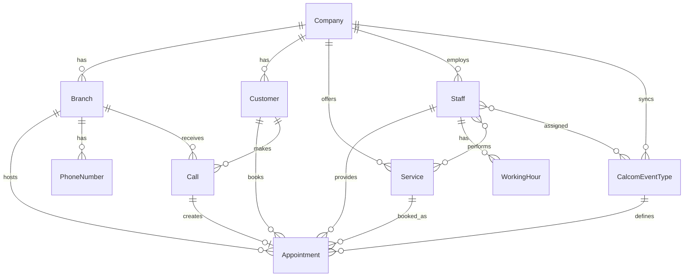

# AskProAI Database Schema Documentation

*Last Updated: June 23, 2025*

## Overview

The AskProAI platform uses a multi-tenant architecture with comprehensive data isolation. This document details all database tables, their relationships, and key fields.

## Core Domain Models

### 1. Multi-Tenancy Foundation

#### companies
The root tenant table - all data is scoped to a company.

| Field | Type | Description |
|-------|------|-------------|
| id | uuid | Primary key |
| name | string | Company name |
| slug | string | URL-friendly identifier |
| retell_api_key | encrypted | Retell.ai API key |
| calcom_api_key | encrypted | Cal.com API key |
| calcom_team_slug | string | Cal.com team identifier |
| stripe_customer_id | string | Stripe customer reference |
| trial_ends_at | datetime | Trial expiration date |
| settings | json | Company-wide settings |
| is_active | boolean | Account status |
| metadata | json | Additional company data |

**Relationships:**
- Has many: branches, staff, customers, appointments, services

#### branches
Physical locations or departments within a company.

| Field | Type | Description |
|-------|------|-------------|
| id | uuid | Primary key |
| company_id | uuid | Parent company (foreign key) |
| name | string | Branch name |
| slug | string | URL identifier |
| address | string | Physical address |
| phone | string | Main phone number |
| email | string | Contact email |
| timezone | string | Local timezone |
| is_active | boolean | Operational status |
| is_main | boolean | Primary branch flag |
| settings | json | Branch-specific settings |

**Relationships:**
- Belongs to: company
- Has many: appointments, phone_numbers, staff (via home_branch_id)
- Has many through: services (via branch_services)

### 2. User & Authentication Models

#### users
System users who can log into the admin panel.

| Field | Type | Description |
|-------|------|-------------|
| id | uuid | Primary key |
| company_id | uuid | Associated company |
| name | string | Full name |
| email | string | Login email (unique) |
| password | hashed | Encrypted password |
| role | string | User role (admin, manager, staff) |
| is_active | boolean | Account status |
| last_login_at | datetime | Last login timestamp |

**Relationships:**
- Belongs to: company
- Has one: staff (if role = staff)

#### customers
End customers who book appointments.

| Field | Type | Description |
|-------|------|-------------|
| id | uuid | Primary key |
| company_id | uuid | Associated company |
| first_name | string | Customer first name |
| last_name | string | Customer last name |
| email | string | Contact email |
| phone | string | Phone number (indexed) |
| date_of_birth | date | DOB for age verification |
| notes | text | Internal notes |
| tags | json | Customer tags/labels |
| is_blocked | boolean | Blocked status |
| metadata | json | Additional data |

**Relationships:**
- Belongs to: company
- Has many: appointments, calls
- Has one: customer_auth (for portal access)

### 3. Service & Scheduling Models

#### services
Service catalog - what can be booked.

| Field | Type | Description |
|-------|------|-------------|
| id | uuid | Primary key |
| company_id | uuid | Associated company |
| name | string | Service name |
| slug | string | URL identifier |
| description | text | Service description |
| duration | integer | Duration in minutes |
| price | decimal | Base price |
| category | string | Service category |
| is_active | boolean | Available for booking |
| requires_confirmation | boolean | Manual confirmation needed |
| buffer_before | integer | Buffer time before (minutes) |
| buffer_after | integer | Buffer time after (minutes) |

**Relationships:**
- Belongs to: company
- Has many: appointments
- Has many through: staff (via staff_services)

#### staff
Employees who provide services.

| Field | Type | Description |
|-------|------|-------------|
| id | uuid | Primary key |
| company_id | uuid | Associated company |
| user_id | uuid | Optional user account |
| home_branch_id | uuid | Primary branch |
| first_name | string | Staff first name |
| last_name | string | Staff last name |
| email | string | Contact email |
| phone | string | Contact phone |
| title | string | Job title |
| is_active | boolean | Working status |
| color | string | Calendar color |
| calcom_user_id | integer | Cal.com user ID |

**Relationships:**
- Belongs to: company, branch (home_branch)
- Has one: user (optional)
- Has many: appointments
- Has many through: services (via staff_services)
- Has many through: event_types (via staff_event_types)

#### calcom_event_types
Synchronized event types from Cal.com.

| Field | Type | Description |
|-------|------|-------------|
| id | uuid | Primary key |
| company_id | uuid | Associated company |
| calcom_id | integer | Cal.com event type ID |
| title | string | Event type name |
| slug | string | URL slug |
| length | integer | Duration in minutes |
| description | text | Event description |
| locations | json | Available locations |
| metadata | json | Cal.com metadata |
| is_active | boolean | Availability status |
| last_synced_at | datetime | Last sync timestamp |

**Relationships:**
- Belongs to: company
- Has many through: staff (via staff_event_types)
- Has many: appointments

### 4. Appointment & Booking Models

#### appointments
Core appointment records.

| Field | Type | Description |
|-------|------|-------------|
| id | uuid | Primary key |
| company_id | uuid | Associated company |
| branch_id | uuid | Location |
| customer_id | uuid | Booked customer |
| staff_id | uuid | Assigned staff |
| service_id | uuid | Booked service |
| starts_at | datetime | Appointment start |
| ends_at | datetime | Appointment end |
| status | enum | scheduled, confirmed, completed, cancelled, no_show |
| notes | text | Appointment notes |
| price | decimal | Final price |
| source | string | Booking source (phone, web, walk-in) |
| call_id | uuid | Associated phone call |
| calcom_booking_id | string | Cal.com booking reference |
| reminder_24h_sent_at | datetime | 24h reminder sent |
| reminder_2h_sent_at | datetime | 2h reminder sent |
| metadata | json | Additional data |

**Relationships:**
- Belongs to: company, branch, customer, staff, service, call
- Has one: calcom_booking

#### appointment_locks
Prevents double-booking during the booking process.

| Field | Type | Description |
|-------|------|-------------|
| id | uuid | Primary key |
| branch_id | uuid | Branch being locked |
| staff_id | uuid | Staff member |
| starts_at | datetime | Lock start time |
| ends_at | datetime | Lock end time |
| lock_token | string | Unique lock identifier |
| expires_at | datetime | Lock expiration |
| metadata | json | Lock context |

### 5. Communication Models

#### calls
Phone call records from Retell.ai.

| Field | Type | Description |
|-------|------|-------------|
| id | uuid | Primary key |
| company_id | uuid | Associated company |
| branch_id | uuid | Determined branch |
| customer_id | uuid | Identified customer |
| retell_call_id | string | Retell.ai call ID |
| from_number | string | Caller phone |
| to_number | string | Called number |
| agent_id | string | AI agent ID |
| status | string | Call status |
| duration | integer | Call duration (seconds) |
| started_at | datetime | Call start time |
| ended_at | datetime | Call end time |
| transcript | text | Call transcript |
| recording_url | string | Recording location |
| analysis | json | AI analysis data |
| metadata | json | Additional call data |

**Relationships:**
- Belongs to: company, branch, customer
- Has one: appointment (if booking created)

#### phone_numbers
Maps phone numbers to branches/companies.

| Field | Type | Description |
|-------|------|-------------|
| id | uuid | Primary key |
| company_id | uuid | Associated company |
| branch_id | uuid | Associated branch |
| number | string | Phone number (E.164) |
| type | enum | main, support, sales |
| is_active | boolean | Active status |
| retell_agent_id | string | Assigned AI agent |
| capabilities | json | Feature flags |

**Relationships:**
- Belongs to: company, branch

### 6. Integration & Webhook Models

#### webhook_events
Tracks all incoming webhooks.

| Field | Type | Description |
|-------|------|-------------|
| id | uuid | Primary key |
| provider | string | retell, calcom, stripe |
| event_type | string | Event name |
| event_id | string | Provider event ID |
| payload | json | Full webhook data |
| signature | string | Webhook signature |
| processed_at | datetime | Processing timestamp |
| error | text | Error if failed |
| attempts | integer | Processing attempts |

#### retell_webhooks
Retell.ai specific webhook data.

| Field | Type | Description |
|-------|------|-------------|
| id | uuid | Primary key |
| event | string | Event type |
| call_id | string | Associated call |
| timestamp | datetime | Event time |
| data | json | Event payload |
| processed | boolean | Processing status |

### 7. Billing & Subscription Models

#### invoices
Customer invoices.

| Field | Type | Description |
|-------|------|-------------|
| id | uuid | Primary key |
| company_id | uuid | Associated company |
| invoice_number | string | Unique invoice number |
| stripe_invoice_id | string | Stripe reference |
| amount | decimal | Total amount |
| tax | decimal | Tax amount |
| status | enum | draft, open, paid, void |
| due_date | date | Payment due date |
| paid_at | datetime | Payment timestamp |

#### billing_periods
Track usage periods for billing.

| Field | Type | Description |
|-------|------|-------------|
| id | uuid | Primary key |
| company_id | uuid | Associated company |
| starts_at | datetime | Period start |
| ends_at | datetime | Period end |
| appointment_count | integer | Appointments in period |
| call_minutes | integer | Total call minutes |
| status | enum | active, closed, billed |

### 8. Configuration Models

#### working_hours
Staff availability schedules.

| Field | Type | Description |
|-------|------|-------------|
| id | uuid | Primary key |
| staff_id | uuid | Associated staff |
| day_of_week | integer | 0-6 (Sun-Sat) |
| starts_at | time | Work start time |
| ends_at | time | Work end time |
| is_available | boolean | Working this day |

#### staff_event_types
Links staff to Cal.com event types.

| Field | Type | Description |
|-------|------|-------------|
| id | uuid | Primary key |
| staff_id | uuid | Staff member |
| event_type_id | uuid | Event type |
| is_primary | boolean | Primary assignment |
| settings | json | Override settings |

## Relationships Diagram

## Key Indexes

### Performance Indexes
- `customers.phone` - Fast customer lookup by phone
- `appointments.starts_at` - Date range queries
- `calls.retell_call_id` - Webhook processing
- `webhook_events.event_id` - Deduplication
- `phone_numbers.number` - Phone routing

### Unique Constraints
- `users.email` - One account per email
- `companies.slug` - Unique company identifiers
- `branches.slug` - Unique within company
- `phone_numbers.number` - No duplicate numbers

## Data Integrity Rules

### Soft Deletes
The following models use soft deletes:
- None currently (consider adding for audit trail)

### Cascade Rules
- Deleting a Company cascades to all related data
- Deleting a Branch nullifies staff.home_branch_id
- Deleting a Customer keeps appointments (nullify customer_id)
- Deleting Staff keeps appointments (nullify staff_id)

### Validation Rules
- Phone numbers must be E.164 format
- Email addresses must be valid
- Appointment end time must be after start time
- Working hours must not overlap for same staff/day

## Multi-Tenancy

All models except `users` table are automatically scoped by `company_id` using the global `TenantScope`. This ensures complete data isolation between tenants.

## Performance Considerations

1. **Eager Loading**: Always eager load relationships to avoid N+1 queries
2. **Chunking**: Use chunking for bulk operations
3. **Caching**: Cache frequently accessed data (services, event types)
4. **Archiving**: Consider archiving old appointments after 2 years

## Future Considerations

1. **Audit Trail**: Add audit log for all model changes
2. **Versioning**: Implement version control for services/prices
3. **Archiving**: Move old data to archive tables
4. **Sharding**: Prepare for horizontal scaling by company

---

*For implementation details, see the model files in `/app/Models/`*