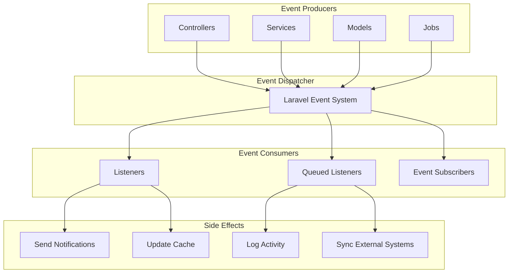

# Event-Driven Architecture Documentation

*Last Updated: June 23, 2025*

## Overview

AskProAI uses Laravel's event system to implement an event-driven architecture that decouples business logic, improves scalability, and enables real-time features. Events are dispatched when significant actions occur, and listeners respond to these events asynchronously.

## Architecture Pattern



## Core Events

### 1. Appointment Events

#### AppointmentCreated
Fired when a new appointment is successfully booked.

**Event Data**:
```php
class AppointmentCreated
{
    public function __construct(
        public Appointment $appointment,
        public ?Call $call = null,
        public string $source = 'phone'
    ) {}
}
```

**Triggered By**:
- `AppointmentBookingService::bookAppointment()`
- `ProcessRetellCallEndedJob`
- Admin panel booking creation

**Listeners**:
- `SendAppointmentConfirmation` - Sends confirmation email
- `SyncToCalendar` - Syncs with Cal.com
- `UpdateCustomerStats` - Updates booking count
- `NotifyStaff` - Notifies assigned staff
- `LogBookingActivity` - Audit trail

#### AppointmentCancelled
Fired when an appointment is cancelled.

**Event Data**:
```php
class AppointmentCancelled
{
    public function __construct(
        public Appointment $appointment,
        public string $reason,
        public ?User $cancelledBy = null
    ) {}
}
```

**Triggered By**:
- Customer cancellation
- Staff cancellation
- System cancellation (no-show)
- Admin cancellation

**Listeners**:
- `SendCancellationNotice` - Notifies all parties
- `ReleaseCalendarSlot` - Frees up availability
- `UpdateMetrics` - Records cancellation metrics
- `ProcessRefund` - Initiates refund if applicable

#### AppointmentRescheduled
Fired when an appointment time is changed.

**Event Data**:
```php
class AppointmentRescheduled
{
    public function __construct(
        public Appointment $appointment,
        public Carbon $oldStartTime,
        public Carbon $oldEndTime,
        public ?string $reason = null
    ) {}
}
```

**Listeners**:
- `SendRescheduleNotification`
- `UpdateCalendarEvent`
- `LogRescheduleActivity`

### 2. Call Events

#### CallCompleted
Fired when a phone call ends.

**Event Data**:
```php
class CallCompleted
{
    public function __construct(
        public Call $call,
        public array $analysis,
        public ?Appointment $appointment = null
    ) {}
}
```

**Triggered By**:
- Retell.ai webhook (call_ended)
- Manual call completion

**Listeners**:
- `UpdateCallMetrics` - Records call statistics
- `ProcessCallRecording` - Stores recording
- `AnalyzeCallQuality` - AI quality analysis
- `UpdateCustomerProfile` - Enriches customer data

#### CallFailed
Fired when a call fails or is dropped.

**Event Data**:
```php
class CallFailed
{
    public function __construct(
        public Call $call,
        public string $reason,
        public ?array $errorDetails = null
    ) {}
}
```

**Listeners**:
- `LogCallFailure` - Records failure details
- `NotifyTechnicalTeam` - Alerts on high failure rate
- `ScheduleCallback` - Creates callback request

### 3. Customer Events

#### CustomerCreated
Fired when a new customer is created.

**Event Data**:
```php
class CustomerCreated
{
    public function __construct(
        public Customer $customer,
        public string $source,
        public ?array $additionalData = null
    ) {}
}
```

**Triggered By**:
- First phone call
- Manual creation
- Import process

**Listeners**:
- `SendWelcomeEmail` - Welcome communication
- `EnrichCustomerData` - Lookup additional info
- `AssignCustomerTags` - Auto-tagging
- `CreateCustomerAuth` - Portal access setup

#### CustomerMerged
Fired when duplicate customers are merged.

**Event Data**:
```php
class CustomerMerged
{
    public function __construct(
        public Customer $primaryCustomer,
        public Customer $mergedCustomer,
        public array $mergedData
    ) {}
}
```

**Listeners**:
- `MergeAppointmentHistory`
- `MergeCallHistory`
- `UpdateCustomerStats`
- `NotifyMergeCompletion`

### 4. System Events

#### MCPAlertTriggered
Fired when MCP monitoring detects issues.

**Event Data**:
```php
class MCPAlertTriggered
{
    public function __construct(
        public string $mcp_server,
        public string $alert_type,
        public array $details,
        public string $severity
    ) {}
}
```

**Listeners**:
- `SendAlertNotification` - Notify ops team
- `LogSystemAlert` - Record in security log
- `TriggerAutoRemediation` - Attempt auto-fix
- `UpdateStatusPage` - Update public status

#### MetricsUpdated
Fired when system metrics are calculated.

**Event Data**:
```php
class MetricsUpdated
{
    public function __construct(
        public string $metric_type,
        public array $values,
        public Carbon $timestamp
    ) {}
}
```

**Listeners**:
- `StoreMetricHistory`
- `CheckThresholds`
- `UpdateDashboards`
- `TriggerAlerts`

## Event Listeners

### Synchronous Listeners
Execute immediately in the same request.

```php
class SendAppointmentConfirmation
{
    public function handle(AppointmentCreated $event): void
    {
        // Send immediate confirmation
        Mail::to($event->appointment->customer->email)
            ->send(new AppointmentConfirmationMail($event->appointment));
            
        // Update appointment
        $event->appointment->update([
            'confirmation_sent_at' => now()
        ]);
    }
}
```

### Queued Listeners
Execute asynchronously via queue system.

```php
class SyncToCalendar implements ShouldQueue
{
    use InteractsWithQueue;
    
    public $queue = 'sync';
    public $delay = 5; // seconds
    
    public function handle(AppointmentCreated $event): void
    {
        $calcomService = app(CalcomV2Service::class);
        
        $booking = $calcomService->createBooking([
            'eventTypeId' => $event->appointment->calcom_event_type_id,
            'start' => $event->appointment->starts_at,
            'end' => $event->appointment->ends_at,
            'attendee' => [
                'email' => $event->appointment->customer->email,
                'name' => $event->appointment->customer->full_name,
            ]
        ]);
        
        $event->appointment->update([
            'calcom_booking_id' => $booking['id']
        ]);
    }
}
```

### Conditional Listeners
Execute based on conditions.

```php
class NotifyHighValueBooking
{
    public function handle(AppointmentCreated $event): void
    {
        if ($event->appointment->price >= 500) {
            Notification::send(
                User::managers()->get(),
                new HighValueBookingNotification($event->appointment)
            );
        }
    }
}
```

## Event Subscribers

Group related event listeners into subscribers.

```php
class AppointmentEventSubscriber
{
    public function subscribe($events): void
    {
        $events->listen(
            AppointmentCreated::class,
            [AppointmentEventSubscriber::class, 'handleAppointmentCreated']
        );
        
        $events->listen(
            AppointmentCancelled::class,
            [AppointmentEventSubscriber::class, 'handleAppointmentCancelled']
        );
        
        $events->listen(
            AppointmentRescheduled::class,
            [AppointmentEventSubscriber::class, 'handleAppointmentRescheduled']
        );
    }
    
    public function handleAppointmentCreated($event): void
    {
        // Handle creation
    }
    
    public function handleAppointmentCancelled($event): void
    {
        // Handle cancellation
    }
    
    public function handleAppointmentRescheduled($event): void
    {
        // Handle reschedule
    }
}
```

## Event Registration

### EventServiceProvider
```php
class EventServiceProvider extends ServiceProvider
{
    protected $listen = [
        AppointmentCreated::class => [
            SendAppointmentConfirmation::class,
            SyncToCalendar::class,
            UpdateCustomerStats::class,
            NotifyStaff::class,
            LogBookingActivity::class,
        ],
        
        AppointmentCancelled::class => [
            SendCancellationNotice::class,
            ReleaseCalendarSlot::class,
            UpdateMetrics::class,
            ProcessRefund::class,
        ],
        
        CallCompleted::class => [
            UpdateCallMetrics::class,
            ProcessCallRecording::class,
            AnalyzeCallQuality::class,
            UpdateCustomerProfile::class,
        ],
    ];
    
    protected $subscribe = [
        AppointmentEventSubscriber::class,
        CustomerEventSubscriber::class,
        SystemEventSubscriber::class,
    ];
}
```

## Dispatching Events

### From Controllers
```php
class AppointmentController extends Controller
{
    public function store(Request $request)
    {
        $appointment = DB::transaction(function () use ($request) {
            $appointment = Appointment::create($request->validated());
            
            // Dispatch event
            event(new AppointmentCreated($appointment, source: 'web'));
            
            return $appointment;
        });
        
        return response()->json($appointment);
    }
}
```

### From Services
```php
class AppointmentBookingService
{
    public function bookAppointment(array $data): Appointment
    {
        $appointment = DB::transaction(function () use ($data) {
            // Booking logic...
            
            $appointment = Appointment::create($appointmentData);
            
            // Dispatch with additional context
            AppointmentCreated::dispatch(
                $appointment, 
                $call ?? null, 
                $data['source'] ?? 'phone'
            );
            
            return $appointment;
        });
        
        return $appointment;
    }
}
```

### From Models
```php
class Appointment extends Model
{
    protected static function booted()
    {
        static::updated(function ($appointment) {
            if ($appointment->isDirty('status')) {
                match($appointment->status) {
                    'cancelled' => event(new AppointmentCancelled($appointment, 'status_change')),
                    'completed' => event(new AppointmentCompleted($appointment)),
                    default => null
                };
            }
        });
    }
}
```

## Testing Events

### Unit Tests
```php
class AppointmentCreatedTest extends TestCase
{
    public function test_appointment_created_event_is_dispatched()
    {
        Event::fake();
        
        $appointment = Appointment::factory()->create();
        
        event(new AppointmentCreated($appointment));
        
        Event::assertDispatched(AppointmentCreated::class, function ($event) use ($appointment) {
            return $event->appointment->id === $appointment->id;
        });
    }
    
    public function test_listeners_are_attached()
    {
        Event::fake();
        
        $appointment = Appointment::factory()->create();
        event(new AppointmentCreated($appointment));
        
        Event::assertListening(
            AppointmentCreated::class,
            SendAppointmentConfirmation::class
        );
    }
}
```

### Integration Tests
```php
class AppointmentBookingIntegrationTest extends TestCase
{
    public function test_booking_triggers_full_event_chain()
    {
        Event::fake([
            AppointmentCreated::class,
            CustomerCreated::class,
        ]);
        
        $response = $this->postJson('/api/appointments', [
            // appointment data
        ]);
        
        Event::assertDispatched(AppointmentCreated::class);
        Event::assertDispatched(CustomerCreated::class);
        
        // Assert queued listeners
        Queue::assertPushed(SyncToCalendar::class);
    }
}
```

## Best Practices

### 1. Event Design
- Keep events focused and specific
- Include all necessary context data
- Make events immutable
- Use value objects for complex data

### 2. Listener Design
- Single responsibility per listener
- Use queued listeners for heavy operations
- Implement proper error handling
- Make listeners idempotent

### 3. Performance
- Queue heavy listeners
- Batch operations where possible
- Use event subscribers for related events
- Monitor event processing time

### 4. Testing
- Test event dispatching
- Test listener behavior
- Use Event::fake() for isolation
- Test error scenarios

## Monitoring Events

### Event Metrics
```php
// Track event dispatching
Event::listen('*', function ($event, $data) {
    Metrics::increment('events.dispatched', 1, [
        'event' => get_class($event)
    ]);
});

// Track listener execution time
class TimedListener
{
    public function handle($event)
    {
        $start = microtime(true);
        
        // Handle event...
        
        $duration = microtime(true) - $start;
        Metrics::timing('listener.duration', $duration, [
            'listener' => static::class
        ]);
    }
}
```

### Event Debugging
```php
// Log all events in development
if (app()->environment('local')) {
    Event::listen('*', function ($event, $data) {
        Log::debug('Event dispatched', [
            'event' => $event,
            'data' => $data
        ]);
    });
}
```

## Future Enhancements

1. **Event Sourcing**: Store all events for complete audit trail
2. **Event Replay**: Ability to replay events for debugging
3. **Event Versioning**: Handle event schema changes
4. **External Events**: Publish events to external systems (webhooks, message queues)
5. **Real-time Events**: WebSocket broadcasting for live updates

---

*For implementation details, see event files in `/app/Events/` and `/app/Listeners/`*