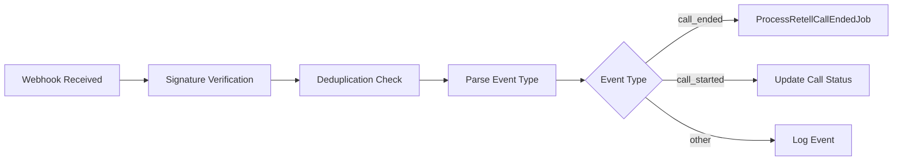

# Queue Jobs Documentation

*Last Updated: June 23, 2025*

## Overview

AskProAI uses Laravel Horizon for queue management with Redis as the queue driver. Jobs are categorized by priority and purpose to ensure optimal performance and reliability.

## Queue Configuration

### Queue Priorities

| Queue Name | Priority | Purpose | Timeout |
|------------|----------|---------|---------|
| webhooks | High | Real-time webhook processing | 90s |
| default | Normal | General processing tasks | 60s |
| sync | Normal | Data synchronization | 300s |
| notifications | Normal | Email/SMS sending | 60s |
| cache | Low | Cache warming, optimization | 120s |
| maintenance | Low | Cleanup, archival tasks | 600s |

### Horizon Configuration
```php
'environments' => [
    'production' => [
        'webhooks' => [
            'connection' => 'redis',
            'queue' => 'webhooks',
            'balance' => 'auto',
            'processes' => 10,
            'tries' => 3,
        ],
        'default' => [
            'connection' => 'redis',
            'queue' => 'default',
            'balance' => 'simple',
            'processes' => 5,
            'tries' => 3,
        ],
    ],
]
```

## Job Categories

### 1. Webhook Processing Jobs

#### ProcessRetellWebhookJob
Processes incoming webhooks from Retell.ai phone system.

**Queue**: webhooks  
**Timeout**: 90 seconds  
**Retries**: 3

**Processing Flow**:


**Key Responsibilities**:
- Validates webhook signature
- Prevents duplicate processing
- Routes to specific handlers
- Logs all events for audit

#### ProcessRetellCallEndedJob
Handles completed phone calls and creates appointments.

**Queue**: webhooks  
**Timeout**: 120 seconds  
**Retries**: 3

**Processing Steps**:
1. Extract call data from webhook payload
2. Find or create customer based on phone number
3. Parse AI conversation for appointment details
4. Check calendar availability
5. Create appointment record
6. Sync with Cal.com
7. Send confirmation email
8. Update call record with outcome

**Error Handling**:
- Rolls back on failure
- Sends alert on repeated failures
- Logs detailed error context

#### ProcessCalcomWebhookJob
Processes Cal.com calendar events.

**Queue**: webhooks  
**Timeout**: 60 seconds  
**Retries**: 3

**Event Types Handled**:
- `booking.created` - New booking from Cal.com
- `booking.cancelled` - Booking cancellation
- `booking.rescheduled` - Time change
- `event_type.created` - New event type

#### ProcessStripeWebhookJob
Handles Stripe payment events.

**Queue**: webhooks  
**Timeout**: 60 seconds  
**Retries**: 5

**Key Events**:
- `invoice.payment_succeeded` - Update subscription
- `invoice.payment_failed` - Send payment failure notice
- `customer.subscription.deleted` - Deactivate account

### 2. Synchronization Jobs

#### SyncCalcomEventTypes
Synchronizes event types from Cal.com.

**Queue**: sync  
**Timeout**: 300 seconds  
**Schedule**: Every 6 hours

**Process**:
```php
public function handle()
{
    $companies = Company::active()->whereNotNull('calcom_api_key')->get();
    
    foreach ($companies as $company) {
        try {
            $eventTypes = $this->calcomService->getEventTypes($company);
            $this->syncEventTypes($eventTypes, $company);
            $this->updateStaffAssignments($company);
            Cache::tags(['company-' . $company->id])->flush();
        } catch (\Exception $e) {
            Log::error('Event type sync failed', [
                'company_id' => $company->id,
                'error' => $e->getMessage()
            ]);
        }
    }
}
```

#### SyncCalcomBookingsJob
Two-way sync of bookings with Cal.com.

**Queue**: sync  
**Timeout**: 300 seconds  
**Schedule**: Every 30 minutes

**Features**:
- Syncs new bookings from Cal.com
- Updates appointment status changes
- Handles cancellations
- Resolves conflicts

#### RefreshCallDataJob
Updates call data from Retell.ai.

**Queue**: sync  
**Timeout**: 120 seconds  
**Trigger**: Manual or after call ends

**Updates**:
- Call transcript
- Recording URL
- AI analysis results
- Call duration

### 3. Notification Jobs

#### SendNotificationJob
Sends various types of notifications.

**Queue**: notifications  
**Timeout**: 60 seconds  
**Retries**: 3

**Notification Types**:
```php
class SendNotificationJob implements ShouldQueue
{
    public function handle()
    {
        match($this->type) {
            'appointment_confirmation' => $this->sendAppointmentConfirmation(),
            'reminder_24h' => $this->send24HourReminder(),
            'reminder_2h' => $this->send2HourReminder(),
            'cancellation' => $this->sendCancellationNotice(),
            'rescheduled' => $this->sendRescheduleNotice(),
        };
    }
}
```

**Channels Supported**:
- Email (primary)
- SMS (planned)
- WhatsApp (planned)
- Push notifications (future)

### 4. Cache & Optimization Jobs

#### WarmCacheJob
Pre-loads frequently accessed data into cache.

**Queue**: cache  
**Timeout**: 120 seconds  
**Schedule**: Daily at 3 AM

**Cached Data**:
- Company settings
- Service catalog
- Staff schedules
- Event types
- Availability slots

#### PrecacheAvailabilityJob
Pre-calculates availability for better performance.

**Queue**: cache  
**Timeout**: 180 seconds  
**Schedule**: Every 4 hours

**Process**:
- Calculates next 7 days availability
- Stores in Redis with 6-hour TTL
- Invalidated on booking changes

### 5. Maintenance Jobs

#### ProcessGdprExportJob
Handles GDPR data export requests.

**Queue**: maintenance  
**Timeout**: 600 seconds  
**Priority**: Low

**Export Includes**:
- Customer profile data
- Appointment history
- Call recordings/transcripts
- Email history
- Stored preferences

#### BulkAssignStaffToEventTypesJob
Bulk assigns staff to event types.

**Queue**: maintenance  
**Timeout**: 300 seconds  
**Use Case**: Onboarding, bulk updates

### 6. Monitoring Jobs

#### HeartbeatJob
Monitors system health.

**Queue**: default  
**Schedule**: Every minute  
**Timeout**: 30 seconds

**Checks**:
- Queue processing status
- Redis connectivity
- Database connectivity
- External API status

#### HorizonSmokeTestJob
Tests queue processing.

**Queue**: default  
**Schedule**: Every 5 minutes  
**Purpose**: Ensure queues are processing

## Job Lifecycle

### 1. Job Dispatch
```php
// Immediate dispatch
ProcessRetellWebhookJob::dispatch($webhookData);

// Delayed dispatch
SendNotificationJob::dispatch($notification)
    ->delay(now()->addMinutes(5));

// Conditional dispatch
ProcessRetellWebhookJob::dispatchIf(
    $this->shouldProcess($webhook),
    $webhookData
);
```

### 2. Job Middleware
```php
public function middleware()
{
    return [
        new WithoutOverlapping($this->company->id),
        new RateLimited('api-calls'),
    ];
}
```

### 3. Error Handling
```php
public function failed(\Throwable $exception)
{
    // Log failure
    Log::error('Job failed', [
        'job' => static::class,
        'error' => $exception->getMessage(),
        'trace' => $exception->getTraceAsString(),
    ]);
    
    // Send alert
    AlertService::jobFailed(static::class, $exception);
    
    // Cleanup
    $this->cleanup();
}
```

## Queue Monitoring

### Horizon Dashboard
Access at: `/horizon`

**Key Metrics**:
- Jobs per minute
- Average wait time
- Failed jobs
- Queue sizes
- Worker status

### Alerts
```php
// High queue depth
if (Queue::size('webhooks') > 1000) {
    Alert::send('High webhook queue depth');
}

// Failed job rate
if ($failedRate > 0.05) { // 5% failure rate
    Alert::send('High job failure rate');
}
```

## Best Practices

### 1. Job Design
- Keep jobs focused on single responsibility
- Use database transactions for data consistency
- Implement idempotency for retryable jobs
- Log context for debugging

### 2. Performance
- Batch operations when possible
- Use chunking for large datasets
- Implement circuit breakers for external APIs
- Cache frequently accessed data

### 3. Error Handling
- Define clear retry strategies
- Implement exponential backoff
- Use dead letter queues for failed jobs
- Alert on repeated failures

### 4. Testing
```php
class ProcessRetellWebhookJobTest extends TestCase
{
    public function test_processes_call_ended_webhook()
    {
        Queue::fake();
        
        $webhook = factory(RetellWebhook::class)->create();
        
        ProcessRetellWebhookJob::dispatch($webhook);
        
        Queue::assertPushed(ProcessRetellWebhookJob::class);
    }
}
```

## Queue Commands

### Management Commands
```bash
# Start Horizon
php artisan horizon

# Stop Horizon gracefully
php artisan horizon:terminate

# Pause processing
php artisan horizon:pause

# Continue processing
php artisan horizon:continue

# Clear failed jobs
php artisan horizon:clear
```

### Monitoring Commands
```bash
# View queue status
php artisan queue:monitor

# Retry failed jobs
php artisan queue:retry all

# Flush specific queue
php artisan queue:flush webhooks

# View failed jobs
php artisan queue:failed
```

## Troubleshooting

### Common Issues

#### High Memory Usage
**Symptoms**: Worker processes consuming excessive memory  
**Solution**: 
- Implement chunking for large datasets
- Use `--memory=256` flag for workers
- Clear model instances after processing

#### Slow Processing
**Symptoms**: Jobs taking longer than expected  
**Solution**:
- Add more workers for high-priority queues
- Optimize database queries
- Implement caching
- Use batch processing

#### Jobs Not Processing
**Symptoms**: Jobs stuck in queue  
**Solution**:
- Check Horizon status
- Verify Redis connectivity
- Check for blocking jobs
- Review error logs

---

*For implementation details, see job files in `/app/Jobs/`*