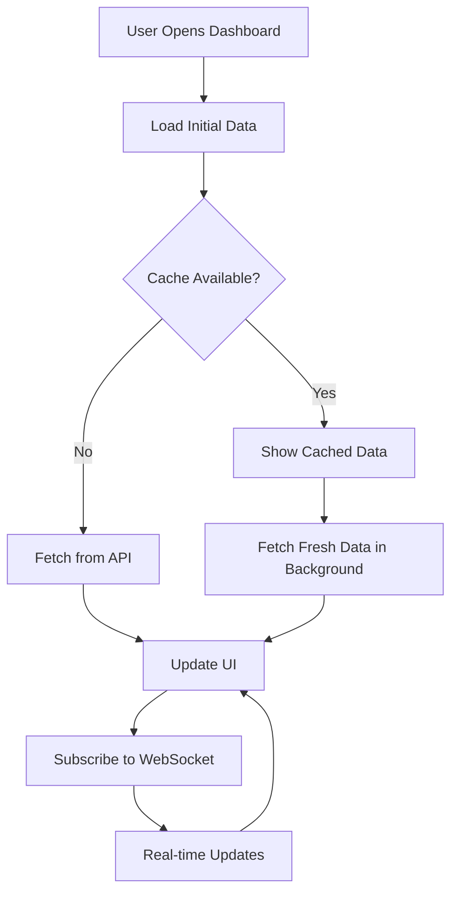

# 📊 Dashboard Module - Deep Dive

## Overview

The Dashboard module serves as the central hub of the Business Portal, providing real-time insights and quick access to key business metrics. It's designed with a mobile-first approach and updates in real-time.

## Technical Architecture

### Component Hierarchy
```
DashboardIndex
├── Header Section
│   ├── Title & Description
│   ├── TimeRangeSelector
│   └── RefreshButton
├── AlertsSection
├── StatsGrid (4 KPI Cards)
│   ├── CallsStatCard
│   ├── AppointmentsStatCard
│   ├── CustomersStatCard
│   └── RevenueStatCard
├── ChartsSection
│   ├── CallVolumeChart (Area)
│   └── ConversionFunnel (Bar)
├── PerformanceMetrics (3 Cards)
│   ├── AnswerRateCard
│   ├── BookingRateCard
│   └── AvgCallDurationCard
├── GoalDashboardWidget
└── TabsSection
    ├── RecentCallsTab
    ├── UpcomingAppointmentsTab
    └── InsightsTab
```

### State Management
```javascript
const [dashboardData, setDashboardData] = useState({
    stats: {
        calls_today: 0,
        appointments_today: 0,
        new_customers: 0,
        revenue_today: 0
    },
    trends: {
        calls: { value: 0, change: 0 },
        appointments: { value: 0, change: 0 },
        customers: { value: 0, change: 0 },
        revenue: { value: 0, change: 0 }
    },
    chartData: {
        daily: [],
        hourly: [],
        sources: [],
        performance: []
    },
    recentCalls: [],
    upcomingAppointments: [],
    performance: {
        answer_rate: 0,
        booking_rate: 0,
        avg_call_duration: 0,
        customer_satisfaction: 0
    },
    alerts: []
});
```

## API Integration

### Main Dashboard Endpoint
```http
GET /business/api/dashboard?range={timeRange}

Parameters:
- range: today | week | month | year

Response:
{
    "stats": {
        "calls_today": 45,
        "appointments_today": 12,
        "new_customers": 8,
        "revenue_today": 1250.00
    },
    "trends": {
        "calls": {
            "value": 45,
            "change": 12.5,
            "direction": "up"
        }
    },
    "chartData": {
        "daily": [
            {
                "date": "2025-01-10",
                "calls": 45,
                "appointments": 12
            }
        ],
        "hourly": [
            {
                "hour": 9,
                "calls": 5
            }
        ]
    },
    "performance": {
        "answer_rate": 92.5,
        "booking_rate": 26.7,
        "avg_call_duration": 185,
        "customer_satisfaction": 4.8
    }
}
```

### Real-time Updates
```javascript
// WebSocket subscription for real-time updates
useEffect(() => {
    const channel = echo.private(`company.${companyId}`)
        .listen('MetricsUpdated', (e) => {
            setDashboardData(prev => ({
                ...prev,
                stats: e.stats
            }));
        });

    return () => {
        echo.leave(`company.${companyId}`);
    };
}, [companyId]);
```

## Data Flow



## Performance Optimizations

### 1. Data Caching
```javascript
// Service Worker caching strategy
self.addEventListener('fetch', (event) => {
    if (event.request.url.includes('/api/dashboard')) {
        event.respondWith(
            caches.match(event.request)
                .then(response => {
                    const fetchPromise = fetch(event.request)
                        .then(networkResponse => {
                            cache.put(event.request, networkResponse.clone());
                            return networkResponse;
                        });
                    return response || fetchPromise;
                })
        );
    }
});
```

### 2. Component Memoization
```javascript
const StatCard = React.memo(({ title, value, icon, trend, color }) => {
    // Component implementation
}, (prevProps, nextProps) => {
    return prevProps.value === nextProps.value && 
           prevProps.trend?.change === nextProps.trend?.change;
});
```

### 3. Lazy Loading Charts
```javascript
const ChartsSection = React.lazy(() => 
    import('./components/ChartsSection')
);

// In render
<Suspense fallback={<ChartSkeleton />}>
    <ChartsSection data={chartData} />
</Suspense>
```

## Mobile Optimization

### Responsive Design
```jsx
// Mobile-specific dashboard component
const MobileDashboard = () => {
    return (
        <div className="mobile-dashboard">
            <CompactStats stats={stats} />
            <SwipeableCharts charts={chartData} />
            <CollapsibleSections>
                <RecentActivity />
                <QuickActions />
            </CollapsibleSections>
        </div>
    );
};

// Detect mobile and render appropriate component
const Dashboard = () => {
    const isMobile = useIsMobile();
    
    if (isMobile) {
        return <MobileDashboard />;
    }
    
    return <DesktopDashboard />;
};
```

### Touch Gestures
```javascript
// Swipeable chart navigation
import { useSwipeable } from 'react-swipeable';

const handlers = useSwipeable({
    onSwipedLeft: () => nextChart(),
    onSwipedRight: () => previousChart(),
    preventDefaultTouchmoveEvent: true,
    trackMouse: true
});
```

## Customization Options

### User Preferences
```javascript
// Store dashboard preferences
const preferences = {
    defaultTimeRange: 'week',
    visibleMetrics: ['calls', 'appointments', 'revenue'],
    chartType: 'area', // area | bar | line
    theme: 'light',
    autoRefresh: true,
    refreshInterval: 60000 // 1 minute
};

// Apply preferences
useEffect(() => {
    const userPrefs = localStorage.getItem('dashboardPrefs');
    if (userPrefs) {
        applyPreferences(JSON.parse(userPrefs));
    }
}, []);
```

### Widget Configuration
```javascript
// Configurable widget system
const DashboardWidgets = {
    stats: {
        component: StatsGrid,
        defaultProps: { columns: 4 },
        customizable: true
    },
    charts: {
        component: ChartsSection,
        defaultProps: { height: 300 },
        customizable: true
    },
    goals: {
        component: GoalDashboard,
        defaultProps: { compact: true },
        customizable: false
    }
};
```

## Error Handling

### Graceful Degradation
```javascript
const fetchDashboardData = async () => {
    try {
        setLoading(true);
        const response = await axiosInstance.get('/dashboard', {
            params: { range: timeRange }
        });
        setDashboardData(response.data);
    } catch (error) {
        // Show cached data if available
        const cachedData = getCachedDashboardData();
        if (cachedData) {
            setDashboardData(cachedData);
            showNotification('Using cached data. Live updates unavailable.');
        } else {
            setError('Failed to load dashboard data.');
        }
    } finally {
        setLoading(false);
    }
};
```

### Retry Logic
```javascript
const retryWithBackoff = async (fn, retries = 3, delay = 1000) => {
    try {
        return await fn();
    } catch (error) {
        if (retries > 0) {
            await new Promise(resolve => setTimeout(resolve, delay));
            return retryWithBackoff(fn, retries - 1, delay * 2);
        }
        throw error;
    }
};
```

## Analytics Integration

### Event Tracking
```javascript
// Track user interactions
const trackDashboardEvent = (action, label, value) => {
    if (window.gtag) {
        window.gtag('event', action, {
            event_category: 'Dashboard',
            event_label: label,
            value: value
        });
    }
};

// Usage
trackDashboardEvent('time_range_change', timeRange);
trackDashboardEvent('chart_interaction', 'conversion_funnel_click');
```

### Performance Monitoring
```javascript
// Monitor dashboard load time
const measureDashboardPerformance = () => {
    const navigationTiming = performance.getEntriesByType('navigation')[0];
    const dashboardTiming = {
        loadTime: navigationTiming.loadEventEnd - navigationTiming.loadEventStart,
        domReady: navigationTiming.domContentLoadedEventEnd - navigationTiming.domContentLoadedEventStart,
        firstPaint: performance.getEntriesByName('first-paint')[0]?.startTime
    };
    
    // Send to analytics
    sendPerformanceMetrics('dashboard', dashboardTiming);
};
```

## Testing

### Unit Tests
```javascript
describe('Dashboard', () => {
    it('displays correct stats', async () => {
        const mockData = {
            stats: {
                calls_today: 25,
                appointments_today: 8
            }
        };
        
        mock.onGet('/business/api/dashboard').reply(200, mockData);
        
        render(<Dashboard />);
        
        await waitFor(() => {
            expect(screen.getByText('25')).toBeInTheDocument();
            expect(screen.getByText('8')).toBeInTheDocument();
        });
    });
    
    it('handles errors gracefully', async () => {
        mock.onGet('/business/api/dashboard').networkError();
        
        render(<Dashboard />);
        
        await waitFor(() => {
            expect(screen.getByText(/failed to load/i)).toBeInTheDocument();
        });
    });
});
```

### E2E Tests
```javascript
describe('Dashboard E2E', () => {
    beforeEach(() => {
        cy.login();
        cy.visit('/business/dashboard');
    });
    
    it('allows time range selection', () => {
        cy.get('[data-testid="time-range-selector"]').click();
        cy.get('[data-value="month"]').click();
        
        cy.get('[data-testid="dashboard-title"]')
            .should('contain', 'Dieser Monat');
    });
    
    it('refreshes data on demand', () => {
        cy.intercept('GET', '/api/dashboard*').as('dashboardData');
        
        cy.get('[data-testid="refresh-button"]').click();
        cy.wait('@dashboardData');
        
        cy.get('[data-testid="refresh-button"]')
            .should('not.have.class', 'animate-spin');
    });
});
```

## Common Issues & Solutions

### Issue: Slow Initial Load
**Solution**: Implement server-side rendering or static generation
```javascript
// Next.js example
export async function getServerSideProps(context) {
    const dashboardData = await fetchDashboardData(context.req.cookies);
    
    return {
        props: {
            initialData: dashboardData
        }
    };
}
```

### Issue: Memory Leaks with Real-time Updates
**Solution**: Proper cleanup of subscriptions
```javascript
useEffect(() => {
    const subscriptions = [];
    
    // Subscribe to multiple channels
    subscriptions.push(subscribeToMetrics());
    subscriptions.push(subscribeToAlerts());
    
    // Cleanup function
    return () => {
        subscriptions.forEach(sub => sub.unsubscribe());
    };
}, []);
```

### Issue: Chart Performance with Large Datasets
**Solution**: Data aggregation and virtualization
```javascript
// Aggregate data points
const aggregateChartData = (data, maxPoints = 50) => {
    if (data.length <= maxPoints) return data;
    
    const bucketSize = Math.ceil(data.length / maxPoints);
    return data.reduce((acc, item, index) => {
        const bucketIndex = Math.floor(index / bucketSize);
        if (!acc[bucketIndex]) {
            acc[bucketIndex] = { ...item, count: 1 };
        } else {
            // Average values in bucket
            acc[bucketIndex].value += item.value;
            acc[bucketIndex].count += 1;
        }
        return acc;
    }, []).map(bucket => ({
        ...bucket,
        value: bucket.value / bucket.count
    }));
};
```

## Future Enhancements

### Planned Features
1. **Customizable Widgets**: Drag-and-drop dashboard builder
2. **AI Insights**: Automated anomaly detection and recommendations
3. **Predictive Analytics**: Forecast trends based on historical data
4. **Custom Alerts**: User-defined thresholds and notifications
5. **Export Options**: PDF reports and Excel exports
6. **Comparison Mode**: Compare multiple time periods side-by-side

### API Enhancements
```javascript
// Planned GraphQL endpoint
const DASHBOARD_QUERY = gql`
    query GetDashboard($timeRange: TimeRange!, $metrics: [MetricType!]) {
        dashboard(timeRange: $timeRange) {
            stats(metrics: $metrics) {
                type
                value
                trend {
                    change
                    direction
                }
            }
            charts {
                daily {
                    date
                    ...MetricFields
                }
            }
        }
    }
`;
```