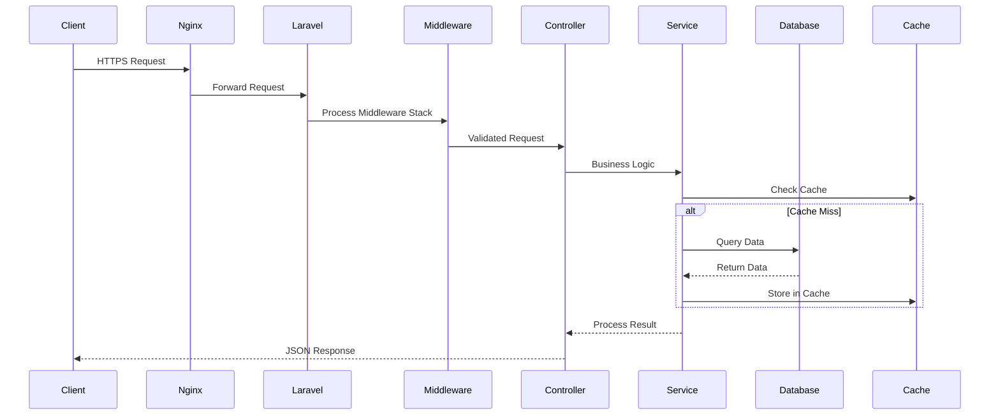

# 🔌 API Architecture & Integration Guide

## Overview

The Business Portal API follows RESTful principles with a focus on performance, security, and developer experience. Built on Laravel 11, it provides a robust foundation for all portal operations.

## Architecture Principles

### 1. Layered Architecture
```
┌─────────────────────────────────────────────────┐
│              API Routes Layer                    │
│         (Routes + Middleware Stack)              │
├─────────────────────────────────────────────────┤
│            Controller Layer                      │
│    (Request Validation + Response Format)        │
├─────────────────────────────────────────────────┤
│             Service Layer                        │
│     (Business Logic + Orchestration)             │
├─────────────────────────────────────────────────┤
│           Repository Layer                       │
│      (Data Access + Query Building)              │
├─────────────────────────────────────────────────┤
│             Model Layer                          │
│    (Eloquent ORM + Relationships)                │
└─────────────────────────────────────────────────┘
```

### 2. Request Lifecycle


## Authentication & Authorization

### Multi-Guard Authentication System
```php
// config/auth.php
'guards' => [
    'portal' => [
        'driver' => 'session',
        'provider' => 'portal_users',
    ],
    'api' => [
        'driver' => 'sanctum',
        'provider' => 'portal_users',
    ],
    'web' => [
        'driver' => 'session',
        'provider' => 'users', // Admin users
    ],
];

// Middleware configuration
'middleware' => [
    'portal.auth' => \App\Http\Middleware\PortalAuth::class,
    'portal.permission' => \App\Http\Middleware\CheckPortalPermission::class,
    'admin.impersonation' => \App\Http\Middleware\AdminImpersonation::class,
];
```

### Session Management
```php
// Isolated session configuration for portal
'portal_session' => [
    'driver' => env('SESSION_DRIVER', 'redis'),
    'lifetime' => env('SESSION_LIFETIME', 120),
    'expire_on_close' => false,
    'encrypt' => true,
    'files' => storage_path('framework/sessions/portal'),
    'connection' => 'portal_sessions',
    'table' => 'portal_sessions',
    'store' => env('SESSION_STORE', null),
    'lottery' => [2, 100],
    'cookie' => 'portal_session',
    'path' => '/business',
    'domain' => env('SESSION_DOMAIN', null),
    'secure' => env('SESSION_SECURE_COOKIE', true),
    'http_only' => true,
    'same_site' => 'lax',
];
```

### API Authentication Flow
```javascript
// Frontend authentication service
class AuthService {
    constructor() {
        this.token = localStorage.getItem('portal_token');
        this.setupInterceptors();
    }

    async login(credentials) {
        const response = await axios.post('/business/api/auth/login', credentials);
        this.token = response.data.token;
        localStorage.setItem('portal_token', this.token);
        this.setupInterceptors();
        return response.data.user;
    }

    setupInterceptors() {
        axios.interceptors.request.use(config => {
            if (this.token) {
                config.headers.Authorization = `Bearer ${this.token}`;
            }
            config.headers['X-CSRF-TOKEN'] = this.getCsrfToken();
            return config;
        });

        axios.interceptors.response.use(
            response => response,
            async error => {
                if (error.response?.status === 401) {
                    await this.refreshToken();
                    return axios(error.config);
                }
                return Promise.reject(error);
            }
        );
    }

    async refreshToken() {
        try {
            const response = await axios.post('/business/api/auth/refresh');
            this.token = response.data.token;
            localStorage.setItem('portal_token', this.token);
        } catch (error) {
            this.logout();
            window.location.href = '/business/login';
        }
    }
}
```

## Request & Response Standards

### Request Format
```javascript
// Standard request structure
{
    headers: {
        'Accept': 'application/json',
        'Content-Type': 'application/json',
        'X-CSRF-TOKEN': 'csrf_token_here',
        'Authorization': 'Bearer api_token_here',
        'X-Company-ID': '123', // For admin impersonation
        'X-Request-ID': 'unique_request_id' // For tracing
    },
    body: {
        // Request data
    }
}
```

### Response Format
```javascript
// Success response
{
    "success": true,
    "data": {
        // Response data
    },
    "message": "Operation completed successfully",
    "meta": {
        "request_id": "unique_request_id",
        "response_time": 125, // ms
        "version": "2.0"
    }
}

// Error response
{
    "success": false,
    "error": {
        "code": "VALIDATION_ERROR",
        "message": "The given data was invalid",
        "details": {
            "email": ["The email field is required"],
            "phone": ["The phone format is invalid"]
        }
    },
    "meta": {
        "request_id": "unique_request_id",
        "response_time": 23
    }
}

// Paginated response
{
    "success": true,
    "data": [...],
    "pagination": {
        "current_page": 1,
        "per_page": 50,
        "total": 245,
        "last_page": 5,
        "from": 1,
        "to": 50
    },
    "meta": {...}
}
```

## API Versioning Strategy

### URL-based Versioning
```php
// routes/api.php
Route::prefix('v1')->group(function () {
    require __DIR__.'/api/v1.php';
});

Route::prefix('v2')->group(function () {
    require __DIR__.'/api/v2.php';
});

// Version negotiation middleware
class ApiVersionMiddleware
{
    public function handle($request, Closure $next)
    {
        $version = $request->header('API-Version', 'v1');
        
        if (!in_array($version, ['v1', 'v2'])) {
            return response()->json([
                'error' => 'Unsupported API version'
            ], 400);
        }
        
        $request->attributes->set('api_version', $version);
        return $next($request);
    }
}
```

## Core API Modules

### 1. Base API Controller
```php
namespace App\Http\Controllers\Portal\Api;

use App\Http\Controllers\Controller;
use Illuminate\Http\JsonResponse;

abstract class BaseApiController extends Controller
{
    protected function success($data = null, string $message = 'Success', int $code = 200): JsonResponse
    {
        return response()->json([
            'success' => true,
            'data' => $data,
            'message' => $message,
            'meta' => $this->getMetadata()
        ], $code);
    }

    protected function error(string $message, array $errors = [], int $code = 400): JsonResponse
    {
        return response()->json([
            'success' => false,
            'error' => [
                'code' => $this->getErrorCode($code),
                'message' => $message,
                'details' => $errors
            ],
            'meta' => $this->getMetadata()
        ], $code);
    }

    protected function paginated($paginator, string $message = 'Success'): JsonResponse
    {
        return response()->json([
            'success' => true,
            'data' => $paginator->items(),
            'pagination' => [
                'current_page' => $paginator->currentPage(),
                'per_page' => $paginator->perPage(),
                'total' => $paginator->total(),
                'last_page' => $paginator->lastPage(),
                'from' => $paginator->firstItem(),
                'to' => $paginator->lastItem()
            ],
            'message' => $message,
            'meta' => $this->getMetadata()
        ]);
    }

    private function getMetadata(): array
    {
        return [
            'request_id' => request()->header('X-Request-ID', uniqid()),
            'response_time' => round((microtime(true) - LARAVEL_START) * 1000),
            'version' => config('api.version', '2.0')
        ];
    }

    private function getErrorCode(int $httpCode): string
    {
        $codes = [
            400 => 'BAD_REQUEST',
            401 => 'UNAUTHORIZED',
            403 => 'FORBIDDEN',
            404 => 'NOT_FOUND',
            422 => 'VALIDATION_ERROR',
            429 => 'RATE_LIMITED',
            500 => 'SERVER_ERROR'
        ];

        return $codes[$httpCode] ?? 'UNKNOWN_ERROR';
    }
}
```

### 2. Request Validation
```php
namespace App\Http\Requests\Portal;

use Illuminate\Foundation\Http\FormRequest;
use Illuminate\Contracts\Validation\Validator;
use Illuminate\Http\Exceptions\HttpResponseException;

abstract class BasePortalRequest extends FormRequest
{
    public function authorize(): bool
    {
        return auth()->guard('portal')->check();
    }

    protected function failedValidation(Validator $validator)
    {
        throw new HttpResponseException(
            response()->json([
                'success' => false,
                'error' => [
                    'code' => 'VALIDATION_ERROR',
                    'message' => 'The given data was invalid',
                    'details' => $validator->errors()
                ],
                'meta' => [
                    'request_id' => request()->header('X-Request-ID', uniqid()),
                    'response_time' => round((microtime(true) - LARAVEL_START) * 1000)
                ]
            ], 422)
        );
    }

    protected function passedValidation()
    {
        // Log successful validation for audit
        activity()
            ->causedBy(auth()->guard('portal')->user())
            ->withProperties(['validated_data' => $this->validated()])
            ->log('Request validated: ' . class_basename($this));
    }
}

// Example usage
class UpdateCallStatusRequest extends BasePortalRequest
{
    public function rules(): array
    {
        return [
            'status' => 'required|in:reviewed,pending,follow_up,completed',
            'notes' => 'nullable|string|max:1000',
            'tags' => 'nullable|array',
            'tags.*' => 'exists:tags,id'
        ];
    }

    public function messages(): array
    {
        return [
            'status.in' => 'Invalid status. Allowed values: reviewed, pending, follow_up, completed'
        ];
    }
}
```

### 3. Service Layer Pattern
```php
namespace App\Services\Portal;

use App\Repositories\CallRepository;
use App\Models\Call;
use Illuminate\Support\Facades\DB;
use Illuminate\Support\Facades\Cache;

class CallService
{
    public function __construct(
        private CallRepository $repository,
        private NotificationService $notifications,
        private ActivityLogger $logger
    ) {}

    public function updateCallStatus(int $callId, array $data): Call
    {
        return DB::transaction(function () use ($callId, $data) {
            $call = $this->repository->findOrFail($callId);
            
            // Business logic validation
            if ($call->status === 'completed' && $data['status'] !== 'completed') {
                throw new \InvalidArgumentException('Cannot change status of completed call');
            }

            // Update call
            $previousStatus = $call->status;
            $call = $this->repository->update($callId, $data);

            // Clear cache
            Cache::tags(['calls', "company:{$call->company_id}"])->flush();

            // Log activity
            $this->logger->log('call.status.updated', [
                'call_id' => $callId,
                'previous_status' => $previousStatus,
                'new_status' => $call->status
            ]);

            // Send notifications if needed
            if ($this->shouldNotify($previousStatus, $call->status)) {
                $this->notifications->sendCallStatusUpdate($call);
            }

            return $call;
        });
    }

    private function shouldNotify(string $oldStatus, string $newStatus): bool
    {
        $notifiableTransitions = [
            'pending' => ['reviewed', 'follow_up'],
            'follow_up' => ['completed']
        ];

        return isset($notifiableTransitions[$oldStatus]) && 
               in_array($newStatus, $notifiableTransitions[$oldStatus]);
    }
}
```

## Rate Limiting & Throttling

### Adaptive Rate Limiting
```php
// app/Http/Middleware/AdaptiveRateLimit.php
namespace App\Http\Middleware;

use Closure;
use Illuminate\Cache\RateLimiter;
use Illuminate\Http\Request;

class AdaptiveRateLimit
{
    public function __construct(private RateLimiter $limiter) {}

    public function handle(Request $request, Closure $next, string $type = 'api')
    {
        $key = $this->resolveRequestKey($request, $type);
        $maxAttempts = $this->getMaxAttempts($request, $type);
        
        if ($this->limiter->tooManyAttempts($key, $maxAttempts)) {
            return $this->buildResponse($key, $maxAttempts);
        }

        $this->limiter->hit($key);

        $response = $next($request);

        return $this->addHeaders(
            $response,
            $maxAttempts,
            $this->limiter->attempts($key),
            $this->limiter->availableIn($key)
        );
    }

    private function resolveRequestKey(Request $request, string $type): string
    {
        $user = $request->user('portal');
        
        if ($user) {
            return sprintf('%s:%s:%s', $type, $user->company_id, $user->id);
        }

        return sprintf('%s:%s', $type, $request->ip());
    }

    private function getMaxAttempts(Request $request, string $type): int
    {
        $user = $request->user('portal');
        
        // Different limits based on user type
        if ($user?->is_premium) {
            return config("rate_limits.{$type}.premium", 1000);
        }

        return config("rate_limits.{$type}.default", 60);
    }

    private function addHeaders($response, int $maxAttempts, int $remainingAttempts, ?int $retryAfter = null)
    {
        $headers = [
            'X-RateLimit-Limit' => $maxAttempts,
            'X-RateLimit-Remaining' => $maxAttempts - $remainingAttempts,
        ];

        if ($retryAfter) {
            $headers['X-RateLimit-Reset'] = time() + $retryAfter;
            $headers['Retry-After'] = $retryAfter;
        }

        return $response->withHeaders($headers);
    }
}
```

### Rate Limit Configuration
```php
// config/rate_limits.php
return [
    'api' => [
        'default' => env('RATE_LIMIT_API', 60),
        'premium' => env('RATE_LIMIT_API_PREMIUM', 1000),
    ],
    'exports' => [
        'default' => env('RATE_LIMIT_EXPORTS', 10),
        'premium' => env('RATE_LIMIT_EXPORTS_PREMIUM', 100),
    ],
    'webhooks' => [
        'default' => env('RATE_LIMIT_WEBHOOKS', 1000),
    ],
];
```

## Caching Strategy

### Multi-Level Cache Implementation
```php
namespace App\Services;

use Illuminate\Support\Facades\Cache;
use Illuminate\Support\Facades\Redis;

class CacheService
{
    private const TTL_SHORT = 300;      // 5 minutes
    private const TTL_MEDIUM = 3600;    // 1 hour
    private const TTL_LONG = 86400;     // 24 hours

    public function remember(string $key, $ttl, Closure $callback, array $tags = [])
    {
        // L1 Cache: In-memory
        if ($this->hasInMemory($key)) {
            return $this->getFromMemory($key);
        }

        // L2 Cache: Redis
        $value = Cache::tags($tags)->remember($key, $ttl, $callback);
        
        // Store in L1
        $this->storeInMemory($key, $value);

        return $value;
    }

    public function rememberForever(string $key, Closure $callback, array $tags = [])
    {
        return Cache::tags($tags)->rememberForever($key, $callback);
    }

    public function invalidate(array $tags)
    {
        Cache::tags($tags)->flush();
        $this->clearMemoryByTags($tags);
    }

    // Specific cache methods
    public function getCompanySettings(int $companyId)
    {
        return $this->remember(
            "company:{$companyId}:settings",
            self::TTL_LONG,
            fn() => Company::find($companyId)->settings,
            ["company:{$companyId}", 'settings']
        );
    }

    public function getDashboardStats(int $companyId, string $range)
    {
        return $this->remember(
            "dashboard:{$companyId}:{$range}",
            self::TTL_SHORT,
            fn() => $this->calculateDashboardStats($companyId, $range),
            ["company:{$companyId}", 'dashboard']
        );
    }
}
```

### Cache Warming
```php
// app/Console/Commands/WarmCache.php
class WarmCache extends Command
{
    protected $signature = 'cache:warm {--company=all}';

    public function handle(CacheService $cache)
    {
        $companies = $this->option('company') === 'all' 
            ? Company::active()->get()
            : Company::where('id', $this->option('company'))->get();

        foreach ($companies as $company) {
            $this->info("Warming cache for company: {$company->name}");
            
            // Warm dashboard cache
            foreach (['today', 'week', 'month'] as $range) {
                $cache->getDashboardStats($company->id, $range);
            }
            
            // Warm settings cache
            $cache->getCompanySettings($company->id);
            
            // Warm frequently accessed data
            $this->warmCallsCache($company);
            $this->warmCustomersCache($company);
        }
    }
}
```

## Error Handling

### Global Exception Handler
```php
// app/Exceptions/Handler.php
class Handler extends ExceptionHandler
{
    public function render($request, Throwable $exception)
    {
        if ($request->expectsJson() || $request->is('business/api/*')) {
            return $this->handleApiException($request, $exception);
        }

        return parent::render($request, $exception);
    }

    private function handleApiException($request, Throwable $exception)
    {
        $statusCode = 500;
        $message = 'Server Error';
        $code = 'SERVER_ERROR';

        if ($exception instanceof ValidationException) {
            $statusCode = 422;
            $message = 'Validation Failed';
            $code = 'VALIDATION_ERROR';
        } elseif ($exception instanceof ModelNotFoundException) {
            $statusCode = 404;
            $message = 'Resource Not Found';
            $code = 'NOT_FOUND';
        } elseif ($exception instanceof AuthenticationException) {
            $statusCode = 401;
            $message = 'Unauthenticated';
            $code = 'UNAUTHENTICATED';
        } elseif ($exception instanceof AuthorizationException) {
            $statusCode = 403;
            $message = 'Forbidden';
            $code = 'FORBIDDEN';
        } elseif ($exception instanceof ThrottleRequestsException) {
            $statusCode = 429;
            $message = 'Too Many Requests';
            $code = 'RATE_LIMITED';
        }

        // Log error
        if ($statusCode >= 500) {
            Log::error($exception->getMessage(), [
                'exception' => $exception,
                'request' => $request->all(),
                'user' => $request->user('portal')?->id
            ]);
        }

        return response()->json([
            'success' => false,
            'error' => [
                'code' => $code,
                'message' => $message,
                'details' => $this->getExceptionDetails($exception)
            ],
            'meta' => [
                'request_id' => $request->header('X-Request-ID', uniqid()),
                'response_time' => round((microtime(true) - LARAVEL_START) * 1000)
            ]
        ], $statusCode);
    }

    private function getExceptionDetails(Throwable $exception): ?array
    {
        if ($exception instanceof ValidationException) {
            return $exception->errors();
        }

        if (config('app.debug')) {
            return [
                'exception' => get_class($exception),
                'file' => $exception->getFile(),
                'line' => $exception->getLine(),
                'trace' => $exception->getTrace()
            ];
        }

        return null;
    }
}
```

### Custom Exceptions
```php
namespace App\Exceptions;

class BusinessLogicException extends \Exception
{
    protected $errorCode;
    protected $details;

    public function __construct(string $message, string $errorCode, array $details = [], int $statusCode = 400)
    {
        parent::__construct($message, $statusCode);
        $this->errorCode = $errorCode;
        $this->details = $details;
    }

    public function render($request)
    {
        return response()->json([
            'success' => false,
            'error' => [
                'code' => $this->errorCode,
                'message' => $this->getMessage(),
                'details' => $this->details
            ]
        ], $this->getCode());
    }
}

// Usage
throw new BusinessLogicException(
    'Insufficient balance for operation',
    'INSUFFICIENT_BALANCE',
    ['required' => 100, 'available' => 50],
    400
);
```

## Performance Monitoring

### Request Performance Tracking
```php
namespace App\Http\Middleware;

class PerformanceMonitoring
{
    public function handle($request, Closure $next)
    {
        $startTime = microtime(true);
        $startMemory = memory_get_usage();

        $response = $next($request);

        $duration = (microtime(true) - $startTime) * 1000;
        $memory = memory_get_usage() - $startMemory;

        // Add performance headers
        $response->headers->set('X-Response-Time', round($duration, 2) . 'ms');
        $response->headers->set('X-Memory-Usage', $this->formatBytes($memory));

        // Log slow requests
        if ($duration > config('monitoring.slow_request_threshold', 1000)) {
            Log::warning('Slow API request detected', [
                'url' => $request->fullUrl(),
                'method' => $request->method(),
                'duration' => $duration,
                'memory' => $memory,
                'user' => $request->user('portal')?->id
            ]);
        }

        // Send metrics to monitoring service
        $this->sendMetrics($request, $duration, $memory);

        return $response;
    }

    private function sendMetrics($request, float $duration, int $memory)
    {
        $tags = [
            'endpoint' => $request->route()?->getName() ?? 'unknown',
            'method' => $request->method(),
            'status' => $response->getStatusCode()
        ];

        Metrics::histogram('api.request.duration', $duration, $tags);
        Metrics::histogram('api.request.memory', $memory, $tags);
        Metrics::increment('api.request.count', $tags);
    }
}
```

## Testing

### API Testing Base Class
```php
namespace Tests\Feature\Api;

use Tests\TestCase;
use App\Models\PortalUser;
use App\Models\Company;

abstract class ApiTestCase extends TestCase
{
    protected PortalUser $user;
    protected Company $company;
    protected array $defaultHeaders = [
        'Accept' => 'application/json',
    ];

    protected function setUp(): void
    {
        parent::setUp();

        $this->company = Company::factory()->create();
        $this->user = PortalUser::factory()
            ->for($this->company)
            ->create();
    }

    protected function actingAsPortalUser(PortalUser $user = null): self
    {
        $user = $user ?? $this->user;
        $this->actingAs($user, 'portal');
        return $this;
    }

    protected function apiGet(string $uri, array $headers = []): TestResponse
    {
        return $this->get($uri, array_merge($this->defaultHeaders, $headers));
    }

    protected function apiPost(string $uri, array $data = [], array $headers = []): TestResponse
    {
        return $this->post($uri, $data, array_merge($this->defaultHeaders, $headers));
    }

    protected function assertApiSuccess($response): void
    {
        $response->assertJsonStructure([
            'success',
            'data',
            'message',
            'meta'
        ])->assertJson(['success' => true]);
    }

    protected function assertApiError($response, int $status = 400): void
    {
        $response->assertStatus($status)
            ->assertJsonStructure([
                'success',
                'error' => ['code', 'message'],
                'meta'
            ])
            ->assertJson(['success' => false]);
    }
}

// Example test
class CallApiTest extends ApiTestCase
{
    public function test_can_list_calls()
    {
        Call::factory()->count(5)->for($this->company)->create();

        $response = $this->actingAsPortalUser()
            ->apiGet('/business/api/calls');

        $this->assertApiSuccess($response);
        $response->assertJsonCount(5, 'data');
    }

    public function test_cannot_access_calls_without_auth()
    {
        $response = $this->apiGet('/business/api/calls');

        $this->assertApiError($response, 401);
    }
}
```

## API Documentation

### OpenAPI/Swagger Integration
```yaml
openapi: 3.0.0
info:
  title: AskProAI Business Portal API
  version: 2.0.0
  description: API for the AskProAI Business Portal

servers:
  - url: https://api.askproai.de/business/api
    description: Production server
  - url: http://localhost:8000/business/api
    description: Development server

security:
  - bearerAuth: []
  - sessionAuth: []

paths:
  /dashboard:
    get:
      summary: Get dashboard data
      tags:
        - Dashboard
      parameters:
        - name: range
          in: query
          schema:
            type: string
            enum: [today, week, month, year]
          description: Time range for data
      responses:
        '200':
          description: Dashboard data
          content:
            application/json:
              schema:
                $ref: '#/components/schemas/DashboardResponse'

  /calls:
    get:
      summary: List calls
      tags:
        - Calls
      parameters:
        - $ref: '#/components/parameters/PageParam'
        - $ref: '#/components/parameters/PerPageParam'
        - name: search
          in: query
          schema:
            type: string
          description: Search in phone numbers and transcripts
      responses:
        '200':
          description: Paginated list of calls
          content:
            application/json:
              schema:
                $ref: '#/components/schemas/CallListResponse'

components:
  securitySchemes:
    bearerAuth:
      type: http
      scheme: bearer
      bearerFormat: JWT
    sessionAuth:
      type: apiKey
      in: cookie
      name: portal_session

  parameters:
    PageParam:
      name: page
      in: query
      schema:
        type: integer
        minimum: 1
        default: 1
    PerPageParam:
      name: per_page
      in: query
      schema:
        type: integer
        minimum: 1
        maximum: 100
        default: 50

  schemas:
    ApiResponse:
      type: object
      properties:
        success:
          type: boolean
        message:
          type: string
        meta:
          type: object
          properties:
            request_id:
              type: string
            response_time:
              type: number
```

## Best Practices

### 1. API Design Guidelines
- Use consistent naming conventions (snake_case for JSON)
- Version your APIs properly
- Implement proper pagination for list endpoints
- Use appropriate HTTP status codes
- Include helpful error messages
- Support filtering and sorting where applicable

### 2. Security Best Practices
- Always validate input data
- Use parameterized queries
- Implement rate limiting
- Log security-relevant events
- Use HTTPS everywhere
- Implement CORS properly
- Sanitize output data

### 3. Performance Guidelines
- Use eager loading to prevent N+1 queries
- Implement caching strategically
- Use database indexes effectively
- Paginate large result sets
- Optimize JSON serialization
- Use queue jobs for heavy operations

### 4. Documentation Standards
- Keep API documentation up-to-date
- Provide clear examples
- Document error responses
- Include rate limits
- Explain authentication requirements
- Version your documentation