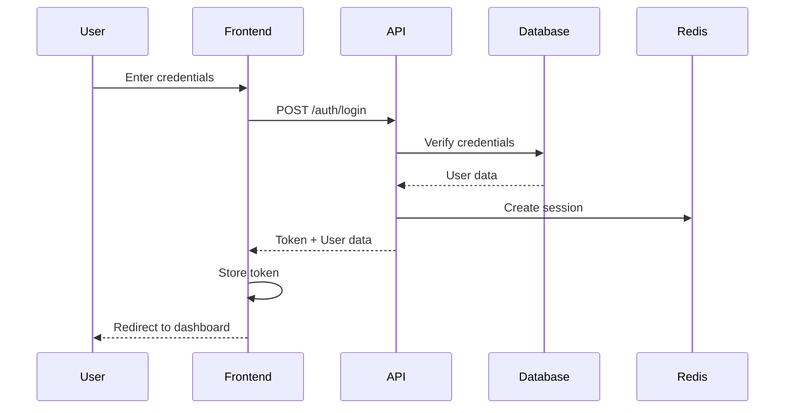

# 🏗️ Architecture & Technology

## Overview

The Business Portal is built with a modern, scalable architecture designed for high performance, security, and developer productivity.

## 🎯 Architecture Principles

### Core Principles
1. **Separation of Concerns**: Clear boundaries between layers
2. **Scalability**: Horizontal scaling capability
3. **Security First**: Defense in depth approach
4. **Performance**: Optimized for speed
5. **Maintainability**: Clean, documented code

## 🔧 Technology Stack

### Frontend Stack

| Technology | Version | Purpose |
|------------|---------|---------|
| **React** | 18.2 | UI Framework |
| **TypeScript** | 5.x | Type Safety |
| **Vite** | 5.x | Build Tool |
| **Tailwind CSS** | 3.x | Styling |
| **shadcn/ui** | Latest | UI Components |
| **Axios** | 1.x | HTTP Client |
| **React Query** | 4.x | Data Fetching |
| **Recharts** | 2.x | Data Visualization |
| **Day.js** | 1.x | Date Handling |
| **React Hook Form** | 7.x | Form Management |

### Backend Stack

| Technology | Version | Purpose |
|------------|---------|---------|
| **Laravel** | 11.x | PHP Framework |
| **PHP** | 8.3 | Runtime |
| **MySQL** | 8.0 | Primary Database |
| **Redis** | 7.x | Cache & Queue |
| **Nginx** | Latest | Web Server |
| **Horizon** | 5.x | Queue Management |
| **Sanctum** | 4.x | Authentication |
| **Filament** | 3.x | Admin Panel |

### Infrastructure

| Service | Purpose |
|---------|---------|
| **Netcup VPS** | Hosting |
| **CloudFlare** | CDN & DDoS Protection |
| **Let's Encrypt** | SSL Certificates |
| **Sentry** | Error Tracking |
| **GitHub Actions** | CI/CD |

## 🏛️ System Architecture

### High-Level Architecture

```
┌─────────────────────────────────────────────────────────────┐
│                        CloudFlare CDN                        │
│                    (DDoS Protection + Cache)                 │
└─────────────────────┬───────────────────────────────────────┘
                      │ HTTPS
┌─────────────────────▼───────────────────────────────────────┐
│                        Load Balancer                         │
│                     (Nginx Reverse Proxy)                    │
└─────────────────────┬───────────────────────────────────────┘
                      │
         ┌────────────┴──────────┬────────────────┐
         │                       │                │
┌────────▼────────┐   ┌─────────▼──────┐  ┌─────▼─────┐
│   Web Server    │   │   Web Server   │  │    ...    │
│   (Nginx +      │   │   (Nginx +     │  │           │
│   PHP-FPM)      │   │   PHP-FPM)     │  │           │
└────────┬────────┘   └────────┬────────┘  └─────┬─────┘
         │                      │                 │
         └──────────┬───────────┴─────────────────┘
                    │
         ┌──────────▼───────────┬────────────────┐
         │                      │                │
┌────────▼────────┐   ┌─────────▼──────┐  ┌─────▼─────┐
│  MySQL Primary  │   │  Redis Master  │  │  Storage  │
│   (Read/Write)  │   │    (Cache)     │  │   (S3)    │
└─────────────────┘   └────────────────┘  └───────────┘
```

### Application Architecture

```
┌─────────────────────────────────────────────────────────────┐
│                    React SPA (Frontend)                      │
├─────────────────────────────────────────────────────────────┤
│  Pages/          Components/        Hooks/         Services/ │
│  ├─ Dashboard    ├─ ui/            ├─ useAuth     ├─ api/   │
│  ├─ Calls        ├─ Portal/        ├─ useCompany  ├─ auth   │
│  ├─ Appointments └─ Mobile/        └─ useData     └─ utils  │
└─────────────────────┬───────────────────────────────────────┘
                      │ HTTPS API Calls
┌─────────────────────▼───────────────────────────────────────┐
│                   Laravel Backend (API)                      │
├─────────────────────────────────────────────────────────────┤
│  HTTP Layer          Service Layer        Data Layer        │
│  ├─ Routes          ├─ CallService       ├─ Models         │
│  ├─ Middleware      ├─ BookingService    ├─ Repositories   │
│  └─ Controllers     └─ BillingService    └─ Migrations     │
└─────────────────────────────────────────────────────────────┘
```

## 🗄️ Database Design

### Core Tables Structure

```sql
-- Companies (Multi-tenant)
CREATE TABLE companies (
    id BIGINT PRIMARY KEY,
    name VARCHAR(255),
    subdomain VARCHAR(100) UNIQUE,
    settings JSON,
    created_at TIMESTAMP
);

-- Portal Users
CREATE TABLE portal_users (
    id BIGINT PRIMARY KEY,
    company_id BIGINT,
    email VARCHAR(255) UNIQUE,
    name VARCHAR(255),
    password VARCHAR(255),
    two_factor_secret TEXT,
    created_at TIMESTAMP,
    FOREIGN KEY (company_id) REFERENCES companies(id)
);

-- Calls
CREATE TABLE calls (
    id VARCHAR(36) PRIMARY KEY,
    company_id BIGINT,
    from_number VARCHAR(20),
    to_number VARCHAR(20),
    duration INT,
    status ENUM('answered', 'missed', 'voicemail'),
    transcript JSON,
    recording_url TEXT,
    created_at TIMESTAMP,
    INDEX idx_company_created (company_id, created_at)
);

-- Appointments
CREATE TABLE appointments (
    id BIGINT PRIMARY KEY,
    company_id BIGINT,
    customer_id BIGINT,
    staff_id BIGINT,
    starts_at TIMESTAMP,
    ends_at TIMESTAMP,
    status ENUM('scheduled', 'confirmed', 'completed', 'cancelled'),
    created_at TIMESTAMP,
    INDEX idx_company_starts (company_id, starts_at)
);
```

### Database Optimization

#### Indexes Strategy
```sql
-- Performance-critical indexes
CREATE INDEX idx_calls_company_date ON calls(company_id, created_at DESC);
CREATE INDEX idx_appointments_schedule ON appointments(company_id, starts_at, status);
CREATE INDEX idx_customers_phone ON customers(company_id, phone_number);
CREATE INDEX idx_transactions_date ON balance_topups(company_id, created_at DESC);
```

#### Partitioning Strategy
```sql
-- Partition large tables by date
ALTER TABLE calls PARTITION BY RANGE (YEAR(created_at)) (
    PARTITION p2024 VALUES LESS THAN (2025),
    PARTITION p2025 VALUES LESS THAN (2026),
    PARTITION p_future VALUES LESS THAN MAXVALUE
);
```

## 🔐 Security Architecture

### Security Layers

```
┌─────────────────────────────────────────────────────────────┐
│                    Layer 1: Network Security                 │
│              (Firewall, DDoS Protection, SSL)               │
├─────────────────────────────────────────────────────────────┤
│                 Layer 2: Application Security                │
│          (CSRF, XSS Protection, Input Validation)          │
├─────────────────────────────────────────────────────────────┤
│                  Layer 3: Authentication                     │
│              (Multi-guard, 2FA, Session Isolation)          │
├─────────────────────────────────────────────────────────────┤
│                   Layer 4: Authorization                     │
│            (RBAC, Tenant Isolation, Permissions)           │
├─────────────────────────────────────────────────────────────┤
│                    Layer 5: Data Security                    │
│           (Encryption at Rest, Secure Backups)             │
└─────────────────────────────────────────────────────────────┘
```

### Authentication Flow



## 🚀 Performance Architecture

### Caching Strategy

```
┌─────────────────────────────────────────────────────────────┐
│                      L1: Browser Cache                       │
│                  (Static assets, API responses)              │
├─────────────────────────────────────────────────────────────┤
│                      L2: CDN Cache                          │
│                   (CloudFlare edge servers)                 │
├─────────────────────────────────────────────────────────────┤
│                   L3: Application Cache                     │
│                      (Redis in-memory)                      │
├─────────────────────────────────────────────────────────────┤
│                    L4: Database Cache                       │
│                    (MySQL query cache)                      │
└─────────────────────────────────────────────────────────────┘
```

### Queue Architecture

```
Producer → Redis Queue → Horizon Workers → Processor
   ↓                         ↓                 ↓
Webhooks                 Monitor           Database
API Calls               Retry Logic       External APIs
Scheduled Jobs          Error Handling    Notifications
```

## 🔄 Data Flow

### API Request Lifecycle

```
1. Client Request
   ├─→ CloudFlare (DDoS check)
   └─→ SSL termination

2. Load Balancer
   ├─→ Health check
   └─→ Route to server

3. Web Server (Nginx)
   ├─→ Static asset check
   └─→ Pass to PHP-FPM

4. Laravel Application
   ├─→ Route matching
   ├─→ Middleware stack
   │   ├─→ CORS
   │   ├─→ Authentication
   │   ├─→ Rate limiting
   │   └─→ Tenant isolation
   ├─→ Controller
   ├─→ Service layer
   ├─→ Data access
   └─→ Response formatting

5. Response Path
   └─→ Client (with caching headers)
```

### Real-time Updates

```
Event Source → Laravel Event → Redis Pub/Sub → WebSocket Server → Client
     ↓              ↓              ↓                ↓              ↓
Call Created   Broadcast      Horizon Job      Pusher/Echo    Update UI
Status Change  Queue Job      Process Event   Subscribe      Show Notification
Data Update    Log Event      Send to Clients Channel        Refresh Data
```

## 🛠️ Development Architecture

### Local Development Setup

```bash
# Docker Compose services
services:
  app:
    image: php:8.3-fpm
    volumes:
      - ./:/var/www
  
  nginx:
    image: nginx:alpine
    ports:
      - "8080:80"
  
  mysql:
    image: mysql:8.0
    environment:
      MYSQL_DATABASE: askproai_dev
  
  redis:
    image: redis:7-alpine
    ports:
      - "6379:6379"
```

### CI/CD Pipeline

```yaml
# GitHub Actions workflow
stages:
  - test
  - build
  - deploy

test:
  - PHPUnit tests
  - Jest tests
  - ESLint
  - PHPStan

build:
  - Composer install
  - NPM build
  - Asset optimization

deploy:
  - Blue-green deployment
  - Database migrations
  - Cache warming
  - Health checks
```

## 📊 Monitoring Architecture

### Metrics Collection

```
Application → StatsD → Prometheus → Grafana
    ↓           ↓          ↓           ↓
 APM Data    Metrics   Storage   Dashboards
 Logs        Events    Queries   Alerts
 Traces      Custom    Rules     Reports
```

### Key Metrics Tracked
- **Response Time**: p50, p95, p99
- **Error Rate**: 4xx, 5xx responses
- **Throughput**: Requests per second
- **Resource Usage**: CPU, Memory, Disk
- **Business Metrics**: Calls, Bookings, Revenue

## 🔧 Maintenance Architecture

### Backup Strategy

```
Daily Backups:
├─ Database (MySQL dump)
├─ File uploads (rsync)
└─ Redis snapshots

Weekly Backups:
├─ Full system backup
└─ Off-site replication

Monthly Archives:
└─ Long-term storage (S3)
```

### Update Process

```
1. Staging Deployment
   ├─ Run migrations
   ├─ Clear caches
   └─ Run tests

2. Production Deployment
   ├─ Maintenance mode
   ├─ Blue-green switch
   ├─ Health checks
   └─ Monitor metrics

3. Rollback Plan
   ├─ Database snapshots
   ├─ Code versioning
   └─ Quick switch
```

## 🌐 API Architecture

### RESTful Design

```
Resource-based URLs:
GET    /api/calls          # List
GET    /api/calls/{id}     # Read
POST   /api/calls          # Create
PUT    /api/calls/{id}     # Update
DELETE /api/calls/{id}     # Delete

Consistent Response:
{
  "success": true,
  "data": {...},
  "meta": {
    "request_id": "...",
    "response_time": 125
  }
}
```

### API Versioning

```
URL-based versioning:
/api/v1/calls  # Version 1
/api/v2/calls  # Version 2

Header-based negotiation:
API-Version: v2
Accept: application/vnd.api+json;version=2
```

## 🏆 Best Practices

### Code Organization
```
app/
├── Http/
│   ├── Controllers/Portal/Api/   # API controllers
│   ├── Middleware/              # Custom middleware
│   └── Requests/               # Form requests
├── Services/                   # Business logic
├── Repositories/              # Data access
├── Models/                   # Eloquent models
└── Events/                  # Event classes

resources/js/
├── Pages/Portal/           # Page components
├── components/            # Reusable components
├── hooks/                # Custom React hooks
├── services/            # API services
└── utils/              # Helper functions
```

### Performance Guidelines
1. **Database**: Use eager loading, indexes
2. **Caching**: Cache expensive operations
3. **Queues**: Offload heavy tasks
4. **Frontend**: Code splitting, lazy loading
5. **API**: Pagination, field filtering

### Security Guidelines
1. **Input**: Validate all user input
2. **Output**: Escape all output
3. **Auth**: Use proper authentication
4. **Crypto**: Use strong encryption
5. **Audit**: Log security events

---

<center>

**🏗️ Built for Scale, Designed for Success**

</center>