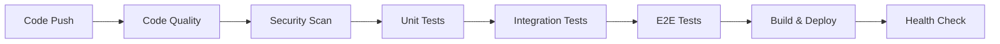

# AskProAI CI/CD Pipeline - Notion Import Structure

## 📋 Overview
This document provides a structured format for importing the AskProAI CI/CD pipeline documentation into Notion. The content is organized hierarchically for easy navigation and reference.

---

# 🚀 CI/CD Pipeline Main Page

## Quick Links
- [GitHub Actions Workflows](#github-actions-workflows)
- [Deployment Strategies](#deployment-strategies)
- [Monitoring & Alerts](#monitoring--alerts)
- [Emergency Procedures](#emergency-procedures)
- [Best Practices](#best-practices)

## Pipeline Architecture

### Overview
AskProAI uses GitHub Actions for CI/CD with multiple deployment strategies:
- ✅ Zero-downtime deployments
- 🔄 Blue-green deployments
- ⚡ Automated rollbacks
- 🔒 Security scanning
- 📊 Performance monitoring

### Key Components
| Component | Description | Link |
|-----------|-------------|------|
| **Version Control** | GitHub | [Repository](https://github.com/askproai/api-gateway) |
| **CI/CD Platform** | GitHub Actions | [Workflows](.github/workflows/) |
| **Production** | api.askproai.de | [Health Check](https://api.askproai.de/api/health) |
| **Staging** | staging.askproai.de | [Health Check](https://staging.askproai.de/api/health) |
| **Monitoring** | Prometheus + Grafana | [Dashboards](#monitoring) |

---

# 🔧 GitHub Actions Workflows

## 1. Main CI/CD Workflow (`ci-comprehensive.yml`)

### Triggers
- ✅ Push to main, develop, staging branches
- ✅ Pull requests to main
- ✅ Daily security scans (2 AM UTC)

### Job Pipeline


### Jobs Detail

#### 1️⃣ Code Quality Analysis
- **PHP CodeSniffer** (PSR-12 standard)
- **PHPStan** (Level 8)
- **PHP Mess Detector**
- **Psalm** static analysis

#### 2️⃣ Security Vulnerability Scan
- **Composer audit**
- **NPM audit**
- **TruffleHog** secret scanning
- **OWASP** dependency check

#### 3️⃣ Test Suites
- **Unit Tests**: 80% coverage requirement
- **Integration Tests**: API & external services
- **E2E Tests**: Complete workflows
- **Performance Tests**: Response time benchmarks

## 2. Manual Deployment Workflow (`deploy.yml`)

### Configuration Options
```yaml
environment: [staging, production]
ref: [branch/tag/commit]
skip_tests: [true/false] # Emergency only
reason: "Deployment description"
```

### Deployment Flow
1. **Validate** permissions
2. **Run tests** (unless skipped)
3. **Build** artifacts
4. **Deploy** to environment
5. **Health check**
6. **Notify** team

## 3. Additional Workflows

### Code Quality (`code-quality.yml`)
- Runs on every push and PR
- Laravel Pint formatting
- PHPStan analysis
- Security checks
- Test coverage validation

### Documentation Auto-Update (`docs-auto-update.yml`)
- Monitors documentation freshness
- Creates update PRs automatically
- Updates README badges
- Comments on PRs with suggestions

---

# 🚢 Deployment Strategies

## 1. Rolling Deployment (Default)

### Steps
1. Enable maintenance mode
2. Pull latest code
3. Install dependencies
4. Run migrations
5. Optimize application
6. Restart services
7. Disable maintenance mode

### Command
```bash
./deploy/deploy.sh production
```

## 2. Zero-Downtime Deployment

### Blue-Green Process
1. Prepare inactive environment
2. Update code and dependencies
3. Run online schema migrations
4. Health check new environment
5. Switch load balancer
6. Drain old connections
7. Update symlinks
8. Monitor for issues

### Command
```bash
./deploy/zero-downtime-deploy.sh production
```

## 3. Canary Deployment

### Configuration
- **Initial Traffic**: 10%
- **Monitor Duration**: 1 hour
- **Success Rate Required**: 99.5%
- **Gradual Increase**: 10% → 25% → 50% → 100%

## 4. Emergency Deployment

### When to Use
- Critical security patches
- Data corruption fixes
- Service outages

### Command
```bash
gh workflow run deploy.yml \
  -f environment=production \
  -f ref=hotfix/critical-bug \
  -f skip_tests=true \
  -f reason="Critical fix for CVE-2025-XXXX"
```

---

# 🔒 Environment Configuration

## GitHub Secrets Required

### SSH Access
```
PRODUCTION_SSH_HOST
PRODUCTION_SSH_USER
PRODUCTION_SSH_KEY
STAGING_SSH_HOST
STAGING_SSH_USER
STAGING_SSH_KEY
```

### Notifications
```
SLACK_WEBHOOK_URL
NOTIFICATION_EMAIL
MAIL_HOST
MAIL_PORT
MAIL_USERNAME
MAIL_PASSWORD
```

### Monitoring
```
METRICS_ENDPOINT
DATADOG_API_KEY (optional)
NEW_RELIC_LICENSE (optional)
```

## Environment Files

### Production (.env.production)
```env
APP_NAME=AskProAI
APP_ENV=production
APP_DEBUG=false
APP_URL=https://api.askproai.de

# Database
DB_CONNECTION=mysql
DB_HOST=127.0.0.1
DB_DATABASE=askproai
DB_USERNAME=askproai_user
DB_PASSWORD=${DB_PASSWORD_PRODUCTION}

# Queue
QUEUE_CONNECTION=redis
HORIZON_PREFIX=horizon:askproai:prod
```

---

# 📊 Monitoring & Alerts

## Health Check Endpoints
- `/api/health` - Main health check
- `/api/health/database` - Database connectivity
- `/api/health/redis` - Redis connectivity
- `/api/health/queue` - Queue status
- `/api/health/calcom` - Cal.com integration
- `/api/health/retell` - Retell.ai integration

## Prometheus Metrics
- `askproai_http_requests_total`
- `askproai_http_request_duration_seconds`
- `askproai_queue_size`
- `askproai_active_calls`
- `askproai_appointments_created_total`

## Alert Rules

### Critical Alerts 🔴
- Deployment failure
- Health check failure
- Error rate > 5%
- Response time > 1s
- Queue backlog > 1000

### Warning Alerts 🟡
- Memory usage > 80%
- Disk usage > 85%
- Slow queries > 100ms
- Failed jobs > 10

## Notification Channels
1. **Slack**
   - `#deployments` - Deployment notifications
   - `#alerts` - System alerts
   - `#monitoring` - Performance metrics

2. **Email**
   - DevOps team for critical alerts
   - Weekly deployment summaries

3. **PagerDuty**
   - On-call rotation
   - Escalation policies

---

# 🆘 Emergency Procedures

## Rollback Procedures

### Automated Rollback
Triggered when:
- Post-deployment health check fails
- Error rate exceeds threshold
- Critical service unavailable

### Manual Rollback
```bash
# Quick rollback to previous version
./deploy/rollback.sh

# Rollback to specific backup
./deploy/rollback.sh /var/backups/askproai/backup-20250110-120000.tar.gz
```

### Rollback Process
1. **Enable maintenance mode**
2. **Stop queue workers**
3. **Restore application code**
4. **Restore database if needed**
5. **Clear caches**
6. **Restart services**
7. **Verify health**
8. **Disable maintenance mode**

## Emergency Contacts

### Escalation Matrix
| Level | Role | Response Time |
|-------|------|---------------|
| L1 | DevOps On-Call | 15 min |
| L2 | Tech Lead | 30 min |
| L3 | CTO | 1 hour |
| L4 | CEO | 2 hours |

---

# 📚 Best Practices

## Pipeline Design Principles

### 1. Fast Feedback
- Developers receive feedback within 10 minutes
- Parallel job execution
- Fail fast on critical errors

### 2. Reproducible Builds
- Locked dependencies
- Specific version tags
- Deterministic builds

### 3. Progressive Deployment
```
Dev → Test → Staging → Manual Approval → Production
```

## Security Best Practices

### Secret Management
- Never commit secrets
- Use GitHub Secrets
- Rotate credentials quarterly
- Audit access regularly

### Dependency Scanning
- Daily vulnerability scans
- Automated security updates
- Container image scanning
- SAST/DAST integration

## Performance Optimization

### Build Optimization
- Multi-stage Docker builds
- Dependency caching
- Parallel test execution
- Appropriate runner sizes

### Pipeline Performance
- Cache Composer/NPM dependencies
- Use matrix builds for testing
- Optimize slow steps
- Monitor pipeline metrics

---

# 📈 Metrics & KPIs

## Deployment Metrics
- **Deployment Frequency**: Daily/Weekly/Monthly
- **Lead Time**: Commit to production
- **MTTR**: Mean time to recovery
- **Change Failure Rate**: Failed deployments %

## Pipeline Performance
- **Build Duration**: Average time
- **Test Coverage**: Minimum 80%
- **Pipeline Success Rate**: >95%
- **Resource Usage**: CPU/Memory

## Quality Metrics
- **Code Quality Score**: PHPStan/Psalm
- **Security Vulnerabilities**: Critical/High/Medium/Low
- **Technical Debt**: Hours estimated
- **Documentation Coverage**: % up-to-date

---

# 🛠️ Troubleshooting Guide

## Common Issues

### 1. Composer Package Conflicts
```bash
composer update --with-all-dependencies
composer install --no-scripts
composer dump-autoload
```

### 2. Database Connection Failed
```bash
php artisan db:show
mysql -h localhost -u askproai_user -p askproai
```

### 3. Permission Errors
```bash
sudo chown -R www-data:www-data storage bootstrap/cache
sudo find storage -type d -exec chmod 755 {} \;
sudo find storage -type f -exec chmod 644 {} \;
```

### 4. Cache Issues
```bash
php artisan optimize:clear
rm -rf bootstrap/cache/*.php
```

### 5. Queue Worker Not Restarting
```bash
php artisan queue:restart
sudo supervisorctl restart all
```

---

# 📝 Templates & Scripts

## Deployment Notification Template
```json
{
  "text": "🚀 Deployment Status",
  "attachments": [{
    "color": "good|danger",
    "title": "Production Deployment",
    "fields": [
      {"title": "Version", "value": "v1.2.3"},
      {"title": "Duration", "value": "5m 23s"},
      {"title": "Deployed by", "value": "@username"}
    ]
  }]
}
```

## Health Check Script
```bash
#!/bin/bash
API_URL="https://api.askproai.de"
ENDPOINTS=("/api/health" "/api/health/database" "/api/health/redis")

for endpoint in "${ENDPOINTS[@]}"; do
  STATUS=$(curl -s -o /dev/null -w "%{http_code}" "${API_URL}${endpoint}")
  echo "$endpoint: $STATUS"
done
```

## Emergency Commands Cheatsheet
```bash
# STOP EVERYTHING
php artisan down
systemctl stop nginx php8.2-fpm
php artisan queue:pause

# RESTART EVERYTHING
systemctl restart nginx php8.2-fpm mysql redis
php artisan up
php artisan queue:restart

# ROLLBACK
./deploy/rollback.sh

# CLEAR ALL CACHES
php artisan optimize:clear
redis-cli FLUSHALL
```

---

# 📅 Maintenance Schedule

## Daily Tasks
- Check overnight deployments
- Review error logs
- Verify queue status
- Monitor performance metrics

## Weekly Tasks
- Deployment planning
- Performance review
- Security audit
- Documentation updates

## Monthly Tasks
- Infrastructure review
- Disaster recovery test
- Update dependencies
- Archive old logs

## Quarterly Tasks
- Security assessment
- Architecture review
- Tool evaluation
- Team training

---

# 🔗 Related Documentation

## Internal Docs
- [Deployment Guide](DEPLOYMENT_GUIDE.md)
- [DevOps Manual](DEVOPS_MANUAL.md)
- [Emergency Procedures](EMERGENCY_PROCEDURES.md)
- [Best Practices](CI_CD_BEST_PRACTICES.md)

## External Resources
- [GitHub Actions Docs](https://docs.github.com/actions)
- [Laravel Deployment](https://laravel.com/docs/deployment)
- [PHP-FPM Tuning](https://www.php.net/manual/en/install.fpm.configuration.php)
- [MySQL Performance](https://dev.mysql.com/doc/refman/8.0/en/optimization.html)

---

**Last Updated**: 2025-01-10
**Version**: 2.0
**Maintained By**: DevOps Team