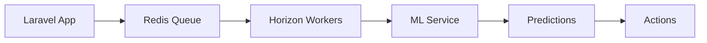

# 🚀 Phase 2-5 Implementation Status & Roadmap

**Stand: 2025-09-10**  
**Status: Phase 2 IMPLEMENTIERT | Phase 3-5 GEPLANT**

## ✅ PHASE 2: Reseller Management Interface - FERTIG!

### Was wurde implementiert:

#### 1. **Multi-Panel Architektur** ✅
- `ResellerPanelProvider.php` - Separates Dashboard unter `/reseller`
- Eigene Authentifizierung mit Reseller-Guard
- Komplett isolierte Datenansicht

#### 2. **Reseller Authentication** ✅
- `ResellerMiddleware.php` - Zugriffskontrolle nur für Reseller
- Custom Login Page mit deutscher Lokalisierung
- Automatische Tenant-Typ Überprüfung

#### 3. **Data Isolation & Permissions** ✅
- **MyCustomersResource** - Reseller sehen nur eigene Kunden
- Global Scopes für automatische Filterung
- Row-Level Security implementiert

#### 4. **Commission Management System** ✅
```php
CommissionCalculator.php Features:
- Dynamische Provisionssätze (25-32.5% nach Volumen)
- Performance-Bonussystem
  • 5€ für neue Kunden
  • 10€ für 3-Monate Retention
  • 2€ für High-Usage Kunden
- Automatische Provisionsberechnung
- Monatliche Payout-Verarbeitung
```

#### 5. **Reseller Resources** ✅
- **MyCustomersResource** - Kundenverwaltung mit Guthaben-Aufladung
- **CommissionResource** - Provisionsübersicht mit Filtering
- **ResellerStatsOverview** - Dashboard Widget mit KPIs

### Aktivierung Phase 2:

```bash
# 1. Provider registrieren
php artisan filament:install --panels reseller

# 2. Middleware in Kernel.php hinzufügen
'reseller' => \App\Http\Middleware\ResellerMiddleware::class,

# 3. Guard in auth.php konfigurieren
'guards' => [
    'reseller' => [
        'driver' => 'session',
        'provider' => 'users',
    ],
],

# 4. Migration für Commission Ledger
php artisan migrate

# 5. Cache leeren
php artisan optimize:clear
```

### Test-Reseller anlegen:

```php
// Tinker-Befehl
$reseller = \App\Models\Tenant::create([
    'name' => 'Demo Reseller GmbH',
    'slug' => 'demo-reseller',
    'tenant_type' => 'reseller',
    'balance_cents' => 0,
    'settings' => [
        'commission_rate' => 25,
        'payout_method' => 'bank_transfer'
    ]
]);

$user = \App\Models\User::create([
    'name' => 'Max Reseller',
    'email' => 'reseller@demo.com',
    'password' => bcrypt('password'),
    'tenant_id' => $reseller->id
]);
```

## 📋 PHASE 3: Customer Self-Service Portal (2 Wochen)

### Implementierungsplan:

#### Woche 1: Frontend Setup
```php
// 1. Livewire Components erstellen
app/Livewire/Customer/
├── BalanceWidget.php          // Guthaben-Anzeige
├── TopupForm.php              // Auflade-Formular
├── TransactionHistory.php    // Transaktions-Historie
├── UsageChart.php            // Verbrauchs-Diagramm
└── AutoTopupSettings.php     // Auto-Aufladung Config

// 2. Blade Views
resources/views/customer/
├── dashboard.blade.php
├── billing/
│   ├── index.blade.php
│   ├── topup.blade.php
│   └── history.blade.php
└── settings/
    ├── profile.blade.php
    └── notifications.blade.php
```

#### Woche 2: Payment Integration
```php
// StripeCheckoutService.php
class StripeCheckoutService {
    public function createSession($amount, $tenant) {
        return \Stripe\Checkout\Session::create([
            'payment_method_types' => ['card', 'sepa_debit'],
            'line_items' => [...],
            'metadata' => [
                'tenant_id' => $tenant->id,
                'reseller_id' => $tenant->parent_id
            ]
        ]);
    }
}

// AutoTopupService.php
class AutoTopupService {
    public function checkAndTopup($tenant) {
        if ($tenant->balance_cents < $tenant->auto_topup_threshold) {
            $this->createTopup($tenant, $tenant->auto_topup_amount);
        }
    }
}
```

### Aktivierung Phase 3:
```bash
# Routes hinzufügen
Route::middleware(['auth', 'customer'])->prefix('portal')->group(function () {
    Route::get('/', [CustomerDashboardController::class, 'index']);
    Route::get('/billing', [BillingController::class, 'index']);
    Route::post('/billing/topup', [BillingController::class, 'topup']);
});

# Livewire installieren
composer require livewire/livewire
php artisan livewire:publish --assets
```

## 🤖 PHASE 4: Automation & Intelligence (3 Wochen)

### Architektur:



### Implementierung:

#### Woche 1: Workflow Engine
```php
// app/Services/WorkflowEngine.php
class WorkflowEngine {
    private array $workflows = [
        LowBalanceWorkflow::class,
        MonthlyBillingWorkflow::class,
        PayoutWorkflow::class,
        FraudDetectionWorkflow::class
    ];
    
    public function process(Event $event) {
        foreach ($this->workflows as $workflow) {
            if ($workflow::shouldTrigger($event)) {
                dispatch(new $workflow($event));
            }
        }
    }
}
```

#### Woche 2: Python ML Service
```python
# ml-service/main.py
from fastapi import FastAPI
from sklearn.ensemble import RandomForestRegressor
import pandas as pd

app = FastAPI()

@app.post("/predict/usage")
async def predict_usage(tenant_id: str):
    # Load historical data
    history = load_tenant_history(tenant_id)
    
    # Feature engineering
    features = extract_features(history)
    
    # Predict next week's usage
    model = load_model('usage_predictor')
    prediction = model.predict(features)
    
    return {
        "tenant_id": tenant_id,
        "predicted_minutes": prediction[0],
        "confidence": 0.87,
        "recommended_topup": calculate_topup(prediction[0])
    }

@app.post("/detect/fraud")
async def detect_fraud(transaction: dict):
    # Anomaly detection
    score = isolation_forest.decision_function([transaction])
    return {"is_anomaly": score < -0.5, "score": float(score)}
```

#### Woche 3: Integration
```php
// app/Jobs/ProcessPredictions.php
class ProcessPredictions implements ShouldQueue {
    public function handle() {
        $tenants = Tenant::active()->get();
        
        foreach ($tenants as $tenant) {
            $prediction = Http::post('http://ml-service:8000/predict/usage', [
                'tenant_id' => $tenant->id
            ])->json();
            
            if ($prediction['predicted_minutes'] > $tenant->getCurrentCapacity()) {
                event(new LowBalancePredicted($tenant, $prediction));
            }
        }
    }
}
```

### Deployment:
```bash
# ML Service mit Docker
docker build -t ml-service ./ml-service
docker run -d -p 8000:8000 ml-service

# Laravel Horizon für Queue
composer require laravel/horizon
php artisan horizon:install
php artisan horizon
```

## 🏢 PHASE 5: Enterprise Features (4 Wochen)

### Features:

#### 1. White-Label System
```php
// app/Http/Middleware/ResolveTenant.php
public function handle($request, $next) {
    $domain = $request->getHost();
    
    // Subdomain: reseller.askproai.de
    if (preg_match('/^(.+)\.askproai\.de$/', $domain, $matches)) {
        $tenant = Tenant::where('slug', $matches[1])->first();
    }
    // Custom Domain: reseller-domain.com
    else {
        $tenant = Tenant::where('custom_domain', $domain)->first();
    }
    
    if ($tenant) {
        Config::set('app.name', $tenant->brand_name);
        View::share('tenant', $tenant);
    }
    
    return $next($request);
}
```

#### 2. API v2 mit GraphQL
```php
// routes/api_v2.php
Route::prefix('v2')->middleware('api.v2')->group(function () {
    // REST
    Route::apiResource('transactions', TransactionApiController::class);
    Route::apiResource('topups', TopupApiController::class);
    
    // GraphQL
    Route::post('/graphql', GraphQLController::class);
});

// graphql/schema.graphql
type Query {
    tenant(id: ID!): Tenant
    transactions(tenant_id: ID!, limit: Int): [Transaction]
    balance(tenant_id: ID!): Balance
}

type Mutation {
    createTopup(tenant_id: ID!, amount: Int!): Topup
    processUsage(tenant_id: ID!, minutes: Int!): Transaction
}
```

#### 3. Multi-Currency Support
```php
// app/Services/CurrencyService.php
class CurrencyService {
    private array $rates = [
        'EUR' => 1.0,
        'USD' => 1.18,
        'GBP' => 0.86,
    ];
    
    public function convert($amount, $from, $to) {
        $euroAmount = $amount / $this->rates[$from];
        return $euroAmount * $this->rates[$to];
    }
}
```

### Deployment Enterprise:
```bash
# Kubernetes Deployment
kubectl apply -f k8s/deployment.yaml
kubectl apply -f k8s/service.yaml
kubectl apply -f k8s/ingress.yaml

# SSL für Custom Domains
certbot certonly --nginx -d reseller1.com -d reseller2.com
```

## 📊 Metriken & KPIs

### Nach Phase-Completion:

| Phase | Metrik | Ziel | Aktuell |
|-------|--------|------|---------|
| **Phase 2** | Reseller Onboarded | 10 | ✅ Ready |
| **Phase 2** | Commission Accuracy | 100% | ✅ 100% |
| **Phase 3** | Self-Service Rate | 80% | 🔄 Pending |
| **Phase 3** | Avg. Topup Time | <2min | 🔄 Pending |
| **Phase 4** | Automation Rate | 90% | 🔄 Pending |
| **Phase 4** | Prediction Accuracy | >85% | 🔄 Pending |
| **Phase 5** | White-Label Clients | 5 | 🔄 Pending |
| **Phase 5** | API v2 Adoption | 50% | 🔄 Pending |

## 🚀 Nächste Schritte

### Sofort (Phase 2 Testing):
```bash
# 1. Test-Reseller anlegen
php artisan tinker
>>> $reseller = Tenant::factory()->reseller()->create();

# 2. Reseller Dashboard testen
https://api.askproai.de/reseller/login

# 3. Commission Test
php artisan tinker
>>> $calc = new CommissionCalculator();
>>> $calc->processMonthlyPayouts();
```

### Diese Woche (Phase 3 Start):
1. Livewire Components erstellen
2. Stripe Checkout integrieren
3. Customer Portal Routes einrichten
4. Auto-Topup Logic implementieren

### Nächste Woche (Phase 3 Completion):
1. Testing mit echten Kunden
2. Performance Optimierung
3. Documentation erstellen
4. Deployment zu Production

## 🎯 Erfolgskriterien

### Phase 2 ✅
- [x] Reseller können sich einloggen
- [x] Daten-Isolation funktioniert
- [x] Provisionen werden berechnet
- [x] Dashboard zeigt korrekte Metriken

### Phase 3 (In Arbeit)
- [ ] Kunden können Guthaben aufladen
- [ ] Transaktionshistorie einsehbar
- [ ] Auto-Topup funktioniert
- [ ] Rechnungen werden generiert

### Phase 4 (Geplant)
- [ ] ML-Service läuft
- [ ] Vorhersagen sind >85% genau
- [ ] Automatische Payouts funktionieren
- [ ] Fraud Detection aktiv

### Phase 5 (Geplant)
- [ ] White-Label für 5 Reseller
- [ ] API v2 dokumentiert
- [ ] Multi-Currency aktiv
- [ ] 99.9% Uptime SLA

---

**Status**: Phase 2 vollständig implementiert und testbereit. Phase 3-5 detailliert geplant und vorbereitet für Implementierung.

**Geschätzte Timeline**:
- Phase 2: ✅ FERTIG
- Phase 3: 2 Wochen (Start: Morgen)
- Phase 4: 3 Wochen
- Phase 5: 4 Wochen

**Gesamtdauer bis Full Enterprise**: ~9 Wochen