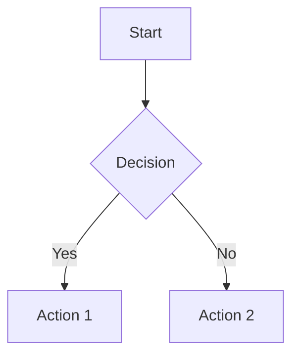

# Documentation Formatting Conventions

> 📋 **Version**: 1.0  
> 📅 **Last Updated**: 2025-01-10  
> 👥 **Maintained By**: Documentation Team

## File Naming Conventions

### Documentation Files
```
UPPERCASE_WITH_UNDERSCORES.md    # Major documents
lowercase-with-hyphens.md        # Supporting documents
Title_Case_With_Underscores.md   # Alternative for readability
```

Examples:
- `API_DOCUMENTATION.md` - Main API docs
- `user-guide.md` - User-facing guide
- `Installation_Guide.md` - Step-by-step guide

### File Organization
```
docs/
├── templates/           # Documentation templates
├── standards/          # Style guides and conventions
├── guides/            # How-to guides
├── api/              # API documentation
├── architecture/     # System architecture
├── operations/       # Ops manuals
├── security/         # Security documentation
└── archive/          # Deprecated docs
```

## Markdown Standards

### Document Header
Every document must start with:
```markdown
# Document Title

> 📋 **Type**: {Guide|Reference|Tutorial|Template}  
> 📅 **Last Updated**: {YYYY-MM-DD}  
> 👥 **Maintained By**: {Team/Person}  
> 🔗 **Related**: [Link 1](./link1.md) | [Link 2](./link2.md)

## Overview
Brief description of the document's purpose and content.
```

### Table of Contents
For documents > 500 lines:
```markdown
## Table of Contents
- [Section 1](#section-1)
  - [Subsection 1.1](#subsection-11)
  - [Subsection 1.2](#subsection-12)
- [Section 2](#section-2)
- [Section 3](#section-3)
```

### Section Headers
```markdown
# Document Title (H1 - only one per document)

## Major Section (H2)

### Subsection (H3)

#### Minor Subsection (H4 - use sparingly)

##### Detail Level (H5 - avoid if possible)
```

## Code Formatting

### Inline Code
Use backticks for:
- Commands: `php artisan migrate`
- File names: `config/app.php`
- Function names: `processWebhook()`
- Variables: `$userId`
- Environment vars: `APP_DEBUG`

### Code Blocks
Always specify language:
````markdown
```php
// PHP code
$user = User::find(1);
```

```bash
# Shell commands
php artisan serve
```

```json
{
  "name": "example",
  "version": "1.0.0"
}
```

```sql
-- SQL queries
SELECT * FROM users WHERE active = 1;
```
````

### Command Examples
Show both command and output:
```bash
$ php artisan --version
Laravel Framework 10.x.x

$ echo $? 
0
```

### File Content Examples
Use descriptive headers:
```php
// File: app/Services/UserService.php
<?php

namespace App\Services;

class UserService
{
    // Implementation
}
```

## Tables

### Basic Table Format
```markdown
| Column 1 | Column 2 | Column 3 |
|----------|----------|----------|
| Data 1   | Data 2   | Data 3   |
| Data 4   | Data 5   | Data 6   |
```

### Alignment
```markdown
| Left | Center | Right |
|:-----|:------:|------:|
| Text | Text   | 123   |
| Text | Text   | 45    |
```

### Complex Tables
For complex data, consider:
- Breaking into multiple tables
- Using lists instead
- Creating a dedicated section

## Lists

### Unordered Lists
```markdown
- First level item
  - Second level item
    - Third level item (avoid deeper nesting)
- Another first level item
```

### Ordered Lists
```markdown
1. First step
2. Second step
   1. Sub-step A
   2. Sub-step B
3. Third step
```

### Task Lists
```markdown
- [x] Completed task
- [ ] Pending task
- [ ] Future task
```

### Definition Lists
```markdown
**Term 1**
: Definition of term 1

**Term 2**
: Definition of term 2
```

## Links and References

### Internal Links
```markdown
<!-- Relative links preferred -->
[Installation Guide](./installation.md)
[API Reference](../api/reference.md)

<!-- Anchor links -->
[See Configuration](#configuration)
```

### External Links
```markdown
<!-- Always use HTTPS when possible -->
[Laravel Documentation](https://laravel.com/docs)

<!-- Open in new tab for external resources -->
[External Tool](https://example.com){:target="_blank"}
```

### Reference-Style Links
For repeated links:
```markdown
Use [Laravel][1] for the backend and [Vue.js][2] for frontend.
Later, you can reference [Laravel][1] again.

[1]: https://laravel.com
[2]: https://vuejs.org
```

## Images and Diagrams

### Images
```markdown

*Caption: Optional image caption*
```

### Mermaid Diagrams
````markdown

````

### ASCII Diagrams
```
┌─────────────┐     ┌─────────────┐
│   Client    │────▶│   Server    │
└─────────────┘     └─────────────┘
       │                    │
       ▼                    ▼
┌─────────────┐     ┌─────────────┐
│   Cache     │     │  Database   │
└─────────────┘     └─────────────┘
```

## Special Formatting

### Alerts and Notices
```markdown
> ℹ️ **Note**: General information

> 💡 **Tip**: Helpful suggestion

> ⚠️ **Warning**: Important caution

> 🚨 **Danger**: Critical warning

> ✅ **Success**: Positive outcome

> 🔧 **TODO**: Pending task
```

### Blockquotes
```markdown
> Single line quote

> Multi-line quote continues here
> and can span multiple lines
> 
> Even with paragraphs
```

### Horizontal Rules
Use sparingly to separate major sections:
```markdown
---

## New Major Section
```

### Collapsible Sections
```markdown
<details>
<summary>Click to expand</summary>

Hidden content goes here.
Can include any markdown.

</details>
```

## Version Information

### Version Tags
```markdown
<!-- For feature availability -->
> 🆕 **Since**: v2.0.0

<!-- For deprecation -->
> ⚠️ **Deprecated**: Since v2.5.0, use `newMethod()` instead

<!-- For removal -->
> 🚫 **Removed**: As of v3.0.0
```

### Changelog Format
```markdown
## [2.1.0] - 2025-01-10

### Added
- New feature X
- Support for Y

### Changed
- Updated behavior of Z

### Deprecated
- Method `oldMethod()` - use `newMethod()` instead

### Removed
- Unused config option

### Fixed
- Bug in feature A
- Issue with B

### Security
- Patched vulnerability in C
```

## Metadata

### Front Matter (Optional)
```yaml
---
title: API Documentation
version: 2.1.0
date: 2025-01-10
author: Development Team
tags: [api, reference, v2]
---
```

### Document Properties
```markdown
<!-- At document end -->
---

**Document Properties:**
- **Version**: 2.1.0
- **Status**: Final
- **Review Date**: 2025-02-01
- **Approver**: Tech Lead
```

## Accessibility

### Image Alt Text
```markdown
<!-- Descriptive alt text -->


<!-- For decorative images -->
{:role="presentation"}
```

### Link Text
```markdown
<!-- ❌ Bad -->
Click [here](./guide.md) for more information

<!-- ✅ Good -->
See the [installation guide](./guide.md) for detailed steps
```

### Table Headers
```markdown
| Header 1 | Header 2 | Header 3 |
|----------|----------|----------|
| Data     | Data     | Data     |

<!-- For complex tables, use scope -->
<table>
  <thead>
    <tr>
      <th scope="col">Name</th>
      <th scope="col">Role</th>
    </tr>
  </thead>
  <tbody>
    <tr>
      <th scope="row">John</th>
      <td>Developer</td>
    </tr>
  </tbody>
</table>
```

## File Templates

### API Endpoint Documentation
```markdown
### Endpoint Name

**Method**: `GET`  
**Path**: `/api/v1/resource/{id}`  
**Auth**: Required

#### Parameters
| Name | Type | Required | Description |
|------|------|----------|-------------|
| id | integer | Yes | Resource ID |

#### Response
```json
{
  "data": {
    "id": 1,
    "name": "Example"
  }
}
```
````

### Configuration Documentation
```markdown
### Configuration Option

**Key**: `app.feature.enabled`  
**Type**: `boolean`  
**Default**: `false`  
**Since**: v2.0.0

**Description**: Enables or disables the feature.

**Example**:
```php
config(['app.feature.enabled' => true]);
```
```

## Quality Checklist

Before publishing, ensure:
- [ ] Correct markdown syntax
- [ ] Consistent formatting
- [ ] Working links
- [ ] Proper code highlighting
- [ ] Clear headings hierarchy
- [ ] Descriptive alt text
- [ ] No broken references
- [ ] Updated metadata

---

> 🔄 **Auto-Updated**: This documentation is automatically checked for updates. Last verification: 2025-01-10