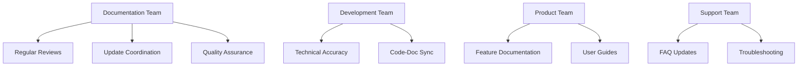
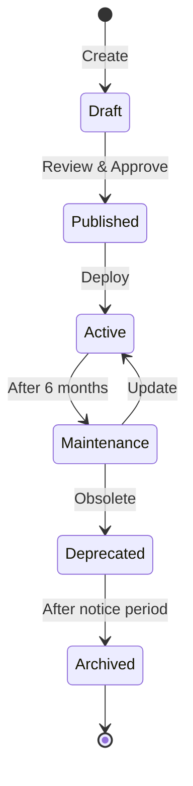

# Documentation Maintenance Guidelines

> 📋 **Version**: 1.0  
> 📅 **Last Updated**: 2025-01-10  
> 👥 **Maintained By**: Documentation Team  
> 🔄 **Review Cycle**: Monthly

## Maintenance Overview

### Maintenance Responsibilities


### Maintenance Schedule
| Task | Frequency | Owner | Duration |
|------|-----------|-------|----------|
| Link checking | Weekly | Automated | 30 min |
| Content review | Monthly | Doc team | 4 hours |
| Technical review | Quarterly | Dev team | 8 hours |
| Full audit | Annually | All teams | 2 days |

## When to Update Documentation

### Immediate Updates Required
1. **Security Issues**
   - Vulnerabilities discovered
   - Security best practices changes
   - Authentication/authorization changes

2. **Breaking Changes**
   - API modifications
   - Deprecated features
   - Configuration changes

3. **Critical Bugs**
   - Incorrect instructions
   - Dangerous examples
   - Data loss risks

### Planned Updates
1. **New Features**
   - Feature releases
   - API additions
   - New integrations

2. **Improvements**
   - User feedback
   - Clarity enhancements
   - Better examples

3. **Regular Maintenance**
   - Version updates
   - Link fixes
   - Typo corrections

## How to Keep Documentation Current

### Automated Monitoring
```yaml
# .github/workflows/doc-monitor.yml
name: Documentation Monitor

on:
  schedule:
    - cron: '0 9 * * MON' # Weekly on Mondays
  workflow_dispatch:

jobs:
  check-health:
    runs-on: ubuntu-latest
    steps:
      - uses: actions/checkout@v3
      
      - name: Check broken links
        run: |
          npx linkcheck docs/**/*.md
          
      - name: Check outdated content
        run: |
          ./scripts/check-outdated.sh
          
      - name: Validate code examples
        run: |
          ./scripts/validate-examples.sh
          
      - name: Generate report
        run: |
          ./scripts/generate-health-report.sh
          
      - name: Notify if issues
        if: failure()
        run: |
          ./scripts/notify-issues.sh
```

### Manual Reviews

#### Monthly Content Review
```markdown
## Monthly Review Checklist
- [ ] Review support tickets for doc issues
- [ ] Check analytics for popular pages
- [ ] Verify recent code changes
- [ ] Update version references
- [ ] Review user feedback
- [ ] Check competitor docs
- [ ] Update examples
- [ ] Refresh screenshots
```

#### Quarterly Technical Review
```markdown
## Technical Review Checklist
- [ ] Validate all API endpoints
- [ ] Test all code examples
- [ ] Verify configuration options
- [ ] Check security recommendations
- [ ] Update performance tips
- [ ] Review architecture diagrams
- [ ] Validate CLI commands
- [ ] Test installation steps
```

### Documentation Health Metrics

#### Key Performance Indicators
```yaml
metrics:
  # Content freshness
  content_age:
    target: < 6 months
    warning: > 9 months
    critical: > 12 months
    
  # Accuracy
  broken_links:
    target: 0
    warning: > 5
    critical: > 10
    
  # Completeness
  coverage:
    target: > 95%
    warning: < 90%
    critical: < 80%
    
  # User satisfaction
  helpfulness:
    target: > 4.0/5
    warning: < 3.5/5
    critical: < 3.0/5
```

#### Health Dashboard
```markdown
# Documentation Health Report - January 2025

## Overall Health: 🟢 Good (87%)

### Metrics
- **Content Age**: 🟢 4.2 months average
- **Broken Links**: 🟢 2 found
- **Code Examples**: 🟡 93% passing
- **Coverage**: 🟢 96%
- **User Rating**: 🟢 4.3/5

### Action Items
1. Fix 2 broken links
2. Update 3 failing examples
3. Review 5 pages > 9 months old
```

## Team Responsibilities

### Documentation Team
- Maintain documentation standards
- Coordinate updates across teams
- Perform regular audits
- Manage documentation tools
- Train contributors

### Development Team
- Update docs with code changes
- Review technical accuracy
- Provide code examples
- Document APIs
- Write migration guides

### Product Team
- Document new features
- Create user guides
- Provide use cases
- Update marketing docs
- Gather user feedback

### Support Team
- Update FAQs
- Document common issues
- Create troubleshooting guides
- Report documentation gaps
- Track user questions

## Maintenance Procedures

### Regular Tasks

#### Daily
```bash
# Check for urgent issues
./scripts/daily-doc-check.sh

# Monitor error reports
tail -f logs/doc-errors.log

# Review documentation mentions
gh issue list --label documentation
```

#### Weekly
```bash
# Full link check
npx linkcheck docs/**/*.md > reports/broken-links.txt

# Check for TODOs
grep -r "TODO\|FIXME" docs/ > reports/todos.txt

# Update statistics
./scripts/update-doc-stats.sh
```

#### Monthly
```bash
# Generate health report
./scripts/monthly-health-report.sh

# Archive old content
./scripts/archive-old-docs.sh

# Update team dashboard
./scripts/update-dashboard.sh
```

### Content Lifecycle

#### Creation → Active → Maintenance → Archive


### Update Coordination

#### Feature Release Process
1. **Pre-release** (2 weeks before)
   - Draft documentation
   - Technical review
   - Create examples

2. **Release Day**
   - Publish documentation
   - Update changelog
   - Notify users

3. **Post-release** (1 week after)
   - Gather feedback
   - Fix issues
   - Enhance content

#### Breaking Change Process
1. **Announcement** (4 weeks before)
   - Document changes
   - Create migration guide
   - Add deprecation notices

2. **Implementation**
   - Update all affected docs
   - Provide examples
   - Update tutorials

3. **Support Period**
   - Monitor issues
   - Update FAQs
   - Assist migration

## Quality Standards

### Documentation Quality Criteria
1. **Accuracy**: 100% technically correct
2. **Completeness**: All features documented
3. **Clarity**: Easy to understand
4. **Currency**: Up-to-date information
5. **Consistency**: Follows style guide
6. **Accessibility**: Works for all users

### Quality Assurance Process
```bash
# Automated quality checks
npm run docs:quality

# Manual quality review
- Technical accuracy review
- Editorial review
- User testing
- Accessibility audit
```

## Continuous Improvement

### Feedback Collection
```markdown
<!-- Feedback widget on each page -->
<div class="feedback-widget">
  Was this page helpful?
  <button onclick="sendFeedback('yes')">👍 Yes</button>
  <button onclick="sendFeedback('no')">👎 No</button>
</div>
```

### Analytics Tracking
- Page views
- Time on page
- Bounce rate
- Search queries
- 404 errors
- Feedback scores

### Improvement Process
1. **Collect Data**
   - User feedback
   - Analytics
   - Support tickets
   - Team input

2. **Analyze**
   - Identify patterns
   - Priority issues
   - Quick wins
   - Long-term improvements

3. **Implement**
   - Quick fixes immediately
   - Plan major updates
   - Test changes
   - Monitor impact

4. **Measure**
   - Track improvements
   - User satisfaction
   - Support ticket reduction
   - Team efficiency

## Tools and Automation

### Maintenance Tools
```yaml
tools:
  # Content Management
  cms: MkDocs / Docusaurus
  
  # Version Control
  vcs: Git / GitHub
  
  # Link Checking
  links: linkcheck / broken-link-checker
  
  # Spell Checking
  spell: cspell / aspell
  
  # Grammar
  grammar: vale / write-good
  
  # Screenshots
  screenshots: playwright / puppeteer
  
  # Diagrams
  diagrams: mermaid / draw.io
  
  # Analytics
  analytics: Google Analytics / Plausible
```

### Automation Scripts
```bash
# scripts/doc-maintenance.sh
#!/bin/bash

# Comprehensive maintenance script
echo "🔧 Running documentation maintenance..."

# Update timestamps
./update-timestamps.sh

# Check health
./check-health.sh

# Fix common issues
./fix-common-issues.sh

# Generate reports
./generate-reports.sh

# Notify team
./notify-status.sh

echo "✅ Maintenance complete"
```

## Emergency Procedures

### Documentation Emergencies
1. **Incorrect Security Information**
   - Immediate fix
   - Notify users
   - Audit related docs

2. **Data Loss Instructions**
   - Remove immediately
   - Post warning
   - Provide correct info

3. **Major Inaccuracy**
   - Quick fix
   - Review process
   - Prevent recurrence

### Rapid Response Team
- Technical Lead: 15-minute response
- Doc Team Lead: 30-minute response
- On-call Developer: 1-hour response

## Archive and Retention

### Retention Policy
| Content Type | Active Period | Archive Period | Total Retention |
|--------------|---------------|----------------|-----------------|
| Current docs | While relevant | - | Indefinite |
| Old versions | Until EOL | 2 years | 2 years after EOL |
| Drafts | 90 days | - | 90 days |
| Reviews | 1 year | 1 year | 2 years |

### Archive Process
```bash
# Archive old version
./scripts/archive-version.sh v1.0.0

# Creates:
# - /archive/v1.0.0/
# - Redirect rules
# - Archive notice
# - Search exclusions
```

---

> 🔄 **Auto-Updated**: This documentation is automatically checked for updates. Last verification: 2025-01-10