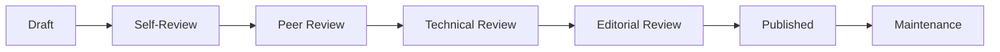

# Documentation Review Process

> 📋 **Version**: 1.0  
> 📅 **Last Updated**: 2025-01-10  
> 👥 **Maintained By**: Documentation Team  
> 🔄 **Review Cycle**: Continuous

## Review Overview

### Review Stages


### Review Types
| Type | Reviewer | Focus | Timeline |
|------|----------|-------|----------|
| Self | Author | Completeness | 30 min |
| Peer | Team member | Clarity | 1-2 hours |
| Technical | SME | Accuracy | 2-4 hours |
| Editorial | Editor | Style/Grammar | 1-2 hours |
| Final | Lead | Approval | 30 min |

## Self-Review Checklist

### Before Submitting
- [ ] **Content Complete**: All sections filled
- [ ] **Examples Work**: Code tested
- [ ] **Links Valid**: All links checked
- [ ] **Formatting Consistent**: Style guide followed
- [ ] **Spelling/Grammar**: Spell check run
- [ ] **Metadata Updated**: Version, date, author
- [ ] **Images Optimized**: Compressed, alt text
- [ ] **TOC Accurate**: Matches headings

### Self-Review Tools
```bash
# Automated checks
npm run docs:lint          # Markdown linting
npm run docs:spell         # Spell check
npm run docs:links         # Link validation
npm run docs:format        # Format check

# Manual verification
./scripts/validate-examples.sh  # Test code examples
```

## Peer Review Process

### Peer Review Focus
1. **Clarity**: Is it easy to understand?
2. **Completeness**: Is anything missing?
3. **Flow**: Does it follow logical order?
4. **Consistency**: Does it match our style?
5. **Usefulness**: Does it solve user problems?

### Peer Review Template
```markdown
## Peer Review Feedback

**Reviewer**: @username
**Date**: 2025-01-10
**Time Spent**: 45 minutes

### Strengths
- Clear explanation of concepts
- Good use of examples
- Well-structured content

### Areas for Improvement
- [ ] Add diagram for architecture section
- [ ] Clarify step 3 in installation
- [ ] Fix typo on line 145

### Questions
1. Should we include troubleshooting for X?
2. Is the API example using latest version?

### Overall Assessment
- [ ] Approved
- [x] Needs revision
- [ ] Major rework needed
```

## Technical Review

### Technical Review Criteria
- **Accuracy**: All information correct
- **Currency**: Using latest versions
- **Security**: No security vulnerabilities
- **Performance**: Efficient examples
- **Best Practices**: Following standards

### Technical Review Checklist
```markdown
## Technical Accuracy
- [ ] API endpoints correct
- [ ] Code examples run without errors
- [ ] Configuration values accurate
- [ ] Version numbers current
- [ ] Dependencies listed correctly

## Security Review
- [ ] No hardcoded credentials
- [ ] Secure coding practices shown
- [ ] Sensitive data handled properly
- [ ] Security warnings included

## Performance
- [ ] Efficient algorithms used
- [ ] Scalability considered
- [ ] Resource usage noted
- [ ] Optimization tips included
```

### Code Review Standards
```php
// ❌ Bad: Insecure example
$user = DB::select("SELECT * FROM users WHERE id = " . $_GET['id']);

// ✅ Good: Secure example with explanation
// Use parameterized queries to prevent SQL injection
$user = DB::select("SELECT * FROM users WHERE id = ?", [$request->input('id')]);
```

## Editorial Review

### Editorial Standards
- **Voice**: Consistent tone
- **Grammar**: Proper English/German
- **Formatting**: Follows conventions
- **Readability**: Appropriate level

### Editorial Checklist
```markdown
## Language & Style
- [ ] Active voice used
- [ ] Present tense maintained
- [ ] Jargon minimized/explained
- [ ] Sentences under 25 words
- [ ] Paragraphs under 5 sentences

## Formatting
- [ ] Headers properly nested
- [ ] Lists formatted correctly
- [ ] Code blocks highlighted
- [ ] Links descriptive
- [ ] Images captioned

## Consistency
- [ ] Terminology consistent
- [ ] Style guide followed
- [ ] Voice maintained
- [ ] Examples similar format
```

## Review Workflow

### Pull Request Process
1. **Create PR**
   ```bash
   git checkout -b docs/update-api-guide
   # Make changes
   git commit -m "docs(api): update authentication section"
   git push origin docs/update-api-guide
   ```

2. **Open PR with Template**
   ```markdown
   ## Documentation Update
   
   ### Changes
   - Updated authentication flow
   - Added OAuth2 examples
   - Fixed broken links
   
   ### Checklist
   - [x] Self-review completed
   - [x] Tests pass
   - [x] Links verified
   - [ ] Peer review
   - [ ] Technical review
   ```

3. **Assign Reviewers**
   - Peer reviewer (any team member)
   - Technical reviewer (SME)
   - Optional: Editorial reviewer

### Review Comments

#### Effective Comments
```markdown
# Specific and actionable
Line 45: "The API key should be stored in `.env` file, not hardcoded"

# Suggest improvements
Consider adding a diagram here to illustrate the flow

# Provide examples
This could be clearer. For example:
"Configure the webhook URL in your dashboard settings"
```

#### Comment Labels
- 🔴 **[BLOCKING]**: Must fix before merge
- 🟡 **[SUGGESTION]**: Consider changing
- 🟢 **[NITPICK]**: Minor issue
- ❓ **[QUESTION]**: Needs clarification
- 💡 **[IDEA]**: Future improvement

## Review Timeline

### SLA by Priority
| Priority | Initial Review | Full Review | Resolution |
|----------|----------------|-------------|------------|
| Critical | 2 hours | 4 hours | Same day |
| High | 4 hours | 1 day | 2 days |
| Normal | 1 day | 2 days | 3 days |
| Low | 2 days | 3 days | 1 week |

### Review Tracking
```yaml
# Review status in PR
status:
  self_review: ✅ complete
  peer_review: 🔄 in progress
  technical_review: ⏳ pending
  editorial_review: ⏳ pending
  approved: ❌ not yet
```

## Quality Gates

### Automated Checks
```yaml
# .github/workflows/docs-review.yml
name: Documentation Review

on:
  pull_request:
    paths:
      - 'docs/**'

jobs:
  quality-checks:
    runs-on: ubuntu-latest
    steps:
      - name: Markdown Lint
        run: markdownlint docs/**/*.md
        
      - name: Spell Check
        run: cspell docs/**/*.md
        
      - name: Link Check
        run: linkcheck docs/**/*.md
        
      - name: Example Validation
        run: ./scripts/validate-examples.sh
```

### Manual Gates
1. **Peer Approval**: At least 1 approval
2. **Technical Sign-off**: For technical content
3. **Editorial Check**: For user-facing docs
4. **Final Approval**: Documentation lead

## Review Metrics

### Performance Metrics
```markdown
## Monthly Review Stats
- Average review time: 2.5 days
- First-time approval rate: 75%
- Average revisions: 1.5
- Reviewer satisfaction: 4.2/5
```

### Quality Metrics
```markdown
## Documentation Quality Score
- Accuracy: 95%
- Completeness: 90%
- Clarity: 88%
- Consistency: 92%
- Timeliness: 85%
```

## Continuous Improvement

### Feedback Collection
```markdown
## Post-Review Survey
1. Was the review helpful? (1-5)
2. Was feedback clear? (1-5)
3. Was timeline reasonable? (Y/N)
4. Suggestions for improvement:
```

### Process Updates
- Monthly review retrospectives
- Quarterly process updates
- Annual tool evaluation
- Continuous training

### Review Training
1. **New Reviewers**
   - Shadow experienced reviewer
   - Review guidelines walkthrough
   - Practice reviews

2. **Ongoing Training**
   - Monthly best practices
   - Tool updates
   - Style guide changes

## Special Cases

### Emergency Updates
```markdown
## Fast-Track Review
For critical fixes:
1. Mark PR as [URGENT]
2. Single technical review required
3. Post-publish full review
4. Document in changelog
```

### Large Documents
```markdown
## Phased Review
For documents > 50 pages:
1. Review in sections
2. Multiple reviewers assigned
3. Longer timeline allowed
4. Progressive publishing
```

### Translations
```markdown
## Translation Review
1. Technical review (same as English)
2. Native speaker review
3. Terminology consistency check
4. Format preservation verify
```

## Tools and Resources

### Review Tools
- **GitHub PR Reviews**: Primary platform
- **Grammarly**: Grammar checking
- **Hemingway**: Readability
- **draw.io**: Diagram reviews
- **Loom**: Video feedback

### Review Resources
- [Writing Style Guide](./WRITING_STYLE_GUIDE.md)
- [Formatting Conventions](./FORMATTING_CONVENTIONS.md)
- [Common Issues](./COMMON_REVIEW_ISSUES.md)
- [Best Practices](./REVIEW_BEST_PRACTICES.md)

---

> 🔄 **Auto-Updated**: This documentation is automatically checked for updates. Last verification: 2025-01-10