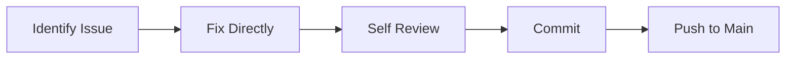
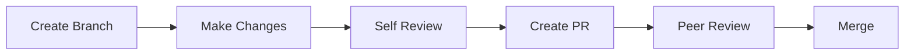
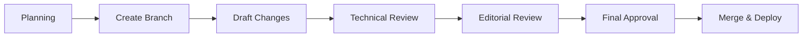

# Documentation Update Procedures

> 📋 **Version**: 1.0  
> 📅 **Last Updated**: 2025-01-10  
> 👥 **Maintained By**: Documentation Team  
> 🔄 **Review Cycle**: Continuous

## Update Triggers

### Automatic Updates Required
1. **Code Changes**
   - New features added
   - API changes
   - Configuration changes
   - Breaking changes

2. **Bug Fixes**
   - Incorrect documentation
   - Misleading information
   - Security issues

3. **User Feedback**
   - Confusion reports
   - Missing information
   - Enhancement requests

4. **Scheduled Reviews**
   - Quarterly accuracy check
   - Annual comprehensive review
   - Version release updates

## Update Process

### 1. Identify Updates Needed
```bash
# Check for code changes affecting docs
git diff --name-only main...develop | grep -E "(Service|Controller|Config)"

# Find TODOs in documentation
grep -r "TODO\|FIXME\|UPDATE" docs/

# Check issue tracker
gh issue list --label documentation
```

### 2. Prioritize Updates
| Priority | Criteria | Timeline |
|----------|----------|----------|
| P1 - Critical | Security, breaking changes | Immediate |
| P2 - High | Wrong information, new features | 24 hours |
| P3 - Normal | Improvements, clarifications | 1 week |
| P4 - Low | Typos, formatting | Next release |

### 3. Create Update Task
```markdown
## Documentation Update Request

**Type**: [Bug Fix | New Feature | Improvement | Security]
**Priority**: [P1 | P2 | P3 | P4]
**Component**: [API | Guide | Tutorial | Reference]

### Description
What needs updating and why

### Affected Documents
- [ ] `/docs/api/authentication.md`
- [ ] `/docs/guides/getting-started.md`

### Related Changes
- PR: #123
- Issue: #456
- Commit: abc123
```

## Update Workflows

### Minor Updates (Typos, Formatting)


### Content Updates (Add/Modify Sections)


### Major Updates (Restructure, New Docs)


## Version Synchronization

### Keep Docs in Sync with Code
```yaml
# .github/workflows/doc-sync.yml
name: Documentation Sync Check

on:
  pull_request:
    paths:
      - 'app/**'
      - 'config/**'
      - 'routes/**'

jobs:
  check-docs:
    runs-on: ubuntu-latest
    steps:
      - name: Check for documentation updates
        run: |
          if ! git diff --name-only origin/main..HEAD | grep -q "^docs/"; then
            echo "::warning::Code changes detected but no documentation updates"
          fi
```

### Version Matching
```markdown
<!-- In documentation -->
> ⚠️ **Version Note**: This documentation applies to v2.1.0 and later

<!-- For version-specific content -->
::: version-2.0
Old behavior description
:::

::: version-2.1
New behavior description
:::
```

## Content Maintenance

### Regular Reviews
```markdown
## Quarterly Review Checklist
- [ ] Verify all code examples still work
- [ ] Check all external links
- [ ] Update version numbers
- [ ] Review user feedback
- [ ] Check analytics for popular pages
- [ ] Update screenshots if UI changed
- [ ] Verify API endpoints
- [ ] Test installation instructions
```

### Automated Checks
```bash
#!/bin/bash
# scripts/doc-health-check.sh

echo "🔍 Checking documentation health..."

# Check for broken links
echo "Checking links..."
npx linkcheck docs/**/*.md

# Check for outdated code examples
echo "Validating code examples..."
./scripts/validate-examples.sh

# Check for old version references
echo "Checking version references..."
grep -r "v1\." docs/ | grep -v archive

# Check image references
echo "Checking images..."
./scripts/check-images.sh
```

### Update Tracking
```markdown
<!-- At the top of each document -->
---
last_reviewed: 2025-01-10
last_updated: 2025-01-10
next_review: 2025-04-10
reviewers: [@username1, @username2]
---
```

## Bulk Updates

### Find and Replace
```bash
# Update version numbers
find docs -name "*.md" -exec sed -i 's/v2.0.0/v2.1.0/g' {} +

# Update deprecated terms
find docs -name "*.md" -exec sed -i 's/oldterm/newterm/g' {} +

# Update API endpoints
find docs -name "*.md" -exec sed -i 's|/api/v1/|/api/v2/|g' {} +
```

### Batch Processing
```python
#!/usr/bin/env python3
# scripts/bulk-update-docs.py

import os
import re
from datetime import datetime

def update_metadata(filepath):
    with open(filepath, 'r+') as f:
        content = f.read()
        # Update last_updated date
        content = re.sub(
            r'📅 \*\*Last Updated\*\*: \d{4}-\d{2}-\d{2}',
            f'📅 **Last Updated**: {datetime.now().strftime("%Y-%m-%d")}',
            content
        )
        f.seek(0)
        f.write(content)
        f.truncate()

# Process all markdown files
for root, dirs, files in os.walk('docs'):
    for file in files:
        if file.endswith('.md'):
            update_metadata(os.path.join(root, file))
```

## Change Documentation

### Document What Changed
```markdown
# CHANGELOG.md

## [2.1.0] - 2025-01-10

### Documentation Updates
- **API Reference**: Updated authentication flow for OAuth2
- **User Guide**: Added troubleshooting section
- **Installation**: Clarified system requirements
- **Examples**: Updated to use latest SDK version

### Why These Changes
- OAuth2 support added in v2.1.0
- User feedback requested better troubleshooting
- New minimum PHP version requirement
- SDK breaking changes in v3.0
```

### Migration Guides
```markdown
# Migrating Documentation from v2.0 to v2.1

## What Changed
1. API endpoints moved from `/api/v1` to `/api/v2`
2. Authentication now uses Bearer tokens
3. Response format changed to JSON:API

## Update Instructions
1. Search and replace API endpoints
2. Update authentication examples
3. Modify response parsing code
```

## Notification System

### Update Notifications
```yaml
# Notify stakeholders of changes
notifications:
  major_updates:
    - email: dev-team@askproai.de
    - slack: #documentation
    - webhook: https://api.askproai.de/webhooks/docs
  
  minor_updates:
    - slack: #documentation
```

### User Communication
```markdown
<!-- In-document notices -->
> 📢 **Update Notice**: This page was updated on 2025-01-10 to reflect changes in v2.1.0. 
> See [what changed](#changelog).

<!-- Banner for major changes -->
<div class="update-banner">
  ⚠️ <strong>Important Update</strong>: The authentication method has changed. 
  <a href="/docs/migration/auth-v2">Learn more</a>
</div>
```

## Archive Management

### When to Archive
- Documentation for EOL versions
- Deprecated features
- Obsolete guides
- Old announcements

### Archive Process
```bash
# Create archive directory structure
mkdir -p docs/archive/v1.0/{api,guides,tutorials}

# Move old documentation
mv docs/api/v1/*.md docs/archive/v1.0/api/

# Add deprecation notice
cat > docs/archive/v1.0/README.md << EOF
# Archived Documentation - v1.0

This documentation is for v1.0 which reached end-of-life on 2024-12-31.

For current documentation, see [latest version](/docs).
EOF

# Update redirects
echo "/docs/api/v1/* /docs/archive/v1.0/api/:splat 301" >> _redirects
```

## Quality Assurance

### Pre-Update Checklist
- [ ] Backup current version
- [ ] Test all examples
- [ ] Verify links
- [ ] Check formatting
- [ ] Review changes

### Post-Update Checklist
- [ ] Verify deployment
- [ ] Test documentation site
- [ ] Check search index
- [ ] Monitor 404s
- [ ] Gather feedback

### Update Metrics
```markdown
## Documentation Health Dashboard
- Pages updated this month: 45
- Average age of content: 3.2 months
- Broken links found: 2
- User feedback addressed: 12/15
- Code examples tested: 100%
```

## Emergency Updates

### Security Updates
```bash
# Immediate security documentation update
git checkout -b security/urgent-fix

# Make changes
vim docs/security/vulnerability-xyz.md

# Fast-track merge
git add -A
git commit -m "docs(security): urgent fix for XYZ vulnerability"
git push origin security/urgent-fix

# Create PR with [SECURITY] tag
gh pr create --title "[SECURITY] Document XYZ vulnerability fix" --body "Urgent security update"
```

### Hotfix Process
1. Create hotfix branch
2. Apply minimal changes
3. Single reviewer approval
4. Immediate deployment
5. Full review later

## Automation Tools

### Update Scripts
```bash
# scripts/update-docs.sh
#!/bin/bash

# Update timestamp
./scripts/update-timestamps.sh

# Validate structure
./scripts/validate-structure.sh

# Check for TODOs
./scripts/find-todos.sh

# Generate reports
./scripts/generate-update-report.sh
```

### CI/CD Integration
```yaml
# Auto-update on merge
on:
  push:
    branches: [main]
    paths:
      - 'app/**'
      - 'config/**'

jobs:
  update-docs:
    runs-on: ubuntu-latest
    steps:
      - name: Check for required updates
        run: ./scripts/check-required-updates.sh
      
      - name: Create update PR if needed
        run: ./scripts/create-update-pr.sh
```

---

> 🔄 **Auto-Updated**: This documentation is automatically checked for updates. Last verification: 2025-01-10