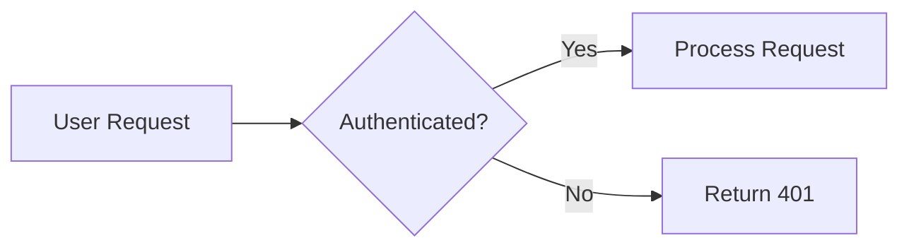

# AskProAI Documentation Writing Style Guide

> 📋 **Version**: 1.0  
> 📅 **Last Updated**: 2025-01-10  
> 👥 **Maintained By**: Documentation Team

## Purpose
This guide ensures consistency, clarity, and professionalism across all AskProAI documentation.

## Voice and Tone

### Voice Characteristics
- **Professional**: Authoritative but approachable
- **Clear**: Simple language, avoid jargon
- **Helpful**: Focus on solving problems
- **Inclusive**: Welcome all skill levels

### Tone Guidelines
- **Technical Docs**: Direct, precise, factual
- **User Guides**: Friendly, encouraging, patient
- **API Docs**: Concise, example-rich
- **Troubleshooting**: Calm, solution-focused

## Writing Principles

### 1. Clarity First
```markdown
❌ Bad: "The system will instantiate the requisite components"
✅ Good: "The system creates the required components"
```

### 2. Active Voice
```markdown
❌ Bad: "The API key should be configured by the user"
✅ Good: "Configure your API key"
```

### 3. Present Tense
```markdown
❌ Bad: "This will send a request to the server"
✅ Good: "This sends a request to the server"
```

### 4. Direct Instructions
```markdown
❌ Bad: "You might want to consider clearing the cache"
✅ Good: "Clear the cache"
```

## Structure Guidelines

### Document Structure
1. **Title**: Clear, descriptive, action-oriented
2. **Metadata**: Version, date, maintainer
3. **Overview**: What and why (2-3 sentences)
4. **Prerequisites**: What's needed before starting
5. **Content**: Logical flow, step-by-step
6. **Examples**: Real-world scenarios
7. **Troubleshooting**: Common issues
8. **Next Steps**: Where to go next

### Headings
- **H1**: Document title only
- **H2**: Major sections
- **H3**: Subsections
- **H4**: Rarely used, only for deep nesting

Example:
```markdown
# Installation Guide

## Prerequisites

### System Requirements

### Required Permissions

## Installation Steps

### Step 1: Download

### Step 2: Configure
```

## Language Guidelines

### Word Choice
| Avoid | Use Instead | Why |
|-------|-------------|-----|
| utilize | use | Simpler |
| commence | start | Clearer |
| terminate | end, stop | Less technical |
| prior to | before | More direct |
| in order to | to | Concise |

### Technical Terms
- Define on first use
- Provide glossary for complex docs
- Link to detailed explanations
- Use consistent terminology

Example:
```markdown
The API uses **JWT** (JSON Web Tokens) for authentication. 
JWTs are self-contained tokens that securely transmit information.
```

### Lists
Use lists to improve readability:

**Bulleted lists** for:
- Non-sequential items
- Features or benefits
- Options or alternatives

**Numbered lists** for:
1. Sequential steps
2. Prioritized items
3. Procedures

**Checklists** for:
- [ ] Prerequisites
- [ ] Validation steps
- [ ] Task lists

## Code Examples

### Code Block Guidelines
- Always specify language
- Include comments for clarity
- Show both input and output
- Provide complete, runnable examples

```php
// ✅ Good example
// Connect to the database and fetch user
$user = User::where('email', 'user@example.com')
    ->firstOrFail();

echo $user->name; // Output: John Doe
```

### Command Line Examples
```bash
# Show command with explanation
$ php artisan migrate --force
# Output:
# Migrating: 2025_01_10_000000_create_users_table
# Migrated:  2025_01_10_000000_create_users_table (0.05 seconds)
```

## Visual Elements

### Screenshots
- Use for UI elements
- Annotate with arrows/boxes
- Update with UI changes
- Provide alt text

### Diagrams
- Use Mermaid for flow charts
- Keep simple and focused
- Include legend if needed
- Explain complex diagrams



### Tables
Use tables for:
- Comparing options
- Listing parameters
- Showing configurations

| Type | When to Use | Example |
|------|-------------|---------|
| Info | General information | System requirements |
| Warning | Potential issues | Data loss risk |
| Error | Problems | Failed validation |

## Special Elements

### Admonitions

```markdown
> ℹ️ **Note**: Additional information

> 💡 **Tip**: Helpful suggestion

> ⚠️ **Warning**: Important caution

> 🚨 **Danger**: Critical warning

> ✅ **Success**: Positive outcome
```

### Cross-References
```markdown
For more information, see:
- [Installation Guide](./installation.md)
- [API Reference](./api-reference.md)
- [External Resource](https://example.com)
```

## Formatting Conventions

### Text Formatting
- **Bold**: UI elements, important terms
- *Italic*: Emphasis, first use of terms
- `Code`: Inline code, commands, filenames
- ~~Strikethrough~~: Deprecated features

### File Paths
- Unix-style forward slashes
- Relative to project root
- Use code formatting

```markdown
Edit the configuration file at `config/services.php`
```

### API Endpoints
```markdown
**GET** `/api/v1/users/{id}`
```

### Environment Variables
```markdown
Set `API_KEY` in your `.env` file
```

## Version Documentation

### Version Numbers
- Use semantic versioning
- Document breaking changes
- Maintain version history

```markdown
## Version 2.1.0 (2025-01-10)
### Added
- New feature X
### Changed
- Updated behavior Y
### Deprecated
- Method Z (remove in 3.0)
### Fixed
- Bug in feature A
```

## Accessibility

### Guidelines
- Descriptive link text
- Alt text for images
- Logical heading structure
- High contrast code examples
- Screen reader friendly

```markdown
❌ Bad: Click [here](./guide.md) for more info
✅ Good: See the [installation guide](./guide.md) for detailed steps
```

## Localization

### German Documentation
When writing German documentation:
- Use formal "Sie" form
- Follow German technical conventions
- Maintain same structure as English
- Keep code examples in English

```markdown
## Voraussetzungen
Sie benötigen folgende Komponenten:
- PHP 8.3 oder höher
- MySQL 8.0 oder höher
```

## Review Process

### Before Publishing
- [ ] Run spell check
- [ ] Verify all links work
- [ ] Test all code examples
- [ ] Check formatting consistency
- [ ] Update last modified date
- [ ] Get peer review

### Documentation Checklist
```markdown
- [ ] Clear title and overview
- [ ] Complete prerequisites
- [ ] Step-by-step instructions
- [ ] Working examples
- [ ] Common issues addressed
- [ ] Next steps provided
- [ ] Metadata updated
```

## Common Patterns

### Tutorial Pattern
1. What we're building
2. Prerequisites
3. Step-by-step guide
4. Testing the result
5. Troubleshooting
6. Next steps

### Reference Pattern
1. Overview
2. Complete API/options
3. Examples for each
4. Edge cases
5. Related references

### Troubleshooting Pattern
1. Symptom description
2. Possible causes
3. Diagnostic steps
4. Solutions
5. Prevention tips

## Tools and Resources

### Writing Tools
- **Spell Check**: aspell, built-in IDE
- **Grammar**: Grammarly, LanguageTool
- **Markdown**: Markdownlint
- **Links**: linkchecker

### Style References
- [Google Developer Style Guide](https://developers.google.com/style)
- [Microsoft Writing Style Guide](https://docs.microsoft.com/style-guide)
- [Write the Docs](https://www.writethedocs.org)

---

> 🔄 **Auto-Updated**: This documentation is automatically checked for updates. Last verification: 2025-01-10