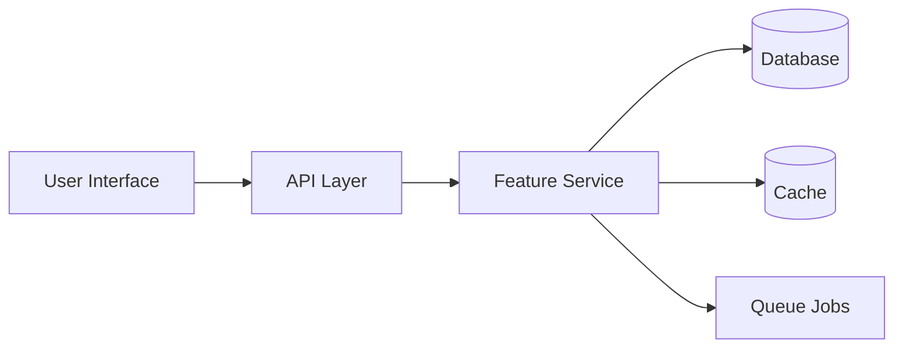

# Feature Documentation Template

> 📋 **Feature**: {FeatureName}  
> 📅 **Released**: {VERSION} on {DATE}  
> 👥 **Product Owner**: {PRODUCT_OWNER}  
> 🎯 **Target Users**: {USER_SEGMENT}

## Overview

### What is {FeatureName}?
Brief, user-friendly description of the feature and its purpose.

### Key Benefits
- 🚀 **Benefit 1**: Clear value proposition
- 💰 **Benefit 2**: Business impact
- ⏱️ **Benefit 3**: Time/cost savings

### Use Cases
1. **Primary Use Case**: Step-by-step scenario
2. **Secondary Use Case**: Alternative scenario
3. **Edge Case**: Less common but supported

## User Guide

### Getting Started

#### Prerequisites
- [ ] Required permissions/roles
- [ ] System requirements
- [ ] Data requirements
- [ ] Configuration needed

#### Quick Start
1. Navigate to [Feature Location]
2. Click on [Action Button]
3. Follow the setup wizard
4. Configure basic settings
5. Start using the feature

### Feature Walkthrough

#### Step 1: Initial Setup


**What to do:**
1. Enter required information
2. Select your preferences
3. Configure notifications

**Tips:**
- 💡 Pro tip for optimal setup
- ⚠️ Common mistake to avoid

#### Step 2: Basic Usage


**Available Actions:**
- **Create**: Add new items
- **Edit**: Modify existing items
- **Delete**: Remove items (with confirmation)
- **Export**: Download data

#### Step 3: Advanced Features


**Power User Features:**
- Bulk operations
- Custom filters
- Automation rules
- API access

### Configuration Options

#### General Settings
| Setting | Description | Default | Options |
|---------|-------------|---------|---------|
| Enable Notifications | Receive alerts | Yes | Yes/No |
| Default View | Initial display | List | List/Grid/Calendar |
| Items Per Page | Pagination | 25 | 10/25/50/100 |
| Time Zone | Display timezone | User's timezone | UTC/Local |

#### Advanced Settings
```json
{
  "feature_config": {
    "auto_save": true,
    "refresh_interval": 60,
    "max_items": 1000,
    "custom_fields": []
  }
}
```

### Permissions and Access

#### Role-Based Access
| Role | View | Create | Edit | Delete | Admin |
|------|------|--------|------|--------|-------|
| Admin | ✅ | ✅ | ✅ | ✅ | ✅ |
| Manager | ✅ | ✅ | ✅ | ✅ | ❌ |
| User | ✅ | ✅ | Own only | ❌ | ❌ |
| Viewer | ✅ | ❌ | ❌ | ❌ | ❌ |

#### Feature-Specific Permissions
- `feature.view` - View feature and data
- `feature.create` - Create new items
- `feature.edit` - Edit existing items
- `feature.delete` - Delete items
- `feature.admin` - Access admin settings

## Technical Details

### Architecture


### Database Schema
```sql
-- Main feature table
CREATE TABLE feature_items (
    id BIGINT PRIMARY KEY,
    company_id BIGINT NOT NULL,
    name VARCHAR(255) NOT NULL,
    settings JSON,
    created_at TIMESTAMP,
    updated_at TIMESTAMP,
    FOREIGN KEY (company_id) REFERENCES companies(id),
    INDEX idx_company_created (company_id, created_at)
);
```

### API Endpoints
| Method | Endpoint | Description | Auth Required |
|--------|----------|-------------|---------------|
| GET | `/api/v1/feature` | List items | Yes |
| POST | `/api/v1/feature` | Create item | Yes |
| GET | `/api/v1/feature/{id}` | Get single item | Yes |
| PUT | `/api/v1/feature/{id}` | Update item | Yes |
| DELETE | `/api/v1/feature/{id}` | Delete item | Yes |

### Events and Webhooks
- `feature.created` - Item created
- `feature.updated` - Item updated
- `feature.deleted` - Item deleted
- `feature.exported` - Data exported

## Integration Guide

### Webhook Integration
```json
{
  "event": "feature.created",
  "timestamp": "2025-01-10T10:00:00Z",
  "data": {
    "id": "123",
    "type": "feature_item",
    "attributes": {
      "name": "Example Item",
      "status": "active"
    }
  }
}
```

### API Integration
```javascript
// JavaScript Example
const client = new AskProAIClient(apiKey);

// Create item
const item = await client.feature.create({
  name: "New Item",
  settings: { priority: "high" }
});

// List items with filters
const items = await client.feature.list({
  status: "active",
  sort: "-created_at",
  limit: 50
});
```

### Third-Party Integrations
- **Zapier**: Automated workflows
- **Cal.com**: Calendar sync
- **Slack**: Notifications
- **Email**: Reports and alerts

## Best Practices

### DO's ✅
- Regular data backups
- Use filters for large datasets
- Set up automated workflows
- Monitor usage metrics
- Train team members

### DON'Ts ❌
- Don't bypass validation
- Don't ignore rate limits
- Don't share access tokens
- Don't modify data directly in DB
- Don't disable audit logs

### Performance Tips
1. **Use Pagination**: Don't load all data at once
2. **Enable Caching**: For frequently accessed data
3. **Batch Operations**: For bulk updates
4. **Async Processing**: For heavy operations
5. **Regular Cleanup**: Archive old data

## Troubleshooting

### Common Issues

#### "Feature Not Available"
**Cause**: Insufficient permissions or feature not enabled
**Solution**: 
1. Check user permissions
2. Verify feature is enabled for company
3. Clear browser cache

#### "Data Not Syncing"
**Cause**: Queue processing delay or API issues
**Solution**:
1. Check queue status
2. Verify API credentials
3. Manual sync option

#### "Performance Issues"
**Cause**: Large dataset or missing indexes
**Solution**:
1. Use filters to reduce data
2. Enable pagination
3. Contact support for optimization

### Debug Mode
```javascript
// Enable debug logging
localStorage.setItem('debug_feature', 'true');

// View debug info
console.log(window.featureDebugInfo);
```

## FAQ

### General Questions

**Q: How much data can I store?**
A: Each plan has different limits:
- Starter: 1,000 items
- Professional: 10,000 items
- Enterprise: Unlimited

**Q: Can I export my data?**
A: Yes, export available in CSV, JSON, and Excel formats

**Q: Is there an API?**
A: Yes, full REST API with webhook support

### Technical Questions

**Q: What's the rate limit?**
A: 60 requests per minute per API key

**Q: How long is data retained?**
A: Active data: Indefinitely
Deleted data: 30 days (soft delete)
Backups: 90 days

**Q: Can I customize fields?**
A: Yes, Enterprise plans support custom fields

## Migration Guide

### From Legacy System
1. Export data from old system
2. Transform to required format
3. Use import wizard
4. Verify data integrity
5. Archive old system

### Data Import Format
```csv
name,email,phone,status,custom_field_1
"John Doe","john@example.com","+1234567890","active","value1"
"Jane Smith","jane@example.com","+0987654321","pending","value2"
```

## Release Notes

### Version 2.0.0 (Current)
- 🆕 Bulk operations support
- 🆕 Advanced filtering
- 🔧 Performance improvements
- 🐛 Fixed timezone issues

### Version 1.5.0
- 🆕 API v2 support
- 🆕 Webhook events
- 🔧 UI improvements

### Version 1.0.0
- 🎉 Initial release
- Basic CRUD operations
- Role-based access

## Support Resources

### Documentation
- [User Guide](./user-guide.md)
- [API Reference](./api-reference.md)
- [Video Tutorials](./tutorials.md)

### Getting Help
- 📧 Email: support@askproai.de
- 💬 Chat: Available 9-5 CET
- 📱 Phone: +49-XXX-SUPPORT
- 🎫 Tickets: support.askproai.de

### Training Materials
- Onboarding video (15 min)
- Interactive tutorial
- Best practices guide
- Monthly webinars

---

> 🔄 **Auto-Updated**: This documentation is automatically checked for updates. Last verification: {TIMESTAMP}