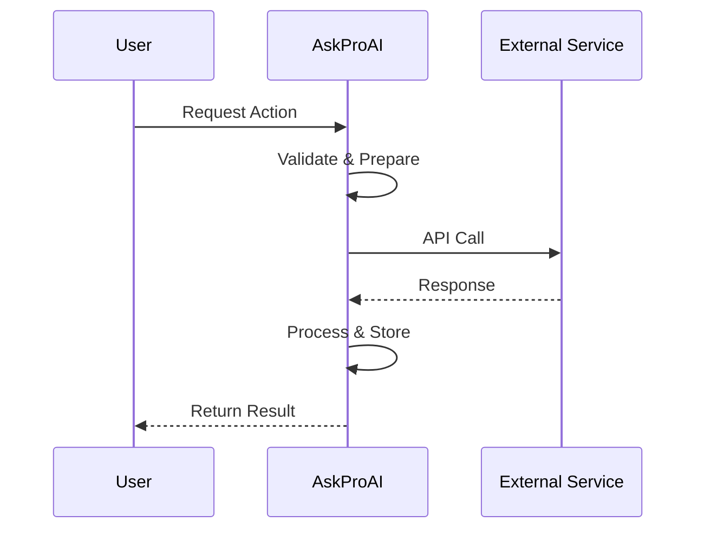

# Integration Guide Template

> 📋 **Integration**: {IntegrationName}  
> 📅 **Last Updated**: {DATE}  
> 👥 **Maintained By**: {TEAM/PERSON}  
> 🔗 **API Docs**: [Official API](https://docs.example.com) | [Our Implementation](../services/integration-service.md)

## Overview

### What is {IntegrationName}?
Brief description of the external service and its purpose.

### Why We Integrate
- **Business Value**: What problems does this solve?
- **Use Cases**: Specific scenarios where this is used
- **Benefits**: Measurable improvements

### Integration Architecture


## Prerequisites

### Account Requirements
- [ ] Account on {Platform}
- [ ] API access enabled
- [ ] Appropriate plan/tier
- [ ] Webhook access (if needed)

### Technical Requirements
- [ ] PHP 8.1+
- [ ] Required packages installed
- [ ] Network access to API endpoints
- [ ] SSL/TLS support

### Required Credentials
```env
# Add to .env file
INTEGRATION_API_KEY=your-api-key-here
INTEGRATION_SECRET=your-secret-here
INTEGRATION_WEBHOOK_SECRET=webhook-secret
INTEGRATION_ENVIRONMENT=production
```

## Installation

### 1. Install Package (if applicable)
```bash
composer require vendor/package-name
```

### 2. Publish Configuration
```bash
php artisan vendor:publish --tag=integration-config
```

### 3. Run Migrations
```bash
php artisan migrate
```

### 4. Configure Environment
Add the required environment variables to your `.env` file.

## Configuration

### Basic Configuration
```php
// config/services.php
'integration_name' => [
    'api_key' => env('INTEGRATION_API_KEY'),
    'secret' => env('INTEGRATION_SECRET'),
    'webhook_secret' => env('INTEGRATION_WEBHOOK_SECRET'),
    'environment' => env('INTEGRATION_ENVIRONMENT', 'production'),
    'timeout' => 30,
    'retry_attempts' => 3,
    'rate_limit' => 60, // requests per minute
],
```

### Advanced Configuration
```php
// config/integration.php
return [
    'endpoints' => [
        'production' => 'https://api.example.com/v1',
        'sandbox' => 'https://sandbox-api.example.com/v1',
    ],
    'features' => [
        'webhooks' => true,
        'batch_operations' => false,
        'real_time_updates' => true,
    ],
    'field_mappings' => [
        'our_field' => 'their_field',
        'customer_name' => 'client_name',
    ],
];
```

## Implementation

### Service Setup
```php
<?php

namespace App\Services\Integrations;

use App\Services\BaseIntegrationService;

class IntegrationNameService extends BaseIntegrationService
{
    protected string $baseUrl;
    protected string $apiKey;
    
    public function __construct()
    {
        $this->baseUrl = config('services.integration_name.endpoints.production');
        $this->apiKey = config('services.integration_name.api_key');
    }
    
    public function authenticate(): bool
    {
        // Authentication logic
    }
}
```

### Basic Operations

#### Create Resource
```php
public function createResource(array $data): array
{
    $response = Http::withHeaders([
        'Authorization' => 'Bearer ' . $this->apiKey,
        'Content-Type' => 'application/json',
    ])->post($this->baseUrl . '/resources', $data);
    
    if (!$response->successful()) {
        throw new IntegrationException($response->body());
    }
    
    return $response->json();
}
```

#### Retrieve Resource
```php
public function getResource(string $id): array
{
    return Cache::remember("integration:resource:{$id}", 300, function () use ($id) {
        $response = Http::withToken($this->apiKey)
            ->get($this->baseUrl . "/resources/{$id}");
            
        return $response->json();
    });
}
```

#### Update Resource
```php
public function updateResource(string $id, array $data): array
{
    // Implementation
}
```

#### Delete Resource
```php
public function deleteResource(string $id): bool
{
    // Implementation
}
```

### Webhook Handling

#### Webhook Controller
```php
<?php

namespace App\Http\Controllers\Webhooks;

class IntegrationWebhookController extends Controller
{
    public function handle(Request $request)
    {
        // Verify signature
        if (!$this->verifySignature($request)) {
            abort(401, 'Invalid signature');
        }
        
        // Process webhook
        ProcessIntegrationWebhook::dispatch($request->all());
        
        return response()->json(['status' => 'accepted']);
    }
    
    private function verifySignature(Request $request): bool
    {
        $signature = $request->header('X-Webhook-Signature');
        $payload = $request->getContent();
        $secret = config('services.integration_name.webhook_secret');
        
        $expected = hash_hmac('sha256', $payload, $secret);
        
        return hash_equals($expected, $signature);
    }
}
```

#### Webhook Routes
```php
// routes/webhooks.php
Route::post('/webhooks/integration-name', [IntegrationWebhookController::class, 'handle'])
    ->name('webhooks.integration-name');
```

### Error Handling

#### Custom Exceptions
```php
class IntegrationException extends Exception
{
    public function __construct(
        string $message,
        public readonly ?array $errors = null,
        int $code = 0
    ) {
        parent::__construct($message, $code);
    }
}
```

#### Retry Logic
```php
public function callWithRetry(callable $callback, int $attempts = 3)
{
    return retry($attempts, $callback, function ($attempt, $exception) {
        if ($exception instanceof RateLimitException) {
            return $exception->retryAfter * 1000;
        }
        return $attempt * 1000;
    });
}
```

## Data Mapping

### Field Mappings
| Our Field | Their Field | Type | Notes |
|-----------|-------------|------|-------|
| customer_name | client_name | string | Max 255 chars |
| phone_number | contact_phone | string | E.164 format |
| appointment_date | booking_date | datetime | ISO 8601 |
| status | state | enum | See status mapping |

### Status Mapping
| Our Status | Their Status | Description |
|------------|--------------|-------------|
| pending | draft | Not confirmed |
| confirmed | active | Confirmed |
| completed | done | Finished |
| cancelled | void | Cancelled |

### Data Transformation
```php
public function transformToExternal(Model $model): array
{
    return [
        'client_name' => $model->customer_name,
        'contact_phone' => $this->formatPhoneNumber($model->phone_number),
        'booking_date' => $model->appointment_date->toIso8601String(),
        'state' => $this->mapStatus($model->status),
    ];
}

public function transformFromExternal(array $data): array
{
    return [
        'customer_name' => $data['client_name'],
        'phone_number' => $this->parsePhoneNumber($data['contact_phone']),
        'appointment_date' => Carbon::parse($data['booking_date']),
        'status' => $this->reverseMapStatus($data['state']),
    ];
}
```

## Testing

### Unit Tests
```php
class IntegrationServiceTest extends TestCase
{
    public function test_creates_resource()
    {
        Http::fake([
            'api.example.com/*' => Http::response(['id' => '123'], 201)
        ]);
        
        $service = new IntegrationService();
        $result = $service->createResource(['name' => 'Test']);
        
        $this->assertEquals('123', $result['id']);
    }
}
```

### Integration Tests
```php
public function test_webhook_processing()
{
    $payload = ['event' => 'resource.created', 'data' => []];
    $signature = hash_hmac('sha256', json_encode($payload), 'secret');
    
    $response = $this->postJson('/webhooks/integration-name', $payload, [
        'X-Webhook-Signature' => $signature
    ]);
    
    $response->assertStatus(200);
    $this->assertDatabaseHas('webhook_events', ['event' => 'resource.created']);
}
```

### Manual Testing

#### Test Checklist
- [ ] Authentication works
- [ ] Create operations succeed
- [ ] Read operations return data
- [ ] Update operations persist
- [ ] Delete operations remove data
- [ ] Webhooks are received
- [ ] Error handling works
- [ ] Rate limiting is respected

#### Test Data
```json
{
  "test_customer": {
    "name": "Test Customer",
    "email": "test@example.com",
    "phone": "+49123456789"
  },
  "test_appointment": {
    "date": "2025-01-15T10:00:00Z",
    "duration": 60,
    "service": "consultation"
  }
}
```

## Monitoring

### Health Checks
```php
public function healthCheck(): array
{
    try {
        $response = Http::timeout(5)
            ->get($this->baseUrl . '/health');
            
        return [
            'status' => $response->successful() ? 'healthy' : 'unhealthy',
            'response_time' => $response->transferStats->getTransferTime(),
            'timestamp' => now(),
        ];
    } catch (\Exception $e) {
        return [
            'status' => 'error',
            'error' => $e->getMessage(),
            'timestamp' => now(),
        ];
    }
}
```

### Metrics to Track
- API response times
- Success/failure rates
- Webhook delivery success
- Rate limit usage
- Error types and frequency

### Logging
```php
Log::channel('integrations')->info('API call completed', [
    'integration' => 'IntegrationName',
    'endpoint' => $endpoint,
    'method' => $method,
    'duration' => $duration,
    'status' => $response->status(),
    'correlation_id' => $correlationId,
]);
```

## Troubleshooting

### Common Issues

#### Authentication Failures
**Symptoms**: 401 or 403 errors
**Causes**:
- Expired API key
- Wrong environment credentials
- Missing permissions

**Solutions**:
1. Verify API key is correct
2. Check key permissions in platform
3. Ensure using correct environment
4. Regenerate key if needed

#### Rate Limiting
**Symptoms**: 429 errors
**Solutions**:
1. Implement exponential backoff
2. Use queue for batch operations
3. Cache responses when possible
4. Upgrade API plan if needed

#### Webhook Failures
**Symptoms**: Events not processed
**Debugging Steps**:
1. Check webhook URL is accessible
2. Verify signature validation
3. Check webhook logs in platform
4. Test with webhook testing tool

### Debug Mode
```php
// Enable debug logging
config(['services.integration_name.debug' => true]);

// Log all API calls
Http::beforeSending(function (Request $request) {
    Log::debug('API Request', [
        'url' => $request->url(),
        'method' => $request->method(),
        'headers' => $request->headers(),
        'body' => $request->body(),
    ]);
});
```

## Migration Guide

### From Version X to Y
1. Update package version
2. Run new migrations
3. Update environment variables
4. Modify service configuration
5. Test in staging environment

### Breaking Changes
- Method `oldMethod()` renamed to `newMethod()`
- Parameter `$oldParam` now required
- Response format changed

## Best Practices

### DO's
- ✅ Always validate webhook signatures
- ✅ Implement proper error handling
- ✅ Use caching for read operations
- ✅ Log important operations
- ✅ Implement circuit breakers
- ✅ Use queues for heavy operations
- ✅ Keep credentials in environment files

### DON'Ts
- ❌ Don't hardcode credentials
- ❌ Don't ignore rate limits
- ❌ Don't skip webhook verification
- ❌ Don't cache write operations
- ❌ Don't expose internal IDs

## Support

### Internal Support
- Slack: #integration-support
- Wiki: Internal Integration Guide
- Team: integrations@askproai.de

### External Resources
- Official Documentation: https://docs.example.com
- API Status: https://status.example.com
- Support: support@example.com

---

> 🔄 **Auto-Updated**: This documentation is automatically checked for updates. Last verification: {TIMESTAMP}