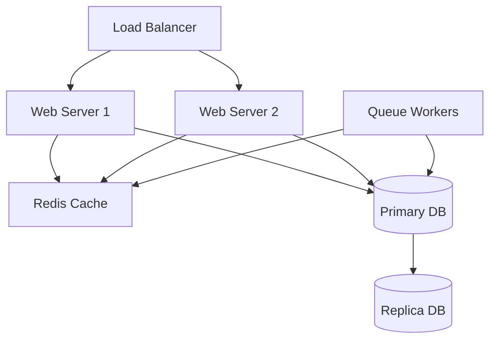

# Operations Manual Template

> 📋 **System**: {SystemName}  
> 📅 **Last Updated**: {DATE}  
> 👥 **Maintained By**: {OPS_TEAM}  
> 🆘 **24/7 Support**: {SUPPORT_CONTACT}

## Table of Contents
1. [System Overview](#system-overview)
2. [Daily Operations](#daily-operations)
3. [Deployment Procedures](#deployment-procedures)
4. [Backup and Recovery](#backup-and-recovery)
5. [Monitoring and Alerting](#monitoring-and-alerting)
6. [Incident Response](#incident-response)
7. [Maintenance Windows](#maintenance-windows)
8. [Disaster Recovery](#disaster-recovery)

## System Overview

### Architecture


### Infrastructure Components
| Component | Type | Location | Purpose |
|-----------|------|----------|---------|
| Web Servers | EC2 t3.large | eu-central-1a/b | Application hosting |
| Database | RDS MySQL 8.0 | Multi-AZ | Data persistence |
| Cache | ElastiCache Redis | Cluster mode | Performance |
| Queue | SQS + EC2 | Auto-scaling | Async processing |
| Storage | S3 | Cross-region | File storage |

### Access Information
- **SSH Access**: Via bastion host only
- **Database Access**: Via VPN only
- **Admin Panel**: https://admin.askproai.de
- **Monitoring**: https://monitoring.askproai.de

## Daily Operations

### Morning Checklist (09:00)
- [ ] Check overnight alerts and logs
- [ ] Verify all services are running
- [ ] Review queue depths
- [ ] Check backup completion
- [ ] Review error rates
- [ ] Check disk space
- [ ] Verify SSL certificates

```bash
# Morning health check script
./scripts/daily-health-check.sh

# Or manual checks
php artisan health:check
php artisan queue:monitor
php artisan backup:status
df -h
```

### Service Status Commands
```bash
# Application status
sudo systemctl status nginx
sudo systemctl status php8.3-fpm
sudo systemctl status horizon

# Database status
php artisan db:check

# Cache status
redis-cli ping

# Queue status
php artisan horizon:status
```

### Log Review
```bash
# Check for errors in last 24h
grep -i error /var/log/nginx/error.log | grep "$(date -d yesterday '+%Y/%m/%d')"
grep "ERROR" storage/logs/laravel-$(date +%Y-%m-%d).log

# Check slow queries
tail -f storage/logs/slow-queries.log

# Security events
grep -i "auth\|security" storage/logs/laravel-$(date +%Y-%m-%d).log
```

## Deployment Procedures

### Pre-Deployment Checklist
- [ ] All tests passing in CI/CD
- [ ] Deployment approved by lead
- [ ] Backup completed
- [ ] Maintenance window scheduled
- [ ] Rollback plan prepared
- [ ] Team notified

### Standard Deployment Process
```bash
# 1. Enable maintenance mode
php artisan down --render="maintenance" --secret="bypass-secret"

# 2. Pull latest code
git fetch --all
git checkout tags/v{VERSION}

# 3. Install dependencies
composer install --no-dev --optimize-autoloader
npm ci && npm run production

# 4. Run migrations
php artisan migrate --force

# 5. Clear and warm caches
php artisan optimize:clear
php artisan optimize

# 6. Restart services
sudo systemctl restart php8.3-fpm
php artisan horizon:terminate
php artisan horizon

# 7. Health check
php artisan health:check

# 8. Disable maintenance mode
php artisan up
```

### Zero-Downtime Deployment
```bash
# Use deployment script
./deploy.sh --zero-downtime --version=v{VERSION}

# Manual blue-green deployment
./scripts/blue-green-deploy.sh
```

### Rollback Procedure
```bash
# Quick rollback (< 5 minutes)
git checkout tags/v{PREVIOUS_VERSION}
composer install --no-dev
php artisan migrate:rollback --step=1
php artisan optimize:clear
sudo systemctl restart php8.3-fpm

# Full rollback with backup
./scripts/emergency-rollback.sh --version=v{PREVIOUS_VERSION}
```

## Backup and Recovery

### Backup Schedule
| Type | Frequency | Retention | Location |
|------|-----------|-----------|----------|
| Database Full | Daily 02:00 | 30 days | S3 |
| Database Incremental | Hourly | 7 days | S3 |
| Files | Daily 03:00 | 14 days | S3 |
| Config | On change | 90 days | Git |
| Logs | Daily | 30 days | S3 Glacier |

### Manual Backup
```bash
# Database backup
php artisan backup:run --only-db

# Full system backup
php artisan backup:run

# Specific table backup
mysqldump -u root -p askproai_db customers appointments > backup_$(date +%Y%m%d).sql
```

### Recovery Procedures

#### Database Recovery
```bash
# List available backups
php artisan backup:list

# Restore latest backup
php artisan backup:restore --latest

# Restore specific backup
php artisan backup:restore --date=2025-01-10

# Manual restore
mysql -u root -p askproai_db < backup_20250110.sql
```

#### File Recovery
```bash
# Restore uploaded files
aws s3 sync s3://askproai-backups/files/latest storage/app/public/

# Restore specific date
aws s3 sync s3://askproai-backups/files/2025-01-10 storage/app/public/
```

## Monitoring and Alerting

### Monitoring Stack
- **Metrics**: Prometheus + Grafana
- **Logs**: ELK Stack (Elasticsearch, Logstash, Kibana)
- **APM**: New Relic / DataDog
- **Uptime**: Pingdom / UptimeRobot
- **Errors**: Sentry

### Key Metrics

#### Application Metrics
| Metric | Warning | Critical | Check Command |
|--------|---------|----------|---------------|
| Response Time | > 500ms | > 2s | `curl -w "%{time_total}" -o /dev/null -s http://localhost/health` |
| Error Rate | > 1% | > 5% | `php artisan metrics:errors` |
| Queue Depth | > 1000 | > 5000 | `php artisan queue:size` |
| Active Users | - | - | `php artisan metrics:users` |

#### Infrastructure Metrics
| Metric | Warning | Critical | Check Command |
|--------|---------|----------|---------------|
| CPU Usage | > 70% | > 90% | `top -bn1 | grep "Cpu(s)"` |
| Memory Usage | > 80% | > 95% | `free -m | grep Mem` |
| Disk Usage | > 80% | > 90% | `df -h | grep /dev/root` |
| Database Connections | > 80 | > 95 | `php artisan db:connections` |

### Alert Configuration
```yaml
# config/monitoring.yaml
alerts:
  high_error_rate:
    condition: error_rate > 5
    duration: 5m
    severity: critical
    notify:
      - oncall@askproai.de
      - slack:#alerts-critical
      
  slow_response:
    condition: response_time_p95 > 2000
    duration: 10m
    severity: warning
    notify:
      - team@askproai.de
      - slack:#alerts-warning
```

### Custom Health Checks
```php
// app/Health/DatabaseHealthCheck.php
class DatabaseHealthCheck extends Check
{
    public function run(): Result
    {
        try {
            DB::connection()->getPdo();
            return Result::ok('Database connection OK');
        } catch (\Exception $e) {
            return Result::failed('Database connection failed: ' . $e->getMessage());
        }
    }
}
```

## Incident Response

### Severity Levels
| Level | Description | Response Time | Examples |
|-------|-------------|---------------|----------|
| P1 - Critical | Complete outage | 15 min | Site down, data loss |
| P2 - High | Major functionality broken | 1 hour | Payment failure, API down |
| P3 - Medium | Degraded performance | 4 hours | Slow response, minor errors |
| P4 - Low | Minor issues | 24 hours | UI bugs, typos |

### Incident Response Process

#### 1. Detection & Alert
```bash
# Acknowledge incident
./scripts/incident.sh acknowledge --id=INC-001

# Start incident timer
./scripts/incident.sh start --severity=P1
```

#### 2. Initial Response
- [ ] Acknowledge alert
- [ ] Assess severity
- [ ] Notify stakeholders
- [ ] Start incident log
- [ ] Begin investigation

#### 3. Investigation
```bash
# Gather system state
./scripts/incident-snapshot.sh

# Check recent changes
git log --oneline -10
php artisan audit:recent

# Review logs
./scripts/log-analysis.sh --time="15 minutes ago"
```

#### 4. Mitigation
```bash
# Common quick fixes
php artisan cache:clear  # Clear corrupted cache
php artisan queue:restart  # Restart stuck workers
sudo systemctl restart php8.3-fpm  # Restart PHP

# Feature flags
php artisan feature:disable problematic-feature
```

#### 5. Resolution & Post-Mortem
- Document timeline
- Identify root cause
- List action items
- Update runbooks
- Schedule retrospective

### Emergency Contacts
| Role | Name | Phone | Email |
|------|------|-------|-------|
| On-Call Engineer | Rotation | +49-XXX-ONCALL | oncall@askproai.de |
| Infrastructure Lead | Name | +49-XXX-XXXX | infra@askproai.de |
| Engineering Manager | Name | +49-XXX-XXXX | em@askproai.de |
| CTO | Name | +49-XXX-XXXX | cto@askproai.de |

## Maintenance Windows

### Scheduled Maintenance
- **Weekly**: Tuesday 03:00-04:00 CET (patches)
- **Monthly**: First Sunday 02:00-06:00 CET (updates)
- **Quarterly**: Announced 2 weeks prior (major upgrades)

### Maintenance Procedures

#### Pre-Maintenance
```bash
# 1. Notify users (24h before)
php artisan maintenance:announce --time="2025-01-15 03:00" --duration="1 hour"

# 2. Backup everything
php artisan backup:run --full

# 3. Prepare rollback
./scripts/prepare-rollback.sh
```

#### During Maintenance
```bash
# Enable maintenance mode with bypass
php artisan down --render="maintenance" --secret="secret-bypass-key"

# Perform updates
sudo apt update && sudo apt upgrade
composer update
npm update

# Database maintenance
php artisan db:optimize
```

#### Post-Maintenance
```bash
# Verify services
php artisan health:check --detailed

# Run tests
php artisan test --parallel

# Disable maintenance mode
php artisan up

# Monitor for issues (30 min)
./scripts/post-maintenance-monitor.sh
```

## Disaster Recovery

### RTO/RPO Targets
- **RTO** (Recovery Time Objective): 4 hours
- **RPO** (Recovery Point Objective): 1 hour

### DR Scenarios

#### Complete Region Failure
```bash
# 1. Activate DR site
./dr/activate-dr-region.sh eu-west-1

# 2. Update DNS
./dr/update-dns-dr.sh

# 3. Verify services
./dr/verify-dr-site.sh

# 4. Notify stakeholders
./dr/send-dr-notifications.sh
```

#### Database Corruption
```bash
# 1. Stop application
php artisan down

# 2. Restore from backup
php artisan backup:restore --latest --only-db

# 3. Verify data integrity
php artisan db:verify

# 4. Resume service
php artisan up
```

#### Security Breach
```bash
# 1. Isolate affected systems
./security/isolate-breach.sh

# 2. Rotate all credentials
./security/rotate-all-credentials.sh

# 3. Audit access logs
./security/audit-access.sh --days=7

# 4. Implement additional monitoring
./security/enhance-monitoring.sh
```

### DR Testing Schedule
- **Monthly**: Backup restoration test
- **Quarterly**: Failover test
- **Annually**: Full DR drill

## Automation Scripts

### Daily Operations
```bash
#!/bin/bash
# scripts/daily-ops.sh

echo "=== Daily Operations Check ==="
date

# Check services
systemctl is-active nginx || echo "WARNING: Nginx is down"
systemctl is-active php8.3-fpm || echo "WARNING: PHP-FPM is down"
systemctl is-active redis || echo "WARNING: Redis is down"

# Check disk space
df -h | grep -E "8[0-9]%|9[0-9]%|100%" && echo "WARNING: High disk usage"

# Check queues
php artisan queue:size | grep -E "[0-9]{4,}" && echo "WARNING: High queue depth"

# Check errors
grep -c ERROR storage/logs/laravel-$(date +%Y-%m-%d).log || echo "0 errors today"
```

### Performance Monitoring
```bash
#!/bin/bash
# scripts/performance-check.sh

# Response time check
for i in {1..10}; do
    time curl -s -o /dev/null http://localhost/health
done | grep real | awk '{sum+=$2} END {print "Avg response time:", sum/NR, "seconds"}'

# Database query performance
php artisan tinker --execute="DB::select('SHOW PROCESSLIST')" | grep -v Sleep

# Cache hit rate
redis-cli info stats | grep keyspace_hits
```

## Security Operations

### Security Checklist
- [ ] Review access logs daily
- [ ] Check for failed login attempts
- [ ] Verify SSL certificates monthly
- [ ] Rotate API keys quarterly
- [ ] Security patches weekly
- [ ] Penetration test annually

### Security Commands
```bash
# Check for suspicious activity
grep -i "sql injection\|xss\|unauthorized" storage/logs/*.log

# List recent logins
php artisan security:logins --days=7

# Check file integrity
./security/file-integrity-check.sh

# Scan for vulnerabilities
composer audit
npm audit
```

## Compliance and Auditing

### Audit Logs
- All admin actions logged
- API access logged
- Database queries logged (dev only)
- File changes tracked

### Compliance Checks
```bash
# GDPR compliance
php artisan gdpr:audit

# PCI compliance (if applicable)
./compliance/pci-check.sh

# Generate audit report
php artisan audit:report --month=2025-01
```

## Documentation and Training

### Required Documentation
- [ ] This operations manual
- [ ] Network diagram
- [ ] Runbook for each service
- [ ] Incident response plan
- [ ] DR procedures
- [ ] Contact list

### Training Requirements
- New team members: 2-week onboarding
- Quarterly DR drills
- Annual security training
- Technology updates as needed

---

> 🔄 **Auto-Updated**: This documentation is automatically checked for updates. Last verification: {TIMESTAMP}