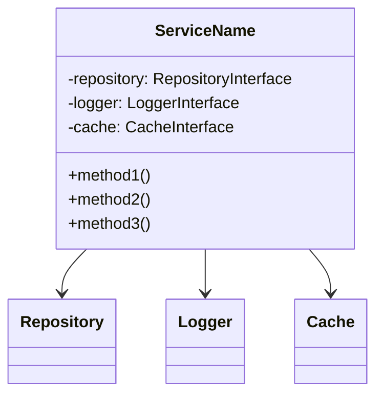

# Service Documentation Template

> 📋 **Service**: {ServiceName}Service  
> 📅 **Last Updated**: {DATE}  
> 👥 **Maintained By**: {TEAM/PERSON}  
> 🏗️ **Architecture**: [Service Layer](../architecture/service-layer.md)

## Overview

### Purpose
Brief description of what this service does and why it exists.

### Responsibilities
- [ ] Primary responsibility 1
- [ ] Primary responsibility 2
- [ ] Primary responsibility 3

### Dependencies
- **Internal**: List of internal services/classes this depends on
- **External**: External APIs, packages, or services
- **Database**: Tables and models used

## Architecture

### Class Diagram


### Service Location
```
app/Services/{Domain}/{ServiceName}Service.php
```

### Interface Definition
```php
<?php

namespace App\Services\{Domain};

interface {ServiceName}ServiceInterface
{
    public function primaryMethod(array $data): Result;
    public function secondaryMethod(int $id): ?Model;
}
```

## Public Methods

### method1()
**Purpose**: What this method does

**Signature**:
```php
public function method1(array $params): ResponseType
```

**Parameters**:
| Name | Type | Required | Description | Example |
|------|------|----------|-------------|---------|
| params | array | Yes | Parameters array | ['key' => 'value'] |

**Returns**: `ResponseType` - Description of return value

**Exceptions**:
- `ValidationException` - When validation fails
- `NotFoundException` - When resource not found

**Example**:
```php
$service = app(ServiceNameService::class);
$result = $service->method1([
    'param1' => 'value1',
    'param2' => 'value2'
]);
```

### method2()
[Similar structure for each public method]

## Configuration

### Environment Variables
```env
SERVICE_NAME_API_KEY=your-api-key
SERVICE_NAME_TIMEOUT=30
SERVICE_NAME_RETRY_ATTEMPTS=3
```

### Config File
```php
// config/services.php
'service_name' => [
    'api_key' => env('SERVICE_NAME_API_KEY'),
    'timeout' => env('SERVICE_NAME_TIMEOUT', 30),
    'retry_attempts' => env('SERVICE_NAME_RETRY_ATTEMPTS', 3),
],
```

## Usage Examples

### Basic Usage
```php
use App\Services\ServiceNameService;

class ExampleController extends Controller
{
    public function __construct(
        private ServiceNameService $service
    ) {}
    
    public function handle(Request $request)
    {
        try {
            $result = $this->service->process($request->validated());
            return response()->json($result);
        } catch (ServiceException $e) {
            return response()->json(['error' => $e->getMessage()], 400);
        }
    }
}
```

### Advanced Usage
```php
// With transaction handling
DB::transaction(function () use ($data) {
    $result = $this->service->createWithRelations($data);
    event(new ResourceCreated($result));
    return $result;
});

// With caching
$result = Cache::remember('key', 3600, function () {
    return $this->service->expensiveOperation();
});
```

### Queue Integration
```php
// Dispatching to queue
ProcessServiceJob::dispatch($data)
    ->onQueue('high-priority')
    ->delay(now()->addMinutes(5));
```

## Error Handling

### Exception Types
| Exception | When Thrown | HTTP Code | Action Required |
|-----------|-------------|-----------|-----------------|
| ValidationException | Invalid input | 422 | Fix validation errors |
| NotFoundException | Resource missing | 404 | Check resource exists |
| ServiceUnavailableException | External service down | 503 | Retry later |
| QuotaExceededException | Limit reached | 429 | Wait or upgrade |

### Error Recovery
```php
try {
    $result = $this->service->riskyOperation();
} catch (ServiceUnavailableException $e) {
    // Fallback logic
    $result = $this->service->fallbackOperation();
    
    // Log for monitoring
    Log::warning('Service unavailable, using fallback', [
        'exception' => $e->getMessage(),
        'context' => $context
    ]);
}
```

## Testing

### Unit Tests
```php
class ServiceNameServiceTest extends TestCase
{
    private ServiceNameService $service;
    
    protected function setUp(): void
    {
        parent::setUp();
        $this->service = app(ServiceNameService::class);
    }
    
    public function test_basic_functionality()
    {
        // Arrange
        $input = ['key' => 'value'];
        
        // Act
        $result = $this->service->process($input);
        
        // Assert
        $this->assertInstanceOf(ExpectedType::class, $result);
        $this->assertEquals('expected', $result->value);
    }
}
```

### Integration Tests
```php
public function test_integration_with_external_service()
{
    // Mock external service
    Http::fake([
        'api.external.com/*' => Http::response(['success' => true], 200)
    ]);
    
    // Test integration
    $result = $this->service->callExternalApi();
    $this->assertTrue($result->success);
}
```

### Test Scenarios
1. ✅ Happy path scenarios
2. ✅ Validation failures
3. ✅ External service failures
4. ✅ Concurrent access
5. ✅ Performance under load

## Performance Considerations

### Optimization Strategies
- **Caching**: Cache expensive operations with appropriate TTL
- **Batch Processing**: Process multiple items in single query
- **Eager Loading**: Prevent N+1 queries
- **Chunking**: Process large datasets in chunks

### Benchmarks
| Operation | Average Time | Memory Usage | Optimization |
|-----------|--------------|--------------|--------------|
| Single process | 50ms | 2MB | - |
| Batch (100) | 200ms | 8MB | Use chunks |
| With cache | 5ms | 1MB | 5 min TTL |

## Monitoring

### Key Metrics
- **Response Time**: < 200ms (p95)
- **Error Rate**: < 0.1%
- **Throughput**: 100 req/s
- **Queue Depth**: < 1000 jobs

### Logging
```php
// Structured logging
Log::channel('services')->info('Operation completed', [
    'service' => 'ServiceName',
    'method' => 'process',
    'duration' => $duration,
    'result' => $result->toArray(),
    'correlation_id' => $correlationId
]);
```

### Alerts
- Response time > 500ms for 5 minutes
- Error rate > 1% for 10 minutes
- Queue depth > 5000 jobs
- External API failures > 10/minute

## Security

### Authentication
- Service uses API key authentication
- Keys stored in environment variables
- Rotate keys every 90 days

### Authorization
- Check user permissions before operations
- Use policies for resource access
- Audit sensitive operations

### Data Protection
- Encrypt sensitive data at rest
- Use HTTPS for external calls
- Sanitize user input
- Mask sensitive data in logs

## Maintenance

### Regular Tasks
- [ ] Weekly: Review error logs
- [ ] Monthly: Update dependencies
- [ ] Quarterly: Performance review
- [ ] Yearly: Security audit

### Deprecation Policy
1. Mark methods as deprecated with `@deprecated` tag
2. Add deprecation notice in logs
3. Provide migration guide
4. Remove after 2 major versions

## Troubleshooting

### Common Issues

#### Issue: Service returns 503
**Symptoms**: Service unavailable errors
**Cause**: External API down or rate limited
**Solution**:
1. Check circuit breaker status
2. Verify API credentials
3. Check rate limits
4. Enable fallback mode

#### Issue: Slow performance
**Symptoms**: Response times > 1s
**Cause**: Missing indexes or N+1 queries
**Solution**:
1. Check query logs
2. Add database indexes
3. Implement caching
4. Use eager loading

## Related Documentation
- [API Documentation](../api/service-name-api.md)
- [Integration Guide](../guides/service-name-integration.md)
- [Architecture Decision](../adr/service-name-design.md)

---

> 🔄 **Auto-Updated**: This documentation is automatically checked for updates. Last verification: {TIMESTAMP}