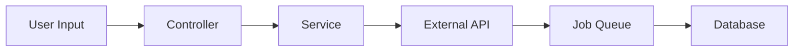

# Feature: [Feature Name]

## 📋 Overview
**Status**: 🟢 Active | 🟡 In Development | 🔴 Deprecated  
**Version**: 1.0.0  
**Last Updated**: [Date]  
**Owner**: [Team/Person]  

### Purpose
[Brief description of what this feature does and why it exists]

### Business Value
- [ ] [Key benefit 1]
- [ ] [Key benefit 2]
- [ ] [Key benefit 3]

## 🏗️ Architecture

### Components
| Component | Location | Description |
|-----------|----------|-------------|
| Service | `app/Services/[Name]Service.php` | Main business logic |
| Controller | `app/Http/Controllers/[Name]Controller.php` | API endpoints |
| Model | `app/Models/[Name].php` | Data structure |
| Job | `app/Jobs/[Name]Job.php` | Async processing |

### Dependencies
- **External APIs**: [List external services]
- **Internal Services**: [List internal dependencies]
- **Database Tables**: [List affected tables]

### Data Flow


## 🔧 Configuration

### Environment Variables
```env
FEATURE_NAME_ENABLED=true
FEATURE_NAME_API_KEY=xxx
FEATURE_NAME_TIMEOUT=30
```

### Feature Flags
```php
// config/features.php
'feature_name' => [
    'enabled' => env('FEATURE_NAME_ENABLED', false),
    'options' => [
        'timeout' => env('FEATURE_NAME_TIMEOUT', 30),
    ],
],
```

## 📖 Usage

### Basic Example
```php
// Using the feature
$service = app(FeatureService::class);
$result = $service->performAction($data);
```

### Advanced Usage
```php
// With error handling
try {
    $result = $service->performAction($data, [
        'option1' => true,
        'retries' => 3,
    ]);
} catch (FeatureException $e) {
    // Handle specific errors
}
```

### API Endpoints
| Method | Endpoint | Description |
|--------|----------|-------------|
| GET | `/api/feature` | List items |
| POST | `/api/feature` | Create item |
| PUT | `/api/feature/{id}` | Update item |
| DELETE | `/api/feature/{id}` | Delete item |

## 🧪 Testing

### Unit Tests
```bash
php artisan test --filter=FeatureServiceTest
```

### Integration Tests
```bash
php artisan test --filter=FeatureIntegrationTest
```

### Manual Testing
1. [Step 1 to test manually]
2. [Step 2 to test manually]
3. [Expected result]

## 🚨 Troubleshooting

### Common Issues

#### Issue: [Error Message]
**Symptoms**: [What user sees]  
**Cause**: [Root cause]  
**Solution**: 
```bash
# Fix command
php artisan feature:fix
```

#### Issue: [Another Error]
**Symptoms**: [Description]  
**Cause**: [Root cause]  
**Solution**: [Step by step fix]

### Debug Commands
```bash
# Check feature status
php artisan feature:status

# Clear feature cache
php artisan feature:clear-cache

# Run diagnostics
php artisan feature:diagnose
```

### Logs
- **Application Log**: `storage/logs/feature-name.log`
- **Error Log**: `storage/logs/laravel.log`
- **Queue Log**: Check failed_jobs table

## 📊 Monitoring

### Metrics
- **Success Rate**: [Current %]
- **Average Response Time**: [Current ms]
- **Daily Volume**: [Current count]

### Alerts
| Alert | Condition | Action |
|-------|-----------|--------|
| High Error Rate | > 5% errors | Check logs |
| Slow Response | > 1000ms avg | Scale resources |
| API Down | No response | Check external service |

### Dashboard
Access monitoring at: `/admin/monitoring/feature-name`

## 🔒 Security

### Authentication
- [x] API Key required
- [x] User authentication
- [ ] OAuth2 (planned)

### Permissions
```php
// Required permissions
'feature.view'
'feature.create'
'feature.update'
'feature.delete'
```

### Data Protection
- Sensitive data encrypted at rest
- API communications use HTTPS
- PII data masked in logs

## 📈 Performance

### Optimization Tips
1. Enable caching: `FEATURE_CACHE_ENABLED=true`
2. Use queue for heavy operations
3. Implement pagination for large datasets

### Benchmarks
| Operation | Time | Memory |
|-----------|------|--------|
| Create | 50ms | 2MB |
| Update | 30ms | 1MB |
| List (100) | 100ms | 5MB |

## 🔄 Version History

### v1.0.0 (Current)
- Initial release
- Basic CRUD operations
- API integration

### v0.9.0
- Beta testing
- Performance improvements

## 📚 Related Documentation
- [API Documentation](./api-documentation.md)
- [Integration Guide](./integration-guide.md)
- [Security Guidelines](./security.md)

## 🤝 Support
- **Slack Channel**: #feature-support
- **Email**: feature-team@askproai.de
- **On-Call**: See PagerDuty rotation

---
**Note**: This is a living document. Please update it when making changes to the feature.