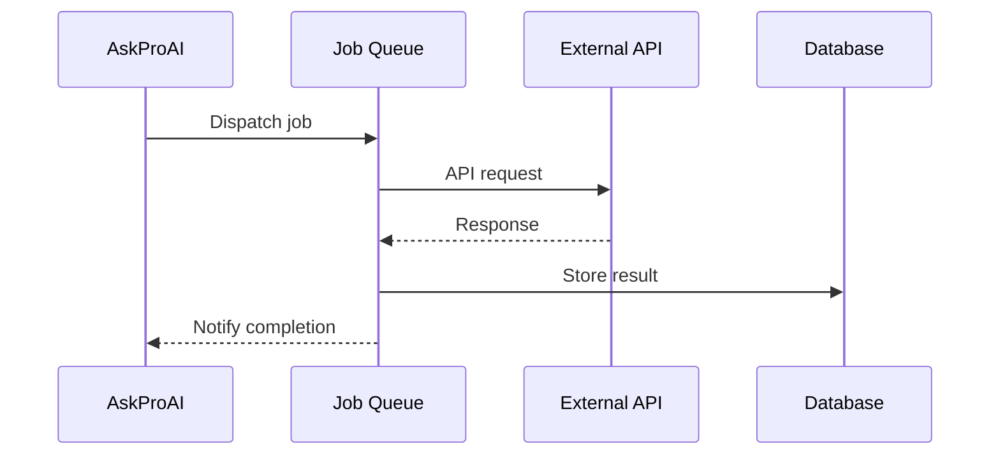

# Integration Guide: [Service Name]

## 📋 Overview
**Service**: [Service Name]  
**Type**: 🌐 External API | 📦 Package | 🔧 Internal Service  
**Version**: [Version]  
**Status**: 🟢 Production | 🟡 Beta | 🔴 Deprecated  

### Purpose
[Brief description of what this integration provides]

### Key Features
- ✅ [Feature 1]
- ✅ [Feature 2]
- ✅ [Feature 3]
- ⏳ [Planned Feature]

## 🚀 Quick Start

### 1. Installation
```bash
# If package
composer require vendor/package

# If npm package
npm install package-name
```

### 2. Configuration
```env
# .env configuration
SERVICE_NAME_ENABLED=true
SERVICE_NAME_API_KEY=your-api-key
SERVICE_NAME_API_SECRET=your-secret
SERVICE_NAME_WEBHOOK_URL=https://api.askproai.de/webhooks/service
```

### 3. Basic Usage
```php
use App\Services\ServiceNameClient;

$client = new ServiceNameClient();
$result = $client->doSomething($params);
```

## 🏗️ Architecture

### Integration Flow


### Components
| Component | Purpose | Location |
|-----------|---------|----------|
| Service Client | API communication | `app/Services/[Service]Client.php` |
| Webhook Controller | Handle callbacks | `app/Http/Controllers/Webhooks/[Service]Controller.php` |
| Data Models | Store integration data | `app/Models/[Service]*.php` |
| Jobs | Async processing | `app/Jobs/[Service]/*.php` |

## 🔧 Detailed Configuration

### Service Registration
```php
// config/services.php
'service_name' => [
    'enabled' => env('SERVICE_NAME_ENABLED', false),
    'api_key' => env('SERVICE_NAME_API_KEY'),
    'api_secret' => env('SERVICE_NAME_API_SECRET'),
    'webhook_secret' => env('SERVICE_NAME_WEBHOOK_SECRET'),
    'base_url' => env('SERVICE_NAME_BASE_URL', 'https://api.service.com'),
    'timeout' => env('SERVICE_NAME_TIMEOUT', 30),
    'retry_times' => env('SERVICE_NAME_RETRY_TIMES', 3),
],
```

### Service Provider
```php
// app/Providers/ServiceNameServiceProvider.php
public function register()
{
    $this->app->singleton(ServiceNameClient::class, function ($app) {
        return new ServiceNameClient(
            config('services.service_name')
        );
    });
}
```

## 📡 API Integration

### Authentication
```php
// OAuth2 Example
$client->authenticate([
    'grant_type' => 'client_credentials',
    'client_id' => config('services.service_name.client_id'),
    'client_secret' => config('services.service_name.client_secret'),
]);

// API Key Example
$client->setApiKey(config('services.service_name.api_key'));
```

### Common Operations

#### List Resources
```php
$resources = $client->resources()->list([
    'page' => 1,
    'per_page' => 50,
    'filters' => [
        'status' => 'active',
    ],
]);
```

#### Create Resource
```php
$resource = $client->resources()->create([
    'name' => 'Resource Name',
    'type' => 'standard',
    'metadata' => [
        'key' => 'value',
    ],
]);
```

#### Update Resource
```php
$updated = $client->resources()->update($resourceId, [
    'name' => 'Updated Name',
]);
```

#### Delete Resource
```php
$client->resources()->delete($resourceId);
```

## 🔗 Webhook Integration

### Webhook Setup
```php
// routes/webhooks.php
Route::post('/webhooks/service-name', [ServiceNameWebhookController::class, 'handle'])
    ->middleware('verify.webhook:service_name');
```

### Webhook Handler
```php
// app/Http/Controllers/Webhooks/ServiceNameWebhookController.php
public function handle(Request $request)
{
    $event = $request->input('event');
    $data = $request->input('data');
    
    switch ($event) {
        case 'resource.created':
            ProcessResourceCreated::dispatch($data);
            break;
        case 'resource.updated':
            ProcessResourceUpdated::dispatch($data);
            break;
        // ... other events
    }
    
    return response()->json(['status' => 'received']);
}
```

### Webhook Security
```php
// app/Http/Middleware/VerifyWebhookSignature.php
public function handle($request, Closure $next, $service)
{
    $signature = $request->header('X-Webhook-Signature');
    $secret = config("services.{$service}.webhook_secret");
    
    $calculated = hash_hmac('sha256', $request->getContent(), $secret);
    
    if (!hash_equals($calculated, $signature)) {
        abort(401, 'Invalid signature');
    }
    
    return $next($request);
}
```

## 🧪 Testing

### Unit Tests
```php
// tests/Unit/Services/ServiceNameClientTest.php
public function test_can_create_resource()
{
    $client = $this->mock(ServiceNameClient::class);
    
    $client->shouldReceive('create')
        ->once()
        ->with(['name' => 'Test'])
        ->andReturn(['id' => 123, 'name' => 'Test']);
    
    $result = $client->create(['name' => 'Test']);
    
    $this->assertEquals(123, $result['id']);
}
```

### Integration Tests
```php
// tests/Feature/Integrations/ServiceNameTest.php
public function test_webhook_processing()
{
    $payload = [
        'event' => 'resource.created',
        'data' => ['id' => 123],
    ];
    
    $response = $this->postJson('/webhooks/service-name', $payload, [
        'X-Webhook-Signature' => $this->generateSignature($payload),
    ]);
    
    $response->assertOk();
    $this->assertDatabaseHas('resources', ['external_id' => 123]);
}
```

## 🚨 Error Handling

### Common Errors
| Error Code | Description | Solution |
|------------|-------------|----------|
| 401 | Authentication failed | Check API credentials |
| 403 | Permission denied | Verify account permissions |
| 404 | Resource not found | Check resource ID |
| 429 | Rate limit exceeded | Implement backoff strategy |
| 500 | Server error | Retry with exponential backoff |

### Error Handling Example
```php
try {
    $result = $client->doSomething();
} catch (AuthenticationException $e) {
    // Re-authenticate and retry
    $client->authenticate();
    $result = $client->doSomething();
} catch (RateLimitException $e) {
    // Queue for retry
    RetryServiceAction::dispatch($action)
        ->delay($e->getRetryAfter());
} catch (ServiceException $e) {
    // Log and handle gracefully
    Log::error('Service error', [
        'error' => $e->getMessage(),
        'context' => $e->getContext(),
    ]);
}
```

## 📊 Monitoring

### Health Check
```php
// app/Services/ServiceNameHealthCheck.php
public function check(): HealthCheckResult
{
    try {
        $client = app(ServiceNameClient::class);
        $client->ping();
        
        return HealthCheckResult::ok('Service is reachable');
    } catch (\Exception $e) {
        return HealthCheckResult::failed(
            'Service is unreachable: ' . $e->getMessage()
        );
    }
}
```

### Metrics to Track
- API response times
- Error rates by endpoint
- Webhook delivery success rate
- Rate limit usage
- Authentication failures

### Logging
```php
// config/logging.php
'channels' => [
    'service_name' => [
        'driver' => 'daily',
        'path' => storage_path('logs/service-name.log'),
        'level' => 'debug',
        'days' => 14,
    ],
],
```

## 🔒 Security Considerations

### API Key Storage
- Store in `.env` file, never in code
- Use Laravel's encryption for database storage
- Rotate keys regularly

### Data Validation
```php
$validated = $request->validate([
    'webhook_data' => 'required|array',
    'webhook_data.id' => 'required|string',
    'webhook_data.type' => 'required|in:created,updated,deleted',
]);
```

### Rate Limiting
```php
// Implement rate limiting
RateLimiter::for('service-api', function (Request $request) {
    return Limit::perMinute(60)->by($request->user()?->id ?: $request->ip());
});
```

## 🔄 Migration Guide

### From v1 to v2
1. Update configuration keys
2. Change authentication method
3. Update webhook endpoints
4. Migrate data structures

```bash
# Run migration command
php artisan service:migrate-v2
```

## 📚 Resources

### Official Documentation
- [API Reference](https://docs.service.com/api)
- [Webhook Events](https://docs.service.com/webhooks)
- [Rate Limits](https://docs.service.com/rate-limits)

### Internal Documentation
- [Service Architecture](./architecture.md)
- [Troubleshooting Guide](./troubleshooting.md)
- [Performance Optimization](./performance.md)

### Support
- **Internal Slack**: #service-integration
- **Service Support**: support@service.com
- **Status Page**: https://status.service.com

## 🤝 Contributing
1. Create feature branch
2. Add tests for new functionality
3. Update documentation
4. Submit pull request

---
**Last Updated**: [Date]  
**Maintained By**: [Team/Person]