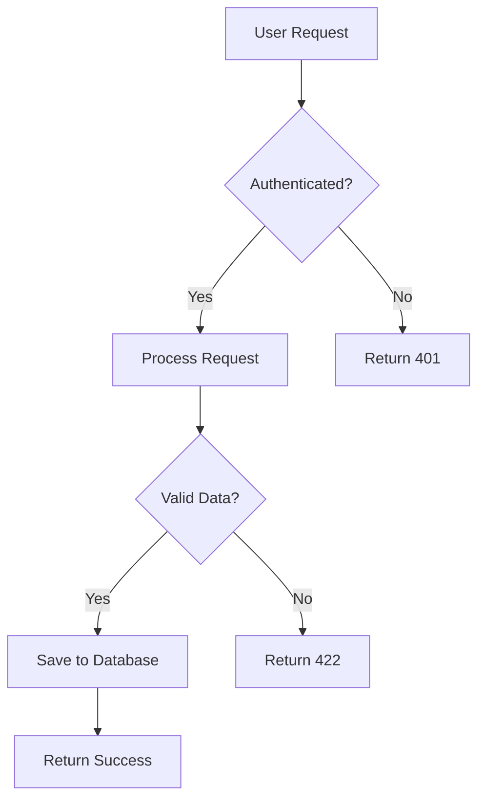
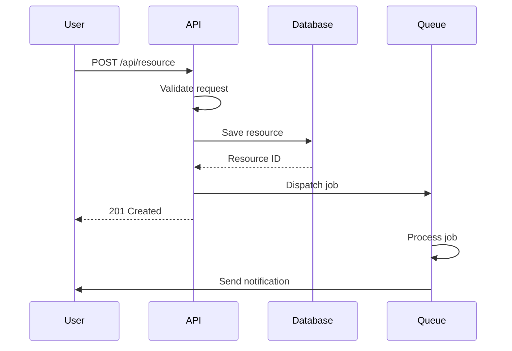

# Documentation Common Snippets

> 📋 **Purpose**: Ready-to-use snippets for consistent documentation  
> 📅 **Last Updated**: 2025-01-10  
> 🎯 **Usage**: Copy, paste, and customize

## Document Headers

### Standard Header
```markdown
# Document Title

> 📋 **Type**: Guide  
> 📅 **Last Updated**: 2025-01-10  
> 👥 **Maintained By**: Team Name  
> 🔗 **Related**: [Link 1](./link1.md) | [Link 2](./link2.md)
```

### API Documentation Header
```markdown
# API Endpoint Name

> 🔌 **Endpoint**: `GET /api/v1/resource`  
> 🔐 **Authentication**: Required  
> 📅 **Since**: v2.0.0  
> 🚦 **Rate Limit**: 60 requests/minute
```

### Feature Documentation Header
```markdown
# Feature Name

> ✨ **Status**: Beta  
> 📅 **Released**: v2.1.0  
> 🎯 **Target Users**: Pro and Enterprise  
> 📊 **Usage**: 85% adoption rate
```

## Common Sections

### Prerequisites Section
```markdown
## Prerequisites

Before you begin, ensure you have:

- ✅ PHP 8.3 or higher installed
- ✅ Composer dependency manager
- ✅ MySQL 8.0 or MariaDB 10.5+
- ✅ Redis server running
- ✅ Valid API credentials

**Check your environment:**
```bash
php --version
composer --version
mysql --version
```
````

### Installation Section
```markdown
## Installation

### Option 1: Composer (Recommended)
```bash
composer require askproai/package-name
```

### Option 2: Manual Installation
1. Download the latest release
2. Extract to your project directory
3. Include the autoloader:
   ```php
   require_once 'vendor/autoload.php';
   ```

### Verify Installation
```bash
php artisan package:verify
```
````

### Configuration Section
```markdown
## Configuration

### Environment Variables
Add these to your `.env` file:

```env
# Required
SERVICE_API_KEY=your-api-key-here
SERVICE_API_SECRET=your-secret-here

# Optional
SERVICE_TIMEOUT=30
SERVICE_RETRY_ATTEMPTS=3
SERVICE_DEBUG=false
```

### Configuration File
Publish the configuration file:
```bash
php artisan vendor:publish --tag=config
```

Edit `config/service.php`:
```php
return [
    'api_key' => env('SERVICE_API_KEY'),
    'timeout' => env('SERVICE_TIMEOUT', 30),
];
```
````

## Code Examples

### PHP Class Example
```markdown
### Basic Usage

```php
<?php

use AskProAI\Service;

// Initialize the service
$service = new Service([
    'api_key' => 'your-api-key',
    'timeout' => 30,
]);

// Make a request
try {
    $result = $service->doSomething([
        'param1' => 'value1',
        'param2' => 'value2',
    ]);
    
    echo "Success: " . $result->getId();
} catch (ServiceException $e) {
    echo "Error: " . $e->getMessage();
}
```
````

### API Request Example
```markdown
### API Request Example

```bash
curl -X POST https://api.askproai.de/api/v1/resource \
  -H "Authorization: Bearer YOUR_API_KEY" \
  -H "Content-Type: application/json" \
  -d '{
    "name": "Example Resource",
    "type": "demo",
    "settings": {
      "enabled": true
    }
  }'
```

**Response:**
```json
{
  "data": {
    "id": "res_123",
    "type": "resource",
    "attributes": {
      "name": "Example Resource",
      "created_at": "2025-01-10T10:00:00Z"
    }
  }
}
```
````

### JavaScript Example
```markdown
### JavaScript Integration

```javascript
// Import the client
import { AskProAIClient } from '@askproai/sdk';

// Initialize
const client = new AskProAIClient({
  apiKey: process.env.ASKPROAI_API_KEY,
  environment: 'production'
});

// Async/await usage
async function createResource() {
  try {
    const resource = await client.resources.create({
      name: 'My Resource',
      type: 'example'
    });
    
    console.log('Created:', resource.id);
  } catch (error) {
    console.error('Error:', error.message);
  }
}

// Promise usage
client.resources.list()
  .then(resources => {
    console.log(`Found ${resources.length} resources`);
  })
  .catch(error => {
    console.error('Error:', error);
  });
```
````

## Alert Boxes

### Information Box
```markdown
> ℹ️ **Note**: This feature requires version 2.0 or higher. Check your version with `php artisan --version`.
```

### Success Message
```markdown
> ✅ **Success**: Your configuration is complete! You can now start using the service.
```

### Warning Box
```markdown
> ⚠️ **Warning**: This action cannot be undone. Make sure to backup your data before proceeding.
```

### Error/Danger Box
```markdown
> 🚨 **Danger**: Never commit your API keys to version control. Use environment variables instead.
```

### Tip Box
```markdown
> 💡 **Tip**: Use the `--verbose` flag to see detailed output during debugging.
```

## Tables

### Parameter Table
```markdown
| Parameter | Type | Required | Default | Description |
|-----------|------|----------|---------|-------------|
| `api_key` | string | Yes | - | Your API key |
| `timeout` | integer | No | 30 | Request timeout in seconds |
| `retry` | boolean | No | true | Enable automatic retries |
| `debug` | boolean | No | false | Enable debug logging |
```

### Comparison Table
```markdown
| Feature | Free | Pro | Enterprise |
|---------|------|-----|------------|
| API Calls | 1,000/month | 100,000/month | Unlimited |
| Support | Community | Email | 24/7 Phone |
| SLA | - | 99.9% | 99.99% |
| Custom Domain | ❌ | ✅ | ✅ |
| SSO | ❌ | ❌ | ✅ |
```

### Status Table
```markdown
| Component | Status | Last Check | Notes |
|-----------|--------|------------|-------|
| API | 🟢 Operational | 2025-01-10 10:00 | All systems normal |
| Database | 🟢 Operational | 2025-01-10 10:00 | Performance optimal |
| Queue | 🟡 Degraded | 2025-01-10 10:00 | High load, scaling up |
| Storage | 🟢 Operational | 2025-01-10 10:00 | 45% capacity |
```

## Troubleshooting Templates

### Common Issue Template
```markdown
### Issue: Error Message Here

**Symptoms:**
- Specific error message
- When it occurs
- What stops working

**Cause:**
Brief explanation of why this happens

**Solution:**
1. First step to resolve
2. Second step
3. Verification step

**Example:**
```bash
# Command that fixes the issue
php artisan cache:clear
```

**Prevention:**
- How to avoid this issue
- Best practices
```

### Debug Steps Template
```markdown
### Debugging Steps

1. **Enable Debug Mode**
   ```bash
   # In .env file
   APP_DEBUG=true
   LOG_LEVEL=debug
   ```

2. **Check Logs**
   ```bash
   tail -f storage/logs/laravel.log
   ```

3. **Test Connection**
   ```bash
   php artisan service:test-connection
   ```

4. **Verify Configuration**
   ```bash
   php artisan config:show service
   ```
```

## API Documentation

### Endpoint Documentation
```markdown
### Create Resource

Creates a new resource with the specified attributes.

**Endpoint:** `POST /api/v1/resources`  
**Authentication:** Required  
**Rate Limit:** 100 requests per hour

#### Request

**Headers:**
| Header | Value | Required |
|--------|-------|----------|
| Authorization | Bearer {token} | Yes |
| Content-Type | application/json | Yes |

**Body:**
```json
{
  "name": "string (required)",
  "description": "string (optional)",
  "settings": {
    "key": "value"
  }
}
```

#### Response

**Success (201 Created):**
```json
{
  "data": {
    "id": "res_123",
    "type": "resource",
    "attributes": {
      "name": "My Resource",
      "created_at": "2025-01-10T10:00:00Z"
    }
  }
}
```

**Error (422 Validation Error):**
```json
{
  "errors": [
    {
      "title": "Validation Error",
      "detail": "The name field is required.",
      "source": {
        "pointer": "/data/attributes/name"
      }
    }
  ]
}
```
````

## Diagrams

### Flow Diagram
````markdown

````

### Sequence Diagram
````markdown

````

## Version Information

### Version Badge
```markdown


```

### Version Requirements
```markdown
## System Requirements

| Component | Minimum | Recommended | Notes |
|-----------|---------|-------------|-------|
| PHP | 8.1 | 8.3 | 8.0 support ended |
| MySQL | 8.0 | 8.0.35 | MariaDB 10.5+ also supported |
| Redis | 6.0 | 7.0 | For caching and queues |
| Node.js | 16 | 20 | For asset compilation |
```

### Deprecation Notice
```markdown
> ⚠️ **Deprecation Notice**: The `oldMethod()` is deprecated as of v2.0.0 and will be removed in v3.0.0. Use `newMethod()` instead.

**Migration example:**
```php
// Old way (deprecated)
$service->oldMethod($param);

// New way
$service->newMethod(['param' => $param]);
```
```

## Quick Copy Templates

### TODO Comment
```markdown
<!-- TODO: Add example for error handling -->
<!-- FIXME: Update this section after v2.1 release -->
<!-- NOTE: This requires admin permissions -->
```

### Link References
```markdown
[laravel-docs]: https://laravel.com/docs
[api-reference]: /docs/api/reference.md
[troubleshooting]: #troubleshooting
```

### Collapsible Section
```markdown
<details>
<summary>Click to expand advanced options</summary>

### Advanced Configuration

Additional options for power users...

</details>
```

### Copy Button
```markdown
```bash
# Click the copy button to copy this command
php artisan migrate --force
```
<button onclick="navigator.clipboard.writeText('php artisan migrate --force')">📋 Copy</button>
```

---

> 🔄 **Auto-Updated**: This documentation is automatically checked for updates. Last verification: 2025-01-10