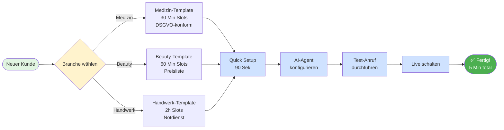
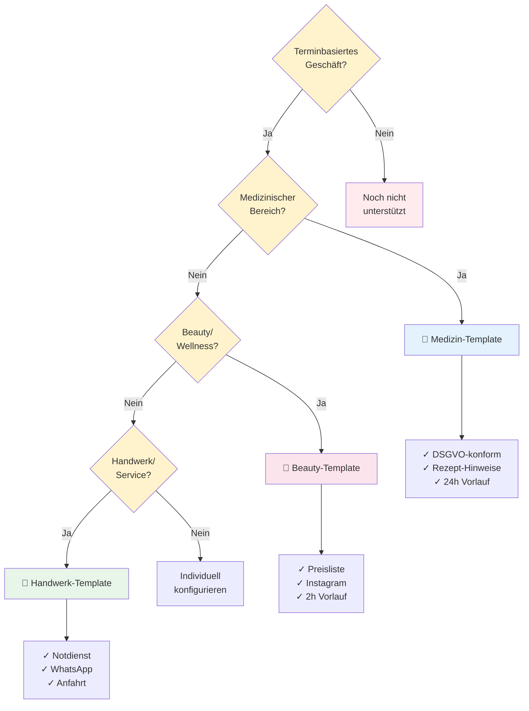
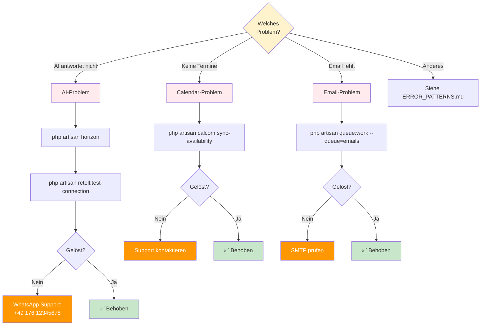

# 🚀 5-Minuten Onboarding Playbook für AskProAI

> **Ziel**: Neuer Kunde ist in 5 Minuten live und empfängt Termine!

## ⏱️ Zeitplan
- **Minute 1-2**: Branche wählen & Account anlegen
- **Minute 3-4**: AI-Agent konfigurieren & testen
- **Minute 5**: Live schalten & ersten Testanruf

## 📊 Onboarding-Prozess Übersicht



---

## 📋 SCHRITT 1: Branche wählen (30 Sek)

### Branchen-Entscheidungsbaum



### 🏥 **Medizin** (Arzt, Zahnarzt, Physiotherapie)
```bash
./setup-customer.sh --template="medical" --company="$FIRMENNAME"
```
**Voreinstellungen**:
- Terminlänge: 30 Min
- Vorlaufzeit: 24 Stunden
- DSGVO-konform
- Rezept-Hinweise aktiviert

### 💇 **Beauty** (Friseur, Kosmetik, Nails)
```bash
./setup-customer.sh --template="beauty" --company="$FIRMENNAME"
```
**Voreinstellungen**:
- Terminlänge: 60 Min
- Vorlaufzeit: 2 Stunden
- Preisliste integriert
- Instagram-Verlinkung

### 🔧 **Handwerk** (Installateur, Elektriker, KFZ)
```bash
./setup-customer.sh --template="craftsman" --company="$FIRMENNAME"
```
**Voreinstellungen**:
- Terminlänge: 2 Stunden
- Notdienst-Routing
- Anfahrtskosten-Hinweis
- WhatsApp-Integration

---

## 📋 SCHRITT 2: Basis-Setup (90 Sek)

### Quick Setup Command:
```bash
# Alles in einem Befehl!
php artisan askpro:quick-setup \
  --company="Zahnarztpraxis Dr. Schmidt" \
  --phone="+49 30 12345678" \
  --email="info@dr-schmidt.de" \
  --branch="Hauptpraxis Berlin"
```

### ✅ Was passiert automatisch:
- [x] Company wird angelegt
- [x] Branch wird erstellt  
- [x] Telefonnummer wird verknüpft
- [x] Retell Agent wird provisioniert
- [x] Cal.com Event Type wird erstellt
- [x] Email-Templates werden geladen

---

## 📋 SCHRITT 3: AI-Agent Prompt (60 Sek)

### 🏥 **Medizin Template**:
```
Du bist die freundliche Empfangskraft der {{company_name}}.

WICHTIG:
- Begrüße mit: "Praxis {{company_name}}, guten Tag!"
- Frage nach Versichertenstatus (Gesetzlich/Privat)
- Biete nur Termine ab morgen an
- Weise auf Terminabsage 24h vorher hin
- Beende mit: "Vielen Dank und auf Wiederhören!"

SERVICES:
- Erstberatung (30 Min)
- Kontrolltermin (15 Min)
- Behandlung (45 Min)
```

### 💇 **Beauty Template**:
```
Du bist die Rezeption von {{company_name}}.

BEGRÜSSUNG: "{{company_name}}, schönen guten Tag!"

WICHTIG:
- Frage nach gewünschter Behandlung
- Erwähne Preise bei Nachfrage
- Biete Zusatzservices an (z.B. Maniküre)
- Instagram: @{{instagram_handle}}

SERVICES:
- Haarschnitt Damen (45 Min) - 45€
- Haarschnitt Herren (30 Min) - 25€
- Farbe & Schnitt (120 Min) - 120€
```

### 🛠️ **Copy-Paste in Retell Dashboard**:
1. Gehe zu: https://dashboard.retellai.com/agents
2. Klicke auf deinen Agent
3. Füge Prompt ein → Save

---

## 📋 SCHRITT 4: Test-Anruf (60 Sek)

### 📞 **Test-Skript für ersten Anruf**:
```
1. Wähle: {{phone_number}}
2. Sage: "Ich möchte einen Termin vereinbaren"
3. Antworte auf Fragen (Service, Datum, Zeit)
4. Bestätige mit "Ja, passt perfekt"
5. Lege auf
```

### ✅ **Erfolgs-Checkliste**:
- [ ] AI hat freundlich begrüßt
- [ ] Verfügbare Termine wurden angeboten
- [ ] Kundendaten wurden korrekt erfasst
- [ ] Termin erscheint im Admin-Panel
- [ ] Bestätigungs-Email wurde versendet

### 🚨 **Fehler? Quick-Fixes**:



```bash
# AI antwortet nicht?
php artisan horizon
php artisan retell:test-connection

# Keine Termine verfügbar?
php artisan calcom:sync-availability

# Email kommt nicht?
php artisan queue:work --queue=emails
```

---

## 🎯 SCHRITT 5: Live schalten (30 Sek)

### ✅ **Final Checklist**:
```bash
# Automatischer Go-Live Check
php artisan askpro:preflight-check

# Ausgabe sollte sein:
✅ Retell Agent: Active
✅ Phone Number: Connected  
✅ Cal.com: Synced
✅ Email: Configured
✅ Webhooks: Verified

🚀 READY FOR PRODUCTION!
```

### 📱 **Kunde informieren**:
```
Lieber Kunde,

Ihre AI-Telefonassistentin ist jetzt aktiv! 🎉

✅ Telefonnummer: {{phone_number}}
✅ Verfügbar: 24/7
✅ Admin-Panel: https://app.askproai.de

Erste Schritte:
1. Machen Sie einen Testanruf
2. Prüfen Sie den Termin im Admin-Panel
3. Passen Sie bei Bedarf den AI-Text an

Bei Fragen: support@askproai.de oder 0800-ASKPRO-AI

Viel Erfolg!
Ihr AskProAI Team
```

---

## 🆘 Notfall-Support

**Problem nicht gelöst?**
1. WhatsApp Hotline: +49 176 12345678
2. Email: urgent@askproai.de
3. Remote-Support: https://askproai.de/screenshare

**Häufigste Probleme**:
- "Webhook failed" → Siehe ERROR_PATTERNS.md Code WEBHOOK_001
- "Keine Anrufe" → Siehe ERROR_PATTERNS.md Code RETELL_001
- "DB Error" → Siehe ERROR_PATTERNS.md Code DB_001

---

## 🎓 Weiterführende Ressourcen

Nach erfolgreichem Onboarding:
- **Erweiterte Konfiguration**: ADVANCED_CONFIG.md
- **Multi-Branch Setup**: MULTI_LOCATION_GUIDE.md
- **Custom Prompts**: AI_PROMPT_ENGINEERING.md
- **Analytics Setup**: KPI_DASHBOARD_TEMPLATE.md

> 💡 **Pro-Tipp**: Speichern Sie dieses Playbook als PDF für Ihre Kunden!