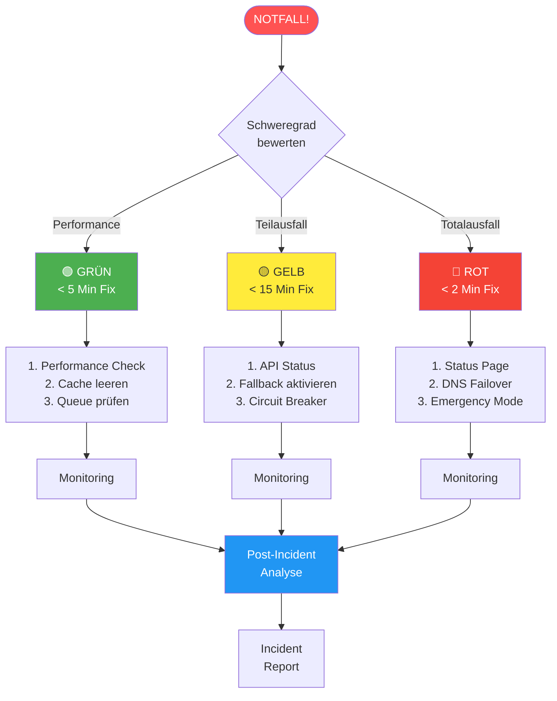
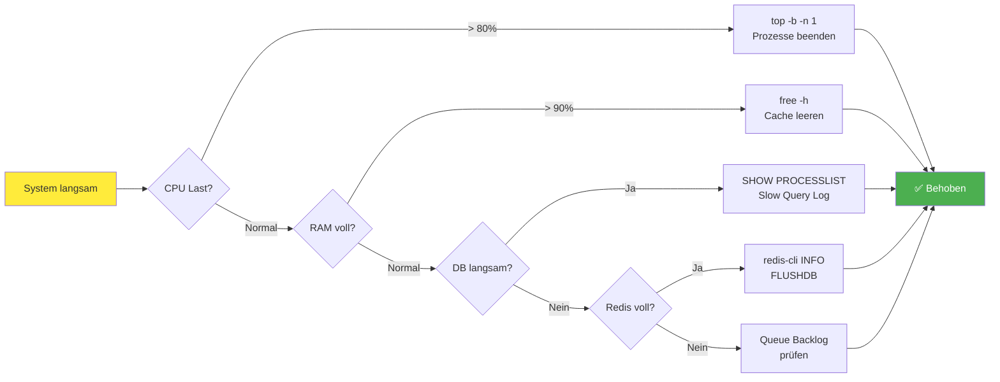
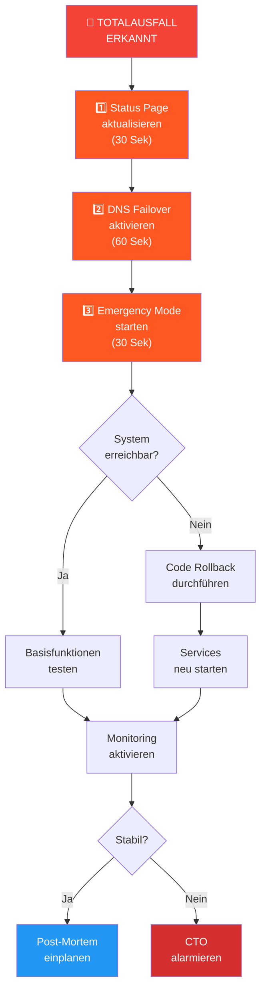
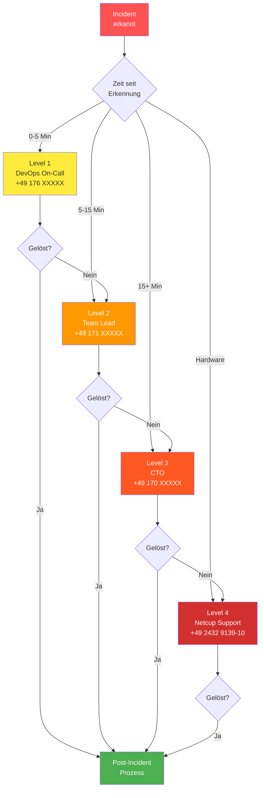

# 🚨 EMERGENCY RESPONSE PLAYBOOK - 24/7 Notfall-Prozeduren

> **KRITISCH**: Bei Totalausfall SOFORT zur [🔴 ROTE ZONE](#rote-zone-totalausfall)

## ⚡ QUICK EMERGENCY COMMAND
```bash
# Ein-Befehl-Notfall-Diagnose
./emergency-response.sh --auto-fix
```

## 📈 Emergency Response Flow



---

## 🚦 NOTFALL-KATEGORIEN

### 🟢 GRÜN: Performance-Probleme (Fix: < 5 Min)
- Langsame Responses
- Einzelne fehlgeschlagene Calls
- Email-Verzögerungen

### 🟡 GELB: Teilausfälle (Fix: < 15 Min)
- Retell API Down
- Cal.com Sync-Fehler
- Webhook-Ausfälle

### 🔴 ROT: Totalausfall (Fix: < 2 Min)
- Keine Anrufe möglich
- Datenbank nicht erreichbar
- Kompletter Service Down

---

## 🟢 GRÜNE ZONE: Performance-Probleme

### Diagnose-Flowchart



### Problem: "System reagiert langsam"
```bash
# 1. Quick Performance Check
php artisan performance:emergency-check

# 2. Cache leeren
php artisan optimize:clear
redis-cli FLUSHDB

# 3. Queue-Backlog prüfen
php artisan horizon:status
php artisan queue:clear webhooks

# 4. Database Connections resetten
php artisan db:reconnect
```

### Problem: "Einzelne Anrufe schlagen fehl"
```bash
# Letzte Fehler anzeigen
tail -n 50 storage/logs/laravel.log | grep -E "ERROR|CRITICAL"

# Betroffene Company identifizieren
php artisan calls:show-failed --last-hour

# Company-spezifischer Fix
php artisan company:reset-integration --id=X
```

---

## 🟡 GELBE ZONE: Teilausfälle

### Problem: "Retell.ai nicht erreichbar"
```bash
# 1. Status prüfen
curl -s https://api.retellai.com/health || echo "RETELL DOWN"

# 2. Fallback aktivieren
php artisan config:set retell.fallback_mode=true
php artisan cache:clear

# 3. Calls queuen für später
php artisan retell:enable-queue-mode

# 4. Kunden-Notification
php artisan notify:customers --message="Temporäre Wartung, Anrufe in 15 Min wieder möglich"
```

### Problem: "Cal.com Sync ausgefallen"
```bash
# 1. Circuit Breaker Status
php artisan circuit-breaker:status calcom

# 2. Circuit Breaker Reset
php artisan circuit-breaker:reset calcom --force

# 3. Manual Sync
php artisan calcom:emergency-sync --next-hours=24

# 4. Local Cache aktivieren
php artisan config:set calcom.use_cache_fallback=true
```

### Problem: "Webhooks kommen nicht an"
```bash
# 1. Webhook-Queue Status
php artisan webhook:queue-status

# 2. Signature-Verification temporär deaktivieren
php artisan config:set webhook.verify_signature=false
php artisan cache:clear

# 3. Webhook-Replay für letzte Stunde
php artisan webhook:replay --since="1 hour ago"

# 4. Alternative Webhook-URL
php artisan webhook:set-fallback-url https://backup.askproai.de/webhook
```

---

## 🔴 ROTE ZONE: Totalausfall

### SOFORT-MAßNAHMEN (Reihenfolge beachten!)



#### 1️⃣ **Status-Page aktualisieren** (30 Sek)
```bash
curl -X POST https://api.statuspage.io/v1/incidents \
  -H "Authorization: OAuth YOUR_TOKEN" \
  -d '{"incident":{"name":"Service-Unterbrechung","status":"investigating"}}'
```

#### 2️⃣ **Failover aktivieren** (60 Sek)
```bash
# DNS auf Backup-Server umschalten
./dns-failover.sh --target=backup-server

# Oder manuell bei Netcup:
# 1. Login: https://www.customercontrolpanel.de
# 2. Domains → askproai.de → DNS
# 3. A-Record ändern zu: 185.243.112.224 (Backup)
```

#### 3️⃣ **Emergency Mode aktivieren** (30 Sek)
```bash
# Auf Backup-Server
ssh emergency@backup.askproai.de
sudo ./activate-emergency-mode.sh

# Minimaler Service läuft mit:
# - Static Landing Page
# - Queue für eingehende Calls
# - Auto-Response "Rückruf in 30 Min"
```

### ROLLBACK bei Code-Problemen
```bash
# 1. Letzten funktionierenden Stand
cd /var/www/api-gateway
git log --oneline -10  # Finde letzten stabilen Commit

# 2. Hard Reset
git reset --hard STABLE_COMMIT_HASH

# 3. Dependencies restaurieren
composer install
npm ci

# 4. Services neu starten
sudo systemctl restart php8.3-fpm
php artisan horizon:terminate
php artisan up
```

### DATENBANK-NOTFALL
```bash
# 1. Connection testen
mysql -u root -p'V9LGz2tdR5gpDQz' -e "SELECT 1"

# 2. Bei Fehler: Failover zu Backup-DB
php artisan config:set database.default=mysql_backup
php artisan config:cache

# 3. Letzte Backup restaurieren
mysql -u root -p'V9LGz2tdR5gpDQz' askproai_db < /backups/latest.sql

# 4. Consistency Check
php artisan db:verify-integrity
```

---

## 📞 ESKALATIONS-KETTE



### Level 1: DevOps On-Call (0-5 Min)
```
WhatsApp: +49 176 DEVOPS-ONCALL
Automatisch via: ./alert-oncall.sh
```

### Level 2: Team Lead (5-15 Min)
```
Mobile: +49 171 TEAMLEAD
Slack: @teamlead-emergency
```

### Level 3: CTO (15+ Min)
```
Mobile: +49 170 CTO-MOBILE
Email: cto-emergency@askproai.de
```

### Level 4: Netcup Support (Server-Hardware)
```
Hotline: +49 2432 9139-10
Ticket: https://www.customercontrolpanel.de
Login: hosting215275
```

---

## 🔧 AUTOMATISIERTE RECOVERY SCRIPTS

### `emergency-response.sh`
```bash
#!/bin/bash
set -e

echo "🚨 EMERGENCY RESPONSE AKTIVIERT"

# Auto-Diagnose
echo "1️⃣ Checking Services..."
systemctl is-active mysql || sudo systemctl start mysql
systemctl is-active redis || sudo systemctl start redis
systemctl is-active php8.3-fpm || sudo systemctl start php8.3-fpm

echo "2️⃣ Checking APIs..."
curl -f https://api.retellai.com/health || echo "⚠️ Retell Down"
curl -f https://api.cal.com/health || echo "⚠️ Cal.com Down"

echo "3️⃣ Auto-Fixing Common Issues..."
php artisan optimize:clear
php artisan horizon:terminate && php artisan horizon &
php artisan config:cache

echo "4️⃣ Running Health Check..."
php artisan health:check

echo "✅ Emergency Response Complete!"
```

### `quick-restore.sh`
```bash
#!/bin/bash
# Schnell-Wiederherstellung in < 2 Min

# 1. Code auf letzten stabilen Stand
git reset --hard $(cat LAST_STABLE_VERSION)

# 2. Services neu starten
sudo systemctl restart mysql redis php8.3-fpm

# 3. Caches leeren
php artisan optimize:clear
redis-cli FLUSHALL

# 4. Basis-Check
curl -f https://api.askproai.de/health
```

---

## 📊 POST-INCIDENT CHECKLIST

Nach Behebung IMMER durchführen:

### 1. Verification (5 Min)
```bash
php artisan askpro:post-incident-check
```

### 2. Customer Communication
```bash
# Email an betroffene Kunden
php artisan notify:incident-resolved --affected-last-hour
```

### 3. Incident Report
```bash
# Automatischer Report
php artisan incident:generate-report --output=incident-$(date +%Y%m%d).md
```

### 4. Preventive Measures
- [ ] Root Cause analysieren
- [ ] Monitoring verbessern
- [ ] Runbook aktualisieren
- [ ] Team-Briefing planen

---

## 🛡️ PRÄVENTIVE MAßNAHMEN

### Tägliche Checks (Cron)
```cron
# Automated Emergency Preparedness
0 */6 * * * /var/www/api-gateway/emergency-preparedness-check.sh
```

### Wöchentliche Disaster Recovery Tests
```bash
# Jeden Montag 3 Uhr
0 3 * * 1 /var/www/api-gateway/disaster-recovery-test.sh
```

### Monatliches Backup-Verify
```bash
# Backup-Integrität prüfen
php artisan backup:verify --all --notify-slack
```

---

## 💡 NOTFALL-KONTAKTE WALLET CARD

```
🚨 ASKPROAI NOTFALL 🚨
─────────────────────
DevOps:  +49 176 XXX
Backup:  +49 171 XXX  
CTO:     +49 170 XXX
─────────────────────
Server:  Netcup #215275
Support: +49 2432 9139-10
─────────────────────
Status:  status.askproai.de
Backup:  185.243.112.224
```

> ⚠️ **WICHTIG**: Dieses Playbook monatlich reviewen und aktualisieren!