# 🏥 Integration Health Monitor - Real-time Status & Alerts

> **Live Dashboard**: https://app.askproai.de/health

## 🚦 QUICK STATUS CHECK
```bash
# Ein-Befehl Gesundheits-Check
php artisan health:check --all

# Output:
✅ Retell.ai    : HEALTHY (45ms)
⚠️  Cal.com      : DEGRADED (850ms)
✅ Database     : HEALTHY (12ms)
✅ Redis        : HEALTHY (3ms)
✅ Email (SMTP) : HEALTHY (125ms)
```

## 📈 System Health Flow

```mermaid
flowchart TB
    subgraph Monitoring["Health Monitoring"]
        Metrics["Metrics<br/>Collection"]
        Checks["Health<br/>Checks"]
        Alerts["Alert<br/>Engine"]
    end
    
    subgraph Services["Services"]
        Retell["Retell.ai<br/>🟢 45ms"]
        Calcom["Cal.com<br/>🟡 850ms"]
        DB["Database<br/>🟢 12ms"]
        Redis["Redis<br/>🟢 3ms"]
    end
    
    subgraph Actions["Automated Actions"]
        CB["Circuit<br/>Breaker"]
        Heal["Self<br/>Healing"]
        Notify["Alert<br/>Channels"]
    end
    
    Services --> Metrics
    Metrics --> Checks
    Checks --> Alerts
    
    Alerts -->|"Threshold"| CB
    Alerts -->|"Pattern"| Heal
    Alerts -->|"Critical"| Notify
    
    CB --> Services
    Heal --> Services
    
    style Retell fill:#d4edda,stroke:#28a745
    style Calcom fill:#fff3cd,stroke:#ffc107
    style DB fill:#d4edda,stroke:#28a745
    style Redis fill:#d4edda,stroke:#28a745
```



---

## 📊 LIVE STATUS DASHBOARD

### 🎯 Gesamtsystem-Status
```
┌─────────────────────────────────────────────────────┐
│ ASKPROAI SYSTEM HEALTH: 98.5% ████████████████████░ │
├─────────────────────────────────────────────────────┤
│ Uptime: 45d 13h 27m | Last Incident: 72h ago       │
│ Active Calls: 47 | Queue Depth: 12 | Error Rate: 0.3% │
└─────────────────────────────────────────────────────┘
```

### 🔌 Integration Status Matrix

| Service | Status | Latenz | Uptime (30d) | Circuit Breaker | Action |
|---------|--------|--------|--------------|-----------------|--------|
| **Retell.ai** | 🟢 OK | 45ms | 99.97% | CLOSED | - |
| **Cal.com** | 🟡 SLOW | 850ms | 98.2% | HALF-OPEN | [Optimize](#calcom-optimize) |
| **MySQL** | 🟢 OK | 12ms | 99.99% | CLOSED | - |
| **Redis** | 🟢 OK | 3ms | 100% | CLOSED | - |
| **SMTP** | 🟢 OK | 125ms | 99.5% | CLOSED | - |
| **Webhook Queue** | 🟢 OK | - | - | - | 12 pending |

---

## 🔔 ALERT KONFIGURATION

### Alert Flow Diagram

```mermaid
stateDiagram-v2
    [*] --> Monitoring: System läuft
    
    Monitoring --> Threshold: Metrik überschreitet Schwellwert
    Threshold --> Evaluation: Alert Rule prüfen
    
    Evaluation --> Minor: Severity = Low
    Evaluation --> Major: Severity = Warning  
    Evaluation --> Critical: Severity = Critical
    
    Minor --> Log: Log only
    Major --> Slack: Slack Notification
    Critical --> AllChannels: Alle Kanäle
    
    AllChannels --> SMS: SMS Alert
    AllChannels --> Email: Email Alert
    AllChannels --> PagerDuty: PagerDuty
    AllChannels --> Slack2: Slack Alert
    
    Log --> Recovery
    Slack --> Recovery
    SMS --> Incident
    Email --> Incident
    PagerDuty --> Incident
    Slack2 --> Incident
    
    Incident --> WarRoom: War Room eröffnet
    WarRoom --> Resolution: Problem gelöst
    Resolution --> PostMortem: Post-Mortem
    PostMortem --> Recovery
    
    Recovery --> Monitoring: Zurück zu Normal
    
    note right of Critical
        Beispiele:
        - Service Down
        - Error Rate > 10%
        - Database Offline
    end note
    
    note right of Major
        Beispiele:
        - Hohe Latenz
        - Memory > 80%
        - Queue Backlog
    end note
```



### 📱 Alert Channels
```yaml
alerts:
  channels:
    - type: slack
      webhook: ${SLACK_WEBHOOK_URL}
      severity: [critical, warning]
    
    - type: email
      to: [ops@askproai.de, cto@askproai.de]
      severity: [critical]
    
    - type: sms
      to: [+49176EMERGENCY]
      severity: [critical]
      provider: twilio
    
    - type: pagerduty
      api_key: ${PAGERDUTY_KEY}
      severity: [critical]
```

### 🚨 Alert Rules

#### KRITISCH (Sofort-Alarm)
```yaml
critical_alerts:
  - name: "Service Komplett-Ausfall"
    condition: "service.status == DOWN for 1 minute"
    services: [retell, calcom, database]
    action: 
      - notify: all_channels
      - auto_failover: true
      - create_incident: true
  
  - name: "Error Rate Spike"
    condition: "error_rate > 10% for 2 minutes"
    action:
      - notify: [slack, email]
      - enable_debug_mode: true
  
  - name: "Queue Überlauf"
    condition: "queue_depth > 1000"
    action:
      - notify: [slack]
      - scale_workers: true
```

#### WARNUNG (Team-Notification)
```yaml
warning_alerts:
  - name: "Hohe Latenz"
    condition: "latency > 500ms for 5 minutes"
    services: [calcom, retell]
    action:
      - notify: [slack]
      - log_performance_trace: true
  
  - name: "Memory Usage"
    condition: "memory > 80%"
    action:
      - notify: [slack]
      - trigger_gc: true
  
  - name: "Niedrige Conversion"
    condition: "conversion_rate < 40% for 1 hour"
    action:
      - notify: [slack]
      - suggest_optimization: true
```

---

## 📈 METRIKEN & MONITORING

### Real-time Metriken
```bash
# Live Metrics Stream
php artisan metrics:stream

# Output:
┌─ LIVE METRICS ──────────────────────────────┐
│ Requests/sec: 127                           │
│ Avg Response: 187ms                         │
│ Active Users: 342                           │
│ CPU Usage: 42%                              │
│ Memory: 2.1GB/4GB                           │
│ Disk I/O: 12MB/s                            │
└─────────────────────────────────────────────┘
```

### Service-spezifische Checks

#### 🤖 Retell.ai Health
```bash
# Detaillierter Retell Check
php artisan health:retell --detailed

# Checks:
✓ API Erreichbarkeit
✓ Agent Status (alle aktiv)
✓ Webhook Delivery Rate: 99.8%
✓ Call Success Rate: 94%
✓ Credit Balance: 12,453€
```

#### 📅 Cal.com Health
```bash
# Cal.com Integration Check
php artisan health:calcom --detailed

# Checks:
✓ API v2 Erreichbarkeit
⚠ Response Zeit: 850ms (Ziel: <500ms)
✓ Event Types synced: 45/45
✓ Availability Cache: Valid
✓ Booking Success: 98.2%
```

#### 💾 Database Health
```bash
# Database Performance Check
php artisan health:database --detailed

# Checks:
✓ Connection Pool: 23/100 used
✓ Slow Queries: 2 (threshold: 5)
✓ Replication Lag: 0ms
✓ Table Locks: 0
✓ Index Usage: 97%
```

---

## 🔧 AUTO-HEALING MECHANISMEN

### Circuit Breaker State Machine


### 1. Circuit Breaker Pattern
```php
// Automatische Konfiguration
'circuit_breaker' => [
    'failure_threshold' => 5,      // Fehler bis Open
    'success_threshold' => 2,      // Erfolge bis Close
    'timeout' => 60,              // Sekunden im Open State
    'half_open_max_requests' => 3, // Test-Requests
]
```

### 2. Automatische Recovery Actions
```yaml
auto_recovery:
  - trigger: "retell_api_timeout"
    actions:
      - increase_timeout: 10s
      - retry_with_backoff: true
      - switch_to_queue_mode: true
  
  - trigger: "calcom_slow_response"
    actions:
      - enable_cache_mode: true
      - reduce_sync_frequency: true
      - notify_team: true
  
  - trigger: "database_connection_lost"
    actions:
      - reconnect_attempt: 3
      - switch_to_read_replica: true
      - enable_emergency_cache: true
```

### 3. Self-Healing Scripts
```bash
# Auto-Fix Common Issues
./health-monitor/auto-heal.sh

# Aktionen:
- Cache leeren bei Memory > 90%
- Queue Workers neustarten bei Stau
- Zombie Processes killen
- Stuck Locks aufräumen
- Failed Jobs retry
```

---

## 📊 HEALTH DASHBOARD HTML

```html
<!DOCTYPE html>
<html>
<head>
    <title>AskProAI Health Monitor</title>
    <script src="https://cdn.jsdelivr.net/npm/chart.js"></script>
    <style>
        .service-card {
            display: inline-block;
            width: 200px;
            margin: 10px;
            padding: 20px;
            border-radius: 10px;
            text-align: center;
        }
        .healthy { background: #10b981; color: white; }
        .warning { background: #f59e0b; color: white; }
        .critical { background: #ef4444; color: white; }
        .metric { font-size: 36px; font-weight: bold; }
        .label { font-size: 14px; opacity: 0.8; }
    </style>
</head>
<body>
    <h1>🏥 AskProAI Health Monitor</h1>
    
    <div id="services">
        <div class="service-card healthy">
            <div class="label">Retell.ai</div>
            <div class="metric">45ms</div>
            <div class="label">99.97% Uptime</div>
        </div>
        
        <div class="service-card warning">
            <div class="label">Cal.com</div>
            <div class="metric">850ms</div>
            <div class="label">98.2% Uptime</div>
        </div>
    </div>
    
    <canvas id="latencyChart"></canvas>
    
    <script>
    // WebSocket für Live-Updates
    const ws = new WebSocket('wss://api.askproai.de/health/stream');
    
    ws.onmessage = (event) => {
        const data = JSON.parse(event.data);
        updateServiceCards(data.services);
        updateLatencyChart(data.latency);
    };
    
    // Auto-Refresh alle 5 Sekunden
    setInterval(() => {
        fetch('/api/health/status')
            .then(res => res.json())
            .then(data => updateDashboard(data));
    }, 5000);
    </script>
</body>
</html>
```

---

## 🚨 INCIDENT RESPONSE

### Automatisches Incident Management
```bash
# Incident wird automatisch erstellt bei:
- Service Down > 1 Minute
- Error Rate > 10%
- Multiple Alerts gleichzeitig

# Incident Response Flow:
1. Alert triggered
2. Incident created (ID: INC-2024-001)
3. On-Call Engineer notified
4. War Room Slack Channel created
5. Status Page updated
6. Customer notification (wenn > 5 Min)
```

### Post-Incident Process
```bash
# Nach Behebung automatisch:
php artisan incident:close --id=INC-2024-001

# Generiert:
- Incident Timeline
- Root Cause Analysis Template
- Action Items
- Metrics Report
- Customer Communication
```

---

## 📱 MOBILE ALERTS APP

```javascript
// Push Notification Config
{
  "alert": {
    "title": "⚠️ Cal.com Degraded",
    "body": "Response time 850ms (threshold: 500ms)",
    "sound": "critical.wav",
    "badge": 1
  },
  "data": {
    "type": "service_degraded",
    "service": "calcom",
    "metric": "latency",
    "value": 850,
    "threshold": 500,
    "actions": ["view_details", "acknowledge", "escalate"]
  }
}
```

---

## 🔍 TROUBLESHOOTING GUIDE

### Service-spezifische Diagnose

#### "Retell.ai nicht erreichbar"
```bash
# 1. API Status prüfen
curl -I https://api.retellai.com/health

# 2. Failover aktivieren
php artisan config:set retell.failover=true

# 3. Alternative Route
php artisan retell:use-backup-endpoint
```

#### "Cal.com langsam"
```bash
# 1. Cache-Status prüfen
php artisan calcom:cache-status

# 2. Parallel Requests reduzieren
php artisan config:set calcom.max_concurrent=5

# 3. Read-Replica aktivieren
php artisan calcom:use-read-replica
```

#### "Database Overload"
```bash
# 1. Aktive Connections anzeigen
mysql -e "SHOW PROCESSLIST"

# 2. Slow Queries killen
php artisan db:kill-slow-queries --threshold=10

# 3. Emergency Mode
php artisan db:emergency-mode --read-only
```

---

## 🎯 PROAKTIVE WARTUNG

### Tägliche Health Checks (Automated)
```cron
# Crontab
0 6 * * * /usr/bin/php /var/www/api-gateway/artisan health:daily-check
0 */4 * * * /usr/bin/php /var/www/api-gateway/artisan health:quick-check
*/5 * * * * /usr/bin/php /var/www/api-gateway/artisan metrics:collect
```

### Wöchentliche Performance Review
```bash
# Automatischer Report jeden Montag
php artisan health:weekly-report --email=team@askproai.de

# Inhalt:
- Service Uptime Statistiken
- Performance Trends
- Error Rate Analysis
- Capacity Planning
- Optimization Empfehlungen
```

> 💡 **Dashboard URL**: https://app.askproai.de/health
> 📱 **Mobile App**: AskProAI Health (iOS/Android)