# 📞➡️📅 Telefon zu Termin - Interaktiver Datenfluss

> **Klickbar**: Jede Box kann angeklickt werden für Details & Debugging!

## 🎯 GESAMT-FLOW ÜBERSICHT

```mermaid
flowchart TB
    subgraph "1️⃣ ANRUF-PHASE"
        Phone["📞 Kunde ruft an<br/>+49 30 12345678"]
        Phone -->|"DNS Lookup<br/>~50ms"| Carrier["Telekom/Vodafone<br/>Carrier"]
        Carrier -->|"SIP Forward<br/>~200ms"| Retell["Retell.ai<br/>Cloud"]
    end
    
    subgraph "2️⃣ AI-DIALOG PHASE"
        Retell -->|"Agent Load<br/>~100ms"| Agent["AI Agent #123<br/>Aktiv"]
        Agent -->|"Begrüßung"| Dialog["Gespräch<br/>2-3 Min"]
        Dialog -->|"NLP Processing"| Intent["Intent erkannt:<br/>Termin buchen"]
        Intent -->|"Daten extrahiert"| Data["Name: Schmidt<br/>Service: Zahnreinigung<br/>Datum: 15.01.2024"]
    end
    
    subgraph "3️⃣ WEBHOOK PHASE"
        Data -->|"POST /api/retell/webhook<br/>~50ms"| Webhook["Webhook<br/>Controller"]
        Webhook -->|"HMAC-SHA256"| Valid{"Signature<br/>valid?"}
        Valid -->|"Nein"| Reject["🚫 401<br/>Unauthorized"]
        Valid -->|"Ja"| Queue["Laravel Queue<br/>webhooks"]
    end
    
    subgraph "4️⃣ PROCESSING PHASE"
        Queue -->|"Async Job"| Process["ProcessRetellCallEndedJob<br/>~2s"]
        Process -->|"Phone Lookup"| Branch["Branch gefunden:<br/>Hauptpraxis Berlin"]
        Branch -->|"Match/Create"| Customer["Customer:<br/>ID #4567"]
        Customer -->|"API Call"| Calcom["Cal.com<br/>Availability Check"]
    end
    
    subgraph "5️⃣ BOOKING PHASE"
        Calcom -->|"Slots?"| Book{"Slot<br/>verfügbar?"}
        Book -->|"Ja"| Create["Appointment<br/>erstellt"]
        Book -->|"Nein"| Alternative["Alternative<br/>vorschlagen"]
        Create -->|"Success"| Confirm["✅ Bestätigung<br/>Email + SMS"]
        Alternative -->|"Retry"| Calcom
    end
    
    style Phone fill:#e3f2fd,stroke:#1976d2
    style Agent fill:#e8f5e9,stroke:#388e3c
    style Webhook fill:#fff3e0,stroke:#f57c00
    style Create fill:#e8f5e9,stroke:#388e3c
    style Reject fill:#ffebee,stroke:#d32f2f
    style Valid fill:#fff9c4,stroke:#fbc02d
    style Book fill:#fff9c4,stroke:#fbc02d
```



---

## 🔍 DETAILLIERTE PHASE-ANALYSE

### 1️⃣ **ANRUF-PHASE** (0-3 Sekunden)

```mermaid
sequenceDiagram
    participant K as Kunde
    participant T as Telekom
    participant R as Retell.ai
    participant A as AskProAI
    
    K->>T: Wählt +49 30 12345678
    Note over T: DNS/Number Lookup
    T->>R: SIP INVITE
    R->>R: Load Agent Config
    R->>A: Webhook: call_started
    R->>K: "Guten Tag, Praxis..."
```



**🐛 Debug-Punkte:**
```bash
# Check 1: Telefonnummer aktiv?
curl https://api.retellai.com/v1/phone-number/check \
  -H "Authorization: Bearer $RETELL_KEY"

# Check 2: Agent zugewiesen?
php artisan phone:check-agent --number="+49301234567"

# Check 3: Webhook empfangen?
tail -f storage/logs/webhook.log | grep call_started
```

### 2️⃣ **AI-DIALOG PHASE** (3-180 Sekunden)

```mermaid
stateDiagram-v2
    [*] --> Begrüßung: Anruf angenommen
    
    Begrüßung --> NameAbfrage: "Guten Tag, Praxis..."
    NameAbfrage --> ServiceAbfrage: Name erhalten
    ServiceAbfrage --> TerminAbfrage: Service gewählt
    TerminAbfrage --> ZeitAbfrage: Datum genannt
    ZeitAbfrage --> Bestätigung: Zeit gewählt
    Bestätigung --> [*]: Termin bestätigt
    
    NameAbfrage --> NameAbfrage: Nicht verstanden
    ServiceAbfrage --> ServiceAbfrage: Unklar
    TerminAbfrage --> TerminAbfrage: Nachfrage
    
    note right of Begrüßung
        Dauer: 2-3 Sek
        "Praxis Dr. Schmidt,
        guten Tag!"
    end note
    
    note right of ServiceAbfrage
        Services:
        - Zahnreinigung
        - Kontrolle
        - Behandlung
    end note
    
    note right of Bestätigung
        "Perfekt! Termin für
        Zahnreinigung am 15.01.
        um 10:00 Uhr"
    end note
```



**💬 Prompt-Template:**
```javascript
{
  "greeting": "{{company_name}}, guten Tag! Wie kann ich Ihnen helfen?",
  "name_request": "Darf ich nach Ihrem Namen fragen?",
  "service_request": "Welche Behandlung wünschen Sie?",
  "date_request": "Wann hätten Sie gerne einen Termin?",
  "confirmation": "Ich bestätige: {{service}} am {{date}} um {{time}} Uhr."
}
```

**🐛 Debug-Commands:**
```bash
# Live-Transcript anzeigen
php artisan retell:live-transcript --call-id=XXX

# Intent-Analyse
php artisan ai:analyze-intent --call-id=XXX

# Slot-Extraction prüfen
php artisan ai:check-slots --call-id=XXX
```

### 3️⃣ **WEBHOOK PHASE** (< 100ms)


**📦 Webhook Payload:**
```json
{
  "event_type": "call_ended",
  "call_id": "9b6a7d8e-5f4c-3b2a-1d0e",
  "phone_number": "+49301234567",
  "transcript": "Kunde möchte Termin...",
  "custom_data": {
    "name": "Schmidt",
    "service": "Zahnreinigung",
    "preferred_date": "2024-01-15",
    "preferred_time": "morning"
  }
}
```

**🐛 Webhook-Debugging:**
```bash
# Webhook-Log
tail -f storage/logs/webhooks.log

# Replay Webhook
php artisan webhook:replay --id=XXX

# Signature testen
php artisan webhook:test-signature --payload='{}' --secret=$SECRET
```

### 4️⃣ **PROCESSING PHASE** (1-5 Sekunden)


**🔄 Resolution Flow:**
```php
// 1. Phone → Branch
$phoneNumber = PhoneNumber::where('number', $phone)->first();
$branch = $phoneNumber->branch;

// 2. Branch → Cal.com
$eventTypeId = $branch->calcom_event_type_id;

// 3. Customer Resolution
$customer = Customer::firstOrCreate(
    ['phone' => $normalizedPhone],
    ['name' => $extractedName]
);
```

**🐛 Processing Debug:**
```bash
# Branch Resolution Test
php artisan phone:resolve --number="+49301234567"

# Customer Lookup
php artisan customer:find --phone="+49301234567"

# Service Mapping
php artisan branch:services --branch-id=X
```

### 5️⃣ **BOOKING PHASE** (2-10 Sekunden)


**📅 Availability Check:**
```javascript
// Request to Cal.com
GET https://api.cal.com/v2/availability
{
  "eventTypeId": 12345,
  "dateFrom": "2024-01-15",
  "dateTo": "2024-01-22",
  "timeZone": "Europe/Berlin"
}

// Response
{
  "slots": {
    "2024-01-15": ["09:00", "09:30", "10:00"],
    "2024-01-16": ["14:00", "14:30", "15:00"]
  }
}
```

**🐛 Booking Debug:**
```bash
# Availability prüfen
php artisan calcom:check-availability --event-type=X --date=2024-01-15

# Booking simulieren
php artisan booking:simulate --dry-run

# Email-Queue Status
php artisan queue:monitor emails
```

---

## 🚨 FEHLER-PUNKTE & LÖSUNGEN

### 🔴 **Kritische Fehler-Punkte**

```mermaid
graph LR
    subgraph "Häufige Fehler"
        E1[❌ Phone nicht gefunden] -->|Fix| F1[Phone Mapping prüfen]
        E2[❌ Keine Slots] -->|Fix| F2[Working Hours check]
        E3[❌ Webhook timeout] -->|Fix| F3[Async Processing]
        E4[❌ Customer duplicate] -->|Fix| F4[Phone normalization]
    end
```



### 🛠️ **Quick-Fix Matrix**

| Fehler | Check-Command | Fix-Command |
|--------|---------------|-------------|
| Phone not mapped | `php artisan phone:check` | `php artisan phone:assign` |
| No availability | `php artisan availability:debug` | `php artisan calcom:sync` |
| Webhook fails | `tail -f storage/logs/webhook.log` | `php artisan webhook:retry` |
| Email not sent | `php artisan queue:failed` | `php artisan queue:retry all` |

---

## 📊 PERFORMANCE METRIKEN

```mermaid
gantt
    title Durchschnittliche Latenz pro Phase
    dateFormat X
    axisFormat %Lms
    
    section Anruf
    DNS Lookup          :0, 50
    SIP Setup          :50, 200
    Agent Load         :200, 100
    
    section Dialog
    Begrüßung          :300, 500
    Gespräch           :800, 120000
    
    section Backend
    Webhook            :120800, 50
    Processing         :120850, 2000
    Cal.com API        :122850, 1500
    Booking            :124350, 500
    Email Queue        :124850, 100
```



**⚡ Optimierungs-Ziele:**
- Webhook Response: < 100ms
- Branch Resolution: < 50ms  
- Cal.com API: < 1000ms
- Total Time: < 3 Min

---

## 🎮 INTERAKTIVE DEBUG-CONSOLE

```html
<!DOCTYPE html>
<html>
<head>
    <title>AskProAI Flow Debugger</title>
    <style>
        .phase { 
            border: 2px solid #ccc; 
            padding: 10px; 
            margin: 10px;
            cursor: pointer;
        }
        .phase:hover { border-color: #3b82f6; }
        .active { background: #e3f2fd; }
        .error { background: #ffebee; }
        .success { background: #e8f5e9; }
    </style>
</head>
<body>
    <h1>🔍 Live Call Flow Debugger</h1>
    
    <input type="text" id="callId" placeholder="Call ID eingeben">
    <button onclick="debugCall()">Debug starten</button>
    
    <div id="flow">
        <div class="phase" id="phase-1">1️⃣ Anruf empfangen</div>
        <div class="phase" id="phase-2">2️⃣ AI Dialog</div>
        <div class="phase" id="phase-3">3️⃣ Webhook</div>
        <div class="phase" id="phase-4">4️⃣ Processing</div>
        <div class="phase" id="phase-5">5️⃣ Booking</div>
    </div>
    
    <div id="details"></div>
    
    <script>
    async function debugCall() {
        const callId = document.getElementById('callId').value;
        const response = await fetch(`/api/debug/call/${callId}`);
        const data = await response.json();
        
        // Zeige Status jeder Phase
        data.phases.forEach((phase, i) => {
            const el = document.getElementById(`phase-${i+1}`);
            el.className = 'phase ' + phase.status;
            el.onclick = () => showDetails(phase);
        });
    }
    
    function showDetails(phase) {
        document.getElementById('details').innerHTML = `
            <h3>${phase.name}</h3>
            <pre>${JSON.stringify(phase.data, null, 2)}</pre>
            <button onclick="runFix('${phase.fix}')">Auto-Fix</button>
        `;
    }
    </script>
</body>
</html>
```

> 💡 **Live-Debug**: https://app.askproai.de/debug/flow