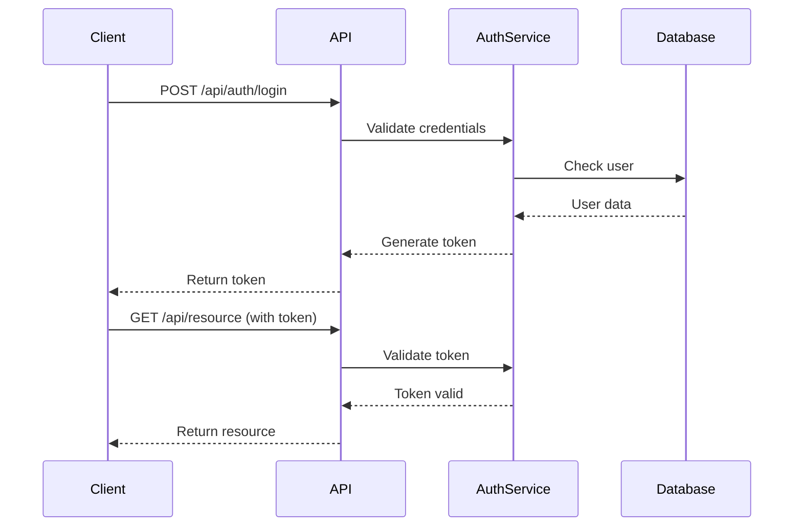

# API Authentication

## Overview

The AskProAI API uses Bearer token authentication to secure endpoints. All API requests must include a valid authentication token in the request headers.

## Authentication Methods

### 1. API Token Authentication

API tokens are the primary authentication method for server-to-server communication.

#### Obtaining an API Token

```bash
php artisan mcp:create-token --name="My Integration" --company=1
```

#### Using the Token

Include the token in the `Authorization` header:

```bash
curl -X GET https://api.askproai.de/api/v2/appointments \
  -H "Authorization: Bearer YOUR_API_TOKEN" \
  -H "Accept: application/json"
```

### 2. Session-Based Authentication

For web applications, use Laravel's built-in session authentication:

```php
// Login endpoint
POST /api/auth/login
{
  "email": "user@example.com",
  "password": "your-password"
}

// Response
{
  "token": "eyJ0eXAiOiJKV1QiLCJhbGc...",
  "user": {
    "id": 1,
    "name": "John Doe",
    "email": "user@example.com"
  }
}
```

## Authentication Flow



## Security Headers

### Required Headers

| Header | Description | Example |
|--------|-------------|---------|
| `Authorization` | Bearer token | `Bearer eyJ0eXAiOiJKV1QiLCJhbGc...` |
| `X-Company-ID` | Company identifier for multi-tenancy | `1` |
| `Accept` | Response format | `application/json` |

### Optional Headers

| Header | Description | Default |
|--------|-------------|---------|
| `X-Request-ID` | Unique request identifier for tracking | Auto-generated |
| `X-Client-Version` | Client application version | - |

## Token Management

### Token Expiration

- **Access tokens**: Valid for 60 minutes
- **Refresh tokens**: Valid for 30 days
- **API tokens**: No expiration (revoke manually)

### Refreshing Tokens

```bash
POST /api/auth/refresh
{
  "refresh_token": "your-refresh-token"
}
```

### Revoking Tokens

```bash
POST /api/auth/logout
Authorization: Bearer YOUR_TOKEN
```

## Multi-Tenancy

AskProAI uses company-based multi-tenancy. Include the `X-Company-ID` header to specify the tenant context:

```bash
curl -X GET https://api.askproai.de/api/v2/branches \
  -H "Authorization: Bearer YOUR_TOKEN" \
  -H "X-Company-ID: 1" \
  -H "Accept: application/json"
```

## Rate Limiting

Authenticated requests are subject to rate limiting:

- **Standard tier**: 1000 requests per hour
- **Premium tier**: 5000 requests per hour
- **Enterprise**: Custom limits

Rate limit headers are included in responses:

```
X-RateLimit-Limit: 1000
X-RateLimit-Remaining: 999
X-RateLimit-Reset: 1640995200
```

## Error Responses

### 401 Unauthorized

```json
{
  "error": "Unauthenticated",
  "message": "Invalid or expired token",
  "code": "AUTH_001"
}
```

### 403 Forbidden

```json
{
  "error": "Forbidden",
  "message": "Insufficient permissions for this resource",
  "code": "AUTH_002"
}
```

## Best Practices

1. **Store tokens securely**: Never expose tokens in client-side code
2. **Use HTTPS**: Always use encrypted connections
3. **Rotate tokens**: Regularly refresh access tokens
4. **Monitor usage**: Track API usage for unusual patterns
5. **Implement retry logic**: Handle token expiration gracefully

## Code Examples

### PHP (Guzzle)

```php
use GuzzleHttp\Client;

$client = new Client([
    'base_uri' => 'https://api.askproai.de/api/v2/',
    'headers' => [
        'Authorization' => 'Bearer ' . $token,
        'X-Company-ID' => '1',
        'Accept' => 'application/json',
    ]
]);

$response = $client->get('appointments');
$appointments = json_decode($response->getBody(), true);
```

### JavaScript (Axios)

```javascript
import axios from 'axios';

const api = axios.create({
  baseURL: 'https://api.askproai.de/api/v2',
  headers: {
    'Authorization': `Bearer ${token}`,
    'X-Company-ID': '1',
    'Accept': 'application/json'
  }
});

const appointments = await api.get('/appointments');
```

### Python (Requests)

```python
import requests

headers = {
    'Authorization': f'Bearer {token}',
    'X-Company-ID': '1',
    'Accept': 'application/json'
}

response = requests.get(
    'https://api.askproai.de/api/v2/appointments',
    headers=headers
)

appointments = response.json()
```

## Testing Authentication

Use the test endpoint to verify your authentication:

```bash
GET /api/auth/test

Response:
{
  "authenticated": true,
  "user": {
    "id": 1,
    "name": "John Doe"
  },
  "company": {
    "id": 1,
    "name": "Example Company"
  },
  "permissions": ["appointments.view", "appointments.create"]
}
```