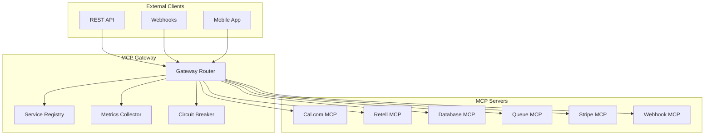

# MCP Gateway API

The Model Context Protocol (MCP) Gateway provides a unified interface for all AskProAI services, enabling standardized communication, monitoring, and orchestration.

## Overview

The MCP Gateway acts as a central hub for:
- Service discovery and registration
- Request routing and load balancing
- Monitoring and metrics collection
- Circuit breaking and fault tolerance
- Transaction coordination

## Architecture



## Base Endpoint

```
https://api.askproai.de/api/mcp/gateway
```

## Authentication

All requests require Bearer token authentication:

```http
Authorization: Bearer YOUR_API_TOKEN
```

## Service Discovery

### List Available Services

```http
GET /api/mcp/gateway/services
```

**Response:**
```json
{
    "services": [
        {
            "name": "calcom",
            "version": "2.0.0",
            "status": "healthy",
            "endpoints": [
                "checkAvailability",
                "createBooking",
                "updateBooking",
                "cancelBooking"
            ],
            "metrics": {
                "requests_per_minute": 156,
                "average_latency_ms": 87,
                "error_rate": 0.01
            }
        },
        {
            "name": "retell",
            "version": "1.5.0",
            "status": "healthy",
            "endpoints": [
                "processCall",
                "getTranscript",
                "updateAgent"
            ]
        }
    ]
}
```

## Service Invocation

### Generic Service Call

```http
POST /api/mcp/gateway/invoke
```

**Request Body:**
```json
{
    "service": "calcom",
    "method": "checkAvailability",
    "params": {
        "eventTypeId": 2026361,
        "dateFrom": "2025-06-26",
        "dateTo": "2025-06-26",
        "timeZone": "Europe/Berlin"
    },
    "options": {
        "timeout": 5000,
        "retries": 3
    }
}
```

**Response:**
```json
{
    "success": true,
    "data": {
        "slots": [
            {
                "time": "2025-06-26T09:00:00+02:00",
                "available": true
            },
            {
                "time": "2025-06-26T10:00:00+02:00",
                "available": true
            }
        ]
    },
    "metadata": {
        "service": "calcom",
        "method": "checkAvailability",
        "duration_ms": 124,
        "trace_id": "mcp-trace-123456"
    }
}
```

## Service-Specific Endpoints

### Cal.com Service

#### Check Availability
```http
POST /api/mcp/gateway/calcom/availability
```

**Request:**
```json
{
    "branch_id": "uuid-here",
    "date": "2025-06-26",
    "duration": 30
}
```

#### Create Booking
```http
POST /api/mcp/gateway/calcom/bookings
```

**Request:**
```json
{
    "customer": {
        "name": "Max Mustermann",
        "email": "max@example.com",
        "phone": "+4915123456789"
    },
    "appointment": {
        "branch_id": "uuid-here",
        "service_id": "uuid-here",
        "start": "2025-06-26T10:00:00+02:00",
        "duration": 30
    }
}
```

### Retell Service

#### Process Call
```http
POST /api/mcp/gateway/retell/calls
```

**Request:**
```json
{
    "call_id": "retell_call_123",
    "action": "process"
}
```

#### Get Call Analysis
```http
GET /api/mcp/gateway/retell/calls/{call_id}/analysis
```

**Response:**
```json
{
    "call_id": "retell_call_123",
    "duration": 180,
    "intent": "book_appointment",
    "customer_data": {
        "name": "detected_name",
        "phone": "detected_phone"
    },
    "appointment_request": {
        "service": "Haarschnitt",
        "preferred_time": "tomorrow morning"
    },
    "sentiment": "positive"
}
```

### Database Service

#### Query Execution
```http
POST /api/mcp/gateway/database/query
```

**Request:**
```json
{
    "query": "appointments.upcoming",
    "params": {
        "branch_id": "uuid-here",
        "limit": 10
    }
}
```

**Note:** Only predefined, safe queries are allowed.

### Queue Service

#### Job Status
```http
GET /api/mcp/gateway/queue/jobs/{job_id}
```

#### Queue Metrics
```http
GET /api/mcp/gateway/queue/metrics
```

**Response:**
```json
{
    "queues": {
        "default": {
            "size": 45,
            "processing": 5,
            "failed": 2,
            "throughput": 120
        },
        "webhooks": {
            "size": 12,
            "processing": 3,
            "failed": 0,
            "throughput": 200
        }
    }
}
```

## Monitoring & Health

### Gateway Health Check
```http
GET /api/mcp/gateway/health
```

**Response:**
```json
{
    "status": "healthy",
    "timestamp": "2025-06-25T14:30:00Z",
    "services": {
        "calcom": "healthy",
        "retell": "healthy",
        "database": "healthy",
        "queue": "healthy",
        "stripe": "degraded",
        "webhook": "healthy"
    },
    "metrics": {
        "uptime_seconds": 864000,
        "total_requests": 1234567,
        "active_connections": 42
    }
}
```

### Service Metrics
```http
GET /api/mcp/gateway/metrics/{service}
```

### Circuit Breaker Status
```http
GET /api/mcp/gateway/circuit-breakers
```

**Response:**
```json
{
    "circuit_breakers": [
        {
            "service": "calcom",
            "state": "closed",
            "failure_count": 0,
            "last_failure": null
        },
        {
            "service": "stripe",
            "state": "half_open",
            "failure_count": 3,
            "last_failure": "2025-06-25T14:25:00Z",
            "next_attempt": "2025-06-25T14:31:00Z"
        }
    ]
}
```

## Error Handling

All errors follow a consistent format:

```json
{
    "error": {
        "code": "SERVICE_UNAVAILABLE",
        "message": "Cal.com service is currently unavailable",
        "service": "calcom",
        "trace_id": "mcp-trace-789",
        "details": {
            "circuit_breaker": "open",
            "retry_after": 60
        }
    }
}
```

### Error Codes

| Code | Description |
|------|-------------|
| `SERVICE_NOT_FOUND` | Requested service doesn't exist |
| `METHOD_NOT_FOUND` | Service method doesn't exist |
| `SERVICE_UNAVAILABLE` | Service is down or circuit breaker is open |
| `TIMEOUT` | Request exceeded timeout |
| `RATE_LIMITED` | Too many requests |
| `INVALID_PARAMS` | Invalid request parameters |
| `INTERNAL_ERROR` | Unexpected server error |

## Rate Limiting

The gateway enforces rate limits per API key:

- **Default**: 1000 requests/minute
- **Burst**: 50 requests/second

Rate limit headers are included in responses:
```http
X-RateLimit-Limit: 1000
X-RateLimit-Remaining: 950
X-RateLimit-Reset: 1719325860
```

## Distributed Tracing

All requests include trace headers for debugging:

```http
X-Trace-Id: mcp-trace-123456
X-Span-Id: span-789
X-Parent-Span-Id: span-456
```

## WebSocket Support

For real-time updates:

```javascript
const ws = new WebSocket('wss://api.askproai.de/api/mcp/gateway/ws');

ws.send(JSON.stringify({
    type: 'subscribe',
    services: ['calcom', 'retell'],
    events: ['booking.created', 'call.ended']
}));

ws.onmessage = (event) => {
    const data = JSON.parse(event.data);
    console.log('Event received:', data);
};
```

## Best Practices

1. **Use Circuit Breakers**: Check circuit breaker status before critical operations
2. **Implement Retries**: Use exponential backoff for transient failures
3. **Monitor Metrics**: Track service health and performance
4. **Handle Timeouts**: Set appropriate timeouts for your use case
5. **Use Trace IDs**: Include trace IDs in logs for debugging

## SDK Examples

### JavaScript/TypeScript
```typescript
import { MCPGateway } from '@askproai/mcp-sdk';

const gateway = new MCPGateway({
    apiKey: 'YOUR_API_KEY',
    baseUrl: 'https://api.askproai.de'
});

// Check availability
const slots = await gateway.calcom.checkAvailability({
    branchId: 'uuid-here',
    date: '2025-06-26'
});

// Create booking
const booking = await gateway.calcom.createBooking({
    customer: { name: 'Max', email: 'max@example.com' },
    slot: slots[0]
});
```

### PHP
```php
use AskProAI\MCPGateway;

$gateway = new MCPGateway([
    'api_key' => 'YOUR_API_KEY'
]);

$slots = $gateway->calcom->checkAvailability([
    'branch_id' => 'uuid-here',
    'date' => '2025-06-26'
]);
```

---

*Last updated: June 25, 2025*