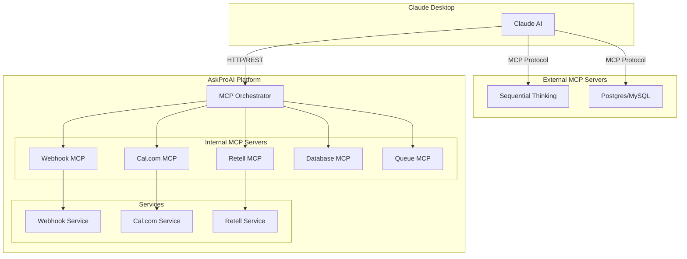

# MCP (Model Context Protocol) API

## Overview

The Model Context Protocol (MCP) provides a standardized interface for AI models to interact with the AskProAI platform. MCP servers expose specialized functionality through a consistent protocol.

## Available MCP Servers

### Internal MCP Servers

These servers are built into the AskProAI platform:

| Server | Description | Endpoint |
|--------|-------------|----------|
| `webhook` | Webhook processing and orchestration | `/api/mcp/webhook/*` |
| `calcom` | Cal.com calendar integration | `/api/mcp/calcom/*` |
| `retell` | Retell.ai phone service | `/api/mcp/retell/*` |
| `database` | Direct database operations | `/api/mcp/database/*` |
| `queue` | Queue management | `/api/mcp/queue/*` |
| `stripe` | Payment processing | `/api/mcp/stripe/*` |

### External MCP Servers

These are Node.js-based tools that enhance Claude's capabilities:

| Server | Description | Installation |
|--------|-------------|--------------|
| `sequential-thinking` | Step-by-step reasoning | `npx @modelcontextprotocol/server-sequential-thinking` |
| `postgres` | Database access (MySQL compatible) | `npx @modelcontextprotocol/server-postgres` |

## MCP Endpoints

### Webhook MCP Server

#### Test Webhook Processing

```http
POST /api/mcp/webhook/test
```

**Request Body:**

```json
{
  "provider": "retell",
  "event_type": "call_ended",
  "test_data": {
    "call_id": "test_123",
    "duration": 300
  }
}
```

#### Get Webhook Statistics

```http
GET /api/mcp/webhook/stats
```

**Response:**

```json
{
  "total_webhooks": 15234,
  "providers": {
    "retell": 8456,
    "calcom": 6234,
    "stripe": 544
  },
  "success_rate": 98.5,
  "average_processing_time": 145
}
```

### Cal.com MCP Server

#### List Event Types

```http
GET /api/mcp/calcom/event-types
```

**Response:**

```json
{
  "event_types": [
    {
      "id": 2026361,
      "title": "30 Min Appointment",
      "slug": "30min",
      "duration": 30,
      "description": "Standard appointment slot"
    }
  ]
}
```

#### Check Availability

```http
POST /api/mcp/calcom/availability
```

**Request Body:**

```json
{
  "event_type_id": 2026361,
  "start_date": "2025-06-24",
  "end_date": "2025-06-24",
  "timezone": "Europe/Berlin"
}
```

#### Create Booking

```http
POST /api/mcp/calcom/book
```

**Request Body:**

```json
{
  "event_type_id": 2026361,
  "start": "2025-06-24T10:00:00Z",
  "responses": {
    "name": "John Doe",
    "email": "john@example.com",
    "phone": "+49 30 123456"
  }
}
```

### Retell MCP Server

#### List AI Agents

```http
GET /api/mcp/retell/agents
```

**Response:**

```json
{
  "agents": [
    {
      "agent_id": "agent_abc123",
      "agent_name": "AskProAI Receptionist",
      "voice_id": "voice_emma",
      "language": "de-DE"
    }
  ]
}
```

#### Get Call Statistics

```http
GET /api/mcp/retell/calls/stats
```

**Response:**

```json
{
  "total_calls": 4567,
  "calls_today": 45,
  "average_duration": 185,
  "success_rate": 92.3,
  "appointments_created": 3890
}
```

#### Import Recent Calls

```http
POST /api/mcp/retell/calls/import
```

### Database MCP Server

#### Execute Query

```http
POST /api/mcp/database/query
```

**Request Body:**

```json
{
  "query": "SELECT COUNT(*) as total FROM appointments WHERE status = ?",
  "params": ["confirmed"],
  "company_id": 1
}
```

**Security Note:** Only read queries are allowed. The system automatically adds tenant isolation.

#### Get Schema Information

```http
GET /api/mcp/database/schema/{table}
```

### Queue MCP Server

#### Get Queue Overview

```http
GET /api/mcp/queue/overview
```

**Response:**

```json
{
  "horizon_status": "running",
  "failed_jobs": 12,
  "queues": {
    "default": {
      "size": 45,
      "status": "normal",
      "throughput": 120
    },
    "webhooks": {
      "size": 0,
      "status": "idle"
    }
  }
}
```

#### Retry Failed Jobs

```http
POST /api/mcp/queue/retry/{id}
```

## MCP Architecture



## Authentication

MCP endpoints require authentication via API token:

```bash
curl -X GET https://api.askproai.de/api/mcp/webhook/stats \
  -H "Authorization: Bearer YOUR_MCP_TOKEN" \
  -H "X-Company-ID: 1"
```

## Rate Limiting

MCP endpoints have specific rate limits:

| Endpoint Type | Limit |
|--------------|-------|
| Read operations | 1000/hour |
| Write operations | 100/hour |
| Database queries | 500/hour |

## Error Handling

MCP servers return standardized error responses:

```json
{
  "success": false,
  "error": {
    "code": "MCP_001",
    "message": "Invalid query syntax",
    "details": {
      "line": 1,
      "column": 15
    }
  }
}
```

## Best Practices

1. **Use specific MCP servers**: Each server is optimized for its domain
2. **Cache responses**: MCP responses are cacheable for 5 minutes
3. **Handle errors gracefully**: Implement retry logic for transient failures
4. **Monitor usage**: Track MCP usage for optimization
5. **Test thoroughly**: Use test endpoints before production

## MCP Development

### Creating Custom MCP Servers

```php
namespace App\Services\MCP;

class CustomMCPServer extends BaseMCPServer
{
    public function getCapabilities(): array
    {
        return [
            'name' => 'custom',
            'version' => '1.0.0',
            'endpoints' => [
                'GET /status',
                'POST /process'
            ]
        ];
    }
    
    public function handleRequest($method, $path, $params)
    {
        // Implementation
    }
}
```

### Testing MCP Servers

```bash
# Test MCP server locally
php artisan mcp:test custom

# Run MCP server standalone
php artisan mcp:serve custom --port=8080
```

## Monitoring

Monitor MCP performance:

```bash
# Real-time monitoring
php artisan mcp:monitor

# Generate usage report
php artisan mcp:report --days=7
```