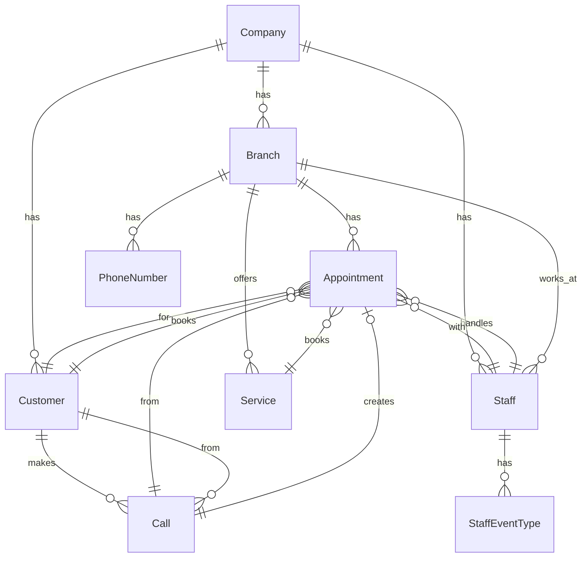

# Complete Model Documentation

Generated on: 2025-06-23

## Model Overview

The AskProAI platform uses **75 Eloquent models** to represent the business domain. All models implement multi-tenancy through the `company_id` field where applicable.

## Core Domain Models

### 🏢 Company & Organization

#### Company
- **Table**: `companies`
- **Purpose**: Root tenant model for multi-tenancy
- **Key Fields**: name, slug, settings (JSON), is_active, subscription_status
- **Relations**: hasMany branches, staff, customers, appointments

#### Branch
- **Table**: `branches`
- **Purpose**: Physical locations/outlets of a company
- **Key Fields**: name, address, phone_number, email, timezone, is_active
- **Relations**: belongsTo company, hasMany staff, appointments, phoneNumbers

#### BranchEventType
- **Table**: `branch_event_types`
- **Purpose**: Links Cal.com event types to branches
- **Key Fields**: branch_id, calcom_event_type_id, is_active
- **Relations**: belongsTo branch, calcomEventType

### 👥 People Models

#### Customer
- **Table**: `customers`
- **Purpose**: Customer records with contact information
- **Key Fields**: name, email, phone, tags (JSON), preferences (JSON)
- **Relations**: belongsTo company, hasMany appointments, calls

#### Staff
- **Table**: `staff`
- **Purpose**: Employees who provide services
- **Key Fields**: name, email, phone, home_branch_id, is_active
- **Relations**: belongsTo company, branch, hasMany appointments, staffEventTypes

#### User
- **Table**: `users`
- **Purpose**: System users for authentication
- **Key Fields**: name, email, password, company_id, staff_id
- **Relations**: belongsTo company, staff, hasMany roles

### 📅 Appointment Models

#### Appointment
- **Table**: `appointments`
- **Purpose**: Core appointment/booking records
- **Key Fields**: starts_at, ends_at, status, customer_id, staff_id, service_id
- **Relations**: belongsTo customer, staff, service, branch, call

#### AppointmentNote
- **Table**: `appointment_notes`
- **Purpose**: Notes and comments on appointments
- **Key Fields**: appointment_id, user_id, content, is_internal
- **Relations**: belongsTo appointment, user

#### AppointmentReminder
- **Table**: `appointment_reminders`
- **Purpose**: Scheduled reminders for appointments
- **Key Fields**: appointment_id, type, scheduled_at, sent_at
- **Relations**: belongsTo appointment

### 📞 Phone System Models

#### Call
- **Table**: `calls`
- **Purpose**: Phone call records from Retell.ai
- **Key Fields**: call_id, phone_number, duration, transcript, analysis (JSON)
- **Relations**: hasOne appointment, belongsTo customer

#### PhoneNumber
- **Table**: `phone_numbers`
- **Purpose**: Phone numbers assigned to branches
- **Key Fields**: phone_number, branch_id, retell_agent_id, is_active
- **Relations**: belongsTo branch

#### CallbackRequest
- **Table**: `callback_requests`
- **Purpose**: Customer callback requests
- **Key Fields**: phone_number, preferred_time, status, assigned_to
- **Relations**: belongsTo customer, staff

### 🛍️ Service Models

#### Service
- **Table**: `services`
- **Purpose**: Services offered by branches
- **Key Fields**: name, description, duration, price, branch_id
- **Relations**: belongsTo branch, hasMany appointments

#### MasterService
- **Table**: `master_services`
- **Purpose**: Company-wide service templates
- **Key Fields**: name, description, default_duration, default_price
- **Relations**: belongsTo company, hasMany branchServiceOverrides

#### ServiceCategory
- **Table**: `service_categories`
- **Purpose**: Categories for organizing services
- **Key Fields**: name, slug, parent_id, sort_order
- **Relations**: hasMany services, belongsTo parent

### 📅 Calendar Integration Models

#### CalcomEventType
- **Table**: `calcom_event_types`
- **Purpose**: Cached Cal.com event types
- **Key Fields**: event_type_id, title, slug, length, price
- **Relations**: hasMany staffEventTypes, branchEventTypes

#### StaffEventType
- **Table**: `staff_event_types`
- **Purpose**: Links staff to Cal.com event types
- **Key Fields**: staff_id, calcom_event_type_id, is_primary
- **Relations**: belongsTo staff, calcomEventType

#### CalcomBooking
- **Table**: `calcom_bookings`
- **Purpose**: Cal.com booking records
- **Key Fields**: booking_uid, event_type_id, start_time, end_time
- **Relations**: belongsTo appointment

### 🔔 Notification Models

#### Notification
- **Table**: `notifications`
- **Purpose**: System notifications
- **Key Fields**: type, notifiable_type, notifiable_id, data (JSON)
- **Relations**: morphTo notifiable

#### NotificationTemplate
- **Table**: `notification_templates`
- **Purpose**: Email/SMS templates
- **Key Fields**: name, type, subject, content, variables (JSON)
- **Relations**: belongsTo company

### 📊 Analytics Models

#### MetricSnapshot
- **Table**: `metric_snapshots`
- **Purpose**: Historical metric data
- **Key Fields**: metric_type, value, metadata (JSON), recorded_at
- **Relations**: belongsTo company, branch

#### ConversionTracking
- **Table**: `conversion_trackings`
- **Purpose**: Track call-to-appointment conversions
- **Key Fields**: call_id, appointment_id, conversion_time
- **Relations**: belongsTo call, appointment

### 🔐 Security & Audit Models

#### AuditLog
- **Table**: `audit_logs`
- **Purpose**: Track all system changes
- **Key Fields**: user_id, action, model_type, model_id, changes (JSON)
- **Relations**: belongsTo user, morphTo auditable

#### ApiToken
- **Table**: `api_tokens`
- **Purpose**: API authentication tokens
- **Key Fields**: tokenable_type, tokenable_id, token, abilities (JSON)
- **Relations**: morphTo tokenable

### 🔄 Webhook Models

#### WebhookEvent
- **Table**: `webhook_events`
- **Purpose**: Incoming webhook storage
- **Key Fields**: provider, event_type, payload (JSON), processed_at
- **Relations**: hasMany webhookProcessingLogs

#### WebhookEndpoint
- **Table**: `webhook_endpoints`
- **Purpose**: Configured webhook endpoints
- **Key Fields**: url, secret, events (JSON), is_active
- **Relations**: belongsTo company

### 💰 Financial Models

#### Invoice
- **Table**: `invoices`
- **Purpose**: Customer invoices
- **Key Fields**: invoice_number, amount, status, due_date
- **Relations**: belongsTo customer, hasMany lineItems

#### Payment
- **Table**: `payments`
- **Purpose**: Payment records
- **Key Fields**: amount, method, status, transaction_id
- **Relations**: belongsTo invoice, customer

#### Subscription
- **Table**: `subscriptions`
- **Purpose**: Company subscriptions
- **Key Fields**: plan_id, status, starts_at, ends_at
- **Relations**: belongsTo company

### 🚀 Feature & Configuration Models

#### FeatureFlag
- **Table**: `feature_flags`
- **Purpose**: Feature toggles
- **Key Fields**: name, enabled, config (JSON), rollout_percentage
- **Relations**: belongsToMany companies

#### SystemSetting
- **Table**: `system_settings`
- **Purpose**: Global system configuration
- **Key Fields**: key, value (JSON), is_public
- **Relations**: none (global)

### 📝 Content Models

#### KnowledgeBaseArticle
- **Table**: `knowledge_base_articles`
- **Purpose**: Help articles
- **Key Fields**: title, slug, content, category_id, is_published
- **Relations**: belongsTo category, company

#### EmailTemplate
- **Table**: `email_templates`
- **Purpose**: Transactional email templates
- **Key Fields**: name, subject, html_content, text_content
- **Relations**: belongsTo company

### 🔄 Queue & Job Models

#### QueuedJob
- **Table**: `jobs`
- **Purpose**: Laravel queue jobs
- **Key Fields**: queue, payload, attempts, reserved_at
- **Relations**: none

#### FailedJob
- **Table**: `failed_jobs`
- **Purpose**: Failed queue jobs
- **Key Fields**: uuid, connection, queue, payload, exception
- **Relations**: none

### 🗃️ Migration & Import Models

#### ImportLog
- **Table**: `import_logs`
- **Purpose**: Track data imports
- **Key Fields**: type, status, processed, failed, errors (JSON)
- **Relations**: belongsTo user

#### MigrationStatus
- **Table**: `migration_statuses`
- **Purpose**: Track data migrations
- **Key Fields**: migration_name, batch, status, started_at
- **Relations**: none

## Model Traits

### Commonly Used Traits

1. **HasCompany**: Adds company scoping
   ```php
   use HasCompany;
   ```

2. **HasUuid**: Adds UUID primary keys
   ```php
   use HasUuid;
   ```

3. **LogsActivity**: Audit logging
   ```php
   use LogsActivity;
   ```

4. **Searchable**: Full-text search
   ```php
   use Searchable;
   ```

5. **HasTags**: Tagging support
   ```php
   use HasTags;
   ```

## Model Scopes

### Global Scopes
- **TenantScope**: Automatically filters by company_id
- **ActiveScope**: Filters only active records
- **PublishedScope**: Filters published content

### Local Scopes
```php
// Common local scopes
->active()
->inactive()
->today()
->thisWeek()
->thisMonth()
->between($start, $end)
->forBranch($branchId)
->forStaff($staffId)
->withStatus($status)
```

## Model Events

### Commonly Observed Events
```php
creating  - Set default values
created   - Send notifications
updating  - Log changes
updated   - Clear cache
deleting  - Check dependencies
deleted   - Cleanup related data
```

## Relationships Map



## Performance Optimizations

1. **Eager Loading**: Prevent N+1 queries
   ```php
   Appointment::with(['customer', 'staff', 'service'])->get();
   ```

2. **Indexing**: Key fields are indexed
   - company_id on all tenant models
   - phone_number for lookups
   - email for authentication
   - starts_at for appointments

3. **Caching**: Frequently accessed data
   - Company settings
   - Service catalogs
   - Staff schedules

## Future Considerations

1. **Soft Deletes**: Add to more models
2. **Versioning**: Track model changes
3. **Partitioning**: For large tables
4. **Archiving**: Old appointment data
5. **Read Replicas**: For reporting