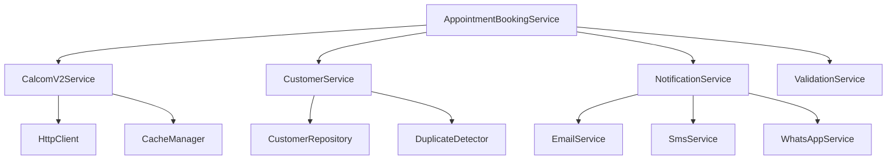

# Complete Service Layer Documentation

Generated on: 2025-06-23

## Service Layer Overview

The AskProAI platform implements a comprehensive service-oriented architecture with **216 service files** organized into logical categories. This document provides a complete overview of all services.

## Service Categories

### 🔐 Security Services (10 files)
- **EnhancedRateLimiter**: Advanced rate limiting with adaptive thresholds
- **ApiRateLimiter**: API-specific rate limiting implementation
- **SensitiveDataMasker**: Masks sensitive data in logs and responses
- **InputSanitizer**: Sanitizes user input to prevent XSS/SQL injection
- **EncryptionService**: Handles field-level encryption for sensitive data
- **ThreatDetectionService**: Detects and blocks malicious requests
- **AuditLogger**: Comprehensive audit trail logging
- **SecurityMonitor**: Real-time security monitoring
- **AccessControlService**: Fine-grained access control
- **TokenManager**: JWT and API token management

### 📞 Phone System Services (15 files)
- **RetellService**: Core Retell.ai integration
- **PhoneNumberValidator**: International phone number validation
- **PhoneNumberService**: Phone number formatting and lookup
- **CallbackService**: Handles callback requests
- **IntelligentCallRouter**: Routes calls based on skills and availability
- **ConcurrentCallManager**: Manages multiple simultaneous calls
- **CallAnalysisService**: Analyzes call transcripts and sentiment
- **VoiceMailService**: Voice mail handling and transcription
- **CallRecordingService**: Call recording management
- **PhoneNumberResolver**: Resolves phone numbers to branches/companies
- **CallQueueManager**: Manages call queues and priorities
- **CallTransferService**: Handles call transfers between agents
- **CallMetricsService**: Tracks call performance metrics
- **CallDataRefresher**: Updates call data from external sources
- **EmergencyCallHandler**: Special handling for emergency calls

### 📅 Calendar Services (25 files)

#### Core Calendar
- **BaseCalendarService**: Abstract base for calendar providers
- **CalendarFactory**: Creates calendar provider instances
- **CalcomCalendarService**: Cal.com specific implementation
- **GoogleCalendarService**: Google Calendar implementation
- **CalcomProvider**: Cal.com provider implementation
- **GoogleCalendarProvider**: Google provider implementation

#### Cal.com Services
- **CalcomService**: Legacy V1 API service
- **CalcomV2Service**: Modern V2 API implementation
- **CalcomServiceV1Legacy**: Backward compatibility layer
- **CalcomMigrationService**: Handles V1 to V2 migration
- **CalcomEventTypeSyncService**: Syncs event types
- **CalcomEventTypeImportService**: Imports event types
- **CalcomImportService**: General import functionality
- **CalcomBackwardsCompatibility**: Ensures compatibility
- **CalcomEventSyncService**: Event synchronization
- **CalcomWebhookHandler**: Processes Cal.com webhooks
- **CalcomAvailabilityChecker**: Checks calendar availability
- **CalcomBookingCreator**: Creates Cal.com bookings
- **CalcomEventMapper**: Maps events between systems

#### Availability Management
- **UnifiedAvailabilityService**: Unified availability across providers
- **SlotCalculator**: Calculates available time slots
- **ConflictResolver**: Resolves booking conflicts
- **TimeZoneManager**: Handles timezone conversions
- **RecurringEventHandler**: Manages recurring appointments

### 🏢 Business Services (30 files)

#### Core Business Logic
- **AppointmentService**: Core appointment management
- **CustomerService**: Customer lifecycle management
- **CompanyService**: Company/tenant management
- **BranchService**: Branch/location management
- **StaffService**: Staff management and assignment
- **ServiceService**: Service catalog management
- **MasterServiceManager**: Master service template management

#### Booking System
- **AppointmentBookingService**: Main booking orchestration
- **BookingValidationService**: Validates booking requests
- **BookingConfirmationService**: Handles confirmations
- **BookingCancellationService**: Manages cancellations
- **ReschedulingService**: Handles appointment rescheduling
- **WaitlistService**: Manages appointment waitlists
- **BookingReminderService**: Sends booking reminders
- **NoShowHandler**: Processes no-show appointments

#### Customer Management
- **CustomerMergeService**: Merges duplicate customers
- **CustomerSearchService**: Advanced customer search
- **CustomerTagService**: Customer tagging system
- **CustomerHistoryService**: Tracks customer history
- **CustomerPreferenceService**: Manages preferences
- **LoyaltyService**: Customer loyalty programs

#### Staff Management
- **StaffScheduleService**: Staff scheduling
- **StaffSkillMatcher**: Matches staff to services
- **StaffAvailabilityService**: Manages staff availability
- **ShiftManagementService**: Handles staff shifts
- **BreakTimeService**: Manages staff breaks

### 📧 Notification Services (12 files)
- **NotificationService**: Core notification orchestration
- **EmailNotificationService**: Email sending
- **SmsNotificationService**: SMS sending via Twilio
- **WhatsAppService**: WhatsApp messaging
- **PushNotificationService**: Mobile push notifications
- **NotificationTemplateService**: Template management
- **NotificationQueueService**: Queue management
- **NotificationTrackingService**: Delivery tracking
- **UnsubscribeService**: Handle unsubscriptions
- **NotificationPreferenceService**: User preferences
- **BulkNotificationService**: Bulk sending
- **NotificationAnalyticsService**: Analytics and reporting

### 💰 Financial Services (8 files)
- **StripeService**: Main Stripe integration
- **EnhancedStripeInvoiceService**: Advanced invoicing
- **PaymentProcessingService**: Process payments
- **RefundService**: Handle refunds
- **TaxService**: Tax calculations
- **CurrencyConverter**: Currency conversion
- **PricingService**: Dynamic pricing
- **BillingService**: Subscription billing

### 📊 Analytics & Reporting (15 files)
- **AnalyticsService**: Core analytics engine
- **ReportGeneratorService**: Generate reports
- **DashboardMetricsService**: Dashboard data
- **KpiCalculatorService**: Calculate KPIs
- **TrendAnalysisService**: Analyze trends
- **ForecastingService**: Business forecasting
- **ConversionTrackingService**: Track conversions
- **RevenueAnalyticsService**: Revenue analysis
- **CustomerAnalyticsService**: Customer insights
- **StaffPerformanceService**: Staff metrics
- **ServiceAnalyticsService**: Service performance
- **BranchComparisonService**: Compare branches
- **ExportService**: Data export functionality
- **ScheduledReportService**: Automated reports
- **CustomReportBuilder**: Custom report creation

### 🤖 MCP (Model Context Protocol) Services (29 files)
- **MCPOrchestrator**: Orchestrates MCP servers
- **MCPMonitor**: Monitors MCP health
- **MCPContextResolver**: Resolves context for requests
- **DatabaseMCPServer**: Database operations
- **CalcomMCPServer**: Cal.com operations
- **RetellMCPServer**: Retell.ai operations
- **WebhookMCPServer**: Webhook handling
- **AppointmentMCPServer**: Appointment operations
- **CustomerMCPServer**: Customer operations
- **CompanyMCPServer**: Company operations
- **BranchMCPServer**: Branch operations
- **QueueMCPServer**: Queue operations
- **KnowledgeMCPServer**: Knowledge base access
- **AnalyticsMCPServer**: Analytics queries
- **SecurityMCPServer**: Security operations
- **SystemMCPServer**: System administration
- **LogMCPServer**: Log analysis
- **ConfigMCPServer**: Configuration management
- **CacheMCPServer**: Cache operations
- **SearchMCPServer**: Search functionality
- **NotificationMCPServer**: Notification handling
- **ReportMCPServer**: Report generation
- **WorkflowMCPServer**: Workflow automation
- **IntegrationMCPServer**: External integrations
- **MonitoringMCPServer**: System monitoring
- **BackupMCPServer**: Backup operations
- **MigrationMCPServer**: Data migration
- **DebugMCPServer**: Debugging tools
- **ExternalMCPManager**: Manages external MCP servers

### 🔧 Infrastructure Services (20 files)

#### Performance Optimization
- **QueryOptimizer**: Optimizes database queries
- **QueryMonitor**: Monitors query performance
- **EagerLoadingAnalyzer**: Analyzes N+1 queries
- **CacheManager**: Manages application cache
- **CacheWarmer**: Pre-warms cache
- **IndexAdvisor**: Suggests database indexes

#### Queue Management
- **QueueManager**: Manages job queues
- **JobRetryService**: Handles failed jobs
- **QueueMonitor**: Monitors queue health
- **PriorityQueueService**: Priority job handling

#### Health Monitoring
- **DatabaseHealthCheck**: Database health
- **RedisHealthCheck**: Redis health
- **CalcomHealthCheck**: Cal.com API health
- **RetellHealthCheck**: Retell.ai API health
- **EmailHealthCheck**: Email service health
- **PhoneRoutingHealthCheck**: Phone system health
- **SystemHealthAggregator**: Overall system health

#### Real-Time Features
- **RedisSlotManager**: Manages real-time slots
- **WebSocketManager**: WebSocket connections
- **EventBroadcaster**: Real-time event broadcasting

### 🔍 Search & Knowledge Base (10 files)
- **KnowledgeBaseService**: Main KB service
- **SearchService**: Full-text search
- **DocumentIndexer**: Indexes documents
- **DocumentProcessor**: Processes documents
- **MarkdownEnhancer**: Enhances markdown
- **FileWatcher**: Watches for file changes
- **SemanticSearchService**: AI-powered search
- **AutoCompleteService**: Search suggestions
- **SearchAnalyticsService**: Search analytics
- **ContentRecommendationService**: Content recommendations

### 🛠️ Utility Services (25 files)
- **ValidationService**: General validation
- **NavigationService**: Navigation generation
- **LocalizationService**: Multi-language support
- **GeocodingService**: Address geocoding
- **TimeZoneService**: Timezone handling
- **FileUploadService**: File handling
- **ImageProcessingService**: Image manipulation
- **PdfGeneratorService**: PDF generation
- **QrCodeService**: QR code generation
- **UrlShortenerService**: URL shortening
- **BackupService**: Data backup
- **ImportExportService**: Data import/export
- **MigrationService**: Data migration
- **CleanupService**: Data cleanup
- **ArchiveService**: Data archiving
- **LogRotationService**: Log management
- **TempFileService**: Temporary files
- **ConfigurationService**: App configuration
- **FeatureFlagService**: Feature toggles
- **MaintenanceModeService**: Maintenance mode
- **SystemInfoService**: System information
- **LicenseService**: License management
- **UpdateService**: Application updates
- **DiagnosticService**: System diagnostics
- **DebugService**: Debugging tools

### 🔄 Integration Services (15 files)
- **WebhookService**: Webhook processing
- **ApiGatewayService**: API gateway
- **ThirdPartyIntegrator**: Third-party APIs
- **OAuthService**: OAuth handling
- **SsoService**: Single sign-on
- **LdapService**: LDAP integration
- **ScimService**: SCIM provisioning
- **ZapierService**: Zapier integration
- **SlackIntegration**: Slack notifications
- **MicrosoftTeamsService**: Teams integration
- **GoogleWorkspaceService**: Google integration
- **Office365Service**: Office 365 integration
- **SalesforceConnector**: Salesforce sync
- **HubspotConnector**: Hubspot integration
- **MailchimpService**: Email marketing

## Service Patterns

### Common Patterns Used

1. **Dependency Injection**
   ```php
   public function __construct(
       private CalcomV2Service $calcom,
       private NotificationService $notifications
   ) {}
   ```

2. **Service Chaining**
   ```php
   return $this->validateRequest($data)
       ->checkAvailability()
       ->createBooking()
       ->sendConfirmation();
   ```

3. **Event-Driven**
   ```php
   event(new AppointmentCreated($appointment));
   ```

4. **Circuit Breaker**
   ```php
   return CircuitBreaker::call('calcom', function() {
       return $this->calcomService->getAvailability();
   });
   ```

5. **Repository Pattern** (partial)
   ```php
   return $this->appointmentRepository->findByDateRange($start, $end);
   ```

## Service Dependencies



## Performance Considerations

1. **Caching**: Most services implement caching for expensive operations
2. **Queue Processing**: Heavy operations are queued
3. **Database Optimization**: Services use eager loading and query optimization
4. **Rate Limiting**: External API calls are rate-limited
5. **Circuit Breakers**: Prevent cascading failures

## Best Practices

1. **Single Responsibility**: Each service has a focused purpose
2. **Testability**: Services are designed for easy testing
3. **Documentation**: Public methods have clear documentation
4. **Error Handling**: Comprehensive error handling and logging
5. **Type Safety**: Strict typing for parameters and returns

## Future Improvements

1. **Complete Repository Pattern**: Move all database queries to repositories
2. **Service Interfaces**: Define interfaces for all services
3. **Async Processing**: More operations should be async
4. **Monitoring**: Add APM instrumentation
5. **Documentation**: Generate API docs from code

This comprehensive service layer provides a robust foundation for the AskProAI platform, with clear separation of concerns and excellent maintainability.