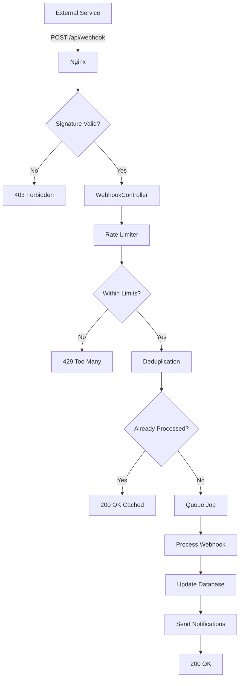
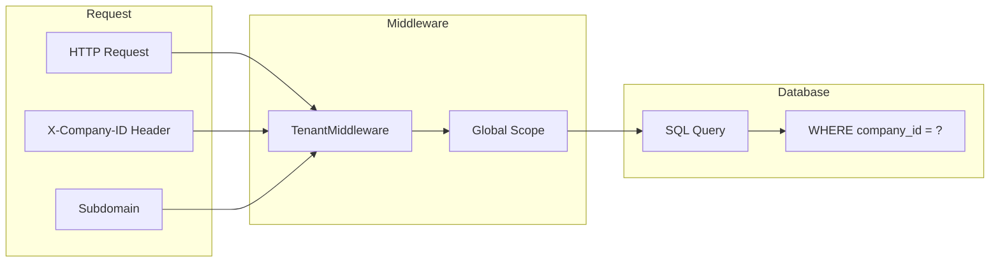

# Data Flow Diagrams

Generated on: 2025-06-23 16:14:17

## Webhook Data Flow

```mermaid
graph TD
    A[External Service] -->|POST /api/webhook| B[Nginx]
    B --> C{Signature Valid?}
    C -->|No| D[403 Forbidden]
    C -->|Yes| E[WebhookController]
    E --> F[Rate Limiter]
    F --> G{Within Limits?}
    G -->|No| H[429 Too Many]
    G -->|Yes| I[Deduplication]
    I --> J{Already Processed?}
    J -->|Yes| K[200 OK Cached]
    J -->|No| L[Queue Job]
    L --> M[Process Webhook]
    M --> N[Update Database]
    N --> O[Send Notifications]
    O --> P[200 OK]
```

## Multi-Tenant Data Isolation

```mermaid
graph LR
    subgraph "Request"
        REQ[HTTP Request]
        HEAD[X-Company-ID Header]
        SUB[Subdomain]
    end

    subgraph "Middleware"
        TEN[TenantMiddleware]
        SCOPE[Global Scope]
    end

    subgraph "Database"
        QUERY[SQL Query]
        WHERE[WHERE company_id = ?]
    end

    REQ --> TEN
    HEAD --> TEN
    SUB --> TEN
    TEN --> SCOPE
    SCOPE --> QUERY
    QUERY --> WHERE
```

