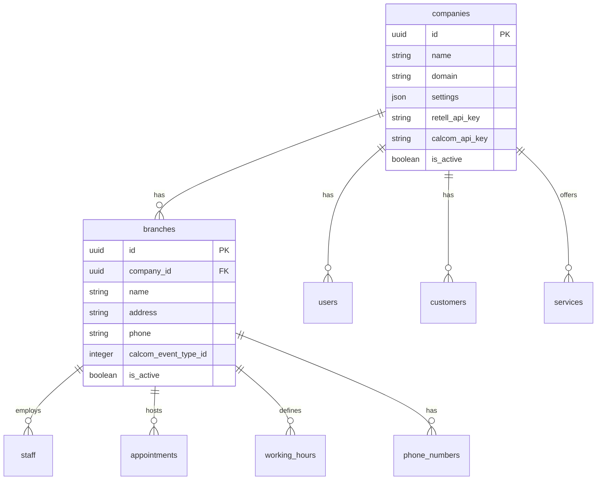
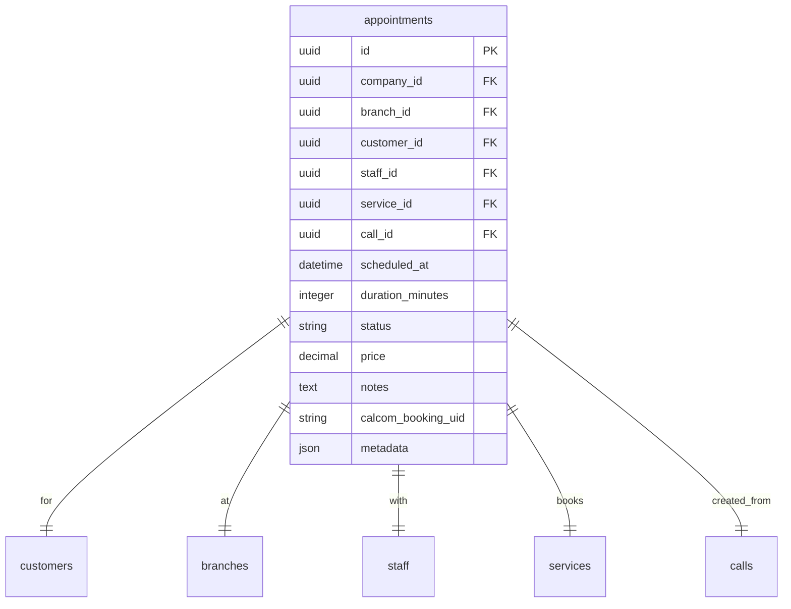
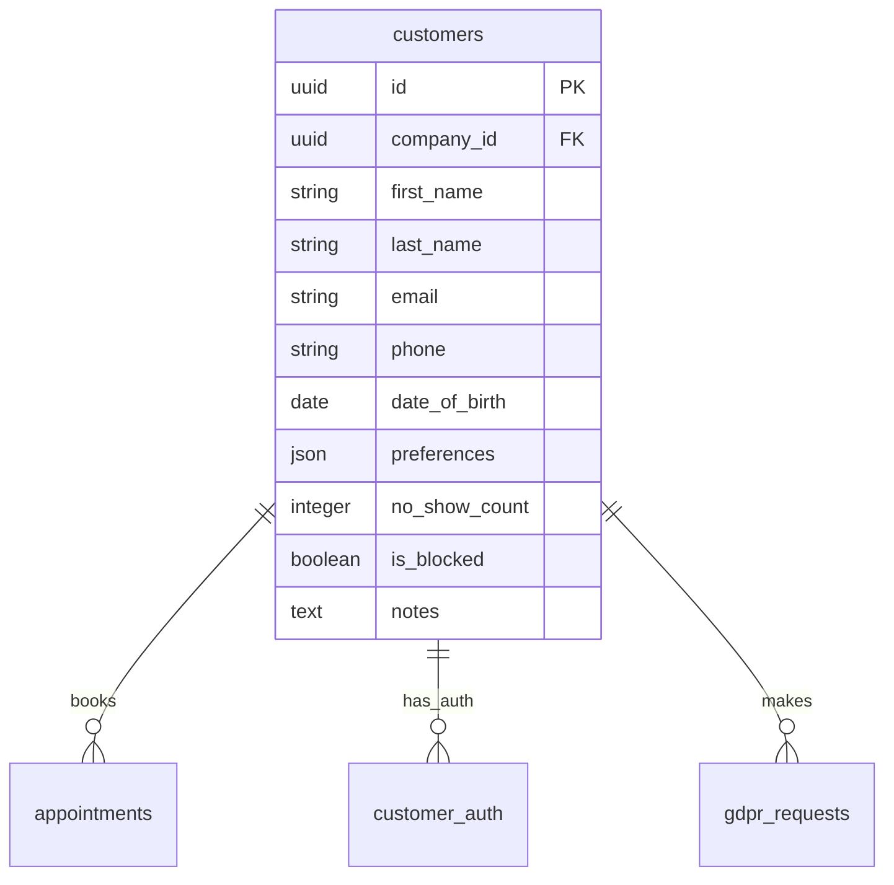

# Database Schema

The AskProAI platform uses MySQL/MariaDB with a comprehensive schema supporting multi-tenancy, appointment booking, knowledge management, and billing.

## Overview

- **Total Tables**: 94
- **Core Domain**: 25 tables
- **Knowledge System**: 12 tables
- **Security & Audit**: 8 tables
- **Billing & Invoicing**: 9 tables
- **Supporting Tables**: 40 tables

## Core Domain Model

### Companies & Multi-Tenancy



### Appointment System



### Phone & Call System

```mermaid
erDiagram
    phone_numbers ||--|| branches : belongs_to
    phone_numbers ||--o{ calls : receives
    
    phone_numbers {
        uuid id PK
        uuid branch_id FK
        string number
        string retell_agent_id
        string display_name
        boolean is_active
    }
    
    calls ||--o| appointments : creates
    calls ||--|| phone_numbers : to
    
    calls {
        uuid id PK
        uuid company_id FK
        string retell_call_id
        uuid phone_number_id FK
        string from_number
        datetime started_at
        datetime ended_at
        integer duration_seconds
        text transcript
        json analysis
        string status
        decimal cost
    }
```

### Customer Management



## Knowledge Base System

### Document Management

```sql
CREATE TABLE knowledge_documents (
    id CHAR(36) PRIMARY KEY,
    company_id CHAR(36),
    category_id CHAR(36),
    title VARCHAR(255),
    slug VARCHAR(255) UNIQUE,
    content LONGTEXT,
    type ENUM('guide', 'api', 'faq', 'tutorial'),
    status ENUM('draft', 'published', 'archived'),
    view_count INT DEFAULT 0,
    created_by CHAR(36),
    updated_by CHAR(36),
    published_at DATETIME,
    created_at TIMESTAMP,
    updated_at TIMESTAMP,
    INDEX idx_slug (slug),
    INDEX idx_category_status (category_id, status),
    FOREIGN KEY (company_id) REFERENCES companies(id)
);
```

### Search & Analytics

```sql
CREATE TABLE knowledge_search_index (
    id CHAR(36) PRIMARY KEY,
    document_id CHAR(36),
    content TEXT,
    weight INT DEFAULT 1,
    FULLTEXT idx_content (content),
    FOREIGN KEY (document_id) REFERENCES knowledge_documents(id)
);

CREATE TABLE knowledge_analytics (
    id CHAR(36) PRIMARY KEY,
    document_id CHAR(36),
    user_id CHAR(36),
    action ENUM('view', 'search', 'share', 'print'),
    metadata JSON,
    created_at TIMESTAMP,
    INDEX idx_document_action (document_id, action),
    FOREIGN KEY (document_id) REFERENCES knowledge_documents(id)
);
```

## Security & Compliance

### Audit & Security Logs

```sql
CREATE TABLE security_logs (
    id BIGINT AUTO_INCREMENT PRIMARY KEY,
    user_id CHAR(36),
    ip_address VARCHAR(45),
    user_agent TEXT,
    action VARCHAR(100),
    resource VARCHAR(255),
    status ENUM('success', 'failure', 'blocked'),
    threat_level ENUM('none', 'low', 'medium', 'high', 'critical'),
    metadata JSON,
    created_at TIMESTAMP,
    INDEX idx_user_action (user_id, action),
    INDEX idx_threat_level (threat_level),
    INDEX idx_created_at (created_at)
);

CREATE TABLE audit_trail (
    id BIGINT AUTO_INCREMENT PRIMARY KEY,
    company_id CHAR(36),
    user_id CHAR(36),
    model_type VARCHAR(100),
    model_id CHAR(36),
    action ENUM('created', 'updated', 'deleted', 'viewed'),
    old_values JSON,
    new_values JSON,
    ip_address VARCHAR(45),
    user_agent TEXT,
    created_at TIMESTAMP,
    INDEX idx_company_model (company_id, model_type, model_id),
    INDEX idx_user_action (user_id, action)
);
```

### GDPR Compliance

```sql
CREATE TABLE gdpr_requests (
    id CHAR(36) PRIMARY KEY,
    customer_id CHAR(36),
    type ENUM('export', 'deletion', 'rectification', 'restriction'),
    status ENUM('pending', 'processing', 'completed', 'rejected'),
    requested_at DATETIME,
    processed_at DATETIME,
    processed_by CHAR(36),
    data JSON,
    notes TEXT,
    FOREIGN KEY (customer_id) REFERENCES customers(id)
);

CREATE TABLE cookie_consents (
    id CHAR(36) PRIMARY KEY,
    visitor_id VARCHAR(255),
    ip_address VARCHAR(45),
    consents JSON,
    created_at TIMESTAMP,
    updated_at TIMESTAMP,
    INDEX idx_visitor (visitor_id)
);
```

## Billing & Invoicing

### Flexible Invoice System

```sql
CREATE TABLE invoices (
    id CHAR(36) PRIMARY KEY,
    company_id CHAR(36),
    invoice_number VARCHAR(50) UNIQUE,
    status ENUM('draft', 'sent', 'paid', 'overdue', 'cancelled'),
    subtotal DECIMAL(10,2),
    tax_amount DECIMAL(10,2),
    total DECIMAL(10,2),
    currency CHAR(3) DEFAULT 'EUR',
    due_date DATE,
    paid_at DATETIME,
    stripe_invoice_id VARCHAR(255),
    metadata JSON,
    created_at TIMESTAMP,
    updated_at TIMESTAMP,
    FOREIGN KEY (company_id) REFERENCES companies(id)
);

CREATE TABLE invoice_items_flexible (
    id CHAR(36) PRIMARY KEY,
    invoice_id CHAR(36),
    description TEXT,
    quantity DECIMAL(10,4),
    unit_price DECIMAL(10,4),
    amount DECIMAL(10,2),
    tax_rate DECIMAL(5,2),
    metadata JSON,
    FOREIGN KEY (invoice_id) REFERENCES invoices(id)
);
```

## Performance Indexes

### Critical Performance Indexes

```sql
-- Phone number lookup (must be < 100ms)
CREATE UNIQUE INDEX idx_phone_lookup ON phone_numbers(number, branch_id);

-- Call retrieval
CREATE INDEX idx_calls_retell ON calls(retell_call_id);
CREATE INDEX idx_calls_date ON calls(company_id, created_at DESC);

-- Appointment scheduling
CREATE INDEX idx_appointments_slot ON appointments(branch_id, scheduled_at, status);
CREATE INDEX idx_appointments_customer ON appointments(customer_id, scheduled_at DESC);

-- Knowledge base search
CREATE FULLTEXT INDEX idx_knowledge_search ON knowledge_documents(title, content);

-- Audit trail
CREATE INDEX idx_audit_recent ON audit_trail(company_id, created_at DESC);
```

## Migration Status

### Recent Migrations (2025)

1. **Cal.com v2 Migration**
   - Added `calcom_event_type_id` to branches
   - Removed legacy `staff_service_assignments`
   - Added `staff_event_types` table

2. **Knowledge Base Addition**
   - 12 new tables for documentation system
   - Full-text search indexes
   - Version control support

3. **Security Enhancement**
   - Security logs table
   - Audit trail implementation
   - API rate limiting tables

4. **Billing System**
   - Flexible invoice items
   - Usage-based billing support
   - Stripe integration tables

## Data Integrity Rules

### Foreign Key Constraints

All tables use InnoDB engine with foreign key constraints:
- `ON DELETE CASCADE` for dependent records
- `ON DELETE RESTRICT` for critical relationships
- `ON UPDATE CASCADE` for UUID changes

### Multi-Tenancy

All tenant-scoped tables include:
- `company_id` column with foreign key
- Composite indexes including `company_id`
- Application-level scoping via `TenantScope`

### Soft Deletes

Tables with soft delete support:
- customers
- appointments  
- services
- staff

Include `deleted_at` timestamp column.

## Optimization Notes

1. **UUID Performance**: Using CHAR(36) for UUIDs with proper indexing
2. **JSON Columns**: Used for flexible metadata storage
3. **Partitioning**: Large tables (calls, security_logs) partitioned by date
4. **Read Replicas**: Supported for analytics queries
5. **Connection Pooling**: Max 200 connections configured

---

*Last updated: June 25, 2025*