# Database Schema

Generated on: 2025-06-23 16:14:16

## Database Statistics

- **Total Tables**: 33
- **Database Engine**: MySQL
- **Collation**: utf8mb4_unicode_ci

## Entity Relationship Diagram

```mermaid
erDiagram
    appointments {
        bigint id
        bigint company_id
        bigint customer_id
        char branch_id
        varchar external_id
        timestamp starts_at
        timestamp ends_at
        longtext payload
        varchar status
        timestamp created_at
        timestamp updated_at
        bigint call_id
        char staff_id
        bigint service_id
        datetime start_time
        datetime end_time
        varchar calcom_v2_booking_id
        bigint calcom_event_type_id
        text notes
        int price
        bigint calcom_booking_id
        timestamp reminder_sent_at
        varchar reminder_type
        int version
        timestamp lock_expires_at
        varchar lock_token
    }
    appointments ||--o{ companies : has
    appointments ||--o{ customers : has
    appointments ||--o{ branches : has
    appointments ||--o{ calls : has
    appointments ||--o{ staff : has
    appointments ||--o{ services : has
    appointments ||--o{ calcom_event_types : has
    branch_event_types {
        bigint id
        char branch_id
        bigint event_type_id
        tinyint is_primary
        timestamp created_at
        timestamp updated_at
    }
    branch_event_types ||--o{ branches : has
    branches {
        char id
        bigint customer_id
        bigint company_id
        varchar name
        varchar slug
        varchar city
        varchar phone_number
        tinyint active
        timestamp created_at
        timestamp updated_at
        timestamp deleted_at
        tinyint invoice_recipient
        varchar invoice_name
        varchar invoice_email
        varchar invoice_address
        varchar invoice_phone
        varchar calcom_event_type_id
        varchar calcom_api_key
        varchar retell_agent_id
        longtext integration_status
        enum calendar_mode
        timestamp integrations_tested_at
        varchar calcom_user_id
        longtext retell_agent_cache
        timestamp retell_last_sync
        longtext configuration_status
        longtext parent_settings
        varchar address
        varchar postal_code
        varchar phone
        varchar email
        tinyint is_active
        varchar website
        longtext business_hours
        longtext services_override
        varchar country
        char uuid
        longtext settings
    }
    branches ||--o{ customers : has
    branches ||--o{ companies : has
    branches ||--o{ calcom_event_types : has
    business_hours_templates {
        bigint id
        varchar name
        varchar description
        longtext hours
        tinyint is_default
        timestamp created_at
        timestamp updated_at
    }
    calcom_event_types {
        bigint id
        int company_id
        char branch_id
        char staff_id
        varchar name
        timestamp created_at
        timestamp updated_at
        bigint calcom_numeric_event_type_id
        int team_id
        tinyint is_team_event
        int duration_minutes
        text description
        decimal price
        tinyint is_active
    }
    calcom_event_types ||--o{ companies : has
    calcom_event_types ||--o{ branches : has
    calcom_event_types ||--o{ staff : has
    calls {
        bigint id
        varchar external_id
        text transcript
        longtext raw
        timestamp created_at
        timestamp updated_at
        bigint customer_id
        varchar retell_call_id
        varchar status
        varchar from_number
        varchar to_number
        int duration_sec
        char tmp_call_id
        char branch_id
        bigint phone_number_id
        varchar agent_id
        int cost_cents
        varchar call_status
        tinyint call_successful
        longtext analysis
        char conversation_id
        varchar call_id
        longtext details
        varchar audio_url
        varchar disconnection_reason
        text summary
        varchar sentiment
        varchar public_log_url
        varchar name
        varchar email
        date datum_termin
        time uhrzeit_termin
        varchar dienstleistung
        varchar telefonnummer
        text grund
        varchar calcom_booking_id
        varchar phone_number
        timestamp call_time
        int call_duration
        varchar disconnect_reason
        varchar type
        decimal cost
        tinyint successful
        varchar user_sentiment
        longtext raw_data
        varchar behandlung_dauer
        varchar rezeptstatus
        varchar versicherungsstatus
        varchar haustiere_name
        text notiz
        bigint company_id
        bigint appointment_id
        longtext tags
        timestamp start_timestamp
        timestamp end_timestamp
        varchar call_type
        varchar direction
        longtext transcript_object
        longtext transcript_with_tools
        longtext latency_metrics
        longtext cost_breakdown
        longtext llm_usage
        longtext retell_dynamic_variables
        tinyint opt_out_sensitive_data
        longtext metadata
        decimal duration_minutes
        longtext webhook_data
        int agent_version
        decimal retell_cost
        longtext custom_sip_headers
        longtext transcription
        varchar recording_url
        timestamp started_at
        timestamp ended_at
        timestamp synced_at
        tinyint appointment_requested
        varchar extracted_date
        varchar extracted_time
        varchar extracted_name
        int version
    }
    calls ||--o{ customers : has
    calls ||--o{ branches : has
    calls ||--o{ phone_numbers : has
    calls ||--o{ calls : has
    calls ||--o{ companies : has
    calls ||--o{ appointments : has
    circuit_breaker_metrics {
        bigint id
        varchar service
        varchar status
        varchar state
        int duration_ms
        timestamp created_at
    }
    companies {
        bigint id
        varchar name
        varchar slug
        text address
        varchar contact_person
        varchar phone
        varchar email
        varchar website
        text description
        longtext settings
        varchar industry
        varchar event_type_id
        longtext opening_hours
        text calcom_api_key
        varchar calcom_team_slug
        varchar calcom_user_id
        text retell_api_key
        tinyint is_active
        timestamp trial_ends_at
        tinyint active
        timestamp created_at
        timestamp updated_at
        varchar calcom_event_type_id
        longtext api_test_errors
        tinyint send_booking_confirmations
        timestamp deleted_at
        varchar retell_webhook_url
        varchar retell_agent_id
        varchar retell_voice
        tinyint retell_enabled
        enum calcom_calendar_mode
        enum billing_status
        enum billing_type
        decimal credit_balance
        decimal low_credit_threshold
        longtext metadata
        varchar logo
        varchar subscription_status
        varchar subscription_plan
        varchar city
        varchar state
        varchar postal_code
        varchar country
        varchar timezone
        varchar currency
        text google_calendar_credentials
        varchar stripe_customer_id
        varchar stripe_subscription_id
    }
    companies ||--o{ calcom_event_types : has
    company_pricing {
        bigint id
        bigint company_id
        decimal price_per_minute
        decimal setup_fee
        decimal monthly_base_fee
        int included_minutes
        decimal overage_price_per_minute
        tinyint is_active
        date valid_from
        date valid_until
        text notes
        timestamp created_at
        timestamp updated_at
    }
    company_pricing ||--o{ companies : has
    customers {
        bigint id
        bigint company_id
        varchar first_name
        varchar last_name
        varchar name
        varchar email
        varchar phone
        text notes
        timestamp created_at
        timestamp updated_at
        varchar mobile_app_user_id
        varchar mobile_app_device_token
        longtext mobile_app_preferences
    }
    customers ||--o{ companies : has
    event_type_import_logs {
        bigint id
        bigint company_id
        char branch_id
        bigint user_id
        varchar import_type
        int total_found
        int total_imported
        int total_skipped
        int total_failed
        int total_errors
        enum status
        longtext details
        text error_message
        longtext error_details
        timestamp started_at
        timestamp completed_at
        timestamp created_at
        timestamp updated_at
    }
    event_type_import_logs ||--o{ companies : has
    event_type_import_logs ||--o{ branches : has
    event_type_import_logs ||--o{ users : has
    failed_jobs {
        bigint id
        varchar uuid
        text connection
        text queue
        longtext payload
        longtext exception
        timestamp failed_at
    }
    feature_flag_overrides {
        bigint id
        varchar feature_key
        bigint company_id
        tinyint enabled
        varchar reason
        varchar created_by
        timestamp created_at
        timestamp updated_at
    }
    feature_flag_overrides ||--o{ companies : has
    feature_flag_usage {
        bigint id
        varchar feature_key
        varchar company_id
        varchar user_id
        tinyint result
        varchar evaluation_reason
        timestamp created_at
        timestamp updated_at
    }
    feature_flag_usage ||--o{ companies : has
    feature_flag_usage ||--o{ users : has
    feature_flags {
        bigint id
        varchar key
        varchar name
        text description
        tinyint enabled
        longtext metadata
        varchar rollout_percentage
        timestamp enabled_at
        timestamp disabled_at
        timestamp created_at
        timestamp updated_at
    }
    logs {
        bigint id
        varchar level
        text message
        varchar channel
        longtext context
        varchar user_id
        varchar ip_address
        varchar request_id
        timestamp created_at
        timestamp updated_at
    }
    logs ||--o{ users : has
    mcp_metrics {
        bigint id
        varchar service
        varchar operation
        tinyint success
        decimal duration_ms
        bigint tenant_id
        longtext metadata
        timestamp created_at
        timestamp updated_at
    }
    migrations {
        int id
        varchar migration
        int batch
    }
    model_has_roles {
        bigint role_id
        varchar model_type
        bigint model_id
    }
    model_has_roles ||--o{ roles : has
    permissions {
        bigint id
        varchar name
        varchar guard_name
        timestamp created_at
        timestamp updated_at
    }
    phone_numbers {
        char id
        bigint company_id
        char branch_id
        varchar number
        varchar retell_phone_id
        varchar retell_agent_id
        varchar retell_agent_version
        tinyint is_active
        tinyint is_primary
        varchar type
        longtext capabilities
        longtext metadata
        timestamp created_at
        timestamp updated_at
    }
    phone_numbers ||--o{ companies : has
    phone_numbers ||--o{ branches : has
    role_has_permissions {
        bigint permission_id
        bigint role_id
    }
    role_has_permissions ||--o{ permissions : has
    role_has_permissions ||--o{ roles : has
    roles {
        bigint id
        varchar name
        varchar guard_name
        timestamp created_at
        timestamp updated_at
    }
    security_logs {
        bigint id
        varchar type
        varchar ip_address
        text user_agent
        bigint user_id
        bigint company_id
        varchar url
        varchar method
        longtext data
        timestamp timestamp
        timestamp created_at
        timestamp updated_at
    }
    security_logs ||--o{ users : has
    security_logs ||--o{ companies : has
    service_event_type_mappings {
        bigint id
        bigint service_id
        bigint calcom_event_type_id
        bigint company_id
        char branch_id
        longtext keywords
        int priority
        tinyint is_active
        timestamp created_at
        timestamp updated_at
    }
    service_event_type_mappings ||--o{ services : has
    service_event_type_mappings ||--o{ calcom_event_types : has
    service_event_type_mappings ||--o{ companies : has
    service_event_type_mappings ||--o{ branches : has
    services {
        bigint id
        varchar name
        timestamp created_at
        timestamp updated_at
        timestamp deleted_at
        tinyint active
        int default_duration_minutes
        tinyint is_online_bookable
        int min_staff_required
        int buffer_time_minutes
        varchar calcom_event_type_id
        bigint company_id
        bigint branch_id
        char tenant_id
        text description
        decimal price
        varchar category
        int sort_order
        int max_bookings_per_day
        int duration
        tinyint is_active
    }
    services ||--o{ calcom_event_types : has
    services ||--o{ companies : has
    services ||--o{ branches : has
    sessions {
        varchar id
        bigint user_id
        varchar ip_address
        text user_agent
        longtext payload
        int last_activity
    }
    sessions ||--o{ users : has
    staff {
        char id
        int company_id
        varchar first_name
        varchar last_name
        char branch_id
        varchar name
        varchar email
        varchar phone
        varchar role
        tinyint is_active
        tinyint calendar_connected
        timestamp created_at
        timestamp updated_at
        timestamp deleted_at
        char home_branch_id
        varchar calcom_user_id
        varchar calcom_calendar_link
        tinyint is_bookable
        text notes
        varchar external_calendar_id
        varchar calendar_provider
        tinyint active
    }
    staff ||--o{ companies : has
    staff ||--o{ branches : has
    tax_rates {
        bigint id
        varchar country
        decimal rate
        varchar name
        tinyint is_active
        timestamp created_at
        timestamp updated_at
    }
    users {
        bigint id
        varchar name
        varchar email
        timestamp email_verified_at
        varchar password
        varchar remember_token
        timestamp created_at
        timestamp updated_at
        bigint company_id
        bigint tenant_id
    }
    users ||--o{ companies : has
    webhook_events {
        bigint id
        varchar provider
        bigint company_id
        varchar correlation_id
        varchar type
        varchar source
        varchar event
        varchar status
        longtext payload
        timestamp processed_at
        text error
        text notes
        int retry_count
        timestamp created_at
        timestamp updated_at
    }
    webhook_events ||--o{ companies : has
    webhook_logs {
        bigint id
        varchar webhook_type
        varchar provider
        varchar event_type
        longtext payload
        varchar status
        int processing_time_ms
        text response
        text error_message
        int retry_count
        tinyint is_duplicate
        timestamp created_at
        timestamp updated_at
    }
    working_hours {
        bigint id
        char staff_id
        tinyint weekday
        time start
        time end
        timestamp created_at
        timestamp updated_at
        tinyint day_of_week
    }
    working_hours ||--o{ staff : has
```

## Table Details

### appointments

**Indexes**: 20

| Column | Type | Nullable | Default | Extra |
|--------|------|----------|---------|-------|
| id | bigint(20) unsigned | NO |  | auto_increment |
| company_id | bigint(20) unsigned | YES |  |  |
| customer_id | bigint(20) unsigned | NO |  |  |
| branch_id | char(36) | YES |  |  |
| external_id | varchar(255) | YES |  |  |
| starts_at | timestamp | YES |  |  |
| ends_at | timestamp | YES |  |  |
| payload | longtext | YES |  |  |
| status | varchar(255) | NO | pending |  |
| created_at | timestamp | YES |  |  |
| updated_at | timestamp | YES |  |  |
| call_id | bigint(20) unsigned | YES |  |  |
| staff_id | char(36) | YES |  |  |
| service_id | bigint(20) unsigned | YES |  |  |
| start_time | datetime | YES |  |  |
| end_time | datetime | YES |  |  |
| calcom_v2_booking_id | varchar(255) | YES |  |  |
| calcom_event_type_id | bigint(20) unsigned | YES |  |  |
| notes | text | YES |  |  |
| price | int(11) | YES |  |  |
| calcom_booking_id | bigint(20) unsigned | YES |  |  |
| reminder_sent_at | timestamp | YES |  |  |
| reminder_type | varchar(50) | YES |  |  |
| version | int(10) unsigned | NO | 0 |  |
| lock_expires_at | timestamp | YES |  |  |
| lock_token | varchar(255) | YES |  |  |

### branch_event_types

**Indexes**: 4

| Column | Type | Nullable | Default | Extra |
|--------|------|----------|---------|-------|
| id | bigint(20) unsigned | NO |  | auto_increment |
| branch_id | char(36) | NO |  |  |
| event_type_id | bigint(20) unsigned | NO |  |  |
| is_primary | tinyint(1) | NO | 0 |  |
| created_at | timestamp | YES |  |  |
| updated_at | timestamp | YES |  |  |

### branches

**Indexes**: 4

| Column | Type | Nullable | Default | Extra |
|--------|------|----------|---------|-------|
| id | char(36) | NO |  |  |
| customer_id | bigint(20) unsigned | YES |  |  |
| company_id | bigint(20) unsigned | YES |  |  |
| name | varchar(255) | NO |  |  |
| slug | varchar(255) | YES |  |  |
| city | varchar(255) | YES |  |  |
| phone_number | varchar(255) | YES |  |  |
| active | tinyint(1) | NO | 0 |  |
| created_at | timestamp | YES |  |  |
| updated_at | timestamp | YES |  |  |
| deleted_at | timestamp | YES |  |  |
| invoice_recipient | tinyint(1) | NO | 0 |  |
| invoice_name | varchar(255) | YES |  |  |
| invoice_email | varchar(255) | YES |  |  |
| invoice_address | varchar(255) | YES |  |  |
| invoice_phone | varchar(255) | YES |  |  |
| calcom_event_type_id | varchar(255) | YES |  |  |
| calcom_api_key | varchar(255) | YES |  |  |
| retell_agent_id | varchar(255) | YES |  |  |
| integration_status | longtext | YES |  |  |
| calendar_mode | enum('inherit','override') | NO | inherit |  |
| integrations_tested_at | timestamp | YES |  |  |
| calcom_user_id | varchar(255) | YES |  |  |
| retell_agent_cache | longtext | YES |  |  |
| retell_last_sync | timestamp | YES |  |  |
| configuration_status | longtext | YES |  |  |
| parent_settings | longtext | YES |  |  |
| address | varchar(255) | YES |  |  |
| postal_code | varchar(10) | YES |  |  |
| phone | varchar(255) | YES |  |  |
| email | varchar(255) | YES |  |  |
| is_active | tinyint(1) | NO | 1 |  |
| website | varchar(255) | YES |  |  |
| business_hours | longtext | YES |  |  |
| services_override | longtext | YES |  |  |
| country | varchar(255) | NO | Deutschland |  |
| uuid | char(36) | NO |  |  |
| settings | longtext | YES |  |  |

### business_hours_templates

**Indexes**: 0

| Column | Type | Nullable | Default | Extra |
|--------|------|----------|---------|-------|
| id | bigint(20) unsigned | NO |  | auto_increment |
| name | varchar(255) | NO |  |  |
| description | varchar(255) | YES |  |  |
| hours | longtext | NO |  |  |
| is_default | tinyint(1) | NO | 0 |  |
| created_at | timestamp | YES |  |  |
| updated_at | timestamp | YES |  |  |

### calcom_event_types

**Indexes**: 5

| Column | Type | Nullable | Default | Extra |
|--------|------|----------|---------|-------|
| id | bigint(20) unsigned | NO |  | auto_increment |
| company_id | int(10) unsigned | YES |  |  |
| branch_id | char(36) | YES |  |  |
| staff_id | char(36) | YES |  |  |
| name | varchar(255) | NO |  |  |
| created_at | timestamp | YES |  |  |
| updated_at | timestamp | YES |  |  |
| calcom_numeric_event_type_id | bigint(20) unsigned | YES |  |  |
| team_id | int(11) | YES |  |  |
| is_team_event | tinyint(1) | NO | 0 |  |
| duration_minutes | int(11) | YES |  |  |
| description | text | YES |  |  |
| price | decimal(8,2) | YES |  |  |
| is_active | tinyint(1) | NO | 1 |  |

### calls

**Indexes**: 10

| Column | Type | Nullable | Default | Extra |
|--------|------|----------|---------|-------|
| id | bigint(20) unsigned | NO |  | auto_increment |
| external_id | varchar(255) | YES |  |  |
| transcript | text | YES |  |  |
| raw | longtext | YES |  |  |
| created_at | timestamp | YES |  |  |
| updated_at | timestamp | YES |  |  |
| customer_id | bigint(20) unsigned | YES |  |  |
| retell_call_id | varchar(255) | NO |  |  |
| status | varchar(50) | YES | completed |  |
| from_number | varchar(255) | YES |  |  |
| to_number | varchar(255) | YES |  |  |
| duration_sec | int(10) unsigned | YES |  |  |
| tmp_call_id | char(36) | YES |  |  |
| branch_id | char(36) | YES |  |  |
| phone_number_id | bigint(20) unsigned | YES |  |  |
| agent_id | varchar(255) | YES |  |  |
| cost_cents | int(10) unsigned | YES |  |  |
| call_status | varchar(255) | YES |  |  |
| call_successful | tinyint(1) | YES |  |  |
| analysis | longtext | YES |  |  |
| conversation_id | char(36) | YES |  |  |
| call_id | varchar(255) | YES |  |  |
| details | longtext | YES |  |  |
| audio_url | varchar(255) | YES |  |  |
| disconnection_reason | varchar(255) | YES |  |  |
| summary | text | YES |  |  |
| sentiment | varchar(255) | YES |  |  |
| public_log_url | varchar(255) | YES |  |  |
| name | varchar(255) | YES |  |  |
| email | varchar(255) | YES |  |  |
| datum_termin | date | YES |  |  |
| uhrzeit_termin | time | YES |  |  |
| dienstleistung | varchar(255) | YES |  |  |
| telefonnummer | varchar(255) | YES |  |  |
| grund | text | YES |  |  |
| calcom_booking_id | varchar(255) | YES |  |  |
| phone_number | varchar(255) | YES |  |  |
| call_time | timestamp | YES |  |  |
| call_duration | int(11) | YES |  |  |
| disconnect_reason | varchar(255) | YES |  |  |
| type | varchar(255) | YES | inbound |  |
| cost | decimal(10,2) | YES |  |  |
| successful | tinyint(1) | NO | 1 |  |
| user_sentiment | varchar(255) | YES |  |  |
| raw_data | longtext | YES |  |  |
| behandlung_dauer | varchar(255) | YES |  |  |
| rezeptstatus | varchar(255) | YES |  |  |
| versicherungsstatus | varchar(255) | YES |  |  |
| haustiere_name | varchar(255) | YES |  |  |
| notiz | text | YES |  |  |
| company_id | bigint(20) unsigned | YES |  |  |
| appointment_id | bigint(20) unsigned | YES |  |  |
| tags | longtext | YES |  |  |
| start_timestamp | timestamp | YES |  |  |
| end_timestamp | timestamp | YES |  |  |
| call_type | varchar(20) | YES |  |  |
| direction | varchar(20) | YES |  |  |
| transcript_object | longtext | YES |  |  |
| transcript_with_tools | longtext | YES |  |  |
| latency_metrics | longtext | YES |  |  |
| cost_breakdown | longtext | YES |  |  |
| llm_usage | longtext | YES |  |  |
| retell_dynamic_variables | longtext | YES |  |  |
| opt_out_sensitive_data | tinyint(1) | NO | 0 |  |
| metadata | longtext | YES |  |  |
| duration_minutes | decimal(10,2) | YES |  |  |
| webhook_data | longtext | YES |  |  |
| agent_version | int(11) | YES |  |  |
| retell_cost | decimal(10,4) | YES |  |  |
| custom_sip_headers | longtext | YES |  |  |
| transcription | longtext | YES |  |  |
| recording_url | varchar(255) | YES |  |  |
| started_at | timestamp | YES |  |  |
| ended_at | timestamp | YES |  |  |
| synced_at | timestamp | YES |  |  |
| appointment_requested | tinyint(1) | NO | 0 |  |
| extracted_date | varchar(255) | YES |  |  |
| extracted_time | varchar(255) | YES |  |  |
| extracted_name | varchar(255) | YES |  |  |
| version | int(10) unsigned | NO | 0 |  |

### circuit_breaker_metrics

**Indexes**: 2

| Column | Type | Nullable | Default | Extra |
|--------|------|----------|---------|-------|
| id | bigint(20) unsigned | NO |  | auto_increment |
| service | varchar(255) | NO |  |  |
| status | varchar(255) | NO |  |  |
| state | varchar(255) | NO |  |  |
| duration_ms | int(11) | NO | 0 |  |
| created_at | timestamp | NO | current_timestamp() |  |

### companies

**Indexes**: 4

| Column | Type | Nullable | Default | Extra |
|--------|------|----------|---------|-------|
| id | bigint(20) unsigned | NO |  | auto_increment |
| name | varchar(255) | NO |  |  |
| slug | varchar(255) | YES |  |  |
| address | text | YES |  |  |
| contact_person | varchar(255) | YES |  |  |
| phone | varchar(255) | YES |  |  |
| email | varchar(255) | YES |  |  |
| website | varchar(255) | YES |  |  |
| description | text | YES |  |  |
| settings | longtext | YES |  |  |
| industry | varchar(255) | YES |  |  |
| event_type_id | varchar(255) | YES |  |  |
| opening_hours | longtext | YES |  |  |
| calcom_api_key | text | YES |  |  |
| calcom_team_slug | varchar(255) | YES |  |  |
| calcom_user_id | varchar(255) | YES |  |  |
| retell_api_key | text | YES |  |  |
| is_active | tinyint(1) | NO | 1 |  |
| trial_ends_at | timestamp | YES |  |  |
| active | tinyint(1) | NO | 1 |  |
| created_at | timestamp | YES |  |  |
| updated_at | timestamp | YES |  |  |
| calcom_event_type_id | varchar(255) | YES |  |  |
| api_test_errors | longtext | YES |  |  |
| send_booking_confirmations | tinyint(1) | NO | 1 |  |
| deleted_at | timestamp | YES |  |  |
| retell_webhook_url | varchar(255) | YES | https://api.askproai.de/api/retell/webhook |  |
| retell_agent_id | varchar(255) | YES |  |  |
| retell_voice | varchar(50) | YES | nova |  |
| retell_enabled | tinyint(1) | NO | 0 |  |
| calcom_calendar_mode | enum('zentral','filiale','mitarbeiter') | NO | zentral |  |
| billing_status | enum('active','inactive','trial','suspended') | NO | trial |  |
| billing_type | enum('prepaid','postpaid') | NO | postpaid |  |
| credit_balance | decimal(10,2) | NO | 0.00 |  |
| low_credit_threshold | decimal(10,2) | NO | 10.00 |  |
| metadata | longtext | YES |  |  |
| logo | varchar(255) | YES |  |  |
| subscription_status | varchar(50) | YES |  |  |
| subscription_plan | varchar(50) | YES |  |  |
| city | varchar(255) | YES |  |  |
| state | varchar(255) | YES |  |  |
| postal_code | varchar(20) | YES |  |  |
| country | varchar(2) | NO | DE |  |
| timezone | varchar(50) | NO | Europe/Berlin |  |
| currency | varchar(3) | NO | EUR |  |
| google_calendar_credentials | text | YES |  |  |
| stripe_customer_id | varchar(255) | YES |  |  |
| stripe_subscription_id | varchar(255) | YES |  |  |

### company_pricing

**Indexes**: 1

| Column | Type | Nullable | Default | Extra |
|--------|------|----------|---------|-------|
| id | bigint(20) unsigned | NO |  | auto_increment |
| company_id | bigint(20) unsigned | NO |  |  |
| price_per_minute | decimal(10,4) | NO |  |  |
| setup_fee | decimal(10,2) | YES |  |  |
| monthly_base_fee | decimal(10,2) | YES |  |  |
| included_minutes | int(11) | NO | 0 |  |
| overage_price_per_minute | decimal(10,4) | YES |  |  |
| is_active | tinyint(1) | NO | 1 |  |
| valid_from | date | NO | 2025-06-21 |  |
| valid_until | date | YES |  |  |
| notes | text | YES |  |  |
| created_at | timestamp | YES |  |  |
| updated_at | timestamp | YES |  |  |

### customers

**Indexes**: 0

| Column | Type | Nullable | Default | Extra |
|--------|------|----------|---------|-------|
| id | bigint(20) unsigned | NO |  | auto_increment |
| company_id | bigint(20) unsigned | YES |  |  |
| first_name | varchar(255) | YES |  |  |
| last_name | varchar(255) | YES |  |  |
| name | varchar(255) | NO |  |  |
| email | varchar(255) | YES |  |  |
| phone | varchar(255) | YES |  |  |
| notes | text | YES |  |  |
| created_at | timestamp | YES |  |  |
| updated_at | timestamp | YES |  |  |
| mobile_app_user_id | varchar(255) | YES |  |  |
| mobile_app_device_token | varchar(255) | YES |  |  |
| mobile_app_preferences | longtext | YES |  |  |

### event_type_import_logs

**Indexes**: 5

| Column | Type | Nullable | Default | Extra |
|--------|------|----------|---------|-------|
| id | bigint(20) unsigned | NO |  | auto_increment |
| company_id | bigint(20) unsigned | NO |  |  |
| branch_id | char(36) | YES |  |  |
| user_id | bigint(20) unsigned | NO |  |  |
| import_type | varchar(255) | NO | manual |  |
| total_found | int(11) | NO | 0 |  |
| total_imported | int(11) | NO | 0 |  |
| total_skipped | int(11) | NO | 0 |  |
| total_failed | int(11) | NO | 0 |  |
| total_errors | int(11) | NO | 0 |  |
| status | enum('pending','processing','completed','failed') | NO | pending |  |
| details | longtext | YES |  |  |
| error_message | text | YES |  |  |
| error_details | longtext | YES |  |  |
| started_at | timestamp | YES |  |  |
| completed_at | timestamp | YES |  |  |
| created_at | timestamp | YES |  |  |
| updated_at | timestamp | YES |  |  |

### failed_jobs

**Indexes**: 1

| Column | Type | Nullable | Default | Extra |
|--------|------|----------|---------|-------|
| id | bigint(20) unsigned | NO |  | auto_increment |
| uuid | varchar(255) | NO |  |  |
| connection | text | NO |  |  |
| queue | text | NO |  |  |
| payload | longtext | NO |  |  |
| exception | longtext | NO |  |  |
| failed_at | timestamp | NO | current_timestamp() |  |

### feature_flag_overrides

**Indexes**: 3

| Column | Type | Nullable | Default | Extra |
|--------|------|----------|---------|-------|
| id | bigint(20) unsigned | NO |  | auto_increment |
| feature_key | varchar(255) | NO |  |  |
| company_id | bigint(20) unsigned | NO |  |  |
| enabled | tinyint(1) | NO |  |  |
| reason | varchar(255) | YES |  |  |
| created_by | varchar(255) | YES |  |  |
| created_at | timestamp | YES |  |  |
| updated_at | timestamp | YES |  |  |

### feature_flag_usage

**Indexes**: 3

| Column | Type | Nullable | Default | Extra |
|--------|------|----------|---------|-------|
| id | bigint(20) unsigned | NO |  | auto_increment |
| feature_key | varchar(255) | NO |  |  |
| company_id | varchar(255) | YES |  |  |
| user_id | varchar(255) | YES |  |  |
| result | tinyint(1) | NO |  |  |
| evaluation_reason | varchar(255) | YES |  |  |
| created_at | timestamp | YES |  |  |
| updated_at | timestamp | YES |  |  |

### feature_flags

**Indexes**: 3

| Column | Type | Nullable | Default | Extra |
|--------|------|----------|---------|-------|
| id | bigint(20) unsigned | NO |  | auto_increment |
| key | varchar(255) | NO |  |  |
| name | varchar(255) | NO |  |  |
| description | text | YES |  |  |
| enabled | tinyint(1) | NO | 0 |  |
| metadata | longtext | YES |  |  |
| rollout_percentage | varchar(255) | NO | 0 |  |
| enabled_at | timestamp | YES |  |  |
| disabled_at | timestamp | YES |  |  |
| created_at | timestamp | YES |  |  |
| updated_at | timestamp | YES |  |  |

### logs

**Indexes**: 3

| Column | Type | Nullable | Default | Extra |
|--------|------|----------|---------|-------|
| id | bigint(20) unsigned | NO |  | auto_increment |
| level | varchar(20) | NO |  |  |
| message | text | NO |  |  |
| channel | varchar(50) | YES |  |  |
| context | longtext | YES |  |  |
| user_id | varchar(50) | YES |  |  |
| ip_address | varchar(45) | YES |  |  |
| request_id | varchar(100) | YES |  |  |
| created_at | timestamp | YES |  |  |
| updated_at | timestamp | YES |  |  |

### mcp_metrics

**Indexes**: 5

| Column | Type | Nullable | Default | Extra |
|--------|------|----------|---------|-------|
| id | bigint(20) unsigned | NO |  | auto_increment |
| service | varchar(50) | NO |  |  |
| operation | varchar(100) | YES |  |  |
| success | tinyint(1) | NO | 1 |  |
| duration_ms | decimal(10,2) | YES |  |  |
| tenant_id | bigint(20) unsigned | YES |  |  |
| metadata | longtext | YES |  |  |
| created_at | timestamp | YES |  |  |
| updated_at | timestamp | YES |  |  |

### migrations

**Indexes**: 0

| Column | Type | Nullable | Default | Extra |
|--------|------|----------|---------|-------|
| id | int(10) unsigned | NO |  | auto_increment |
| migration | varchar(255) | NO |  |  |
| batch | int(11) | NO |  |  |

### model_has_roles

**Indexes**: 1

| Column | Type | Nullable | Default | Extra |
|--------|------|----------|---------|-------|
| role_id | bigint(20) unsigned | NO |  |  |
| model_type | varchar(255) | NO |  |  |
| model_id | bigint(20) unsigned | NO |  |  |

### permissions

**Indexes**: 1

| Column | Type | Nullable | Default | Extra |
|--------|------|----------|---------|-------|
| id | bigint(20) unsigned | NO |  | auto_increment |
| name | varchar(255) | NO |  |  |
| guard_name | varchar(255) | NO |  |  |
| created_at | timestamp | YES |  |  |
| updated_at | timestamp | YES |  |  |

### phone_numbers

**Indexes**: 7

| Column | Type | Nullable | Default | Extra |
|--------|------|----------|---------|-------|
| id | char(36) | NO |  |  |
| company_id | bigint(20) unsigned | YES |  |  |
| branch_id | char(36) | NO |  |  |
| number | varchar(255) | NO |  |  |
| retell_phone_id | varchar(255) | YES |  |  |
| retell_agent_id | varchar(255) | YES |  |  |
| retell_agent_version | varchar(255) | YES |  |  |
| is_active | tinyint(1) | NO | 1 |  |
| is_primary | tinyint(1) | NO | 0 |  |
| type | varchar(50) | NO | office |  |
| capabilities | longtext | YES |  |  |
| metadata | longtext | YES |  |  |
| created_at | timestamp | YES |  |  |
| updated_at | timestamp | YES |  |  |

### role_has_permissions

**Indexes**: 1

| Column | Type | Nullable | Default | Extra |
|--------|------|----------|---------|-------|
| permission_id | bigint(20) unsigned | NO |  |  |
| role_id | bigint(20) unsigned | NO |  |  |

### roles

**Indexes**: 1

| Column | Type | Nullable | Default | Extra |
|--------|------|----------|---------|-------|
| id | bigint(20) unsigned | NO |  | auto_increment |
| name | varchar(255) | NO |  |  |
| guard_name | varchar(255) | NO |  |  |
| created_at | timestamp | YES |  |  |
| updated_at | timestamp | YES |  |  |

### security_logs

**Indexes**: 4

| Column | Type | Nullable | Default | Extra |
|--------|------|----------|---------|-------|
| id | bigint(20) unsigned | NO |  | auto_increment |
| type | varchar(50) | NO |  |  |
| ip_address | varchar(45) | YES |  |  |
| user_agent | text | YES |  |  |
| user_id | bigint(20) unsigned | YES |  |  |
| company_id | bigint(20) unsigned | YES |  |  |
| url | varchar(500) | YES |  |  |
| method | varchar(10) | YES |  |  |
| data | longtext | YES |  |  |
| timestamp | timestamp | YES |  |  |
| created_at | timestamp | YES | current_timestamp() |  |
| updated_at | timestamp | YES | current_timestamp() | on update current_timestamp() |

### service_event_type_mappings

**Indexes**: 6

| Column | Type | Nullable | Default | Extra |
|--------|------|----------|---------|-------|
| id | bigint(20) unsigned | NO |  | auto_increment |
| service_id | bigint(20) unsigned | NO |  |  |
| calcom_event_type_id | bigint(20) unsigned | NO |  |  |
| company_id | bigint(20) unsigned | NO |  |  |
| branch_id | char(36) | YES |  |  |
| keywords | longtext | YES |  |  |
| priority | int(11) | NO | 0 |  |
| is_active | tinyint(1) | NO | 1 |  |
| created_at | timestamp | YES |  |  |
| updated_at | timestamp | YES |  |  |

### services

**Indexes**: 3

| Column | Type | Nullable | Default | Extra |
|--------|------|----------|---------|-------|
| id | bigint(20) unsigned | NO |  | auto_increment |
| name | varchar(255) | NO |  |  |
| created_at | timestamp | YES |  |  |
| updated_at | timestamp | YES |  |  |
| deleted_at | timestamp | YES |  |  |
| active | tinyint(1) | NO | 1 |  |
| default_duration_minutes | int(11) | NO | 30 |  |
| is_online_bookable | tinyint(1) | NO | 1 |  |
| min_staff_required | int(11) | NO | 1 |  |
| buffer_time_minutes | int(11) | NO | 0 |  |
| calcom_event_type_id | varchar(255) | YES |  |  |
| company_id | bigint(20) unsigned | YES |  |  |
| branch_id | bigint(20) unsigned | YES |  |  |
| tenant_id | char(36) | YES |  |  |
| description | text | YES |  |  |
| price | decimal(10,2) | NO | 0.00 |  |
| category | varchar(255) | YES |  |  |
| sort_order | int(11) | NO | 0 |  |
| max_bookings_per_day | int(11) | YES |  |  |
| duration | int(11) | YES |  |  |
| is_active | tinyint(1) | NO | 1 |  |

### sessions

**Indexes**: 2

| Column | Type | Nullable | Default | Extra |
|--------|------|----------|---------|-------|
| id | varchar(255) | NO |  |  |
| user_id | bigint(20) unsigned | YES |  |  |
| ip_address | varchar(45) | YES |  |  |
| user_agent | text | YES |  |  |
| payload | longtext | NO |  |  |
| last_activity | int(11) | NO |  |  |

### staff

**Indexes**: 3

| Column | Type | Nullable | Default | Extra |
|--------|------|----------|---------|-------|
| id | char(36) | NO |  |  |
| company_id | int(10) unsigned | YES |  |  |
| first_name | varchar(255) | YES |  |  |
| last_name | varchar(255) | YES |  |  |
| branch_id | char(36) | NO |  |  |
| name | varchar(255) | NO |  |  |
| email | varchar(255) | YES |  |  |
| phone | varchar(255) | YES |  |  |
| role | varchar(50) | YES | staff |  |
| is_active | tinyint(1) | NO | 1 |  |
| calendar_connected | tinyint(1) | NO | 0 |  |
| created_at | timestamp | YES |  |  |
| updated_at | timestamp | YES |  |  |
| deleted_at | timestamp | YES |  |  |
| home_branch_id | char(36) | YES |  |  |
| calcom_user_id | varchar(255) | YES |  |  |
| calcom_calendar_link | varchar(255) | YES |  |  |
| is_bookable | tinyint(1) | NO | 1 |  |
| notes | text | YES |  |  |
| external_calendar_id | varchar(255) | YES |  |  |
| calendar_provider | varchar(255) | YES |  |  |
| active | tinyint(1) | YES | 1 |  |

### tax_rates

**Indexes**: 1

| Column | Type | Nullable | Default | Extra |
|--------|------|----------|---------|-------|
| id | bigint(20) unsigned | NO |  | auto_increment |
| country | varchar(2) | NO | DE |  |
| rate | decimal(5,2) | NO | 19.00 |  |
| name | varchar(255) | YES | MwSt |  |
| is_active | tinyint(1) | NO | 1 |  |
| created_at | timestamp | YES |  |  |
| updated_at | timestamp | YES |  |  |

### users

**Indexes**: 2

| Column | Type | Nullable | Default | Extra |
|--------|------|----------|---------|-------|
| id | bigint(20) unsigned | NO |  | auto_increment |
| name | varchar(255) | NO |  |  |
| email | varchar(255) | NO |  |  |
| email_verified_at | timestamp | YES |  |  |
| password | varchar(255) | NO |  |  |
| remember_token | varchar(100) | YES |  |  |
| created_at | timestamp | YES |  |  |
| updated_at | timestamp | YES |  |  |
| company_id | bigint(20) unsigned | YES |  |  |
| tenant_id | bigint(20) unsigned | YES |  |  |

### webhook_events

**Indexes**: 6

| Column | Type | Nullable | Default | Extra |
|--------|------|----------|---------|-------|
| id | bigint(20) unsigned | NO |  | auto_increment |
| provider | varchar(50) | NO | unknown |  |
| company_id | bigint(20) unsigned | YES |  |  |
| correlation_id | varchar(255) | YES |  |  |
| type | varchar(50) | NO |  |  |
| source | varchar(50) | NO |  |  |
| event | varchar(255) | NO |  |  |
| status | varchar(50) | NO | pending |  |
| payload | longtext | YES |  |  |
| processed_at | timestamp | YES |  |  |
| error | text | YES |  |  |
| notes | text | YES |  |  |
| retry_count | int(11) | NO | 0 |  |
| created_at | timestamp | YES |  |  |
| updated_at | timestamp | YES |  |  |

### webhook_logs

**Indexes**: 5

| Column | Type | Nullable | Default | Extra |
|--------|------|----------|---------|-------|
| id | bigint(20) unsigned | NO |  | auto_increment |
| webhook_type | varchar(50) | NO |  |  |
| provider | varchar(50) | YES |  |  |
| event_type | varchar(50) | NO |  |  |
| payload | longtext | YES |  |  |
| status | varchar(20) | NO | pending |  |
| processing_time_ms | int(11) | YES |  |  |
| response | text | YES |  |  |
| error_message | text | YES |  |  |
| retry_count | int(11) | NO | 0 |  |
| is_duplicate | tinyint(1) | NO | 0 |  |
| created_at | timestamp | YES |  |  |
| updated_at | timestamp | YES |  |  |

### working_hours

**Indexes**: 2

| Column | Type | Nullable | Default | Extra |
|--------|------|----------|---------|-------|
| id | bigint(20) unsigned | NO |  | auto_increment |
| staff_id | char(36) | NO |  |  |
| weekday | tinyint(4) | NO |  |  |
| start | time | NO |  |  |
| end | time | NO |  |  |
| created_at | timestamp | YES |  |  |
| updated_at | timestamp | YES |  |  |
| day_of_week | tinyint(3) unsigned | NO | 1 |  |

