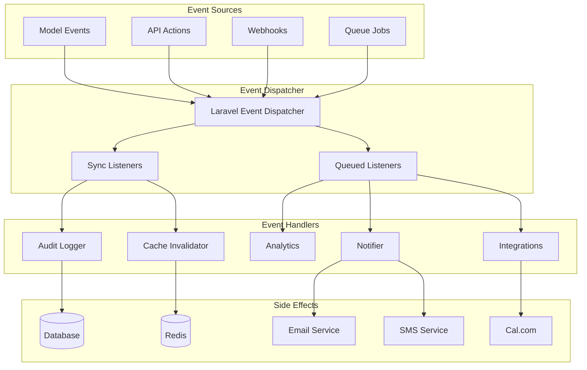
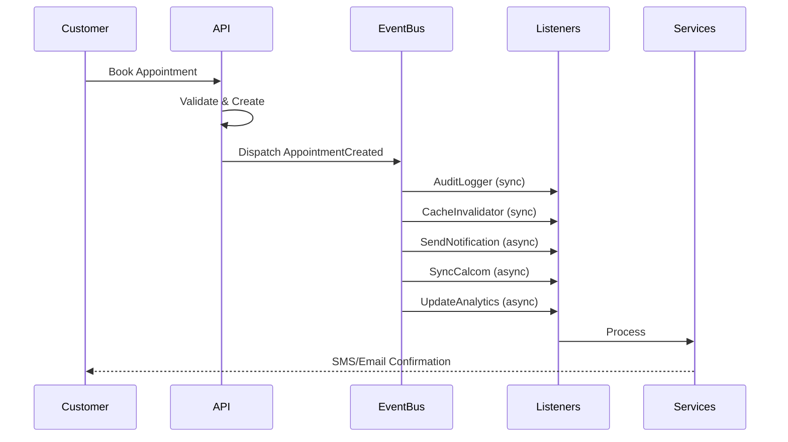
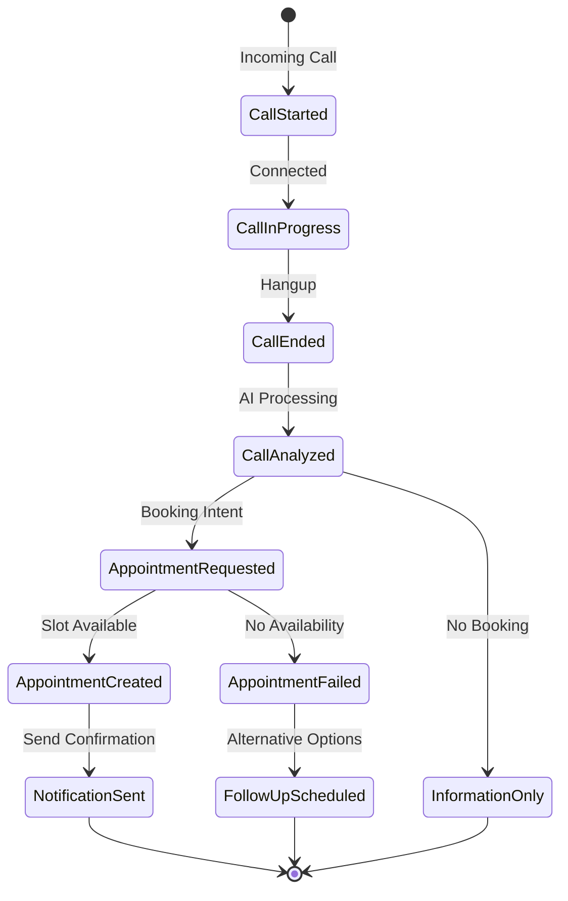

# Event System Architecture

## Overview

AskProAI uses Laravel's event system to implement an event-driven architecture. This enables loose coupling between components, better scalability, and comprehensive audit trails.

## Event Architecture



## Core Events

### Appointment Events

#### AppointmentCreated

```php
namespace App\Events;

class AppointmentCreated
{
    use Dispatchable, InteractsWithSockets, SerializesModels;
    
    public function __construct(
        public Appointment $appointment,
        public ?string $source = null,
        public array $metadata = []
    ) {}
    
    public function broadcastOn()
    {
        return new PrivateChannel('company.' . $this->appointment->company_id);
    }
    
    public function broadcastAs()
    {
        return 'appointment.created';
    }
    
    public function broadcastWith()
    {
        return [
            'appointment' => new AppointmentResource($this->appointment),
            'source' => $this->source,
            'metadata' => $this->metadata,
        ];
    }
}
```

#### AppointmentUpdated

```php
class AppointmentUpdated
{
    public function __construct(
        public Appointment $appointment,
        public array $changes,
        public ?User $updatedBy = null
    ) {}
    
    public function wasRescheduled(): bool
    {
        return isset($this->changes['start_time']) || 
               isset($this->changes['end_time']);
    }
    
    public function wasReassigned(): bool
    {
        return isset($this->changes['staff_id']);
    }
}
```

### Customer Events

#### CustomerCreated

```php
class CustomerCreated
{
    public function __construct(
        public Customer $customer,
        public string $source // 'phone', 'web', 'import', 'manual'
    ) {}
}
```

#### CustomerMerged

```php
class CustomerMerged
{
    public function __construct(
        public Customer $primaryCustomer,
        public Customer $mergedCustomer,
        public array $mergedData
    ) {}
}
```

### Call Events

#### CallCompleted

```php
class CallCompleted
{
    public function __construct(
        public Call $call,
        public array $analysis
    ) {}
    
    public function hasAppointmentRequest(): bool
    {
        return !empty($this->analysis['appointment_request']);
    }
    
    public function getSentiment(): string
    {
        return $this->analysis['sentiment'] ?? 'neutral';
    }
}
```

## Event Listeners

### Synchronous Listeners

These run immediately in the same process.

#### AuditLogger

```php
class AuditLogger
{
    public function handle($event)
    {
        if (!$event instanceof ShouldAudit) {
            return;
        }
        
        AuditLog::create([
            'event_type' => get_class($event),
            'model_type' => $event->getAuditableType(),
            'model_id' => $event->getAuditableId(),
            'user_id' => auth()->id(),
            'company_id' => $event->getCompanyId(),
            'data' => $event->getAuditData(),
            'ip_address' => request()->ip(),
            'user_agent' => request()->userAgent(),
        ]);
    }
}
```

#### CacheInvalidator

```php
class CacheInvalidator
{
    protected array $eventCacheMap = [
        AppointmentCreated::class => ['appointments', 'availability'],
        AppointmentUpdated::class => ['appointments', 'availability'],
        CustomerUpdated::class => ['customers'],
        StaffUpdated::class => ['staff', 'availability'],
    ];
    
    public function handle($event)
    {
        $eventClass = get_class($event);
        
        if (!isset($this->eventCacheMap[$eventClass])) {
            return;
        }
        
        $tags = $this->eventCacheMap[$eventClass];
        
        // Add company-specific tag
        if (method_exists($event, 'getCompanyId')) {
            $tags[] = 'company:' . $event->getCompanyId();
        }
        
        Cache::tags($tags)->flush();
    }
}
```

### Queued Listeners

These run asynchronously in the background.

#### SendAppointmentNotification

```php
class SendAppointmentNotification implements ShouldQueue
{
    use InteractsWithQueue;
    
    public $queue = 'notifications';
    public $delay = 5; // 5 second delay
    
    public function handle(AppointmentCreated $event)
    {
        $appointment = $event->appointment;
        $customer = $appointment->customer;
        
        // Send SMS if enabled
        if ($customer->prefers_sms) {
            dispatch(new SendSMSJob(
                $customer->phone,
                $this->buildSMSMessage($appointment)
            ));
        }
        
        // Send email if enabled
        if ($customer->email && $customer->prefers_email) {
            Mail::to($customer->email)
                ->queue(new AppointmentConfirmation($appointment));
        }
        
        // Send WhatsApp if enabled
        if ($customer->prefers_whatsapp) {
            dispatch(new SendWhatsAppJob(
                $customer->phone,
                $this->buildWhatsAppMessage($appointment)
            ));
        }
    }
    
    public function failed(AppointmentCreated $event, \Throwable $exception)
    {
        Log::error('Failed to send appointment notification', [
            'appointment_id' => $event->appointment->id,
            'error' => $exception->getMessage(),
        ]);
    }
}
```

#### UpdateAnalytics

```php
class UpdateAnalytics implements ShouldQueue
{
    use InteractsWithQueue;
    
    public $queue = 'analytics';
    
    public function handle($event)
    {
        match(true) {
            $event instanceof AppointmentCreated => $this->trackAppointmentCreated($event),
            $event instanceof CallCompleted => $this->trackCallCompleted($event),
            $event instanceof CustomerCreated => $this->trackCustomerCreated($event),
            default => null
        };
    }
    
    private function trackAppointmentCreated(AppointmentCreated $event)
    {
        Analytics::track('appointment.created', [
            'company_id' => $event->appointment->company_id,
            'branch_id' => $event->appointment->branch_id,
            'service_id' => $event->appointment->service_id,
            'source' => $event->source,
            'value' => $event->appointment->service->price,
            'lead_time' => $event->appointment->start_time->diffInHours(now()),
        ]);
    }
}
```

#### SyncWithExternalServices

```php
class SyncWithExternalServices implements ShouldQueue
{
    use InteractsWithQueue;
    
    public $tries = 5;
    public $backoff = [10, 30, 60, 120, 300];
    
    public function handle($event)
    {
        if ($event instanceof AppointmentCreated) {
            $this->syncAppointmentToCalcom($event->appointment);
            $this->syncAppointmentToCRM($event->appointment);
        }
        
        if ($event instanceof CustomerUpdated) {
            $this->syncCustomerToCRM($event->customer);
        }
    }
    
    private function syncAppointmentToCalcom(Appointment $appointment)
    {
        try {
            app(CalcomV2Service::class)->syncAppointment($appointment);
        } catch (CalcomException $e) {
            Log::error('Cal.com sync failed', [
                'appointment_id' => $appointment->id,
                'error' => $e->getMessage(),
            ]);
            throw $e; // Retry
        }
    }
}
```

## Event Subscribers

Event subscribers group related event handlers.

### AppointmentEventSubscriber

```php
class AppointmentEventSubscriber
{
    public function subscribe(Dispatcher $events): void
    {
        $events->listen(
            AppointmentCreated::class,
            [self::class, 'handleAppointmentCreated']
        );
        
        $events->listen(
            AppointmentUpdated::class,
            [self::class, 'handleAppointmentUpdated']
        );
        
        $events->listen(
            AppointmentCancelled::class,
            [self::class, 'handleAppointmentCancelled']
        );
    }
    
    public function handleAppointmentCreated(AppointmentCreated $event): void
    {
        // Update staff availability
        $this->updateStaffAvailability($event->appointment);
        
        // Update branch statistics
        $this->updateBranchStats($event->appointment->branch_id);
        
        // Create follow-up reminders
        $this->scheduleReminders($event->appointment);
    }
    
    public function handleAppointmentUpdated(AppointmentUpdated $event): void
    {
        if ($event->wasRescheduled()) {
            // Clear old time slot
            $this->clearOldTimeSlot($event->appointment, $event->changes);
            
            // Notify affected parties
            $this->notifyRescheduling($event->appointment);
        }
    }
}
```

## Event Sourcing

For critical business events, we store the complete event history.

### Event Store

```php
Schema::create('event_store', function (Blueprint $table) {
    $table->id();
    $table->string('aggregate_id');
    $table->string('aggregate_type');
    $table->integer('version');
    $table->string('event_type');
    $table->json('event_data');
    $table->json('metadata');
    $table->timestamp('occurred_at');
    $table->index(['aggregate_id', 'aggregate_type']);
    $table->index('event_type');
    $table->index('occurred_at');
});
```

### Storing Events

```php
class EventStore
{
    public function store(DomainEvent $event): void
    {
        DB::table('event_store')->insert([
            'aggregate_id' => $event->getAggregateId(),
            'aggregate_type' => $event->getAggregateType(),
            'version' => $event->getVersion(),
            'event_type' => get_class($event),
            'event_data' => json_encode($event->toArray()),
            'metadata' => json_encode($event->getMetadata()),
            'occurred_at' => $event->occurredAt(),
        ]);
    }
    
    public function getEvents(string $aggregateId, string $aggregateType): Collection
    {
        return DB::table('event_store')
            ->where('aggregate_id', $aggregateId)
            ->where('aggregate_type', $aggregateType)
            ->orderBy('version')
            ->get()
            ->map(fn($row) => $this->deserialize($row));
    }
}
```

## Event-Driven Workflows

### Appointment Booking Workflow



### Call Processing Workflow



## Testing Events

### Unit Testing Events

```php
class AppointmentEventTest extends TestCase
{
    public function test_appointment_created_event_has_correct_data()
    {
        $appointment = Appointment::factory()->create();
        
        $event = new AppointmentCreated($appointment, 'api', ['user_id' => 1]);
        
        $this->assertEquals($appointment->id, $event->appointment->id);
        $this->assertEquals('api', $event->source);
        $this->assertArrayHasKey('user_id', $event->metadata);
    }
}
```

### Testing Event Listeners

```php
class NotificationListenerTest extends TestCase
{
    public function test_notification_sent_on_appointment_created()
    {
        Event::fake([AppointmentCreated::class]);
        
        $appointment = Appointment::factory()->create();
        
        event(new AppointmentCreated($appointment));
        
        Event::assertDispatched(AppointmentCreated::class, function ($event) use ($appointment) {
            return $event->appointment->id === $appointment->id;
        });
        
        Event::assertListening(
            AppointmentCreated::class,
            SendAppointmentNotification::class
        );
    }
}
```

## Event Monitoring

### Event Metrics

```php
class EventMetricsCollector
{
    public function collectMetrics(): array
    {
        return [
            'events_per_minute' => $this->getEventRate(),
            'event_types' => $this->getEventTypeDistribution(),
            'failed_listeners' => $this->getFailedListeners(),
            'processing_time' => $this->getAverageProcessingTime(),
            'queue_depth' => $this->getEventQueueDepth(),
        ];
    }
}
```

### Event Dashboard

Monitor events in real-time:

```php
Route::get('/admin/events/dashboard', function () {
    return view('admin.events.dashboard', [
        'recentEvents' => EventStore::recent(100),
        'eventStats' => app(EventMetricsCollector::class)->collectMetrics(),
        'failedEvents' => FailedEvent::recent(50),
    ]);
});
```

## Best Practices

1. **Event Naming**: Use past tense (AppointmentCreated, not CreateAppointment)
2. **Event Data**: Include all relevant data, events should be self-contained
3. **Idempotency**: Listeners should handle duplicate events gracefully
4. **Error Handling**: Failed listeners shouldn't break the main flow
5. **Performance**: Use queued listeners for heavy processing
6. **Testing**: Always test events and their listeners
7. **Monitoring**: Track event metrics and failures