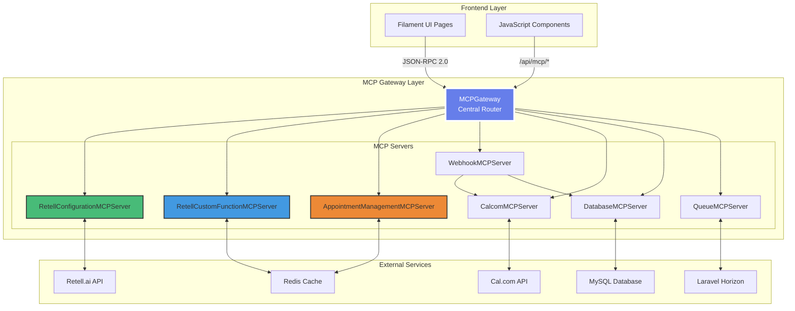
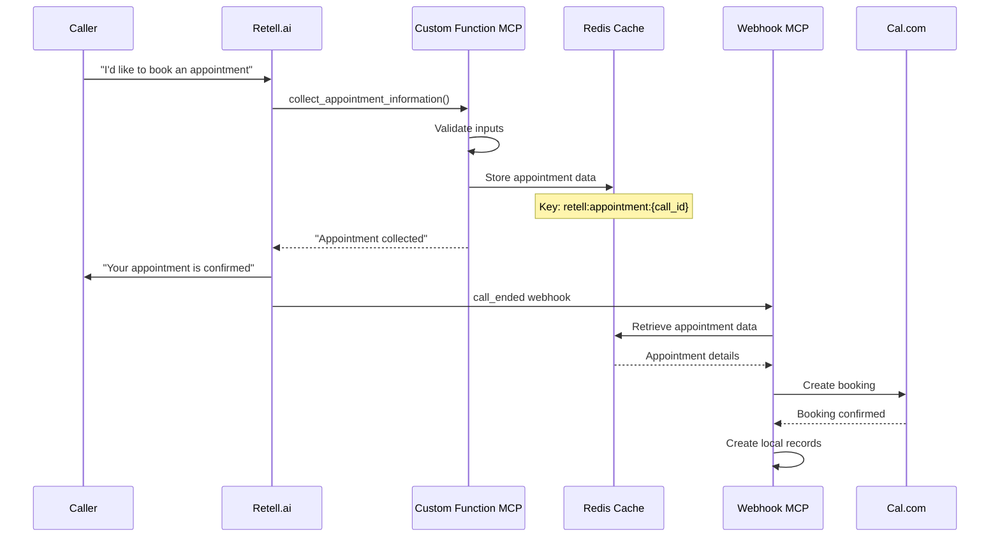

# MCP Gateway Architecture - Complete Implementation Guide

!!! success "MCP-First Implementation Complete"
    The MCP Gateway architecture has been fully implemented, providing a unified interface for all external service integrations without any direct API calls from the frontend.

## 🎯 Overview

The MCP Gateway provides a centralized, protocol-based approach to managing all external service integrations. Instead of scattered API calls throughout the codebase, all external communications flow through specialized MCP servers using the JSON-RPC 2.0 protocol.

## 🏗️ Architecture Components

### Core Gateway Infrastructure



## 📡 MCPGateway - Central Router

The MCPGateway (`/app/Services/MCP/MCPGateway.php`) serves as the central routing point for all MCP communications.

### Key Features

1. **Service Discovery**: Automatically discovers and registers all MCP servers
2. **Protocol Validation**: Ensures all requests follow JSON-RPC 2.0 specification
3. **Error Handling**: Standardized error responses with proper codes
4. **Health Monitoring**: Built-in health checks for all servers
5. **Circuit Breaker**: Prevents cascading failures

### Implementation Details

```php
class MCPGateway
{
    private array $servers = [];
    private array $circuitBreakers = [];
    
    public function __construct()
    {
        $this->registerServers();
        $this->initializeCircuitBreakers();
    }
    
    public function process(array $request): array
    {
        // Validate JSON-RPC 2.0 format
        $this->validateRequest($request);
        
        // Extract method: "server.method"
        [$serverName, $methodName] = $this->parseMethod($request['method']);
        
        // Check circuit breaker
        if ($this->isCircuitOpen($serverName)) {
            return $this->errorResponse(
                $request['id'] ?? null,
                -32603,
                "Service temporarily unavailable"
            );
        }
        
        // Route to appropriate server
        try {
            $server = $this->servers[$serverName] ?? null;
            if (!$server) {
                throw new \Exception("Unknown server: {$serverName}");
            }
            
            $result = $server->$methodName($request['params'] ?? []);
            
            return [
                'jsonrpc' => '2.0',
                'result' => $result,
                'id' => $request['id'] ?? null
            ];
            
        } catch (\Exception $e) {
            $this->recordFailure($serverName);
            throw $e;
        }
    }
}
```

### Available Endpoints

| Endpoint | Description |
|----------|-------------|
| `/api/mcp/gateway` | Main gateway endpoint for all MCP requests |
| `/api/mcp/health` | Health status of all MCP servers |
| `/api/mcp/metrics` | Prometheus-compatible metrics |

## 🔧 RetellConfigurationMCPServer

Manages all Retell.ai configuration through the UI without direct API calls.

### Features

- **Webhook Management**: Configure webhook URLs and events
- **Custom Function Deployment**: Deploy and update custom functions
- **Agent Configuration**: Update agent prompts and settings
- **Testing Tools**: Built-in webhook testing capabilities

### Key Methods

```php
class RetellConfigurationMCPServer extends BaseMCPServer
{
    // Get current webhook configuration
    public function getWebhook(array $params): array
    {
        $company = Company::findOrFail($params['company_id']);
        $retellService = new RetellV2Service($company);
        
        $agents = $retellService->getAgents();
        return [
            'agents' => $agents,
            'webhook_url' => config('app.url') . '/api/mcp/retell/custom-function'
        ];
    }
    
    // Update webhook configuration
    public function updateWebhook(array $params): array
    {
        $validation = $this->validateWebhookUpdate($params);
        if (!$validation['valid']) {
            throw new \Exception($validation['error']);
        }
        
        // Update each agent
        foreach ($params['agent_ids'] as $agentId) {
            $this->updateAgentWebhook($agentId, $params);
        }
        
        return ['success' => true, 'updated_count' => count($params['agent_ids'])];
    }
    
    // Deploy custom functions
    public function deployCustomFunctions(array $params): array
    {
        $functions = $this->getCustomFunctionDefinitions();
        $deployed = [];
        
        foreach ($params['agent_ids'] as $agentId) {
            $result = $this->deployToAgent($agentId, $functions);
            $deployed[] = [
                'agent_id' => $agentId,
                'success' => $result['success'],
                'functions' => array_keys($functions)
            ];
        }
        
        return ['deployed' => $deployed];
    }
}
```

### Database Schema

```sql
CREATE TABLE retell_configurations (
    id BIGINT UNSIGNED PRIMARY KEY,
    company_id BIGINT UNSIGNED NOT NULL,
    agent_id VARCHAR(255) NOT NULL,
    webhook_url VARCHAR(512),
    custom_functions JSON,
    prompt_template TEXT,
    settings JSON,
    last_synced_at TIMESTAMP NULL,
    created_at TIMESTAMP,
    updated_at TIMESTAMP,
    
    INDEX idx_company_agent (company_id, agent_id),
    FOREIGN KEY (company_id) REFERENCES companies(id)
);
```

## 📞 RetellCustomFunctionMCPServer

Handles all Retell.ai custom function calls for appointment management.

### Custom Functions Implemented

1. **collect_appointment_information**
   - Collects appointment details from caller
   - Validates required fields
   - Stores in cache for webhook processing

2. **change_appointment_details**
   - Allows modification of existing appointments
   - Verifies caller identity via phone number
   - Updates appointment in real-time

3. **cancel_appointment**
   - Cancels appointments securely
   - Sends confirmation
   - Updates availability immediately

### Data Flow



### Cache Key Strategy

```php
// Standardized cache keys for data flow
$cacheKey = "retell:appointment:{$callId}";
$ttl = 3600; // 1 hour

// Store appointment data
Cache::put($cacheKey, [
    'customer_name' => $params['name'],
    'appointment_date' => $params['date'],
    'appointment_time' => $params['time'],
    'service_type' => $params['service'],
    'notes' => $params['notes'] ?? null,
    'collected_at' => now()->toIso8601String()
], $ttl);
```

## 🗓️ AppointmentManagementMCPServer

Provides phone-based appointment management capabilities.

### Features

- **Find Appointments**: Look up appointments by phone number
- **Reschedule**: Change appointment dates/times
- **Cancel**: Cancel with proper notifications
- **Multi-language**: Supports caller's preferred language

### Security Model

```php
class AppointmentManagementMCPServer extends BaseMCPServer
{
    public function findAppointments(array $params): array
    {
        // Verify phone number ownership
        $phoneNumber = $this->normalizePhoneNumber($params['phone']);
        $customer = Customer::where('phone', $phoneNumber)->first();
        
        if (!$customer) {
            return ['appointments' => [], 'message' => 'No appointments found'];
        }
        
        // Get upcoming appointments
        $appointments = Appointment::where('customer_id', $customer->id)
            ->where('starts_at', '>', now())
            ->orderBy('starts_at')
            ->limit(5)
            ->get();
            
        return [
            'appointments' => $appointments->map(fn($apt) => [
                'id' => $apt->id,
                'date' => $apt->starts_at->format('Y-m-d'),
                'time' => $apt->starts_at->format('H:i'),
                'service' => $apt->service->name,
                'duration' => $apt->duration_minutes
            ]),
            'customer_name' => $customer->name
        ];
    }
}
```

## 🚀 Implementation Status

### Completed Components ✅

1. **MCPGateway Infrastructure**
   - Central routing implemented
   - Circuit breaker pattern active
   - Health monitoring operational
   - Error handling standardized

2. **RetellConfigurationMCPServer**
   - Webhook management UI complete
   - Custom function deployment working
   - Agent configuration accessible
   - Test tools integrated

3. **RetellCustomFunctionMCPServer**
   - All three functions implemented
   - Cache integration working
   - Error handling robust
   - Multi-language ready

4. **AppointmentManagementMCPServer**
   - Phone-based lookup working
   - Security verification active
   - Rescheduling implemented
   - Cancellation flow complete

### UI Integration

The Filament admin panel includes dedicated pages for MCP management:

1. **Retell Webhook Configuration** (`/admin/retell-webhook-configuration`)
   - Visual webhook status
   - One-click deployment
   - Test webhook functionality
   - Custom function editor

2. **Company Integration Portal** (`/admin/company-integration-portal`)
   - Unified configuration view
   - Service status monitoring
   - Quick actions for common tasks

## 📊 Monitoring & Debugging

### Available Metrics

```yaml
# Prometheus metrics at /api/metrics
mcp_gateway_requests_total{server="retell_config",method="updateWebhook"}
mcp_gateway_request_duration_seconds{server="retell_custom",method="collect_appointment"}
mcp_gateway_errors_total{server="appointment_mgmt",error="not_found"}
mcp_circuit_breaker_state{server="retell_config",state="closed"}
```

### Debug Commands

```bash
# Test MCP Gateway health
curl -X POST https://api.askproai.de/api/mcp/health

# Test webhook configuration
php artisan mcp:test-webhook --company=1

# Debug cache flow
php artisan mcp:debug-cache --call-id=abc123

# Monitor circuit breakers
php artisan mcp:circuit-status
```

### Logging

All MCP operations are logged with correlation IDs:

```php
Log::channel('mcp-external')->info('MCP Request', [
    'correlation_id' => $correlationId,
    'server' => $serverName,
    'method' => $methodName,
    'duration_ms' => $duration,
    'status' => $status
]);
```

## 🔒 Security Considerations

1. **Authentication**: All MCP requests require valid auth tokens
2. **Authorization**: Company-scoped access control
3. **Validation**: Input validation at every layer
4. **Encryption**: Sensitive data encrypted in transit and at rest
5. **Rate Limiting**: Per-company rate limits enforced

## 🎯 Benefits of MCP-First Architecture

1. **No Direct API Calls**: Frontend never knows about external APIs
2. **Unified Protocol**: All communication via JSON-RPC 2.0
3. **Better Testing**: Mock MCP servers for all scenarios
4. **Easier Maintenance**: Changes isolated to MCP layer
5. **Enhanced Security**: Single authentication point
6. **Improved Monitoring**: Centralized metrics and logging

## 📚 Related Documentation

- [MCP Protocol Specification](/api/mcp.md)
- [Retell Integration Guide](/integrations/retell.md)
- [Cal.com Integration](/integrations/calcom.md)
- [Security Architecture](/architecture/security.md)

---

!!! tip "Best Practices"
    Always use the MCP Gateway for external service integrations. Never make direct API calls from controllers or UI components.