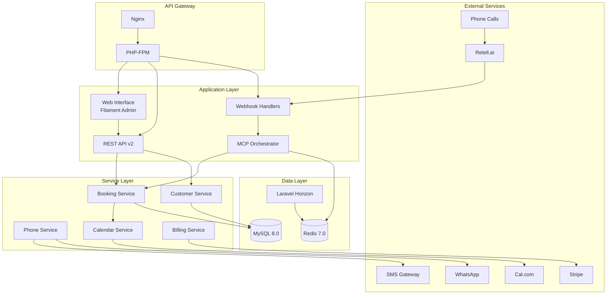

# Architecture Overview

## System Architecture

AskProAI follows a **microservices-inspired monolithic architecture** with clear service boundaries and domain separation.



## Design Principles

### 1. **Domain-Driven Design**
- Clear bounded contexts
- Aggregate roots for data consistency
- Repository pattern for data access

### 2. **Service-Oriented Architecture**
- Each service has a single responsibility
- Services communicate through well-defined interfaces
- Dependency injection for loose coupling

### 3. **Event-Driven Processing**
- Webhooks trigger asynchronous processing
- Queue-based job handling
- Event sourcing for audit trails

### 4. **Multi-Tenancy First**
- Company-level data isolation
- Automatic scope application
- Branch-level permissions

## Core Components

### MCP (Model Context Protocol) System

The heart of AskProAI's architecture is the MCP system with 5 specialized servers:

| Server | Responsibility | Key Features |
|--------|----------------|--------------|
| **WebhookMCPServer** | Orchestrates webhook processing | Request routing, validation |
| **CalcomMCPServer** | Cal.com integration | Circuit breaker, caching |
| **RetellMCPServer** | Retell.ai management | Agent config, phone sync |
| **DatabaseMCPServer** | Protected DB operations | Query monitoring, safety |
| **QueueMCPServer** | Job queue management | Priority handling, monitoring |

### Service Layer

Services encapsulate business logic and external integrations:

- **AppointmentBookingService**: Core booking orchestration
- **CustomerService**: Customer management and deduplication
- **PhoneNumberResolver**: Phone-to-branch resolution
- **CalendarService**: Abstract calendar operations
- **NotificationService**: Email/SMS/WhatsApp notifications

### Data Access Layer

- **Eloquent ORM**: Primary data access
- **Repository Pattern**: Complex queries (partially implemented)
- **Query Builder**: Performance-critical operations
- **Database Transactions**: Data consistency

## Technology Stack

### Backend
- **Framework**: Laravel 10.x
- **PHP Version**: 8.2+
- **Admin Panel**: Filament 3.x
- **API**: RESTful with potential GraphQL

### Frontend
- **Admin UI**: Livewire + Alpine.js
- **Styling**: Tailwind CSS
- **JavaScript**: Vanilla JS + Alpine.js
- **Build Tool**: Vite

### Infrastructure
- **Web Server**: Nginx
- **Application Server**: PHP-FPM
- **Database**: MySQL 8.0
- **Cache/Queue**: Redis 7.0
- **Queue Worker**: Laravel Horizon
- **Monitoring**: Custom + Prometheus ready

### External Services
- **Calendar**: Cal.com v2 API
- **Phone AI**: Retell.ai
- **Payments**: Stripe
- **Email**: SMTP (smtp.udag.de)
- **SMS**: Generic provider interface
- **WhatsApp**: Business API (beta)

## Scalability Considerations

### Current Limitations
- Single MySQL instance (no read replicas)
- Single Redis instance (no clustering)
- Monolithic deployment
- Limited horizontal scaling

### Scaling Strategy
1. **Phase 1**: Optimize current architecture
   - Database query optimization
   - Caching improvements
   - Code-level optimizations

2. **Phase 2**: Infrastructure scaling
   - Read replicas for MySQL
   - Redis Sentinel/Cluster
   - Load balancer setup

3. **Phase 3**: Service extraction
   - Extract MCP as microservice
   - Separate webhook processing
   - Independent calendar service

## Security Architecture

### Application Security
- **Authentication**: Laravel Sanctum
- **Authorization**: Policies & Gates
- **Encryption**: Field-level for PII
- **Input Validation**: Request classes
- **SQL Injection**: Prepared statements

### Infrastructure Security
- **HTTPS**: Enforced everywhere
- **Firewall**: IP whitelisting for webhooks
- **Rate Limiting**: Adaptive per endpoint
- **Monitoring**: Real-time threat detection

### Compliance
- **GDPR**: Full compliance toolkit
- **Data Retention**: Configurable policies
- **Audit Logging**: Comprehensive tracking
- **Data Export**: On-demand generation

## Performance Optimizations

### Caching Strategy
1. **L1 - Memory Cache**: In-process array (50MB)
2. **L2 - Redis Cache**: Shared cache (2GB)
3. **L3 - Database Cache**: Persistent (unlimited)

### Database Optimizations
- 400+ indexes for common queries
- Eager loading for relationships
- Query result caching
- Connection pooling

### API Optimizations
- Response compression
- ETags for caching
- Pagination for lists
- Field filtering

## Monitoring & Observability

### Metrics Collection
- **Prometheus**: `/api/metrics` endpoint
- **Custom Metrics**: Business KPIs
- **Performance Tracking**: Query times, API latency

### Logging Strategy
- **Application Logs**: Structured JSON
- **Audit Logs**: Separate storage
- **Error Tracking**: Sentry integration
- **Correlation IDs**: Request tracing

### Health Checks
- **Application**: `/api/health`
- **Database**: Connection monitoring
- **Redis**: Memory and connection checks
- **External APIs**: Circuit breaker status

## Development Workflow

### Code Organization
```
app/
├── Console/          # Artisan commands
├── Events/           # Event classes
├── Exceptions/       # Custom exceptions
├── Http/
│   ├── Controllers/  # HTTP controllers
│   ├── Middleware/   # HTTP middleware
│   └── Requests/     # Form requests
├── Jobs/            # Queued jobs
├── Models/          # Eloquent models
├── Policies/        # Authorization policies
├── Providers/       # Service providers
└── Services/        # Business logic
```

### Testing Strategy
- **Unit Tests**: Models, services, helpers
- **Integration Tests**: Service interactions
- **Feature Tests**: API endpoints
- **E2E Tests**: Complete workflows

### Deployment Pipeline
1. Code push to GitHub
2. CI/CD runs tests
3. Build Docker image
4. Deploy to staging
5. Run smoke tests
6. Deploy to production
7. Monitor metrics

---

*For detailed component documentation, see specific architecture pages.*