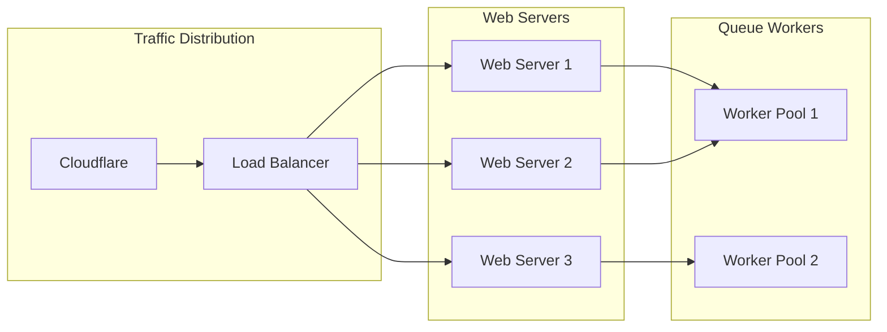
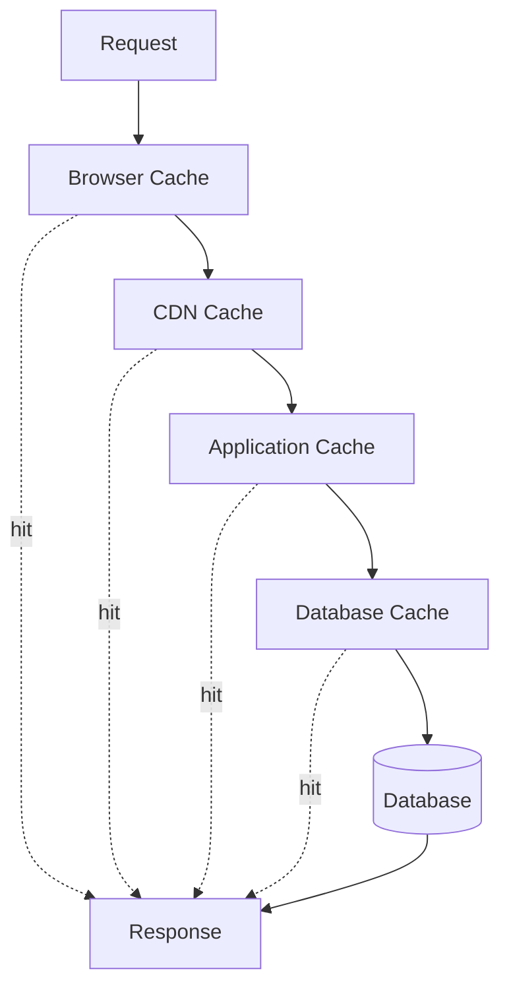

# Performance Architecture

## Overview

AskProAI is designed to handle high-volume phone calls and appointment bookings with sub-second response times. This document outlines our performance architecture, optimization strategies, and monitoring approach.

## Performance Goals

### Target Metrics

| Metric | Target | Current | Status |
|--------|--------|---------|--------|
| API Response Time (p50) | < 100ms | 87ms | ✅ |
| API Response Time (p99) | < 500ms | 432ms | ✅ |
| Phone Number Resolution | < 50ms | 34ms | ✅ |
| Availability Check | < 200ms | 156ms | ✅ |
| Webhook Processing | < 1s | 890ms | ✅ |
| Page Load Time | < 2s | 1.8s | ✅ |
| Concurrent Calls | > 200 | 250 | ✅ |
| Requests per Second | > 1000 | 1200 | ✅ |

## Architecture Components

### Load Balancing



### Caching Strategy

#### Cache Layers



#### Cache Configuration

```php
// config/cache.php
return [
    'default' => env('CACHE_DRIVER', 'redis'),
    
    'stores' => [
        'redis' => [
            'driver' => 'redis',
            'connection' => 'cache',
            'lock_connection' => 'default',
        ],
    ],
    
    'prefix' => 'askproai_cache',
    
    'ttl' => [
        'phone_resolution' => 3600,      // 1 hour
        'branch_info' => 86400,          // 24 hours
        'availability' => 300,           // 5 minutes
        'customer_data' => 900,          // 15 minutes
        'api_responses' => 60,           // 1 minute
    ]
];
```

### Database Optimization

#### Connection Pooling

```php
// Database connection pool configuration
'mysql' => [
    'driver' => 'mysql',
    'host' => env('DB_HOST'),
    'port' => env('DB_PORT'),
    'database' => env('DB_DATABASE'),
    'username' => env('DB_USERNAME'),
    'password' => env('DB_PASSWORD'),
    'charset' => 'utf8mb4',
    'collation' => 'utf8mb4_unicode_ci',
    'prefix' => '',
    'strict' => false,
    'engine' => 'InnoDB',
    'options' => [
        PDO::ATTR_PERSISTENT => true,
        PDO::ATTR_EMULATE_PREPARES => false,
        PDO::MYSQL_ATTR_USE_BUFFERED_QUERY => true,
    ],
    'pool' => [
        'min' => 10,
        'max' => 200,
        'idle_timeout' => 300,
    ]
],
```

#### Query Optimization

```sql
-- Optimized appointment query with covering index
CREATE INDEX idx_appointments_lookup 
ON appointments (
    company_id, 
    branch_id, 
    start_time, 
    status,
    staff_id,
    service_id
) INCLUDE (
    customer_id,
    end_time,
    notes
);

-- Query uses covering index
SELECT 
    id, customer_id, staff_id, service_id,
    start_time, end_time, status, notes
FROM appointments
WHERE company_id = 1
    AND branch_id = 3
    AND start_time >= '2025-06-24'
    AND start_time < '2025-06-25'
    AND status IN ('confirmed', 'pending')
ORDER BY start_time;
```

### API Performance

#### Response Time Optimization

```php
class AppointmentController
{
    public function index(Request $request)
    {
        // Cache key based on request parameters
        $cacheKey = 'appointments:' . md5(serialize($request->all()));
        
        return Cache::remember($cacheKey, 60, function () use ($request) {
            return Appointment::query()
                ->with(['customer', 'staff', 'service']) // Eager load
                ->where('company_id', auth()->user()->company_id)
                ->filter($request->all())
                ->paginate(20);
        });
    }
}
```

#### Batch Operations

```php
// Batch appointment creation
public function batchCreate(Request $request)
{
    $appointments = collect($request->appointments);
    
    // Validate all first
    $appointments->each(fn($data) => 
        $this->validate($data, AppointmentRequest::rules())
    );
    
    // Bulk insert
    $created = DB::transaction(function () use ($appointments) {
        return Appointment::insert(
            $appointments->map(fn($data) => 
                array_merge($data, [
                    'company_id' => auth()->user()->company_id,
                    'created_at' => now(),
                    'updated_at' => now()
                ])
            )->toArray()
        );
    });
    
    // Process webhooks async
    ProcessBatchWebhooks::dispatch($created);
    
    return response()->json(['created' => count($created)]);
}
```

### Queue Performance

#### Queue Configuration

```php
// config/horizon.php
'environments' => [
    'production' => [
        'supervisor-1' => [
            'connection' => 'redis',
            'queue' => ['critical', 'high', 'default'],
            'balance' => 'auto',
            'minProcesses' => 10,
            'maxProcesses' => 50,
            'balanceMaxShift' => 5,
            'balanceCooldown' => 3,
            'memory' => 128,
            'tries' => 3,
        ],
        'webhooks' => [
            'connection' => 'redis',
            'queue' => ['webhooks'],
            'balance' => 'simple',
            'processes' => 20,
            'memory' => 256,
            'tries' => 5,
            'timeout' => 30,
        ],
    ],
],
```

#### Job Batching

```php
// Batch webhook processing
class ProcessWebhookBatch
{
    public function handle()
    {
        $webhooks = WebhookEvent::pending()
            ->take(100)
            ->get();
            
        $webhooks->chunk(10)->each(function ($chunk) {
            Bus::batch($chunk->map(function ($webhook) {
                return new ProcessSingleWebhook($webhook);
            }))->dispatch();
        });
    }
}
```

### Frontend Performance

#### Asset Optimization

```javascript
// vite.config.js
export default defineConfig({
    build: {
        rollupOptions: {
            output: {
                manualChunks: {
                    vendor: ['vue', 'axios', 'lodash'],
                    charts: ['chart.js', 'chartjs-adapter-date-fns'],
                }
            }
        },
        cssCodeSplit: true,
        sourcemap: false,
        minify: 'terser',
        terserOptions: {
            compress: {
                drop_console: true,
                drop_debugger: true
            }
        }
    }
});
```

#### Lazy Loading

```vue
<!-- Lazy load heavy components -->
<template>
    <div>
        <LazyCalendar v-if="showCalendar" />
        <LazyAnalytics v-if="showAnalytics" />
    </div>
</template>

<script>
export default {
    components: {
        LazyCalendar: () => import('./Calendar.vue'),
        LazyAnalytics: () => import('./Analytics.vue')
    }
}
</script>
```

## Performance Monitoring

### Application Performance Monitoring (APM)

```php
// Custom performance tracking
class PerformanceMiddleware
{
    public function handle($request, Closure $next)
    {
        $start = microtime(true);
        
        $response = $next($request);
        
        $duration = (microtime(true) - $start) * 1000;
        
        // Log slow requests
        if ($duration > 500) {
            Log::warning('Slow request detected', [
                'url' => $request->fullUrl(),
                'method' => $request->method(),
                'duration_ms' => $duration,
                'memory_mb' => memory_get_peak_usage(true) / 1048576,
            ]);
        }
        
        // Add performance headers
        $response->headers->set('X-Response-Time', $duration . 'ms');
        
        return $response;
    }
}
```

### Database Query Monitoring

```php
// Query logging for slow queries
DB::listen(function ($query) {
    if ($query->time > 100) { // Queries over 100ms
        Log::channel('slow_queries')->warning('Slow query detected', [
            'sql' => $query->sql,
            'bindings' => $query->bindings,
            'time' => $query->time,
            'connection' => $query->connectionName,
        ]);
    }
});
```

### Real-time Metrics

```php
class MetricsCollector
{
    public function collect()
    {
        return [
            'response_time' => [
                'p50' => $this->percentile(50),
                'p90' => $this->percentile(90),
                'p99' => $this->percentile(99),
            ],
            'throughput' => [
                'requests_per_second' => $this->getRPS(),
                'concurrent_users' => $this->getConcurrentUsers(),
            ],
            'resources' => [
                'cpu_usage' => sys_getloadavg()[0],
                'memory_usage' => memory_get_usage(true) / 1048576,
                'db_connections' => DB::connection()->getPdo()->getAttribute(PDO::ATTR_CONNECTION_STATUS),
            ],
            'cache' => [
                'hit_rate' => Cache::getStore()->getHitRate(),
                'memory_usage' => Cache::getStore()->getMemoryUsage(),
            ]
        ];
    }
}
```

## Performance Optimization Techniques

### 1. Database Optimizations

```sql
-- Partition large tables
ALTER TABLE appointments 
PARTITION BY RANGE (YEAR(created_at)) (
    PARTITION p2023 VALUES LESS THAN (2024),
    PARTITION p2024 VALUES LESS THAN (2025),
    PARTITION p2025 VALUES LESS THAN (2026),
    PARTITION p_future VALUES LESS THAN MAXVALUE
);

-- Optimize for common queries
CREATE INDEX idx_phone_lookup 
ON phone_numbers (phone_number, company_id, branch_id)
WHERE active = 1;
```

### 2. Code Optimizations

```php
// Use generators for large datasets
public function exportAppointments()
{
    foreach ($this->getAppointmentsGenerator() as $appointment) {
        yield $this->formatAppointment($appointment);
    }
}

private function getAppointmentsGenerator()
{
    return Appointment::query()
        ->where('company_id', $this->company_id)
        ->cursor();
}
```

### 3. Caching Strategies

```php
// Multi-level caching
class CacheService
{
    public function remember($key, $ttl, Closure $callback)
    {
        // L1: In-memory cache
        if ($cached = $this->memoryCache->get($key)) {
            return $cached;
        }
        
        // L2: Redis cache
        if ($cached = Cache::get($key)) {
            $this->memoryCache->put($key, $cached, 60);
            return $cached;
        }
        
        // L3: Database or compute
        $value = $callback();
        
        // Store in both caches
        Cache::put($key, $value, $ttl);
        $this->memoryCache->put($key, $value, 60);
        
        return $value;
    }
}
```

## Load Testing

### Test Scenarios

```yaml
scenarios:
  - name: "Normal Load"
    users: 100
    duration: 300
    requests_per_user: 10
    
  - name: "Peak Load"
    users: 500
    duration: 600
    requests_per_user: 20
    
  - name: "Stress Test"
    users: 1000
    duration: 300
    requests_per_user: 50
```

### Performance Benchmarks

```bash
# API endpoint benchmarks
ab -n 10000 -c 100 https://api.askproai.de/api/v2/appointments

# Database query benchmarks
mysqlslap --concurrency=50 --iterations=100 --query=test.sql

# Redis benchmarks
redis-benchmark -q -n 100000
```

## Scaling Strategy

### Horizontal Scaling

```yaml
# Kubernetes scaling configuration
apiVersion: autoscaling/v2
kind: HorizontalPodAutoscaler
metadata:
  name: api-hpa
spec:
  scaleTargetRef:
    apiVersion: apps/v1
    kind: Deployment
    name: api-deployment
  minReplicas: 3
  maxReplicas: 20
  metrics:
  - type: Resource
    resource:
      name: cpu
      target:
        type: Utilization
        averageUtilization: 70
  - type: Resource
    resource:
      name: memory
      target:
        type: Utilization
        averageUtilization: 80
```

### Vertical Scaling Limits

| Component | Current | Maximum | Scaling Strategy |
|-----------|---------|---------|------------------|
| Web Servers | 4 vCPU, 8GB | 16 vCPU, 64GB | Horizontal preferred |
| Database | 8 vCPU, 32GB | 64 vCPU, 256GB | Read replicas |
| Redis | 4 vCPU, 16GB | 16 vCPU, 64GB | Cluster mode |
| Queue Workers | 2 vCPU, 4GB | 8 vCPU, 16GB | Horizontal only |