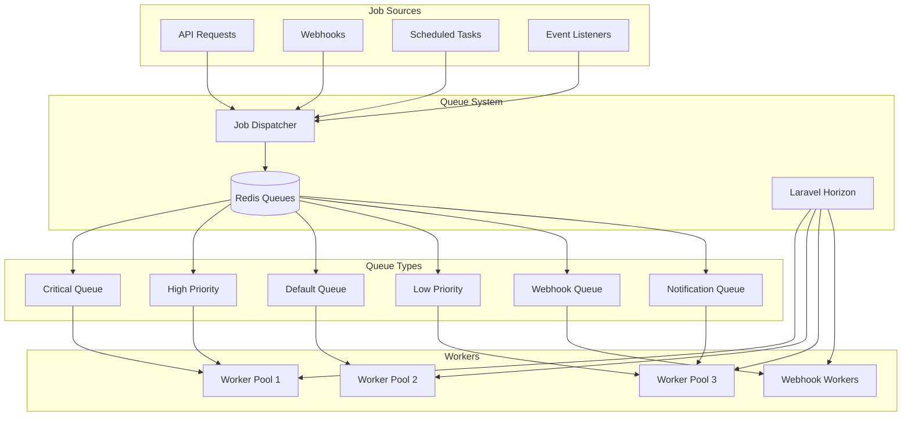

# Queue Jobs Architecture

## Overview

AskProAI uses Laravel's queue system with Redis and Horizon for processing asynchronous tasks. This architecture ensures reliable webhook processing, notifications, and heavy computations without blocking user requests.

## Queue Architecture



## Job Categories

### Critical Jobs

These jobs affect immediate user experience and must be processed quickly.

#### ProcessRetellCallEndedJob
```php
class ProcessRetellCallEndedJob implements ShouldQueue
{
    use Dispatchable, InteractsWithQueue, Queueable, SerializesModels;
    
    public $tries = 3;
    public $timeout = 60;
    public $queue = 'critical';
    
    public function handle()
    {
        // 1. Parse call data
        $callData = $this->parseRetellData($this->payload);
        
        // 2. Create call record
        $call = Call::create($callData);
        
        // 3. Extract appointment request
        if ($appointmentRequest = $this->extractAppointmentRequest()) {
            CreateAppointmentFromCallJob::dispatch($appointmentRequest)
                ->onQueue('high');
        }
        
        // 4. Update customer record
        UpdateCustomerFromCallJob::dispatch($call)
            ->onQueue('default');
    }
    
    public function failed(\Throwable $exception)
    {
        Log::critical('Critical job failed', [
            'job' => self::class,
            'payload' => $this->payload,
            'error' => $exception->getMessage()
        ]);
        
        // Alert operations team
        NotifyOpsTeam::dispatch($exception);
    }
}
```

### High Priority Jobs

Important but not immediately critical.

#### CreateAppointmentFromCallJob
```php
class CreateAppointmentFromCallJob implements ShouldQueue
{
    use Dispatchable, InteractsWithQueue, Queueable, SerializesModels;
    
    public $tries = 5;
    public $backoff = [10, 30, 60, 300, 600];
    public $queue = 'high';
    
    public function handle(
        AppointmentBookingService $bookingService,
        CalcomV2Service $calcomService
    ) {
        DB::transaction(function () use ($bookingService, $calcomService) {
            // Create appointment
            $appointment = $bookingService->createFromCall($this->data);
            
            // Book in Cal.com
            $calcomBooking = $calcomService->createBooking($appointment);
            
            // Update with external reference
            $appointment->update([
                'external_id' => $calcomBooking->id
            ]);
            
            // Send confirmation
            SendAppointmentConfirmationJob::dispatch($appointment)
                ->onQueue('notifications');
        });
    }
}
```

### Default Priority Jobs

Regular processing tasks.

#### SyncCalcomDataJob
```php
class SyncCalcomDataJob implements ShouldQueue
{
    use Dispatchable, InteractsWithQueue, Queueable, SerializesModels;
    
    public $tries = 3;
    public $timeout = 300;
    public $queue = 'default';
    
    public function handle(CalcomSyncService $syncService)
    {
        // Sync event types
        $syncService->syncEventTypes($this->companyId);
        
        // Sync availability
        $syncService->syncAvailability($this->companyId);
        
        // Update cache
        Cache::tags(['calcom', "company:{$this->companyId}"])->flush();
    }
}
```

### Webhook Jobs

Special handling for external webhooks.

#### ProcessCalcomWebhookJob
```php
class ProcessCalcomWebhookJob implements ShouldQueue
{
    use Dispatchable, InteractsWithQueue, Queueable, SerializesModels;
    
    public $tries = 10;
    public $backoff = [5, 10, 30, 60, 120, 300, 600, 1800, 3600, 7200];
    public $queue = 'webhooks';
    
    public function middleware()
    {
        return [
            new RateLimited('calcom-webhooks'),
            new PreventOverlapping($this->webhookId),
        ];
    }
    
    public function handle()
    {
        // Check for duplicate processing
        if ($this->isDuplicate()) {
            Log::info('Skipping duplicate webhook', ['id' => $this->webhookId]);
            return;
        }
        
        // Process based on event type
        match($this->eventType) {
            'booking.created' => $this->handleBookingCreated(),
            'booking.cancelled' => $this->handleBookingCancelled(),
            'booking.rescheduled' => $this->handleBookingRescheduled(),
            default => Log::warning('Unknown webhook event', ['type' => $this->eventType])
        };
        
        // Mark as processed
        WebhookEvent::where('id', $this->webhookId)
            ->update(['processed_at' => now()]);
    }
}
```

### Notification Jobs

User communications.

#### SendSMSNotificationJob
```php
class SendSMSNotificationJob implements ShouldQueue
{
    use Dispatchable, InteractsWithQueue, Queueable, SerializesModels;
    
    public $tries = 3;
    public $timeout = 30;
    public $queue = 'notifications';
    
    public function handle(SMSService $smsService)
    {
        try {
            $smsService->send(
                $this->phoneNumber,
                $this->message,
                $this->metadata
            );
            
            // Log success
            NotificationLog::create([
                'type' => 'sms',
                'recipient' => $this->phoneNumber,
                'status' => 'sent',
                'sent_at' => now()
            ]);
        } catch (\Exception $e) {
            // Log failure but don't throw (avoid retries for invalid numbers)
            NotificationLog::create([
                'type' => 'sms',
                'recipient' => $this->phoneNumber,
                'status' => 'failed',
                'error' => $e->getMessage()
            ]);
        }
    }
}
```

## Queue Configuration

### Horizon Configuration

```php
// config/horizon.php
return [
    'use' => 'default',
    
    'prefix' => env('HORIZON_PREFIX', 'horizon:'),
    
    'waits' => [
        'redis:default' => 60,
    ],
    
    'trim' => [
        'recent' => 60,
        'pending' => 60,
        'completed' => 60,
        'recent_failed' => 10080,
        'failed' => 10080,
        'monitored' => 10080,
    ],
    
    'metrics' => [
        'trim_snapshots' => [
            'job' => 24,
            'queue' => 24,
        ],
    ],
    
    'environments' => [
        'production' => [
            'critical' => [
                'connection' => 'redis',
                'queue' => ['critical'],
                'balance' => 'auto',
                'autoScalingStrategy' => 'time',
                'maxProcesses' => 20,
                'minProcesses' => 5,
                'balanceMaxShift' => 5,
                'balanceCooldown' => 3,
                'memory' => 128,
                'tries' => 3,
                'nice' => 0,
                'timeout' => 60,
            ],
            'high-priority' => [
                'connection' => 'redis',
                'queue' => ['high'],
                'balance' => 'auto',
                'maxProcesses' => 15,
                'minProcesses' => 3,
                'memory' => 256,
                'tries' => 5,
                'nice' => 5,
                'timeout' => 300,
            ],
            'default' => [
                'connection' => 'redis',
                'queue' => ['default'],
                'balance' => 'simple',
                'processes' => 10,
                'memory' => 512,
                'tries' => 3,
                'nice' => 10,
                'timeout' => 600,
            ],
            'webhooks' => [
                'connection' => 'redis',
                'queue' => ['webhooks'],
                'balance' => 'auto',
                'maxProcesses' => 25,
                'minProcesses' => 5,
                'memory' => 256,
                'tries' => 10,
                'nice' => 5,
                'timeout' => 30,
            ],
            'notifications' => [
                'connection' => 'redis',
                'queue' => ['notifications', 'low'],
                'balance' => 'simple',
                'processes' => 5,
                'memory' => 128,
                'tries' => 3,
                'nice' => 15,
                'timeout' => 60,
            ],
        ],
    ],
];
```

## Job Lifecycle

```mermaid
stateDiagram-v2
    [*] --> Dispatched: Job::dispatch()
    Dispatched --> Queued: Add to Redis
    Queued --> Processing: Worker picks up
    Processing --> Completed: Success
    Processing --> Failed: Exception
    Processing --> Released: Retry needed
    Released --> Queued: Back to queue
    Failed --> Retrying: Has retries left
    Retrying --> Queued: Retry after delay
    Failed --> Dead: No retries left
    Completed --> [*]
    Dead --> [*]
```

## Job Patterns

### 1. Idempotent Jobs

```php
trait MakesJobIdempotent
{
    public function handle()
    {
        $lockKey = $this->getLockKey();
        
        $lock = Cache::lock($lockKey, $this->timeout + 60);
        
        if (!$lock->get()) {
            Log::info('Job already processing', ['key' => $lockKey]);
            return;
        }
        
        try {
            if ($this->alreadyProcessed()) {
                Log::info('Job already completed', ['key' => $lockKey]);
                return;
            }
            
            $this->process();
            $this->markAsProcessed();
        } finally {
            $lock->release();
        }
    }
    
    abstract protected function getLockKey(): string;
    abstract protected function alreadyProcessed(): bool;
    abstract protected function process(): void;
    abstract protected function markAsProcessed(): void;
}
```

### 2. Batch Processing

```php
class ProcessBatchJob implements ShouldQueue
{
    use Batchable;
    
    public function handle()
    {
        $items = $this->getItems();
        
        $jobs = $items->map(function ($item) {
            return new ProcessSingleItemJob($item);
        });
        
        Bus::batch($jobs)
            ->then(function (Batch $batch) {
                Log::info('Batch completed', ['id' => $batch->id]);
            })
            ->catch(function (Batch $batch, Throwable $e) {
                Log::error('Batch failed', [
                    'id' => $batch->id,
                    'error' => $e->getMessage()
                ]);
            })
            ->finally(function (Batch $batch) {
                CleanupBatchJob::dispatch($batch->id);
            })
            ->dispatch();
    }
}
```

### 3. Chain Processing

```php
Bus::chain([
    new ExtractCallDataJob($callId),
    new IdentifyCustomerJob($callId),
    new CreateAppointmentJob($callId),
    new SendConfirmationJob($callId),
    new UpdateAnalyticsJob($callId),
])->dispatch();
```

## Monitoring & Metrics

### Queue Metrics

```php
class QueueMetricsService
{
    public function getMetrics(): array
    {
        return [
            'queue_sizes' => $this->getQueueSizes(),
            'processing_time' => $this->getProcessingTimes(),
            'failure_rates' => $this->getFailureRates(),
            'worker_status' => $this->getWorkerStatus(),
            'throughput' => $this->getThroughput(),
        ];
    }
    
    private function getQueueSizes(): array
    {
        return collect(['critical', 'high', 'default', 'webhooks', 'notifications'])
            ->mapWithKeys(function ($queue) {
                return [$queue => Redis::llen("queues:{$queue}")];
            })
            ->toArray();
    }
}
```

### Health Checks

```php
class QueueHealthCheck
{
    public function check(): HealthCheckResult
    {
        $issues = [];
        
        // Check queue sizes
        foreach ($this->getQueueSizes() as $queue => $size) {
            if ($size > $this->getThreshold($queue)) {
                $issues[] = "Queue {$queue} is backed up ({$size} jobs)";
            }
        }
        
        // Check failed jobs
        $failedCount = DB::table('failed_jobs')->count();
        if ($failedCount > 100) {
            $issues[] = "High number of failed jobs ({$failedCount})";
        }
        
        // Check worker health
        if (!$this->areWorkersHealthy()) {
            $issues[] = "Some workers are not responding";
        }
        
        return new HealthCheckResult(
            empty($issues) ? 'healthy' : 'unhealthy',
            $issues
        );
    }
}
```

## Best Practices

### 1. Job Design
- Keep jobs small and focused
- Use database transactions when needed
- Implement proper error handling
- Make jobs idempotent when possible
- Use appropriate timeouts

### 2. Queue Selection
- `critical`: User-facing, immediate impact
- `high`: Important but can wait seconds
- `default`: Regular processing
- `webhooks`: External service callbacks
- `notifications`: User communications
- `low`: Reports, cleanup, maintenance

### 3. Error Handling
```php
public function handle()
{
    try {
        $this->process();
    } catch (RateLimitException $e) {
        // Retry later with backoff
        $this->release($e->retryAfter);
    } catch (ExternalServiceException $e) {
        // Retry with exponential backoff
        $this->release($this->attempts() * 60);
    } catch (ValidationException $e) {
        // Don't retry - log and fail
        Log::error('Validation failed', ['error' => $e->getMessage()]);
        $this->fail($e);
    }
}
```

### 4. Monitoring
- Set up alerts for queue depth
- Monitor job processing time
- Track failure rates
- Watch for memory leaks
- Review slow job logs