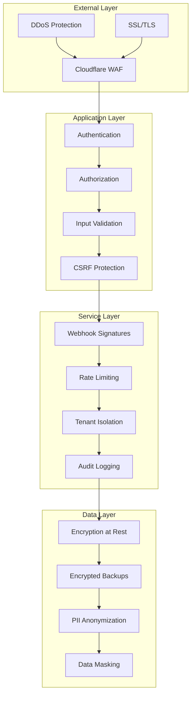
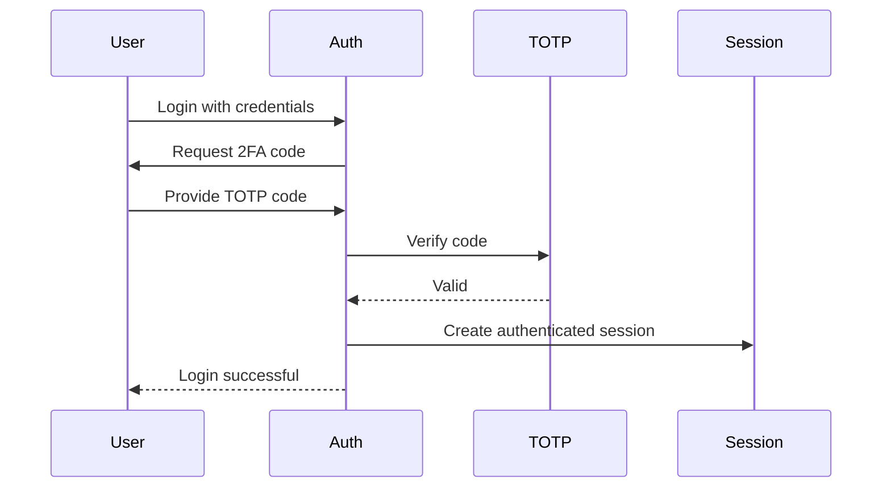
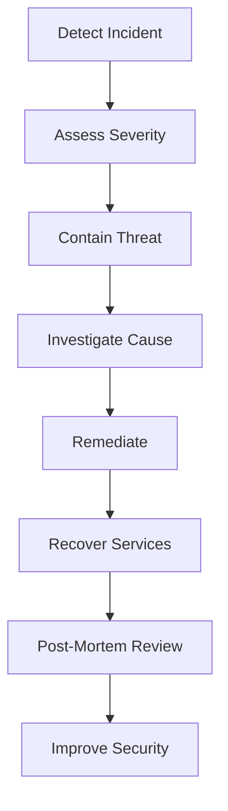

# Security Architecture

## Overview

AskProAI implements defense-in-depth security architecture with multiple layers of protection. This document outlines our security measures, compliance standards, and best practices.

## Security Principles

1. **Zero Trust**: Never trust, always verify
2. **Least Privilege**: Minimal access rights
3. **Defense in Depth**: Multiple security layers
4. **Fail Secure**: Secure by default on failure
5. **Audit Everything**: Comprehensive logging

## Architecture Overview



## Authentication & Authorization

### Authentication Methods

#### API Token Authentication
```php
// Secure token generation
$token = bin2hex(random_bytes(32));
$hashedToken = hash('sha256', $token);

// Store only the hash
ApiToken::create([
    'token_hash' => $hashedToken,
    'company_id' => $company->id,
    'expires_at' => now()->addYear()
]);
```

#### Session-Based Authentication
- Laravel Sanctum for SPA authentication
- Secure session cookies (HttpOnly, Secure, SameSite)
- Session rotation on privilege escalation

### Authorization Framework

```php
// Policy-based authorization
class AppointmentPolicy
{
    public function view(User $user, Appointment $appointment)
    {
        return $user->company_id === $appointment->company_id;
    }
    
    public function update(User $user, Appointment $appointment)
    {
        return $user->company_id === $appointment->company_id
            && $user->hasPermission('appointments.update');
    }
}
```

### Multi-Factor Authentication (MFA)



## Input Validation & Sanitization

### Request Validation

```php
class CreateAppointmentRequest extends FormRequest
{
    public function rules()
    {
        return [
            'customer_phone' => [
                'required',
                'string',
                new PhoneNumber(),
                new SQLInjectionProtection()
            ],
            'start_time' => [
                'required',
                'date',
                'after:now',
                new BusinessHours()
            ],
            'service_id' => [
                'required',
                'integer',
                'exists:services,id,company_id,' . $this->company_id
            ]
        ];
    }
}
```

### XSS Prevention

```php
// Automatic output escaping
{{ $user->name }} // Escaped
{!! $user->bio !!} // Raw (use carefully)

// Content Security Policy
Content-Security-Policy: 
    default-src 'self';
    script-src 'self' 'unsafe-inline' https://cdn.example.com;
    style-src 'self' 'unsafe-inline';
    img-src 'self' data: https:;
```

### SQL Injection Prevention

```php
// Bad - Never do this
$users = DB::select("SELECT * FROM users WHERE email = '$email'");

// Good - Parameterized queries
$users = DB::select("SELECT * FROM users WHERE email = ?", [$email]);

// Better - Query builder
$users = User::where('email', $email)->get();
```

## Webhook Security

### Signature Verification

```php
class VerifyWebhookSignature
{
    public function handle($request, Closure $next)
    {
        $payload = $request->getContent();
        $signature = $request->header('X-Webhook-Signature');
        
        $expected = 'sha256=' . hash_hmac(
            'sha256',
            $payload,
            config('services.webhook.secret')
        );
        
        if (!hash_equals($expected, $signature)) {
            throw new UnauthorizedException('Invalid webhook signature');
        }
        
        return $next($request);
    }
}
```

### Webhook Payload Validation

```json
{
  "timestamp": "2025-06-23T10:00:00Z",
  "signature": "sha256=...",
  "nonce": "unique-value",
  "data": {
    // Actual webhook data
  }
}
```

## Data Encryption

### Encryption at Rest

```php
// Automatic encryption for sensitive fields
class Customer extends Model
{
    protected $encrypted = [
        'ssn',
        'credit_card',
        'medical_notes'
    ];
}

// Encryption implementation
trait EncryptsAttributes
{
    public function setAttribute($key, $value)
    {
        if (in_array($key, $this->encrypted)) {
            $value = Crypt::encryptString($value);
        }
        
        parent::setAttribute($key, $value);
    }
}
```

### Encryption in Transit
- TLS 1.3 minimum
- Strong cipher suites only
- HSTS enabled
- Certificate pinning for mobile apps

## Multi-Tenancy Security

### Tenant Isolation

```php
// Global scope for automatic tenant filtering
class TenantScope implements Scope
{
    public function apply(Builder $builder, Model $model)
    {
        if (Auth::check()) {
            $builder->where('company_id', Auth::user()->company_id);
        }
    }
}

// Applied automatically to models
protected static function booted()
{
    static::addGlobalScope(new TenantScope);
}
```

### Cross-Tenant Protection

```php
// Middleware to prevent tenant switching
class EnsureTenantConsistency
{
    public function handle($request, Closure $next)
    {
        $requestTenant = $request->header('X-Company-ID');
        $userTenant = Auth::user()->company_id;
        
        if ($requestTenant && $requestTenant != $userTenant) {
            abort(403, 'Tenant mismatch');
        }
        
        return $next($request);
    }
}
```

## Rate Limiting & DDoS Protection

### Application-Level Rate Limiting

```php
// Adaptive rate limiting
class AdaptiveRateLimiter
{
    public function getRateLimit($user)
    {
        // Base limits by tier
        $limits = [
            'free' => 100,
            'pro' => 1000,
            'enterprise' => 10000
        ];
        
        $baseLimit = $limits[$user->tier] ?? 100;
        
        // Adjust based on behavior
        if ($this->isSuspiciousBehavior($user)) {
            return $baseLimit * 0.5; // Reduce limit
        }
        
        if ($this->isVerifiedUser($user)) {
            return $baseLimit * 1.2; // Increase limit
        }
        
        return $baseLimit;
    }
}
```

### Infrastructure Protection
- Cloudflare DDoS protection
- Rate limiting at nginx level
- Fail2ban for repeated failures
- Geographic restrictions when needed

## Security Monitoring

### Real-Time Threat Detection

```php
class ThreatDetectionService
{
    protected $patterns = [
        'sql_injection' => '/(\bUNION\b|\bSELECT\b.*\bFROM\b|\bDROP\b)/i',
        'xss_attempt' => '/<script|javascript:|onerror=/i',
        'path_traversal' => '/\.\.\/|\.\.\\\\/',
        'command_injection' => '/;|\||`|\$\(/
    ];
    
    public function analyze($request)
    {
        foreach ($this->patterns as $threat => $pattern) {
            if ($this->detectPattern($request, $pattern)) {
                $this->handleThreat($threat, $request);
            }
        }
    }
}
```

### Audit Logging

```php
// Comprehensive audit trail
class AuditLogger
{
    public function log($action, $model, $user)
    {
        AuditLog::create([
            'user_id' => $user->id,
            'company_id' => $user->company_id,
            'action' => $action,
            'model_type' => get_class($model),
            'model_id' => $model->id,
            'old_values' => $model->getOriginal(),
            'new_values' => $model->getAttributes(),
            'ip_address' => request()->ip(),
            'user_agent' => request()->userAgent(),
            'timestamp' => now()
        ]);
    }
}
```

## GDPR Compliance

### Data Privacy

```php
// Personal data export
class GDPRExportService
{
    public function exportUserData($customer)
    {
        return [
            'personal_info' => $this->getPersonalInfo($customer),
            'appointments' => $this->getAppointments($customer),
            'communications' => $this->getCommunications($customer),
            'consent_history' => $this->getConsentHistory($customer)
        ];
    }
}

// Right to be forgotten
class GDPRDeletionService
{
    public function deleteUserData($customer)
    {
        DB::transaction(function () use ($customer) {
            // Anonymize instead of delete for audit trail
            $customer->update([
                'name' => 'DELETED_USER',
                'email' => 'deleted@example.com',
                'phone' => '0000000000',
                'anonymized_at' => now()
            ]);
            
            // Delete related personal data
            $customer->communications()->delete();
            $customer->consent_records()->delete();
        });
    }
}
```

### Consent Management

```php
class ConsentManager
{
    public function recordConsent($customer, $type, $granted)
    {
        ConsentRecord::create([
            'customer_id' => $customer->id,
            'consent_type' => $type,
            'granted' => $granted,
            'ip_address' => request()->ip(),
            'timestamp' => now(),
            'version' => config('gdpr.consent_version')
        ]);
    }
}
```

## Security Headers

```php
// Security headers middleware
class SecurityHeaders
{
    public function handle($request, Closure $next)
    {
        $response = $next($request);
        
        $response->headers->set('X-Frame-Options', 'DENY');
        $response->headers->set('X-Content-Type-Options', 'nosniff');
        $response->headers->set('X-XSS-Protection', '1; mode=block');
        $response->headers->set('Referrer-Policy', 'strict-origin-when-cross-origin');
        $response->headers->set('Permissions-Policy', 'geolocation=(), microphone=(), camera=()');
        $response->headers->set(
            'Strict-Transport-Security',
            'max-age=31536000; includeSubDomains; preload'
        );
        
        return $response;
    }
}
```

## Incident Response

### Response Plan



### Security Contacts

```yaml
Security Team:
  Email: security@askproai.de
  Phone: +49-30-SECURITY
  
Incident Response:
  Email: incident@askproai.de
  Hotline: +49-30-INCIDENT
  
Bug Bounty:
  Program: https://askproai.de/security/bug-bounty
  Email: bugbounty@askproai.de
```

## Security Checklist

### Development
- [ ] Input validation on all user inputs
- [ ] Output encoding for XSS prevention
- [ ] Parameterized queries for database access
- [ ] Authentication on all endpoints
- [ ] Authorization checks for resources
- [ ] Audit logging for sensitive operations

### Deployment
- [ ] SSL/TLS certificates valid
- [ ] Security headers configured
- [ ] Rate limiting enabled
- [ ] Monitoring alerts active
- [ ] Backup encryption verified
- [ ] Access logs configured

### Maintenance
- [ ] Security patches applied
- [ ] Dependencies updated
- [ ] Access reviews completed
- [ ] Penetration test scheduled
- [ ] Security training current
- [ ] Incident response tested