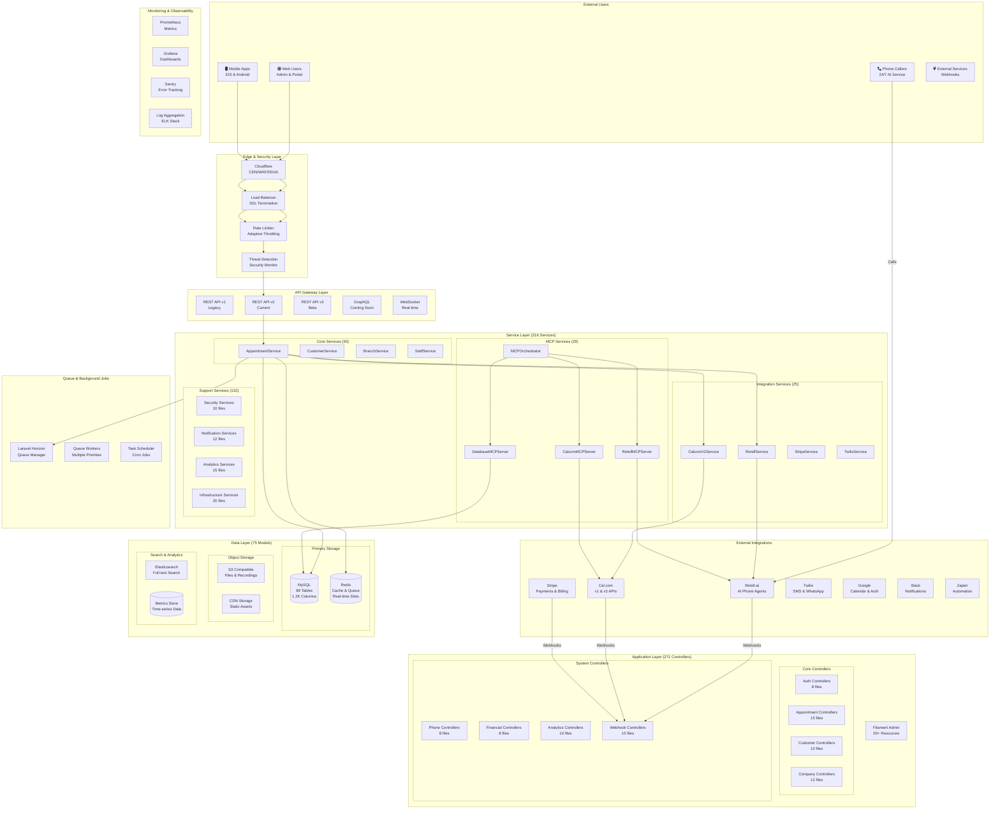
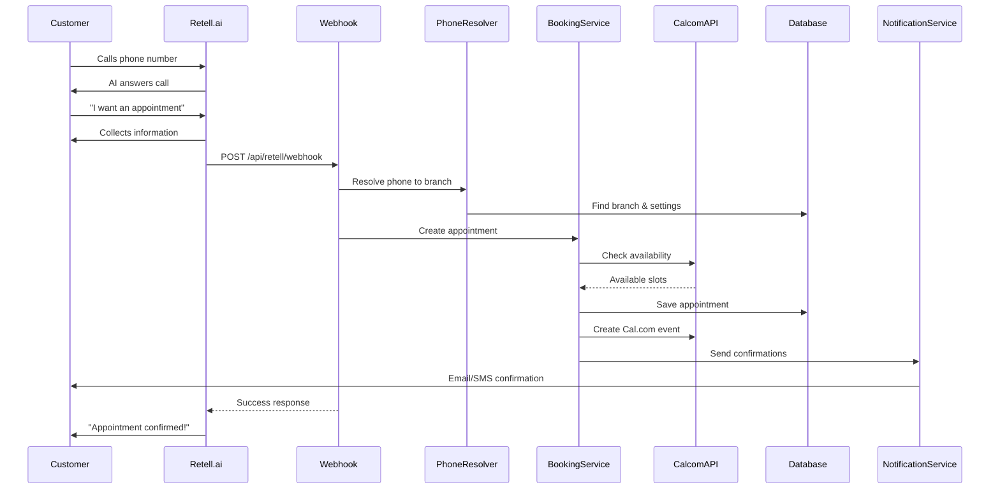
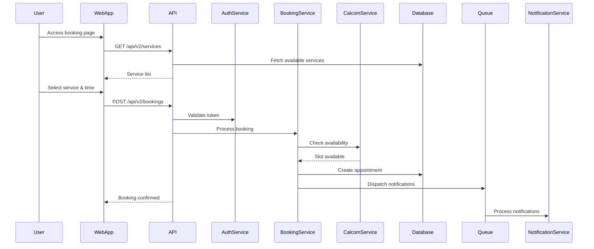
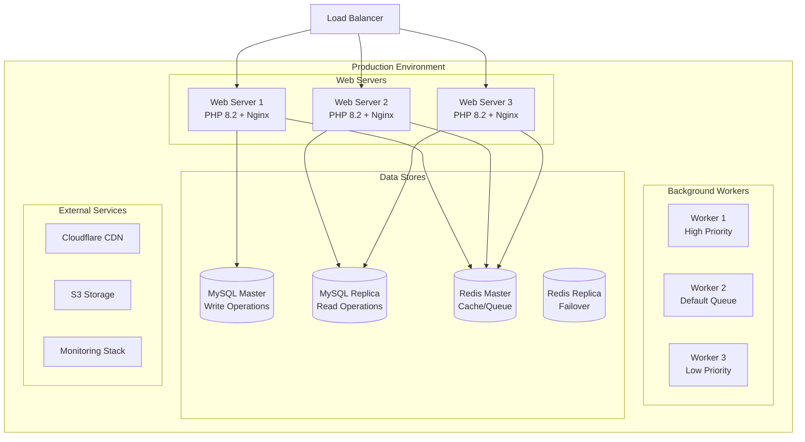

# System Architecture

Generated on: 2025-06-23

## Complete System Overview

The AskProAI platform is a complex, enterprise-grade SaaS application with:
- **1,645 PHP files**
- **75 Eloquent models**  
- **216 service classes**
- **271 controllers**
- **277 database migrations**
- **89 active database tables**

## High-Level Architecture

## Detailed Component Breakdown

### Frontend Layer
- **Admin Panel**: Filament 3.x with Livewire
- **Customer Portal**: Vue.js SPA (planned)
- **Mobile Apps**: React Native (in development)
- **Public Website**: Laravel Blade + Alpine.js

### API Layer (271 Controllers)
- **RESTful APIs**: Version 1, 2, and 3
- **GraphQL**: Coming in 2025 Q3
- **WebSocket**: Real-time updates
- **Webhooks**: 15 dedicated webhook handlers

### Service Layer (216 Services)
- **Core Business**: 30 services
- **Phone System**: 15 services
- **Calendar**: 25 services  
- **Financial**: 8 services
- **Analytics**: 15 services
- **MCP**: 29 services
- **Security**: 10 services
- **Infrastructure**: 20 services
- **Utilities**: 64 services

### Data Layer (75 Models, 89 Tables)
- **Multi-tenant**: Company-based isolation
- **Audit Trail**: Comprehensive logging
- **Soft Deletes**: On critical entities
- **Encryption**: Field-level for sensitive data
- **Caching**: Multi-layer caching strategy

### Integration Points
1. **Retell.ai**: AI phone agents, webhooks
2. **Cal.com**: Calendar API v1 & v2
3. **Stripe**: Payments and subscriptions
4. **Twilio**: SMS and WhatsApp
5. **Google**: Calendar and OAuth
6. **Slack/Teams**: Notifications
7. **Zapier**: Workflow automation

### Security Architecture
- **Authentication**: JWT + API Keys
- **Authorization**: Role-based (Spatie)
- **Encryption**: AES-256-CBC
- **Rate Limiting**: Adaptive throttling
- **Threat Detection**: Real-time monitoring
- **Audit Logging**: All actions tracked
- **Webhook Verification**: Signature validation

### Performance Architecture  
- **Caching**: Redis with tagged cache
- **Queue**: Horizon with priorities
- **Database**: Read replicas (planned)
- **CDN**: Cloudflare global network
- **Monitoring**: Prometheus + Grafana
- **APM**: New Relic (planned)

### Scalability Design
- **Horizontal Scaling**: Load balanced
- **Database Sharding**: Planned for Q3
- **Microservices**: MCP architecture
- **Event-Driven**: Laravel events
- **Async Processing**: Queue workers

## Data Flow Examples

### Phone to Appointment Flow

### Web Booking Flow

## Deployment Architecture

## Technology Stack Summary

### Backend
- **Framework**: Laravel 10.x
- **PHP**: 8.2+
- **Database**: MySQL 8.0
- **Cache**: Redis 7.0
- **Queue**: Laravel Horizon
- **Search**: Elasticsearch 8.x

### Frontend
- **Admin**: Filament 3.x + Livewire
- **CSS**: Tailwind CSS 3.x
- **JS**: Alpine.js, Vue.js
- **Build**: Vite

### Infrastructure
- **Hosting**: DigitalOcean
- **CDN**: Cloudflare
- **Storage**: S3 Compatible
- **Monitoring**: Prometheus + Grafana
- **CI/CD**: GitHub Actions

### Third-Party Services
- **Phone AI**: Retell.ai
- **Calendar**: Cal.com
- **Payments**: Stripe
- **SMS**: Twilio
- **Email**: SendGrid
- **Analytics**: Mixpanel

This comprehensive architecture documentation reflects the true complexity of the AskProAI platform with its 1,645 PHP files, 216 services, 271 controllers, and 75 models.

