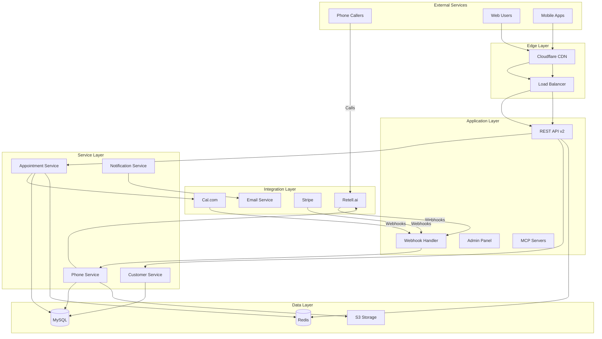
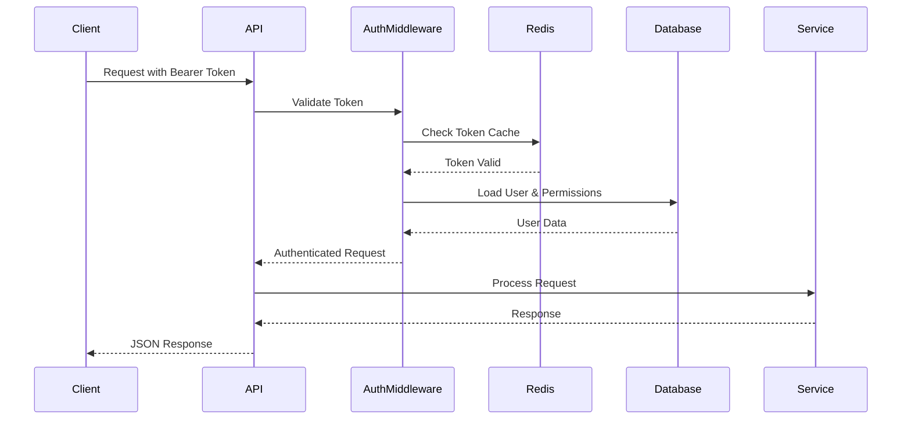
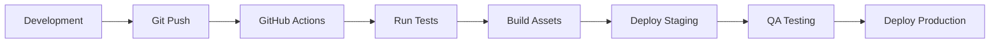

# System Design

## Overview

AskProAI is built as a modern, scalable SaaS platform using Domain-Driven Design (DDD) principles and a microservices-oriented architecture. The system is designed to handle high-volume phone calls and appointment bookings while maintaining data integrity and performance.

## Architecture Principles

### 1. Domain-Driven Design
- **Bounded Contexts**: Clear separation between domains (Appointments, Customers, Phone System)
- **Aggregates**: Company as root aggregate for multi-tenancy
- **Value Objects**: Phone numbers, time slots, addresses
- **Domain Events**: Appointment created, call ended, customer updated

### 2. Multi-Tenant Architecture
- **Row-level Security**: Every table includes `company_id`
- **Automatic Scoping**: Global scopes ensure data isolation
- **Shared Database**: Single database with tenant isolation
- **Performance**: Optimized indexes for tenant queries

### 3. Event-Driven Architecture
- **Event Sourcing**: Call events stored for full audit trail
- **Event Bus**: Laravel's event system for decoupling
- **Async Processing**: Queue-based event handling
- **Webhooks**: External event propagation

## High-Level Architecture



## Component Architecture

### API Gateway
- **Framework**: Laravel 11.x
- **Protocol**: RESTful HTTP/JSON
- **Versioning**: URL-based (v1, v2)
- **Authentication**: Bearer tokens, API keys
- **Rate Limiting**: Redis-based throttling

### Service Layer

#### Appointment Service
```php
class AppointmentService {
    - Create bookings with availability check
    - Handle multi-branch scheduling
    - Manage staff assignments
    - Process cancellations and rescheduling
}
```

#### Customer Service
```php
class CustomerService {
    - Customer deduplication
    - Profile management
    - Appointment history
    - Communication preferences
}
```

#### Phone Service
```php
class PhoneService {
    - Call routing by phone number
    - AI agent management
    - Call recording storage
    - Transcript processing
}
```

### Integration Architecture

#### Retell.ai Integration
- **Purpose**: AI-powered phone answering
- **Protocol**: REST API + Webhooks
- **Features**:
  - Natural language understanding
  - Appointment booking via voice
  - Multi-language support
  - Call analytics

#### Cal.com Integration
- **Purpose**: Calendar and scheduling
- **Protocol**: REST API v2
- **Features**:
  - Availability management
  - Multi-staff scheduling
  - Time zone handling
  - Recurring appointments

### Data Architecture

#### Primary Database (MySQL)
```sql
-- Core tables with multi-tenant support
companies (id, name, settings)
branches (id, company_id, name, phone)
staff (id, branch_id, name)
services (id, company_id, name, duration)
appointments (id, company_id, branch_id, start_time)
customers (id, company_id, phone, email)
calls (id, company_id, phone_number, duration)
```

#### Caching Layer (Redis)
- **Session Storage**: User sessions
- **Cache**: Query results, API responses
- **Queues**: Job processing
- **Rate Limiting**: Request throttling
- **Real-time**: WebSocket pub/sub

#### File Storage (S3)
- **Call Recordings**: MP3 files
- **Transcripts**: Text files
- **Documents**: PDFs, images
- **Backups**: Database dumps

## Security Architecture

### Authentication & Authorization


### Security Layers
1. **Network Security**
   - Cloudflare DDoS protection
   - SSL/TLS encryption
   - IP whitelisting for admin

2. **Application Security**
   - Input validation
   - SQL injection prevention
   - XSS protection
   - CSRF tokens

3. **Data Security**
   - Encryption at rest
   - Encryption in transit
   - PII anonymization
   - Audit logging

## Scalability Design

### Horizontal Scaling
- **Load Balancing**: Round-robin with health checks
- **Session Affinity**: Redis-based sessions
- **Database Replication**: Read replicas
- **Queue Workers**: Auto-scaling based on load

### Performance Optimization
1. **Database**
   - Query optimization
   - Index tuning
   - Connection pooling
   - Read/write splitting

2. **Caching**
   - Query result caching
   - API response caching
   - Static asset CDN
   - Opcode caching

3. **Async Processing**
   - Background jobs
   - Event processing
   - Webhook delivery
   - Report generation

## Monitoring & Observability

### Metrics Collection
```yaml
Application Metrics:
  - Request rate
  - Response time
  - Error rate
  - Queue depth

Business Metrics:
  - Appointments created
  - Call success rate
  - Customer satisfaction
  - Revenue per call

Infrastructure Metrics:
  - CPU usage
  - Memory usage
  - Disk I/O
  - Network traffic
```

### Logging Strategy
1. **Application Logs**: Structured JSON logging
2. **Access Logs**: Nginx/Apache logs
3. **Error Logs**: Sentry integration
4. **Audit Logs**: Database changes
5. **Security Logs**: Authentication attempts

## Deployment Architecture

### Environment Setup
```
Production:
  - Load balanced web servers (3+)
  - Dedicated queue workers (2+)
  - Primary + replica databases
  - Redis cluster

Staging:
  - Single web server
  - Shared queue worker
  - Single database
  - Single Redis

Development:
  - Local environment
  - SQLite database
  - File-based cache
```

### CI/CD Pipeline


## Disaster Recovery

### Backup Strategy
- **Database**: Daily full backup, hourly incremental
- **Files**: Real-time S3 replication
- **Configuration**: Git versioned
- **Secrets**: Encrypted vault

### Recovery Procedures
1. **RTO**: 4 hours
2. **RPO**: 1 hour
3. **Failover**: Automated database failover
4. **Rollback**: Blue-green deployment

## Future Architecture

### Planned Improvements
1. **GraphQL API**: For mobile apps
2. **WebSocket**: Real-time updates
3. **Kubernetes**: Container orchestration
4. **Service Mesh**: Microservices communication
5. **Event Streaming**: Kafka integration