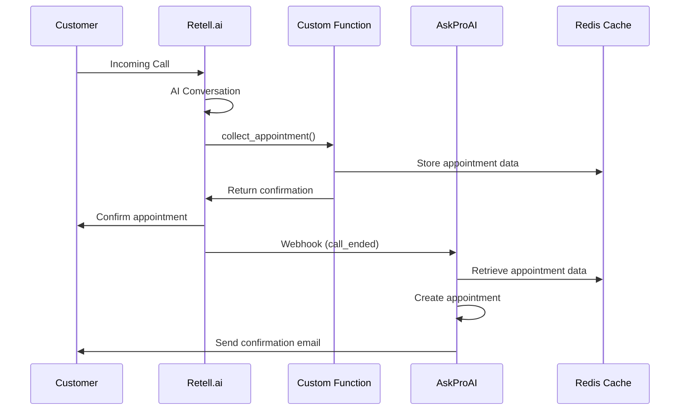

# Retell.ai Integration

## Overview

AskProAI integrates with Retell.ai to provide AI-powered phone answering and appointment booking capabilities. When customers call, the AI agent can collect appointment details and automatically book them in the system.

## Architecture

### Call Flow



## Configuration

### 1. Phone Number Setup

```sql
-- Add phone number to system
INSERT INTO phone_numbers (
    company_id, 
    branch_id, 
    number, 
    type, 
    is_active, 
    retell_agent_id
) VALUES (
    1, -- Your company ID
    'branch-uuid', -- Your branch ID
    '+49 30 12345678', -- Phone number
    'main',
    true,
    'agent_xxx' -- Retell agent ID
);
```

### 2. Retell Agent Configuration

In Retell Dashboard:

1. Create new agent
2. Add custom functions:
   - `collect_appointment`
   - `check_availability`
   - `change_appointment`
   - `cancel_appointment`
3. Configure webhook URL: `https://your-domain.com/api/retell/webhook`

### 3. Custom Function Definition

```json
{
  "name": "collect_appointment",
  "description": "Sammelt Termindaten vom Anrufer",
  "parameters": {
    "type": "object",
    "properties": {
      "datum": {
        "type": "string",
        "description": "Gewünschtes Datum (z.B. morgen, 15.03.2024)"
      },
      "uhrzeit": {
        "type": "string",
        "description": "Gewünschte Uhrzeit (z.B. 14:00)"
      },
      "name": {
        "type": "string",
        "description": "Name des Kunden"
      },
      "telefonnummer": {
        "type": "string",
        "description": "Telefonnummer für Rückrufe"
      },
      "dienstleistung": {
        "type": "string",
        "description": "Gewünschte Dienstleistung"
      },
      "notizen": {
        "type": "string",
        "description": "Zusätzliche Notizen oder Wünsche"
      }
    },
    "required": ["datum", "uhrzeit", "name", "dienstleistung"]
  }
}
```

## Testing

### 1. Test Custom Functions

```bash
php test-retell-custom-function.php
```

Expected output:
- ✅ collect_appointment succeeded
- ✅ Data found in cache
- ✅ check_availability succeeded

### 2. Test Complete Flow

```bash
php test-retell-simple-flow.php
```

This tests:
- Custom function execution
- Cache storage
- Appointment creation
- Call record creation
- Webhook processing

### 3. Manual Testing

1. Call the configured phone number
2. Say: "Ich möchte einen Termin buchen"
3. Provide appointment details when asked
4. Check admin panel for created appointment

## Troubleshooting

### Common Issues

#### No Appointment Created

**Check webhook logs:**
```bash
tail -f storage/logs/laravel.log  < /dev/null |  grep -i retell
```

**Verify cache:**
```php
php artisan tinker
>>> Cache::get('retell:appointment:CALL_ID')
```

#### "No company context found"

**Solution:**
1. Ensure phone number exists in database
2. Branch must be active
3. Check tenant context in webhook processing

#### Custom Function Not Called

**Verify in Retell:**
1. Function is added to agent
2. Agent prompt mentions appointment booking
3. Function parameters match expected format

### Debug Queries

```sql
-- Recent calls
SELECT * FROM calls 
WHERE created_at > NOW() - INTERVAL 1 HOUR 
ORDER BY created_at DESC;

-- Webhook events
SELECT * FROM webhook_events 
WHERE provider = 'retell' 
ORDER BY created_at DESC 
LIMIT 10;

-- Check appointments
SELECT 
    a.*,
    c.name as customer_name,
    s.name as service_name
FROM appointments a
JOIN customers c ON a.customer_id = c.id
JOIN services s ON a.service_id = s.id
WHERE a.created_at > NOW() - INTERVAL 1 DAY;
```

## Best Practices

### 1. Agent Prompts

Include clear instructions:
```
Du bist ein freundlicher Assistent für [Company Name].
Deine Hauptaufgabe ist es, Termine für Kunden zu vereinbaren.
Nutze die collect_appointment Funktion, um alle notwendigen Daten zu sammeln.
```

### 2. Error Handling

- Always validate phone numbers
- Check service availability
- Confirm appointment details before booking
- Handle timezone differences

### 3. Security

- Verify webhook signatures
- Sanitize all input data
- Use tenant isolation
- Implement rate limiting

## Advanced Features

### Multi-Language Support

```php
// In RetellCustomFunctionMCPServer
protected function parseDate(string $date): string {
    $relativeDates = [
        // German
        'heute' => 'today',
        'morgen' => 'tomorrow',
        // English
        'today' => 'today',
        'tomorrow' => 'tomorrow',
        // Add more languages
    ];
}
```

### Custom Availability Rules

```php
// Override in RetellCustomFunctionMCPServer
protected function getAvailableSlots(
    string $branchId, 
    string $date, 
    ?string $serviceName
): array {
    // Implement Cal.com integration
    $calcom = new CalcomV2Service($apiKey);
    return $calcom->getAvailableSlots($eventTypeId, $date);
}
```

## Monitoring

### Key Metrics

- Call completion rate
- Appointment booking success rate
- Average call duration
- Customer satisfaction

### Alerts

Set up monitoring for:
- Webhook failures
- High error rates
- Slow response times
- Cache misses

## API Reference

### Webhook Payload

```json
{
  "event": "call_ended",
  "call": {
    "call_id": "abc123",
    "from_number": "+49 151 12345678",
    "to_number": "+49 30 98765432",
    "duration": 180,
    "status": "completed",
    "appointment_id": "def456"
  }
}
```

### Custom Function Response

```json
{
  "success": true,
  "reference_id": "uuid",
  "message": "Termin erfolgreich erfasst",
  "appointment_summary": "Beratung am 15.03.2024 um 14:00 Uhr"
}
```
