# Appointment Booking System

## Overview

The appointment booking system is the heart of AskProAI, providing seamless scheduling across multiple channels - phone, web, and API. It handles complex scheduling logic while maintaining a simple user experience.

## Booking Channels

```mermaid
graph LR
    subgraph "Input Channels"
        PHONE[📞 Phone Calls]
        WEB[💻 Web Portal]
        API[🔌 API]
        MOBILE[📱 Mobile App]
    end
    
    subgraph "Booking Engine"
        VALIDATOR[Validation]
        AVAILABILITY[Availability Check]
        BOOKING[Booking Creation]
        SYNC[External Sync]
    end
    
    subgraph "Output"
        DB[(Database)]
        CALCOM[Cal.com]
        NOTIFY[Notifications]
        ANALYTICS[Analytics]
    end
    
    PHONE --> VALIDATOR
    WEB --> VALIDATOR
    API --> VALIDATOR
    MOBILE --> VALIDATOR
    
    VALIDATOR --> AVAILABILITY
    AVAILABILITY --> BOOKING
    BOOKING --> SYNC
    
    BOOKING --> DB
    SYNC --> CALCOM
    BOOKING --> NOTIFY
    BOOKING --> ANALYTICS
```



## Core Features

### 1. Multi-Branch Support

Manage appointments across multiple locations:

```php
// Each branch has independent:
- Operating hours
- Staff members  
- Service offerings
- Booking rules
- Calendar integration
```

### 2. Smart Availability Engine

Complex availability calculation considering:

```yaml
Factors:
  - Branch operating hours
  - Staff working hours
  - Staff breaks and time off
  - Existing appointments
  - Service duration
  - Buffer times
  - Travel time (mobile services)
  - Maximum daily bookings
  - Advance booking limits
```

### 3. Service Management

#### Service Configuration

```json
{
  "id": 1,
  "name": "Premium Haircut",
  "duration": 45,
  "price": 45.00,
  "buffer_before": 5,
  "buffer_after": 10,
  "requires_consultation": false,
  "staff_requirements": ["haircut_certified"],
  "resource_requirements": ["chair_1", "chair_2"]
}
```

#### Service Categories

- **Duration-based**: Fixed time slots
- **Flexible**: Variable duration
- **Package**: Multiple services bundled
- **Recurring**: Series appointments

### 4. Staff Assignment

#### Automatic Assignment

```php
public function findBestStaff($service, $datetime, $preferences = [])
{
    return Staff::available($datetime)
        ->hasSkill($service->required_skills)
        ->when($preferences['gender'], function ($q, $gender) {
            $q->where('gender', $gender);
        })
        ->when($preferences['language'], function ($q, $language) {
            $q->whereJsonContains('languages', $language);
        })
        ->withCount(['appointments' => function ($q) use ($datetime) {
            $q->whereDate('start_time', $datetime->toDateString());
        }])
        ->orderBy('appointments_count') // Load balancing
        ->first();
}
```

#### Manual Selection

Customers can choose specific staff members:
- View staff profiles
- See availability
- Read reviews
- Check specializations

## Booking Flow

### 1. Availability Check


### 2. Booking Creation

```php
class AppointmentBookingService
{
    public function createBooking(array $data): Appointment
    {
        return DB::transaction(function () use ($data) {
            // 1. Lock the time slot
            $lock = $this->lockTimeSlot(
                $data['start_time'],
                $data['duration'],
                $data['staff_id']
            );
            
            try {
                // 2. Final availability check
                if (!$this->isStillAvailable($data)) {
                    throw new SlotNoLongerAvailableException();
                }
                
                // 3. Create appointment
                $appointment = Appointment::create([
                    'company_id' => $data['company_id'],
                    'branch_id' => $data['branch_id'],
                    'staff_id' => $data['staff_id'],
                    'service_id' => $data['service_id'],
                    'customer_id' => $data['customer_id'],
                    'start_time' => $data['start_time'],
                    'end_time' => $data['end_time'],
                    'status' => 'confirmed',
                    'source' => $data['source'] ?? 'web',
                ]);
                
                // 4. Sync to Cal.com
                $externalBooking = $this->calcomService->createBooking($appointment);
                $appointment->update(['external_id' => $externalBooking->id]);
                
                // 5. Send confirmations
                event(new AppointmentCreated($appointment));
                
                return $appointment;
            } finally {
                $lock->release();
            }
        });
    }
}
```

### 3. Conflict Resolution

```php
class ConflictResolver
{
    public function handle(SlotConflictException $e): Resolution
    {
        $alternatives = $this->findAlternatives(
            $e->requestedTime,
            $e->service,
            $e->preferences
        );
        
        return new Resolution([
            'status' => 'conflict',
            'message' => 'Selected time no longer available',
            'alternatives' => $alternatives->map(function ($slot) {
                return [
                    'time' => $slot->format('H:i'),
                    'date' => $slot->format('Y-m-d'),
                    'staff' => $slot->staff->name,
                ];
            }),
        ]);
    }
}
```

## Advanced Features

### 1. Recurring Appointments

```yaml
Recurrence Patterns:
  - Daily: Every day at same time
  - Weekly: Same day/time each week
  - Bi-weekly: Every two weeks
  - Monthly: Same date each month
  - Custom: Complex patterns
```

```php
public function createRecurringSeries($pattern, $baseAppointment, $endDate)
{
    $appointments = collect();
    $current = $baseAppointment->start_time->copy();
    
    while ($current <= $endDate) {
        if ($this->isAvailable($current, $baseAppointment)) {
            $appointments->push($this->createSingleAppointment(
                $baseAppointment->replicate(['start_time' => $current])
            ));
        }
        
        $current = $this->getNextOccurrence($current, $pattern);
    }
    
    return $appointments;
}
```

### 2. Group Bookings

Handle multiple people in one appointment:

```json
{
  "type": "group",
  "service_id": 5,
  "participants": [
    {"name": "John Doe", "email": "john@example.com"},
    {"name": "Jane Smith", "email": "jane@example.com"}
  ],
  "requirements": {
    "min_participants": 2,
    "max_participants": 6,
    "resources": ["conference_room_1"]
  }
}
```

### 3. Waiting List

```php
class WaitingListService
{
    public function addToWaitingList($customer, $preferences)
    {
        $entry = WaitingListEntry::create([
            'customer_id' => $customer->id,
            'service_id' => $preferences['service_id'],
            'preferred_dates' => $preferences['dates'],
            'preferred_times' => $preferences['times'],
            'preferred_staff' => $preferences['staff_id'],
            'expires_at' => now()->addDays(30),
        ]);
        
        // Monitor for openings
        WaitingListMonitor::dispatch($entry)->delay(300);
        
        return $entry;
    }
    
    public function checkForOpenings($entry)
    {
        $availableSlots = $this->findMatchingSlots($entry);
        
        if ($availableSlots->isNotEmpty()) {
            Notification::send($entry->customer, 
                new SlotAvailableNotification($availableSlots)
            );
        }
    }
}
```

### 4. Smart Rescheduling

```php
public function reschedule($appointment, $newTime)
{
    DB::transaction(function () use ($appointment, $newTime) {
        // Store original data
        $history = $appointment->replicate();
        
        // Update appointment
        $appointment->update([
            'start_time' => $newTime,
            'end_time' => $newTime->copy()->addMinutes($appointment->duration),
            'rescheduled_at' => now(),
            'rescheduled_count' => $appointment->rescheduled_count + 1,
        ]);
        
        // Update external systems
        if ($appointment->external_id) {
            $this->calcomService->updateBooking(
                $appointment->external_id,
                $newTime
            );
        }
        
        // Notify all parties
        event(new AppointmentRescheduled($appointment, $history));
    });
}
```

## Booking Rules Engine

### Rule Types

```php
interface BookingRule
{
    public function validate(Appointment $appointment): bool;
    public function getMessage(): string;
}

class MinimumNoticeRule implements BookingRule
{
    public function validate(Appointment $appointment): bool
    {
        $minimumHours = config('booking.minimum_notice_hours', 2);
        return $appointment->start_time->diffInHours(now()) >= $minimumHours;
    }
    
    public function getMessage(): string
    {
        return 'Appointments must be booked at least 2 hours in advance';
    }
}

class MaxAdvanceBookingRule implements BookingRule
{
    public function validate(Appointment $appointment): bool
    {
        $maxDays = config('booking.max_advance_days', 90);
        return $appointment->start_time->diffInDays(now()) <= $maxDays;
    }
}

class BusinessHoursRule implements BookingRule
{
    public function validate(Appointment $appointment): bool
    {
        $branch = $appointment->branch;
        $dayOfWeek = strtolower($appointment->start_time->format('l'));
        
        $hours = $branch->operating_hours[$dayOfWeek] ?? null;
        
        if (!$hours || !$hours['open']) {
            return false;
        }
        
        $startTime = $appointment->start_time->format('H:i');
        $endTime = $appointment->end_time->format('H:i');
        
        return $startTime >= $hours['start'] && $endTime <= $hours['end'];
    }
}
```

### Rule Application

```php
class BookingValidator
{
    protected array $rules = [
        MinimumNoticeRule::class,
        MaxAdvanceBookingRule::class,
        BusinessHoursRule::class,
        StaffAvailabilityRule::class,
        ServiceAvailabilityRule::class,
        CustomerBlocklistRule::class,
        MaxDailyBookingsRule::class,
    ];
    
    public function validate(Appointment $appointment): ValidationResult
    {
        $failures = [];
        
        foreach ($this->rules as $ruleClass) {
            $rule = new $ruleClass();
            
            if (!$rule->validate($appointment)) {
                $failures[] = $rule->getMessage();
            }
        }
        
        return new ValidationResult(
            empty($failures),
            $failures
        );
    }
}
```

## Optimization Strategies

### 1. Slot Caching

```php
class SlotCache
{
    public function remember($key, $ttl, Closure $callback)
    {
        // Two-tier caching
        
        // L1: In-memory cache (very fast)
        if ($cached = $this->memoryCache->get($key)) {
            return $cached;
        }
        
        // L2: Redis cache (fast)
        if ($cached = Cache::tags(['slots'])->get($key)) {
            $this->memoryCache->put($key, $cached, 60);
            return $cached;
        }
        
        // Calculate fresh
        $value = $callback();
        
        // Store in both caches
        Cache::tags(['slots'])->put($key, $value, $ttl);
        $this->memoryCache->put($key, $value, 60);
        
        return $value;
    }
}
```

### 2. Batch Availability

```php
public function getBatchAvailability($dates, $service, $branch)
{
    // Single query for multiple dates
    $bookings = Appointment::where('branch_id', $branch->id)
        ->whereIn(DB::raw('DATE(start_time)'), $dates)
        ->whereIn('status', ['confirmed', 'pending'])
        ->get()
        ->groupBy(fn($apt) => $apt->start_time->format('Y-m-d'));
    
    return collect($dates)->mapWithKeys(function ($date) use ($bookings, $service, $branch) {
        return [
            $date => $this->calculateDayAvailability(
                $date,
                $bookings->get($date, collect()),
                $service,
                $branch
            )
        ];
    });
}
```

## Monitoring & Analytics

### Key Metrics

```yaml
Booking Metrics:
  - Conversion Rate: Searches to bookings
  - Average Lead Time: Days booked in advance
  - No-Show Rate: Missed appointments
  - Cancellation Rate: By time period
  - Utilization Rate: Booked vs available slots
  - Popular Times: Heat map of bookings
  - Service Demand: Most requested services
```

### Performance Dashboard

```sql
-- Real-time booking stats
SELECT 
    COUNT(*) as total_bookings,
    SUM(CASE WHEN source = 'phone' THEN 1 ELSE 0 END) as phone_bookings,
    SUM(CASE WHEN source = 'web' THEN 1 ELSE 0 END) as web_bookings,
    AVG(TIMESTAMPDIFF(HOUR, created_at, start_time)) as avg_lead_hours,
    COUNT(*) / COUNT(DISTINCT DATE(start_time)) as avg_daily_bookings
FROM appointments
WHERE created_at >= NOW() - INTERVAL 30 DAY
AND company_id = ?;
```

## Best Practices

1. **Always Lock Time Slots**: Prevent double bookings with distributed locks
2. **Validate Twice**: Check availability before and after user input
3. **Fail Gracefully**: Always offer alternatives on conflicts
4. **Cache Wisely**: Balance freshness with performance
5. **Monitor Everything**: Track all metrics for optimization
6. **Test Edge Cases**: Timezone changes, DST, holidays
7. **Plan for Scale**: Design for 10x current load