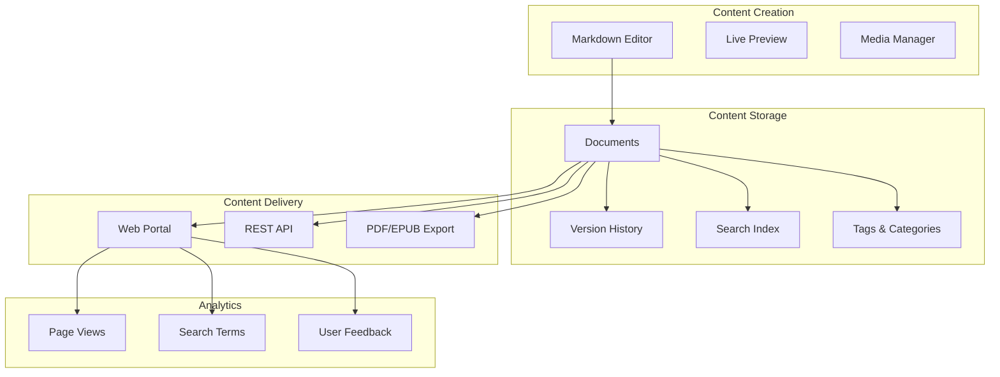

# Knowledge Base System

The AskProAI Knowledge Base is a comprehensive documentation and content management system designed to provide intelligent, searchable documentation for both internal teams and customers.

## Overview

The Knowledge Base system provides:
- 📚 Structured documentation with categories and tags
- 🔍 Full-text search with relevance scoring
- 📝 Markdown-based content with live preview
- 🔄 Version control and revision history
- 📊 Analytics and usage tracking
- 🤖 AI-powered content suggestions
- 📱 API access for programmatic content

## Architecture



## Database Schema

### Core Tables

```sql
knowledge_documents
├── id (UUID)
├── company_id (UUID)
├── category_id (UUID)
├── title (VARCHAR)
├── slug (VARCHAR, unique)
├── content (LONGTEXT)
├── type (ENUM: guide, api, faq, tutorial)
├── status (ENUM: draft, published, archived)
├── view_count (INT)
├── created_by (UUID)
├── updated_by (UUID)
├── published_at (DATETIME)
└── timestamps

knowledge_categories
├── id (UUID)
├── company_id (UUID)
├── parent_id (UUID, nullable)
├── name (VARCHAR)
├── slug (VARCHAR)
├── description (TEXT)
├── icon (VARCHAR)
├── order (INT)
└── timestamps

knowledge_tags
├── id (UUID)
├── name (VARCHAR)
├── slug (VARCHAR)
├── color (VARCHAR)
└── timestamps

knowledge_versions
├── id (UUID)
├── document_id (UUID)
├── version_number (INT)
├── content (LONGTEXT)
├── change_summary (TEXT)
├── created_by (UUID)
└── created_at

knowledge_search_index
├── id (UUID)
├── document_id (UUID)
├── content (TEXT)
├── weight (INT)
└── FULLTEXT INDEX
```

## Features

### 1. Content Management

#### Document Types
- **Guides**: Step-by-step tutorials and how-tos
- **API Documentation**: Technical API references
- **FAQs**: Frequently asked questions
- **Tutorials**: Interactive learning content

#### Markdown Support
```markdown
# Enhanced Markdown Features

- **Bold** and *italic* text
- [Links](https://example.com)
- `inline code` and code blocks
- Tables, lists, and blockquotes
- Mermaid diagrams
- Custom callouts and alerts
```

#### Media Management
- Image upload with automatic optimization
- Video embedding (YouTube, Vimeo)
- File attachments (PDF, ZIP)
- CDN integration for fast delivery

### 2. Search Capabilities

#### Full-Text Search
```php
// Search example
$results = KnowledgeDocument::search('appointment booking')
    ->where('status', 'published')
    ->withHighlight()
    ->paginate(10);
```

#### Search Features
- Fuzzy matching for typos
- Synonym support
- Language-specific stemming
- Relevance scoring
- Search suggestions

### 3. Version Control

Every document change is tracked:
- Complete revision history
- Diff view between versions
- Rollback capability
- Change summaries
- Author attribution

### 4. Analytics & Insights

#### Tracked Metrics
- Page views and unique visitors
- Search queries and click-through rates
- Time on page
- Feedback scores
- Popular content identification

#### Analytics Dashboard
```sql
-- Top viewed documents
SELECT 
    d.title,
    d.view_count,
    COUNT(DISTINCT a.user_id) as unique_viewers,
    AVG(a.time_on_page) as avg_reading_time
FROM knowledge_documents d
JOIN knowledge_analytics a ON d.id = a.document_id
WHERE a.created_at >= DATE_SUB(NOW(), INTERVAL 30 DAY)
GROUP BY d.id
ORDER BY d.view_count DESC
LIMIT 10;
```

### 5. AI-Powered Features

#### Content Suggestions
- Related articles recommendation
- Auto-tagging based on content
- Content gap analysis
- SEO optimization suggestions

#### Smart Search
- Natural language queries
- Intent detection
- Contextual results
- Learning from user behavior

### 6. Access Control

#### Permission Levels
- **Public**: Available to everyone
- **Authenticated**: Requires login
- **Company**: Company-specific content
- **Internal**: Staff only

#### API Access
```php
// API authentication
$response = Http::withToken($apiKey)
    ->get('/api/knowledge/documents', [
        'category' => 'api-docs',
        'status' => 'published'
    ]);
```

## Integration Points

### 1. Customer Portal
- Embedded documentation
- Contextual help tooltips
- Search integration
- Single sign-on

### 2. Admin Panel
- Content editor in Filament
- Analytics dashboard
- Bulk operations
- Import/Export tools

### 3. AI Phone System
- Real-time documentation lookup
- Answer generation from KB
- FAQ integration
- Knowledge base training

### 4. Mobile App
- Offline documentation sync
- Push notifications for updates
- Bookmarking and favorites
- Native search

## API Endpoints

### Documents

```http
# List documents
GET /api/knowledge/documents
GET /api/knowledge/documents/{slug}

# Search
GET /api/knowledge/search?q=appointment

# Categories
GET /api/knowledge/categories
GET /api/knowledge/categories/{slug}/documents

# Analytics
POST /api/knowledge/analytics/track
GET /api/knowledge/analytics/popular
```

### Example Response
```json
{
    "data": {
        "id": "uuid-here",
        "title": "How to Book an Appointment",
        "slug": "how-to-book-appointment",
        "content": "# Booking Guide\n\nFollow these steps...",
        "category": {
            "name": "Getting Started",
            "slug": "getting-started"
        },
        "tags": ["booking", "appointments", "guide"],
        "view_count": 1523,
        "estimated_reading_time": 3,
        "last_updated": "2025-06-20T10:30:00Z"
    }
}
```

## Content Notebooks

### Interactive Documentation
```php
// Notebook structure
knowledge_notebooks
├── id (UUID)
├── title (VARCHAR)
├── description (TEXT)
├── is_public (BOOLEAN)
└── timestamps

knowledge_notebook_entries
├── id (UUID)
├── notebook_id (UUID)
├── type (ENUM: markdown, code, query, chart)
├── content (TEXT)
├── output (TEXT, nullable)
├── order (INT)
└── timestamps
```

### Use Cases
- Interactive tutorials
- Code playgrounds
- API testing environments
- Data visualization
- Training materials

## Best Practices

### 1. Content Structure
- Use clear, descriptive titles
- Implement consistent categorization
- Add relevant tags
- Include meta descriptions
- Use semantic headings

### 2. SEO Optimization
- Unique slugs for each document
- Proper meta tags
- Structured data markup
- XML sitemap generation
- Canonical URLs

### 3. Performance
- Enable caching for popular content
- Use CDN for media files
- Implement lazy loading
- Optimize search indexes
- Monitor query performance

### 4. Maintenance
- Regular content audits
- Update outdated information
- Fix broken links
- Archive obsolete content
- Monitor search queries for gaps

## Configuration

### Environment Variables
```env
# Knowledge Base Configuration
KNOWLEDGE_BASE_ENABLED=true
KNOWLEDGE_SEARCH_DRIVER=elasticsearch
KNOWLEDGE_CACHE_TTL=3600
KNOWLEDGE_CDN_URL=https://cdn.askproai.de
KNOWLEDGE_AI_SUGGESTIONS=true
```

### Search Configuration
```php
// config/knowledge.php
return [
    'search' => [
        'driver' => env('KNOWLEDGE_SEARCH_DRIVER', 'database'),
        'elasticsearch' => [
            'hosts' => [env('ELASTICSEARCH_HOST', 'localhost:9200')],
            'index' => 'knowledge_docs'
        ],
        'fuzzy_threshold' => 0.7,
        'highlight' => [
            'pre_tag' => '<mark>',
            'post_tag' => '</mark>'
        ]
    ]
];
```

## Roadmap

### Planned Features
- [ ] Multi-language support
- [ ] Video tutorials with transcription
- [ ] Community contributions
- [ ] AI-powered content generation
- [ ] Advanced analytics with heatmaps
- [ ] Integration with support tickets
- [ ] Automated content quality checks

---

*Last updated: June 25, 2025*